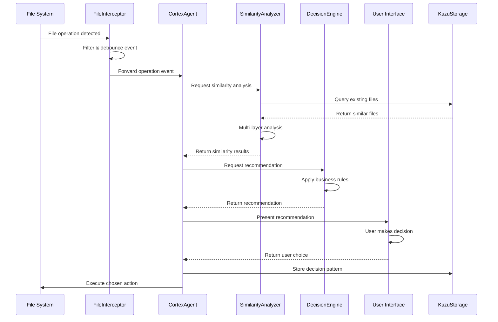
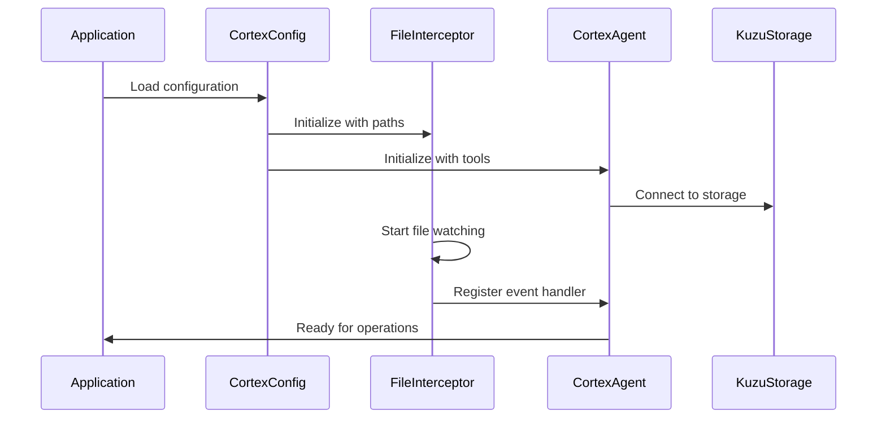

# Continuity Cortex: Component Interactions

## Overview

This document details how components in the Continuity Cortex system interact with each other and external systems, including data flow patterns, event handling, and integration points.

## Core Interaction Patterns

### 1. Real-time File Operation Flow



### 2. Component Initialization Flow



## Detailed Interaction Specifications

### FileOperationInterceptor ↔ ContinuityCortex Agent

#### Event Registration Pattern
```typescript
// Initialization
const interceptor = new FileOperationInterceptor(config);
const cortexAgent = new ContinuityCortexAgent(config);

// Register handler
interceptor.onFileOperation(async (event: FileOperationEvent) => {
  try {
    const result = await cortexAgent.analyzeFileOperation(event);
    await handleAnalysisResult(result, event);
  } catch (error) {
    await handleAnalysisError(error, event);
  }
});

// Start monitoring
await interceptor.start();
```

#### Event Data Contract
```typescript
interface FileOperationEvent {
  // Core event data
  operation: 'create' | 'write' | 'move' | 'delete';
  path: string;
  timestamp: Date;

  // Content information
  content?: string;          // File content (if readable and under size limit)
  contentHash?: string;      // SHA-256 hash for caching
  contentPreview?: string;   // First 500 chars for quick analysis

  // File metadata
  metadata: {
    size: number;
    extension: string;
    mimeType: string;
    encoding?: string;
    lastModified: Date;
    isNew: boolean;          // True for create operations
  };

  // Context information
  context?: {
    intent?: string;         // User-provided intent if available
    parentDirectory: string;
    relatedFiles?: string[]; // Files modified in same session
    triggerSource: 'user' | 'agent' | 'system';
  };
}
```

#### Error Handling Pattern
```typescript
class InterceptorErrorHandler {
  async handleAnalysisError(error: Error, event: FileOperationEvent): Promise<void> {
    // Log error with context
    console.error('Analysis failed:', {
      error: error.message,
      event: {
        operation: event.operation,
        path: event.path,
        size: event.metadata.size
      }
    });

    // Fallback to allowing operation
    await this.fallbackAction(event);

    // Store error for learning
    await this.storeAnalysisError(error, event);
  }

  private async fallbackAction(event: FileOperationEvent): Promise<void> {
    // Default action: allow operation with warning
    if (event.operation === 'create') {
      console.warn(`File created without analysis: ${event.path}`);
    }
  }
}
```

### ContinuityCortex Agent ↔ SimilarityAnalyzer

#### Analysis Request Pattern
```typescript
class ContinuityCortexAgent extends Agent {
  async analyzeFileOperation(event: FileOperationEvent): Promise<AnalysisResult> {
    // Extract file information
    const newFile: FileInfo = {
      path: event.path,
      name: path.basename(event.path),
      extension: path.extname(event.path),
      content: event.content || '',
      size: event.metadata.size,
      created: event.timestamp,
      intent: event.context?.intent
    };

    // Find potentially similar files
    const existingFiles = await this.findCandidateFiles(newFile);

    // Request similarity analysis
    const similarities = await this.similarityAnalyzer.analyzeBatch(newFile, existingFiles);

    // Generate recommendation
    const recommendation = await this.decisionEngine.generateRecommendation(
      newFile,
      similarities.results
    );

    return {
      recommendation,
      similarFiles: similarities.results,
      confidence: recommendation.confidence,
      reasoning: recommendation.reasoning,
      metadata: {
        analysisTime: similarities.analysisTime,
        candidateCount: existingFiles.length,
        layersAnalyzed: similarities.layers
      }
    };
  }

  private async findCandidateFiles(newFile: FileInfo): Promise<FileInfo[]> {
    // Use graph database to find potential matches
    const query = `
      MATCH (f:File)
      WHERE f.extension = $ext
        AND f.directory = $dir
        AND f.created > $recentDate
      RETURN f
      ORDER BY f.lastModified DESC
      LIMIT 20
    `;

    const results = await this.storage.query(query, {
      ext: newFile.extension,
      dir: path.dirname(newFile.path),
      recentDate: new Date(Date.now() - 30 * 24 * 60 * 60 * 1000) // 30 days
    });

    return results.map(this.resultToFileInfo);
  }
}
```

#### Caching Integration
```typescript
class CachedSimilarityAnalyzer extends SimilarityAnalyzer {
  private cache = new Map<string, CachedAnalysis>();

  async analyzeSimilarity(file1: FileInfo, file2: FileInfo): Promise<SimilarityResult> {
    // Generate cache key
    const cacheKey = this.generateCacheKey(file1, file2);

    // Check cache first
    const cached = this.cache.get(cacheKey);
    if (cached && this.isCacheValid(cached)) {
      return cached.result;
    }

    // Perform analysis
    const result = await super.analyzeSimilarity(file1, file2);

    // Cache result
    this.cache.set(cacheKey, {
      result,
      timestamp: Date.now(),
      accessCount: 1
    });

    return result;
  }

  private generateCacheKey(file1: FileInfo, file2: FileInfo): string {
    // Use content hashes for cache key
    const hash1 = file1.contentHash || this.hashContent(file1.content);
    const hash2 = file2.contentHash || this.hashContent(file2.content);
    return `${hash1}:${hash2}`;
  }

  private isCacheValid(cached: CachedAnalysis): boolean {
    const maxAge = 60 * 60 * 1000; // 1 hour
    return Date.now() - cached.timestamp < maxAge;
  }
}
```

### SimilarityAnalyzer ↔ DecisionEngine

#### Analysis to Decision Flow
```typescript
interface AnalysisToDecisionContract {
  // Input: Similarity analysis results
  similarities: SimilarityResult[];

  // Output: Actionable recommendation
  recommendation: Recommendation;

  // Context: Decision-making context
  context: DecisionContext;
}

class FileDecisionEngine {
  async generateRecommendation(
    newFile: FileInfo,
    similarities: SimilarityResult[]
  ): Promise<Recommendation> {
    // Sort by similarity score
    const sortedSimilarities = similarities
      .filter(s => s.overall > this.config.minimumThreshold)
      .sort((a, b) => b.overall - a.overall);

    if (sortedSimilarities.length === 0) {
      return this.createNewFileRecommendation(newFile);
    }

    const topSimilarity = sortedSimilarities[0];

    // Apply decision rules
    if (topSimilarity.overall >= this.config.autoMergeThreshold) {
      return this.createMergeRecommendation(newFile, topSimilarity);
    }

    if (topSimilarity.overall >= this.config.updateThreshold) {
      return this.createUpdateRecommendation(newFile, topSimilarity);
    }

    if (topSimilarity.overall >= this.config.warningThreshold) {
      return this.createWarningRecommendation(newFile, sortedSimilarities);
    }

    return this.createNewFileRecommendation(newFile);
  }

  private createUpdateRecommendation(
    newFile: FileInfo,
    similarity: SimilarityResult
  ): Recommendation {
    return {
      action: 'update',
      targetFile: similarity.targetFile,
      confidence: similarity.confidence,
      reasoning: this.buildUpdateReasoning(similarity),
      alternatives: [
        {
          action: 'create',
          target: newFile.path,
          description: 'Create as new file instead',
          confidence: 1 - similarity.confidence
        },
        {
          action: 'merge',
          target: similarity.targetFile,
          description: 'Merge content with existing file',
          confidence: similarity.confidence * 0.8
        }
      ],
      autoApply: similarity.confidence >= this.config.autoApplyThreshold
    };
  }
}
```

### Agent ↔ Storage Integration

#### Graph Database Operations
```typescript
class CortexStorageIntegration {
  constructor(private storage: KuzuStorageAdapter) {}

  async storeFileNode(file: FileInfo): Promise<void> {
    await this.storage.addNode({
      id: file.path,
      type: 'File',
      properties: {
        name: file.name,
        extension: file.extension,
        size: file.size,
        contentHash: file.contentHash,
        created: file.created.toISOString(),
        lastModified: file.lastModified?.toISOString(),
        purpose: file.detectedPurpose,
        directory: path.dirname(file.path)
      }
    });
  }

  async storeSimilarityRelationship(
    file1Path: string,
    file2Path: string,
    similarity: SimilarityResult
  ): Promise<void> {
    await this.storage.addEdge({
      from: file1Path,
      to: file2Path,
      type: 'SIMILAR_TO',
      properties: {
        similarity: similarity.overall,
        confidence: similarity.confidence,
        layers: similarity.layers.map(l => l.layer),
        analyzedAt: new Date().toISOString(),
        analyzerVersion: '1.0.0'
      }
    });
  }

  async storeUserDecision(decision: UserDecision): Promise<void> {
    await this.storage.addNode({
      id: `decision_${decision.id}`,
      type: 'Decision',
      properties: {
        userId: decision.userId,
        originalFile: decision.originalFile,
        chosenAction: decision.action,
        targetFile: decision.targetFile,
        similarityScore: decision.similarityScore,
        confidence: decision.confidence,
        timestamp: decision.timestamp.toISOString(),
        reasoning: decision.userReasoning
      }
    });

    // Link decision to involved files
    await this.storage.addEdge({
      from: `decision_${decision.id}`,
      to: decision.originalFile,
      type: 'DECIDED_ON',
      properties: { role: 'original' }
    });

    if (decision.targetFile) {
      await this.storage.addEdge({
        from: `decision_${decision.id}`,
        to: decision.targetFile,
        type: 'DECIDED_ON',
        properties: { role: 'target' }
      });
    }
  }

  async findSimilarFiles(filePath: string, threshold: number = 0.5): Promise<FileInfo[]> {
    const query = `
      MATCH (f1:File {path: $filePath})-[r:SIMILAR_TO]-(f2:File)
      WHERE r.similarity >= $threshold
      RETURN f2, r.similarity as similarity
      ORDER BY r.similarity DESC
      LIMIT 10
    `;

    const results = await this.storage.query(query, { filePath, threshold });
    return results.map(result => ({
      ...result.f2.properties,
      similarity: result.similarity
    }));
  }
}
```

#### Learning from User Decisions
```typescript
class LearningSystem {
  async learnFromDecision(decision: UserDecision): Promise<void> {
    // Store the decision
    await this.storage.storeUserDecision(decision);

    // Update similarity thresholds based on decision
    await this.updateThresholds(decision);

    // Update pattern recognition
    await this.updatePatterns(decision);

    // Update user preferences
    await this.updateUserPreferences(decision);
  }

  private async updateThresholds(decision: UserDecision): Promise<void> {
    if (decision.action === 'create' && decision.similarityScore > 0.7) {
      // User chose to create despite high similarity - raise threshold
      this.config.updateThreshold = Math.min(
        this.config.updateThreshold + 0.05,
        0.95
      );
    }

    if (decision.action === 'update' && decision.similarityScore < 0.6) {
      // User chose to update despite low similarity - lower threshold
      this.config.updateThreshold = Math.max(
        this.config.updateThreshold - 0.05,
        0.3
      );
    }

    // Persist updated configuration
    await this.saveConfiguration();
  }

  private async updatePatterns(decision: UserDecision): Promise<void> {
    // Analyze the decision context to identify patterns
    const context = {
      fileExtension: path.extname(decision.originalFile),
      directory: path.dirname(decision.originalFile),
      timeOfDay: decision.timestamp.getHours(),
      similarityLayers: decision.similarityLayers
    };

    // Store pattern for future reference
    await this.storage.addNode({
      id: `pattern_${Date.now()}`,
      type: 'DecisionPattern',
      properties: {
        context,
        decision: decision.action,
        confidence: decision.confidence,
        learnedAt: new Date().toISOString()
      }
    });
  }
}
```

## Error Handling and Resilience

### Graceful Degradation
```typescript
class ResilientCortexAgent extends ContinuityCortexAgent {
  async analyzeFileOperation(event: FileOperationEvent): Promise<AnalysisResult> {
    try {
      return await super.analyzeFileOperation(event);
    } catch (error) {
      console.warn('Cortex analysis failed, falling back to simple mode:', error.message);
      return this.fallbackAnalysis(event);
    }
  }

  private async fallbackAnalysis(event: FileOperationEvent): Promise<AnalysisResult> {
    // Simple filename-based analysis only
    const similarFiles = await this.findFilesByName(event.path);

    return {
      recommendation: {
        action: similarFiles.length > 0 ? 'warn' : 'create',
        confidence: 0.3, // Low confidence for fallback
        reasoning: 'Analysis failed, using simple filename matching',
        alternatives: [],
        autoApply: false
      },
      similarFiles: similarFiles.map(f => ({
        path: f,
        similarity: 0.5,
        matchingLayers: ['filename'],
        lastModified: new Date(),
        confidence: 0.3
      })),
      confidence: 0.3,
      reasoning: ['Fallback analysis due to system error'],
      metadata: {
        analysisTime: 0,
        candidateCount: similarFiles.length,
        fallbackMode: true
      }
    };
  }
}
```

### Circuit Breaker Pattern
```typescript
class CircuitBreakerCortex {
  private failureCount = 0;
  private lastFailureTime = 0;
  private state: 'closed' | 'open' | 'half-open' = 'closed';

  async analyzeFileOperation(event: FileOperationEvent): Promise<AnalysisResult> {
    if (this.state === 'open') {
      if (Date.now() - this.lastFailureTime > this.config.resetTimeout) {
        this.state = 'half-open';
      } else {
        return this.fallbackAnalysis(event);
      }
    }

    try {
      const result = await this.performAnalysis(event);

      if (this.state === 'half-open') {
        this.state = 'closed';
        this.failureCount = 0;
      }

      return result;
    } catch (error) {
      this.handleFailure();
      return this.fallbackAnalysis(event);
    }
  }

  private handleFailure(): void {
    this.failureCount++;
    this.lastFailureTime = Date.now();

    if (this.failureCount >= this.config.failureThreshold) {
      this.state = 'open';
    }
  }
}
```

This interaction specification provides the detailed patterns for how components work together to deliver the Continuity Cortex functionality while maintaining resilience and good performance.