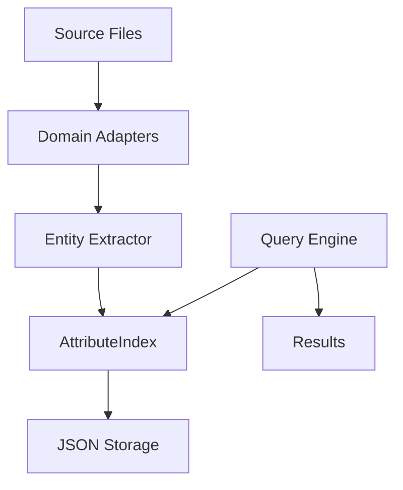
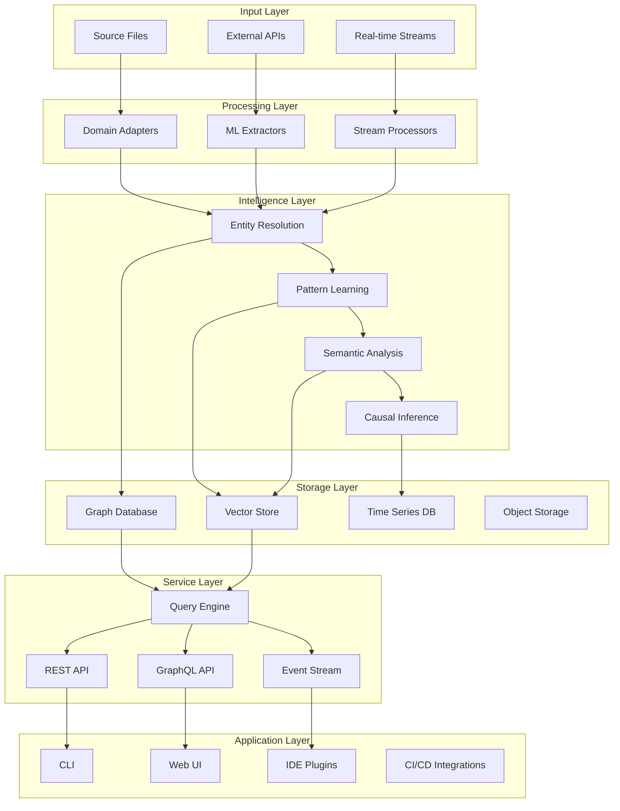

# Architecture Evolution Plan

## Current Architecture



### Current Components
- **Adapters**: TypeScript Analyzer, Universal Fallback
- **Storage**: JSON file-based
- **Indexing**: In-memory AttributeIndex
- **Query**: Boolean attribute queries

## Target Architecture (End State)



## Evolution Phases

### Phase 1: Storage Layer Evolution

#### From: JSON Files
```typescript
// Current
interface Storage {
  save(data: any): void;
  load(): any;
}
```

#### To: Graph Database Abstraction
```typescript
// Target
interface GraphStorage {
  // Node operations
  createNode(type: string, properties: Record<string, any>): NodeId;
  updateNode(id: NodeId, properties: Record<string, any>): void;
  deleteNode(id: NodeId): void;
  
  // Edge operations
  createEdge(from: NodeId, to: NodeId, type: string, properties?: Record<string, any>): EdgeId;
  deleteEdge(id: EdgeId): void;
  
  // Query operations
  query(pattern: GraphPattern): AsyncIterator<Result>;
  traverse(start: NodeId, pattern: TraversalPattern): AsyncIterator<Path>;
  
  // Transaction support
  beginTransaction(): Transaction;
  commit(tx: Transaction): void;
  rollback(tx: Transaction): void;
}
```

#### Migration Strategy
1. Implement storage abstraction interface
2. Create JSON adapter (current functionality)
3. Implement graph adapter (new functionality)
4. Add migration tool
5. Gradual rollout with feature flags

### Phase 2: Intelligence Layer Introduction

#### New Components

##### Entity Resolution Service
```typescript
interface EntityResolver {
  // Disambiguation
  disambiguate(entity: Entity, context: Context): DisambiguatedEntity;
  
  // Merging
  findDuplicates(entities: Entity[]): DuplicateGroup[];
  merge(entities: Entity[]): MergedEntity;
  
  // Confidence scoring
  scoreConfidence(entity: Entity): ConfidenceScore;
  
  // Learning
  learn(correction: ManualCorrection): void;
}
```

##### Pattern Learning Engine
```typescript
interface PatternEngine {
  // Detection
  detectPatterns(entities: Entity[], relationships: Relationship[]): Pattern[];
  
  // Generalization
  generalizePattern(instances: Pattern[]): GeneralizedPattern;
  
  // Application
  applyPattern(pattern: Pattern, context: Context): Prediction[];
  
  // Transfer
  transferPattern(pattern: Pattern, targetDomain: Domain): TransferResult;
}
```

##### Semantic Analyzer
```typescript
interface SemanticAnalyzer {
  // Embedding
  embed(text: string): Vector;
  embedBatch(texts: string[]): Vector[];
  
  // Similarity
  similarity(a: Vector, b: Vector): number;
  findSimilar(vector: Vector, k: number): SimilarItem[];
  
  // Clustering
  cluster(vectors: Vector[]): Cluster[];
  
  // Classification
  classify(text: string, categories: Category[]): Classification;
}
```

### Phase 3: Distributed Architecture

#### From: Single Process
```yaml
Current:
  - Single Node.js process
  - In-memory processing
  - Synchronous operations
```

#### To: Distributed System
```yaml
Target:
  Components:
    - API Gateway (Kong/Envoy)
    - Service Mesh (Istio)
    - Message Queue (RabbitMQ/Kafka)
    - Worker Pool (Kubernetes Jobs)
    - Cache Layer (Redis)
    - CDN (CloudFront)
    
  Patterns:
    - Event Sourcing
    - CQRS
    - Circuit Breaker
    - Bulkhead
    - Retry with Backoff
```

#### Service Decomposition

```yaml
Services:
  ingestion-service:
    responsibility: File processing and entity extraction
    scaling: Horizontal (CPU-based)
    
  analysis-service:
    responsibility: Pattern detection and learning
    scaling: Horizontal (Memory-based)
    
  query-service:
    responsibility: Read operations and search
    scaling: Horizontal with caching
    
  storage-service:
    responsibility: Graph database operations
    scaling: Vertical with sharding
    
  ml-service:
    responsibility: Embedding and classification
    scaling: GPU-based auto-scaling
    
  notification-service:
    responsibility: Event streaming and webhooks
    scaling: Connection-based
```

### Phase 4: Multi-Modal Processing

#### Architecture Extension

```typescript
interface MultiModalProcessor {
  // Processors by type
  processors: Map<MediaType, Processor>;
  
  // Process any input type
  process(input: Input): MultiModalEntity;
  
  // Cross-modal correlation
  correlate(entities: MultiModalEntity[]): Correlation[];
  
  // Unified representation
  unify(entities: MultiModalEntity[]): UnifiedContext;
}

// Specialized processors
interface DiagramProcessor {
  extractArchitecture(image: Buffer): ArchitectureModel;
  extractUML(image: Buffer): UMLModel;
  extractFlow(image: Buffer): FlowModel;
}

interface AudioProcessor {
  transcribe(audio: Buffer): Transcript;
  extractSpeakers(audio: Buffer): Speaker[];
  extractTopics(transcript: Transcript): Topic[];
}
```

### Phase 5: Autonomous Intelligence

#### Self-Managing Architecture

```typescript
interface AutonomousSystem {
  // Self-optimization
  optimizer: {
    analyzePerformance(): PerformanceMetrics;
    identifyBottlenecks(): Bottleneck[];
    optimizeConfiguration(): Configuration;
    applyOptimizations(): void;
  };
  
  // Self-healing
  healer: {
    detectAnomalies(): Anomaly[];
    diagnoseIssues(anomaly: Anomaly): Diagnosis;
    repairIssue(diagnosis: Diagnosis): RepairResult;
    validateRepair(result: RepairResult): boolean;
  };
  
  // Self-learning
  learner: {
    observeUsage(): UsagePattern[];
    learnPreferences(): Preferences;
    adaptBehavior(preferences: Preferences): void;
    improveAccuracy(feedback: Feedback): void;
  };
}
```

## Technology Stack Evolution

### Current Stack
- **Language**: TypeScript
- **Runtime**: Node.js
- **Storage**: JSON files
- **Testing**: Vitest
- **Build**: Mastra CLI

### Phase 1 Additions
- **Graph DB**: Kuzu or SurrealDB
- **Cache**: Redis
- **Monitoring**: Prometheus + Grafana

### Phase 2 Additions
- **ML Framework**: TensorFlow.js or ONNX Runtime
- **Vector DB**: Pinecone or Weaviate
- **Embeddings**: OpenAI or local models

### Phase 3 Additions
- **Container**: Docker + Kubernetes
- **Service Mesh**: Istio
- **Message Queue**: RabbitMQ or Kafka
- **API Gateway**: Kong or Traefik

### Phase 4 Additions
- **Computer Vision**: OpenCV or Tesseract
- **Speech**: Whisper or Google Speech
- **NLP**: spaCy or Hugging Face

### Phase 5 Additions
- **AutoML**: AutoKeras or H2O
- **Observability**: OpenTelemetry
- **Chaos Engineering**: Litmus
- **Feature Flags**: LaunchDarkly

## Data Flow Evolution

### Current Data Flow
```
File -> Adapter -> Entities -> Index -> Query
```

### Target Data Flow
```
Multi-Source Input 
  -> Streaming Pipeline
  -> Multi-Modal Processing
  -> Intelligence Layer
  -> Distributed Storage
  -> Cached Query Layer
  -> Multi-Channel Output
```

## Migration Strategies

### Database Migration
1. **Dual Write**: Write to both JSON and graph
2. **Shadow Read**: Compare results between systems
3. **Gradual Cutover**: Route percentage of traffic
4. **Full Migration**: Complete switchover
5. **Deprecation**: Remove old system

### API Evolution
1. **Version 1**: Current JSON-based API
2. **Version 2**: Graph-aware API with backward compatibility
3. **Version 3**: Full GraphQL with deprecation warnings
4. **Version 4**: Event-driven API with subscriptions

### Deployment Evolution
1. **Current**: Local development only
2. **Phase 1**: Docker containers
3. **Phase 2**: Kubernetes deployment
4. **Phase 3**: Multi-region deployment
5. **Phase 4**: Edge deployment

## Performance Targets by Phase

| Phase | Entities | Relationships | Query Time | Index Time | Memory |
|-------|----------|---------------|------------|------------|---------|
| Current | 10K | 50K | 1s | 10s | 500MB |
| Phase 1 | 100K | 500K | 500ms | 30s | 1GB |
| Phase 2 | 500K | 2M | 200ms | 1m | 2GB |
| Phase 3 | 1M | 10M | 100ms | 2m | 4GB |
| Phase 4 | 10M | 100M | 50ms | 5m | 8GB |
| Phase 5 | 100M | 1B | 25ms | 10m | 16GB |

## Backward Compatibility

### Compatibility Matrix

| Component | v1.0 | v2.0 | v3.0 | v4.0 | v5.0 |
|-----------|------|------|------|------|------|
| JSON Storage | ✓ | ✓ | Deprecated | ✗ | ✗ |
| CLI Commands | ✓ | ✓ | ✓ | ✓ | Enhanced |
| REST API | ✓ | ✓ | ✓ | ✓ | ✓ |
| GraphQL | ✗ | Preview | ✓ | ✓ | ✓ |
| Streaming | ✗ | ✗ | Beta | ✓ | ✓ |

### Deprecation Policy
- 2 version deprecation warning
- 1 version grace period
- Migration tools provided
- Documentation updated
- Community notification

## Architecture Decision Records

### ADR-001: Graph Database Selection
- **Status**: Proposed
- **Context**: Need scalable storage for relationships
- **Decision**: TBD after evaluation
- **Consequences**: Major architecture change

### ADR-002: Distributed vs Monolithic
- **Status**: Proposed
- **Context**: Scale requirements increasing
- **Decision**: Gradual service decomposition
- **Consequences**: Increased complexity, better scale

### ADR-003: ML Integration Strategy
- **Status**: Proposed
- **Context**: Need intelligent features
- **Decision**: Hybrid local/cloud approach
- **Consequences**: Privacy preserved, costs managed

### ADR-004: Multi-Modal Processing
- **Status**: Future
- **Context**: Users have diverse content
- **Decision**: Plugin architecture
- **Consequences**: Extensible but complex

### ADR-005: Autonomous Operations
- **Status**: Future
- **Context**: Manual maintenance doesn't scale
- **Decision**: Progressive automation
- **Consequences**: Reduced operational burden