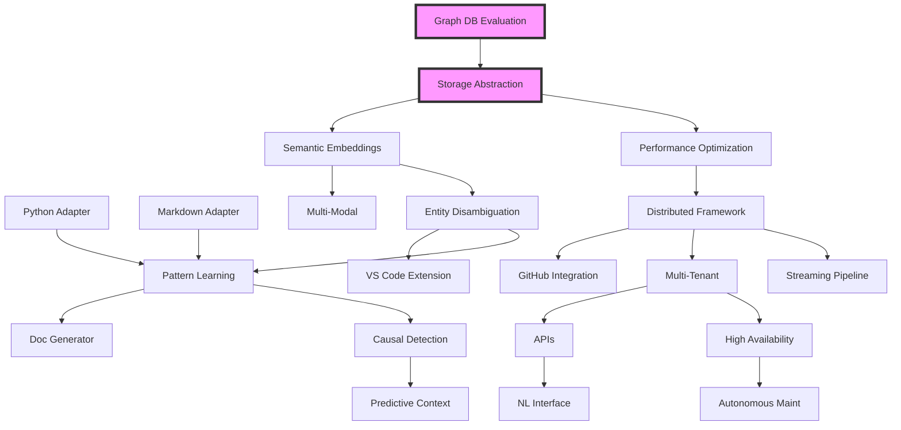

# Dependencies and Sequencing

## Dependency Graph



## Critical Path

The critical path represents the longest sequence of dependent tasks that determines the minimum project duration:

```
Graph DB Evaluation (1w)
→ Storage Abstraction (2w)
→ Performance Optimization (1w)
→ Semantic Embeddings (2w)
→ Entity Disambiguation (1.5w)
→ Pattern Learning (3w)
→ Causal Detection (2w)
→ Distributed Framework (2w)
→ Multi-Tenant Architecture (2w)
→ High Availability (1w)
= 17.5 weeks minimum
```

## Parallel Work Streams

### Stream 1: Storage & Infrastructure
- Graph database evaluation and integration
- Performance optimization
- Distributed architecture
- High availability

### Stream 2: Domain Adapters
- Python adapter
- Markdown adapter
- SQL adapter
- API spec adapter
- Config file adapter

### Stream 3: Intelligence Features
- Semantic embeddings
- Entity disambiguation
- Pattern learning
- Causal inference

### Stream 4: User Experience
- VS Code extension
- GitHub integration
- Documentation generator
- APIs and SDKs

## Task Dependencies Detail

### Phase 1: Foundation Enhancement

| Task | Depends On | Enables | Blockers |
|------|------------|---------|----------|
| T1.1: Graph DB Eval | None | T1.2 | Team availability |
| T1.2: Storage Layer | T1.1 | T1.5, T2.1, T3.1 | DB selection |
| T1.3: Python Adapter | None | T2.3 validation | None |
| T1.4: Markdown Adapter | None | T2.3 validation | None |
| T1.5: Performance Opt | T1.2 | T3.1 | Storage completion |

### Phase 2: Intelligence Layer

| Task | Depends On | Enables | Blockers |
|------|------------|---------|----------|
| T2.1: Embeddings | T1.2 | T2.2, T5.1 | ML infrastructure |
| T2.2: Disambiguation | T2.1 | T2.3, T4.1 | Embedding quality |
| T2.3: Pattern Learning | T2.2, T1.3, T1.4 | T2.4, T4.3 | Multi-domain data |
| T2.4: Causal Detection | T2.3 | T5.2 | Pattern accuracy |

### Phase 3: Scale & Distribution

| Task | Depends On | Enables | Blockers |
|------|------------|---------|----------|
| T3.1: Distributed | T1.5 | T3.2, T3.3, T4.2 | Infrastructure |
| T3.2: Streaming | T3.1 | Large file support | Queue selection |
| T3.3: Multi-Tenant | T3.1 | T3.4, T4.4 | Security review |
| T3.4: High Availability | T3.3 | T5.4 | Testing environment |

### Phase 4: Ecosystem Integration

| Task | Depends On | Enables | Blockers |
|------|------------|---------|----------|
| T4.1: VS Code Ext | T2.2 | User adoption | None |
| T4.2: GitHub | T3.1 | CI/CD integration | API limits |
| T4.3: Doc Generator | T2.3 | Auto documentation | None |
| T4.4: APIs | T3.3 | T5.3 | Security audit |

### Phase 5: Advanced Intelligence

| Task | Depends On | Enables | Blockers |
|------|------------|---------|----------|
| T5.1: Multi-Modal | T2.1 | Complete context | CV libraries |
| T5.2: Predictive | T2.4 | Proactive assistance | Data volume |
| T5.3: NL Interface | T4.4 | Natural interaction | LLM costs |
| T5.4: Autonomous | T3.4 | Self-maintenance | Complexity |

## Resource Dependencies

### Human Resources
```yaml
Required Skills:
  Phase 1:
    - Graph database expertise
    - Python development
    - Performance optimization
    
  Phase 2:
    - Machine learning engineering
    - NLP expertise
    - Statistical analysis
    
  Phase 3:
    - Distributed systems
    - DevOps/Kubernetes
    - Security engineering
    
  Phase 4:
    - Frontend development
    - API design
    - Technical writing
    
  Phase 5:
    - Computer vision
    - AutoML
    - System architecture
```

### Technical Dependencies

#### External Libraries
```json
{
  "phase1": {
    "kuzu": "^0.x",
    "redis": "^4.x",
    "tree-sitter": "^0.x"
  },
  "phase2": {
    "@tensorflow/tfjs": "^4.x",
    "openai": "^4.x",
    "natural": "^6.x"
  },
  "phase3": {
    "amqplib": "^0.x",
    "kubernetes-client": "^9.x",
    "prom-client": "^14.x"
  },
  "phase4": {
    "vscode": "^1.x",
    "@octokit/rest": "^19.x",
    "graphql": "^16.x"
  },
  "phase5": {
    "tesseract.js": "^4.x",
    "whisper": "^1.x",
    "@xenova/transformers": "^2.x"
  }
}
```

#### Infrastructure Requirements
```yaml
Development:
  - Node.js 20+
  - Docker Desktop
  - 16GB RAM minimum
  - GPU (Phase 2+)

Testing:
  - CI/CD pipeline
  - Test databases
  - Load testing tools
  - Security scanning

Production:
  - Kubernetes cluster
  - Graph database cluster
  - Redis cluster
  - Monitoring stack
  - Log aggregation
```

## Dependency Risks

### High-Risk Dependencies

1. **Graph Database Selection** (T1.1)
   - Risk: Wrong choice could require complete rewrite
   - Mitigation: Extensive evaluation, abstraction layer

2. **ML Model Quality** (T2.1)
   - Risk: Poor embeddings affect all downstream features
   - Mitigation: Multiple model options, quality metrics

3. **Distributed Architecture** (T3.1)
   - Risk: Complexity explosion
   - Mitigation: Incremental migration, fallback options

### External Dependencies

| Dependency | Risk Level | Impact | Mitigation |
|------------|------------|--------|------------|
| OpenAI API | Medium | T2.1, T5.3 | Local model fallback |
| GitHub API | Low | T4.2 | Caching, rate limiting |
| Cloud Provider | Medium | T3.* | Multi-cloud strategy |
| npm Registry | Low | All | Private registry mirror |

## Sequencing Strategy

### Minimum Viable Sequence
1. Graph database integration (enables scale)
2. One additional adapter (proves universality)
3. Basic intelligence features (adds value)
4. API layer (enables integration)

### Optimal Sequence
Following the critical path while maximizing parallel work:
- Week 1-4: Database + Adapters in parallel
- Week 5-8: Storage layer + Early intelligence
- Week 9-12: Core intelligence + Distribution prep
- Week 13-16: Scale + Integration
- Week 17-20: Advanced features + Polish

### Risk-Mitigated Sequence
Addressing highest risks first:
1. Graph database POC (Risk: Performance)
2. Cross-domain validation (Risk: Pattern transfer)
3. Security implementation (Risk: Multi-tenant)
4. Distribution architecture (Risk: Complexity)

## Milestone Dependencies

### Milestone 1: Foundation Complete
**Dependencies Met**:
- Graph database operational
- 3+ adapters working
- Performance targets achieved

**Unlocks**:
- Intelligence layer development
- Early adopter program
- Performance benchmarking

### Milestone 2: Intelligence Operational
**Dependencies Met**:
- Semantic search working
- Pattern learning validated
- 90%+ accuracy achieved

**Unlocks**:
- Production readiness
- Enterprise features
- Advanced intelligence

### Milestone 3: Scale Achieved
**Dependencies Met**:
- 1M+ entities supported
- Distributed processing
- 99.9% availability

**Unlocks**:
- Enterprise deployment
- SaaS offering
- Global scale

### Milestone 4: Ecosystem Integrated
**Dependencies Met**:
- Major IDE support
- API stability
- Documentation complete

**Unlocks**:
- Community growth
- Partnership opportunities
- Market expansion

### Milestone 5: Autonomous Intelligence
**Dependencies Met**:
- Self-optimization working
- Predictive accuracy > 70%
- Multi-modal understanding

**Unlocks**:
- Next-generation features
- Research publications
- Industry leadership

## Dependency Management

### Tracking Method
- JIRA dependency links
- Gantt chart visualization
- Weekly dependency review
- Automated blocking detection

### Communication
- Daily standup flag risks
- Weekly planning review dependencies
- Sprint planning validates sequence
- Retrospectives analyze blockers

### Mitigation Strategies
1. **Buffer Time**: 20% added to critical path
2. **Parallel Tracks**: Minimize sequential dependencies
3. **Feature Flags**: Decouple deployments
4. **Abstraction Layers**: Reduce coupling
5. **Spike Solutions**: Validate before committing