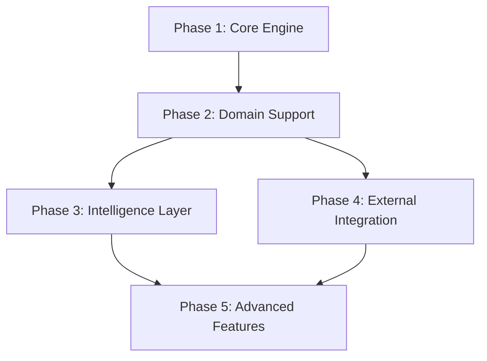

# CorticAI Implementation Phases

## Purpose
This document defines the implementation phases for CorticAI, structured by dependencies rather than timelines. Each phase builds on previous capabilities to enable increasingly sophisticated features.

## Classification
- **Domain:** Planning
- **Stability:** Dynamic
- **Abstraction:** Structural
- **Confidence:** Evolving

## Implementation Strategy

The implementation follows a dependency-driven sequence where each phase enables the next. The system is designed for incremental development with value delivery at each phase.

**IMPORTANT**: Each phase includes integrated research tasks that validate approaches before full implementation. These research tasks are first-class work items, not separate activities.

## Phase Dependencies

## Phase 1: Core Engine [Foundation]

### Goals
- Establish storage infrastructure
- Implement basic operations
- Create minimal API

### Components
- **Storage Setup**: Initialize Kuzu graph database and DuckDB analytics
- **File Monitoring**: Watch for file changes in project
- **Basic API**: CRUD operations for nodes and edges
- **Simple Queries**: Basic pattern matching

### Key Technologies
- Kuzu for graph storage
- DuckDB for analytics
- Chokidar for file watching
- TypeScript for type safety

### Completion Criteria
- Storage initialized and accessible
- File changes detected and logged
- Basic CRUD operations working
- Simple queries returning results

### Enables
- All subsequent phases require this foundation

## Phase 2: Domain Support

### Dependencies
- Requires: Phase 1 (storage and basic operations)

### Goals
- Implement domain adapter interface
- Create code and document adapters
- Enable multi-domain indexing

### Components
- **Domain Adapter Interface**: Abstract base for all adapters
- **Code Domain Adapter**: Extract functions, classes, imports
- **Document Domain Adapter**: Extract sections, references, concepts
- **Universal Pattern Detection**: Identify patterns across domains

### Key Concepts
- Adapter pattern for extensibility
- AST parsing for code analysis
- Markdown parsing for documents
- Cross-domain pattern recognition

### Completion Criteria
- Multiple domain adapters working
- Cross-domain patterns detected
- Successful indexing of mixed content
- Domain-specific queries returning correct results

### Enables
- Intelligence features (Phase 3)
- Cross-domain learning capabilities

## Phase 3: Intelligence Layer

### Dependencies
- Requires: Phase 2 (domain understanding)

### Goals
- Implement lens system
- Create continuity cortex
- Enable progressive loading
- Build maintenance agents

### Components
- **Lens System**: Task-specific views and emphasis
- **Continuity Cortex**: Deduplication and staleness detection
- **Progressive Loading**: Load context at appropriate depth
- **Maintenance Agents**: Automated consolidation and refresh

### Key Features
- Duplicate file prevention
- Context-aware file operations
- Task-specific information filtering
- Automatic maintenance during quiet periods

### Completion Criteria
- Lens system activating appropriately
- Duplicate detection preventing recreation
- Progressive loading reducing context size
- Maintenance agents running successfully

### Enables
- Advanced learning features (Phase 5)
- Sophisticated agent interactions

## Phase 4: External Integration

### Dependencies
- Requires: Phase 1 (storage foundation)
- Can run parallel to: Phase 3

### Goals
- Connect to GitHub/GitLab
- Integrate with issue trackers
- Enable bi-directional sync
- Augment context with external data

### Components
- **GitHub Connector**: Issues, PRs, discussions
- **Issue Tracker Integration**: Jira, Linear, etc.
- **Sync Manager**: Bi-directional synchronization
- **External Augmentation**: Enrich context with external data

### Key Capabilities
- Link issues to code
- Track decision rationale
- Preserve deleted branches
- Sync external changes

### Completion Criteria
- Issues imported and linked to code
- External changes synchronized
- Conflicts detected and resolved
- Augmented context available in queries

### Enables
- Complete context from all sources
- Historical preservation (Phase 5)

## Phase 5: Advanced Features

### Dependencies
- Requires: Phase 3 (intelligence layer)
- Requires: Phase 4 (external integration)

### Goals
- Implement meta-repository pattern
- Add temporal queries
- Build pattern learning
- Enable cross-domain insights

### Components
- **Meta-Repository**: Preserve all branches and experiments
- **Temporal Queries**: Time-travel and evolution tracking
- **Pattern Learning**: Learn from usage and apply optimizations
- **Cross-Domain Insights**: Discover universal patterns

### Advanced Capabilities
- Query historical states
- Learn from user behavior
- Detect emergent patterns
- Cross-project learning

### Completion Criteria
- Full history preserved and queryable
- Temporal queries working correctly
- Patterns learned and applied
- Cross-domain insights discovered

### Enables
- Full system vision realized
- Continuous improvement through learning

## Implementation Approach

### For Each Phase

1. **Design First**
   - Document detailed specifications
   - Create interface definitions
   - Design test scenarios

2. **Build Core**
   - Implement minimal functionality
   - Write comprehensive tests
   - Create basic documentation

3. **Iterate and Refine**
   - Test with real projects
   - Gather usage patterns
   - Optimize performance

4. **Integration**
   - Connect with other components
   - Ensure compatibility
   - Update documentation

### Testing Strategy

**Unit Tests**: Component-level functionality
**Integration Tests**: Cross-component interactions
**Performance Tests**: Scalability and speed
**User Acceptance**: Real-world usage patterns

### Risk Mitigation

**Technical Risks**
- Database performance at scale
- Memory usage for large projects
- Query response times

**Mitigation Strategies**
- Incremental indexing
- Lazy loading patterns
- Caching frequently accessed data

## Relationships
- **Parent Nodes:** [planning/roadmap.md]
- **Child Nodes:** None
- **Related Nodes:** 
  - [architecture/corticai_architecture.md] - implements - System architecture
  - [foundation/problem_analysis.md] - addresses - Core problems
  - [decisions/index.md] - documents - Technology choices

## Navigation Guidance
- **Access Context:** Reference for understanding build sequence and dependencies
- **Common Next Steps:** Review specific phase details or architecture documents
- **Related Tasks:** Sprint planning, feature development, testing
- **Update Patterns:** Update as phases are completed or requirements change

## Metadata
- **Created:** 2025-08-28
- **Last Updated:** 2025-08-28
- **Updated By:** Planning Phase