# Architecture Strategy: Next Phase Implementation

## High-Level Architecture Vision

### Strategic Architecture Goal
Transform the CorticAI foundation from a **universal context engine** into a **user-facing intelligent context system** through three parallel value streams:

1. **Domain Versatility Stream**: Multiple domain adapters proving universal applicability
2. **Intelligence Stream**: Concrete lens implementations delivering adaptive context
3. **Integration Stream**: Seamless component interaction with production-quality polish

### Architecture Principles for This Phase

#### 1. **Foundation Preservation**
- **No Breaking Changes**: All new implementations must maintain backward compatibility
- **Pattern Consistency**: Follow established patterns from NovelAdapter and lens foundation
- **Quality Standards**: Match or exceed existing >90% test coverage and performance benchmarks
- **Security Maintenance**: No introduction of vulnerabilities or security regressions

#### 2. **Parallel Development Enablement**
- **Component Independence**: Each adapter and lens can be developed in isolation
- **Shared Infrastructure**: Common utilities and patterns to prevent code duplication
- **Integration Points**: Clear, well-defined interfaces between components
- **Testing Independence**: Each component has comprehensive standalone tests

#### 3. **User Value Focus**
- **Immediate Utility**: Each component provides standalone user value
- **Composed Intelligence**: Components work together for enhanced user experience
- **Performance First**: All features feel responsive and immediate
- **Error Resilience**: Graceful degradation when components fail

## Component Architecture Design

### Domain Adapter Architecture

#### CodebaseAdapter Design
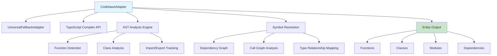

**Key Architectural Decisions**:
- **Extend UniversalFallbackAdapter**: Leverages existing document structure detection
- **TypeScript Compiler API Integration**: Deep code analysis without custom parsing
- **Entity Type Extensions**: Function, class, module, dependency entities with rich metadata
- **Relationship Mapping**: Call graphs, inheritance chains, dependency networks

**Interface Design**:
```typescript
export class CodebaseAdapter extends UniversalFallbackAdapter {
  // Core extraction with code-specific enhancements
  extract(content: string, metadata: FileMetadata): Entity[] {
    const baseEntities = super.extract(content, metadata);
    const codeEntities = this.extractCodeStructure(content, metadata);
    return [...baseEntities, ...codeEntities];
  }

  // Code-specific entity types
  private extractCodeStructure(content: string, metadata: FileMetadata): Entity[] {
    return [
      ...this.extractFunctions(content, metadata),
      ...this.extractClasses(content, metadata),
      ...this.extractModules(content, metadata),
      ...this.extractDependencies(content, metadata)
    ];
  }

  // Enhanced relationship detection for code
  detectRelationships(entities: Entity[]): Relationship[] {
    return [
      ...super.detectRelationships(entities),
      ...this.detectCallRelationships(entities),
      ...this.detectInheritanceRelationships(entities),
      ...this.detectDependencyRelationships(entities)
    ];
  }
}
```

#### DocumentationAdapter Design
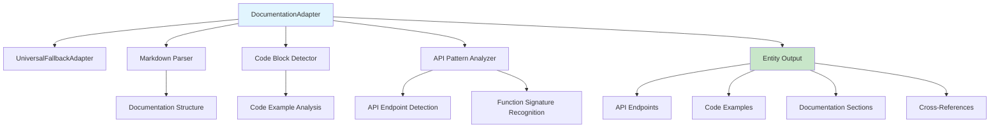

**Key Architectural Decisions**:
- **Documentation-First Approach**: Treats code examples as first-class entities
- **Cross-Reference Resolution**: Links between documentation and code entities
- **API Surface Detection**: Identifies public interfaces and usage patterns
- **Example Validation**: Code examples are analyzed for accuracy and completeness

### Lens Implementation Architecture

#### DebugLens Design
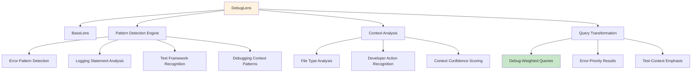

**Pattern Detection Strategy**:
```typescript
export class DebugLens extends BaseLens {
  private debugPatterns = {
    errorHandling: /try\s*{[\s\S]*?catch\s*\([^)]*\)/g,
    logging: /console\.(log|error|warn|debug|info)/g,
    assertions: /expect\(|assert\(|should\(|chai\./g,
    testFrameworks: /(describe|it|test|beforeEach|afterEach)\s*\(/g,
    debuggerStatements: /debugger\s*;/g,
    errorTypes: /(Error|Exception|Throw)/g
  };

  matchesContext(context: ActivationContext): ConfidenceScore {
    const score = this.calculateDebugConfidence(context);
    return {
      confidence: score,
      reasoning: this.generateDebugReasoning(context),
      patterns: this.identifyMatchingPatterns(context)
    };
  }

  transformQuery(query: Query): Query {
    return query
      .addWeighting('error_patterns', 2.5)
      .addWeighting('logging_statements', 2.0)
      .addWeighting('test_frameworks', 1.8)
      .addWeighting('debugging_tools', 1.5)
      .deprioritize('production_code_without_debug_context');
  }
}
```

#### DocumentationLens Design
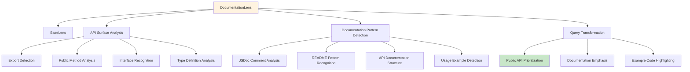

**API Surface Detection Strategy**:
```typescript
export class DocumentationLens extends BaseLens {
  private apiPatterns = {
    exports: /export\s+(class|function|interface|type|const|let|var)/g,
    publicMethods: /public\s+\w+\s*\(/g,
    jsdocComments: /\/\*\*[\s\S]*?\*\//g,
    typeDefinitions: /interface\s+\w+|type\s+\w+\s*=/g,
    apiEndpoints: /(GET|POST|PUT|DELETE|PATCH)\s+\/[\w\/-]+/g
  };

  transformQuery(query: Query): Query {
    return query
      .addWeighting('exported_functions', 3.0)
      .addWeighting('public_interfaces', 2.5)
      .addWeighting('documented_methods', 2.0)
      .addWeighting('api_endpoints', 2.0)
      .addWeighting('type_definitions', 1.5)
      .deprioritize('private_implementation_details');
  }
}
```

## Integration Architecture

### Component Interaction Patterns

#### Domain Adapter Integration
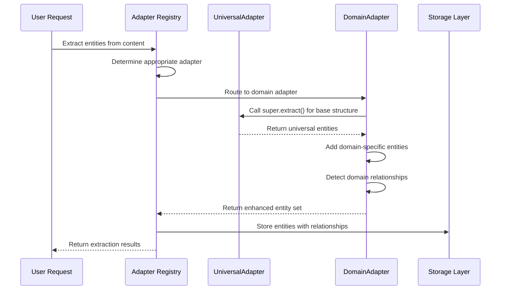

#### Lens System Integration
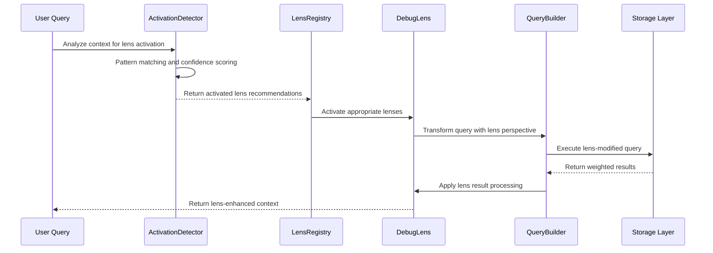

### Performance Architecture

#### Caching Strategy
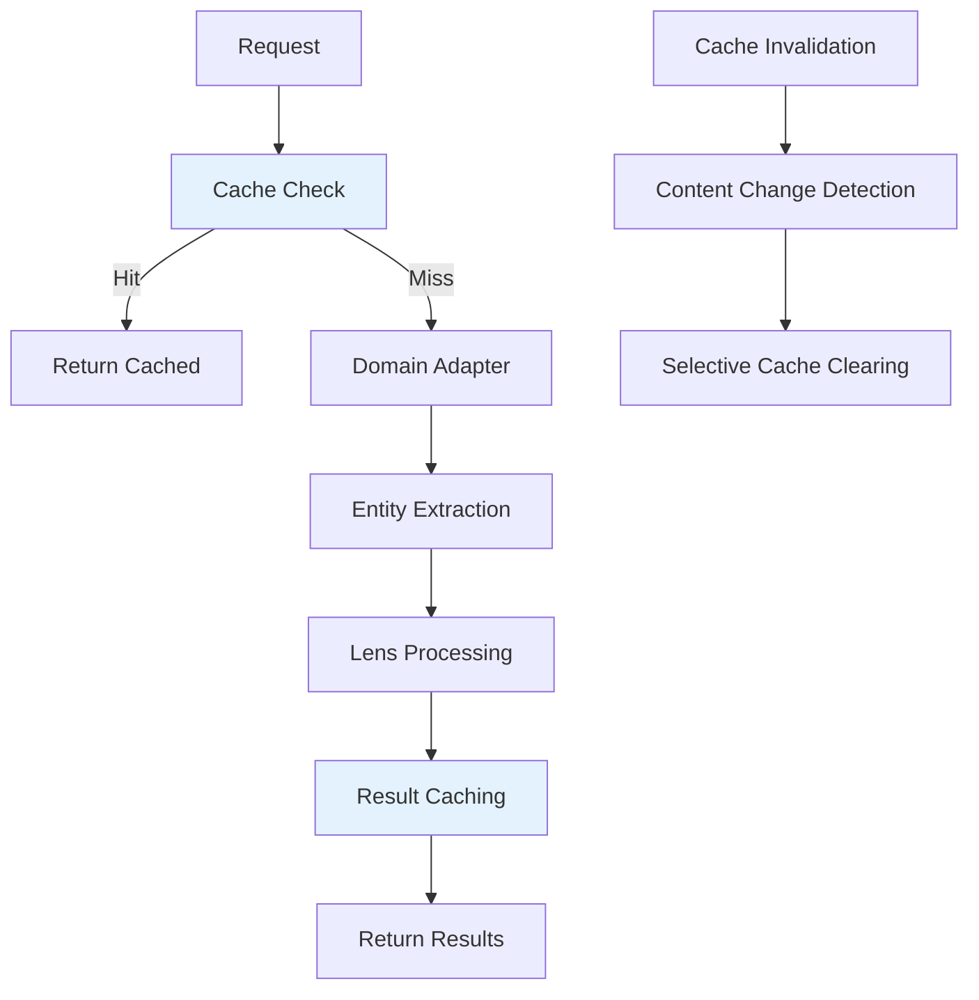

**Caching Implementation Strategy**:
- **Entity Extraction Caching**: Cache by content hash to avoid re-extraction
- **Lens Processing Caching**: Cache lens-modified queries and results
- **Pattern Detection Caching**: Cache expensive pattern analysis results
- **Invalidation Strategy**: Content-based invalidation with selective clearing

#### Memory Management
```typescript
interface PerformanceConfig {
  maxCacheSize: number;
  cacheExpirationMs: number;
  maxConcurrentProcessing: number;
  memoryThresholdMB: number;

  // Domain-specific limits
  maxEntitiesPerAdapter: number;
  maxPatternCacheEntries: number;
  maxLensActivations: number;
}

class PerformanceManager {
  monitorMemoryUsage(): void;
  clearLowPriorityCache(): void;
  throttleConcurrentRequests(): void;
  reportPerformanceMetrics(): PerformanceReport;
}
```

## Data Flow Architecture

### Entity Processing Pipeline
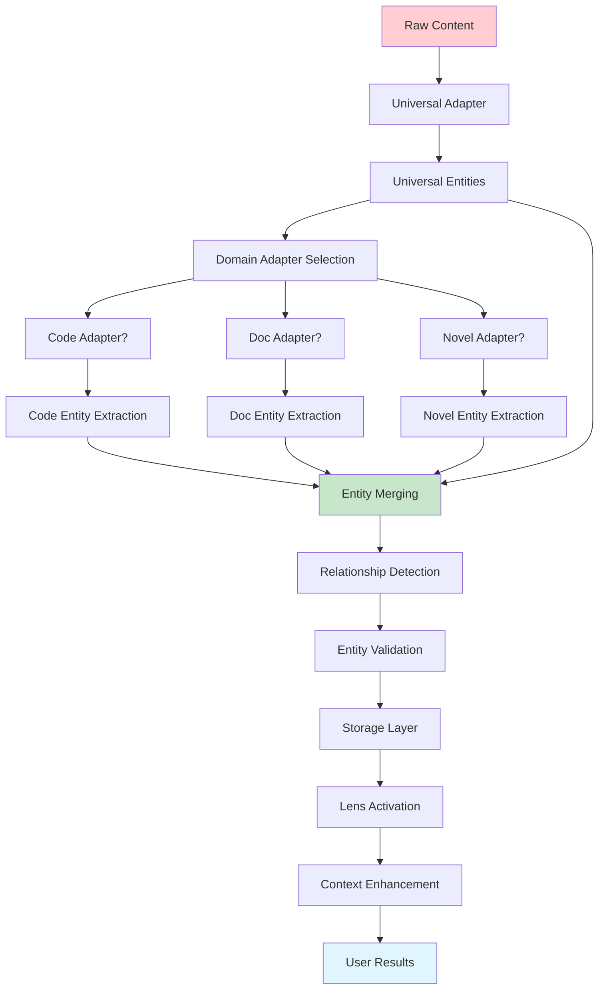

### Query Processing Architecture
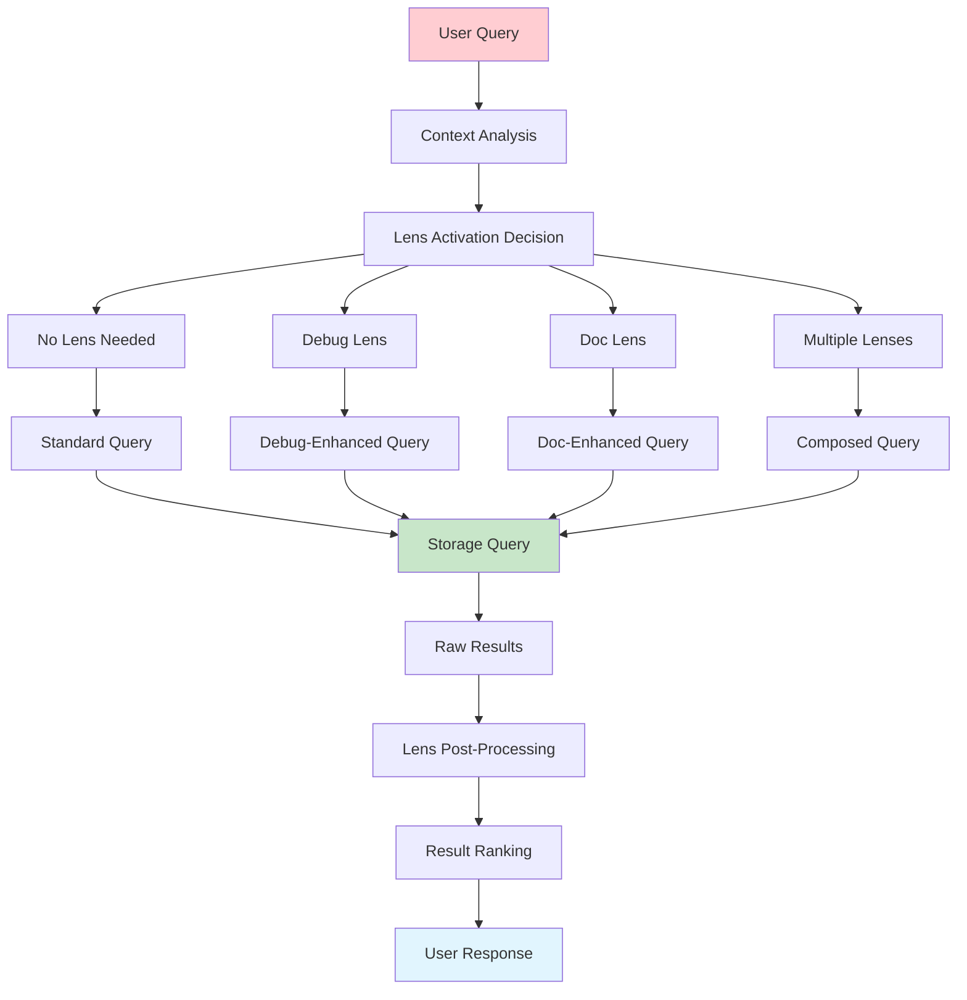

## Security Architecture

### Security Boundaries
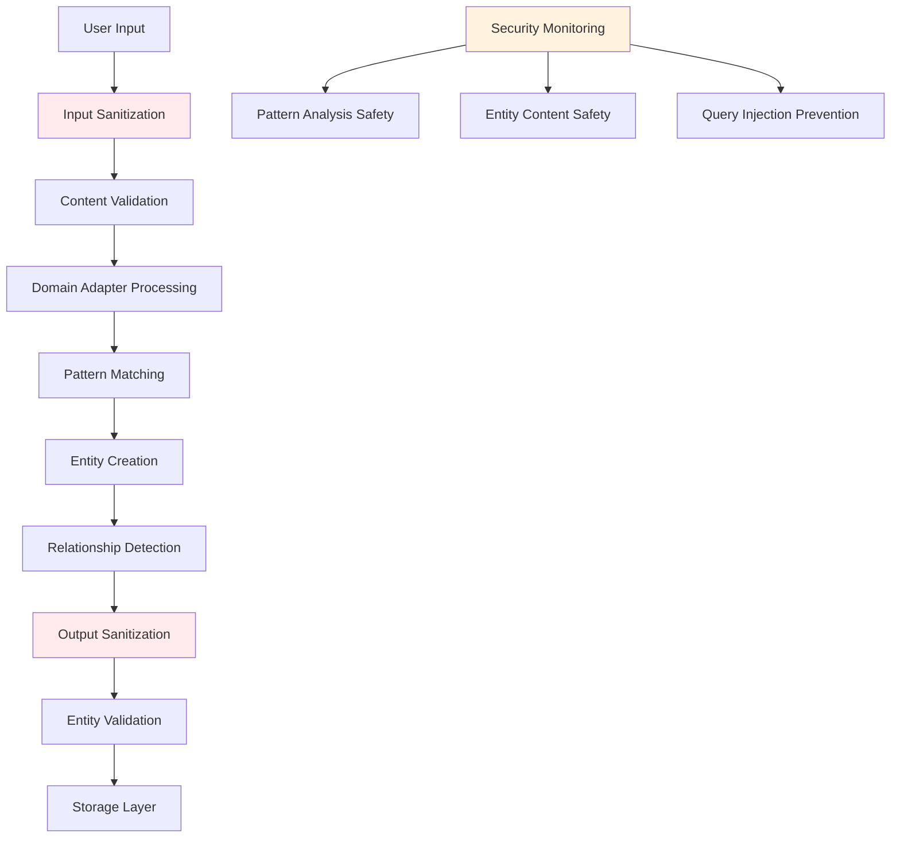

**Security Considerations**:
- **Content Sanitization**: All user content is sanitized before processing
- **Pattern Safety**: Regex patterns are validated to prevent ReDoS attacks
- **Entity Validation**: Entity content is validated before storage
- **Query Safety**: All generated queries are parameterized and validated
- **Access Control**: Domain adapters cannot access filesystem beyond provided content

## Integration Points

### Existing System Integration
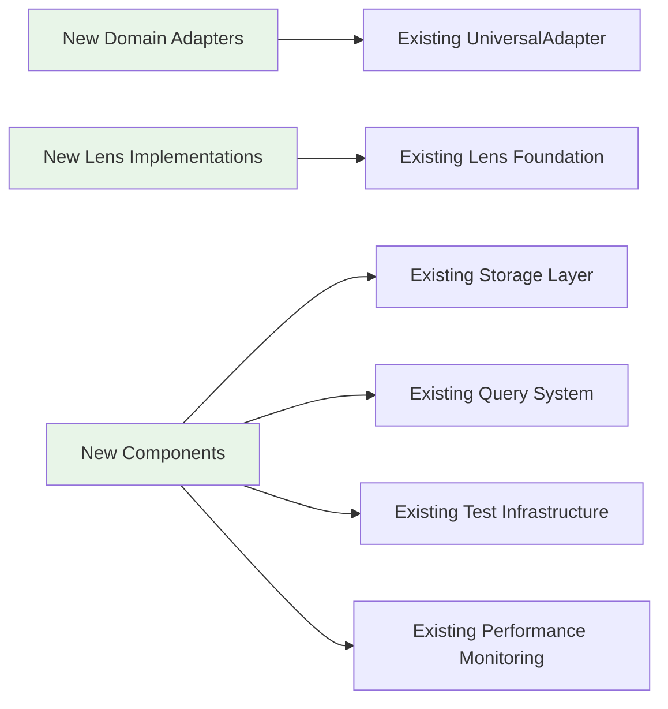

**Integration Requirements**:
- **Backward Compatibility**: All existing APIs must continue working
- **Configuration Integration**: New components use existing configuration patterns
- **Monitoring Integration**: New components integrate with existing performance monitoring
- **Error Handling Integration**: New components use existing error handling patterns
- **Test Integration**: New components follow established testing patterns

### Future Extension Points
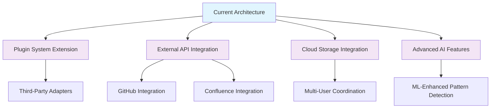

## Quality Assurance Architecture

### Testing Strategy
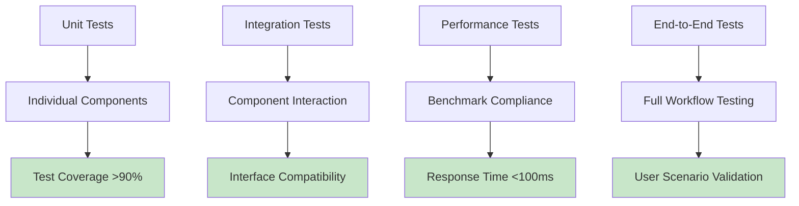

**Quality Gates**:
- **Unit Test Coverage**: >90% for all new code
- **Integration Test Coverage**: All component interfaces tested
- **Performance Benchmarks**: All operations <100ms response time
- **Error Handling**: All error conditions tested and handled gracefully
- **Security Testing**: All input validation and sanitization tested