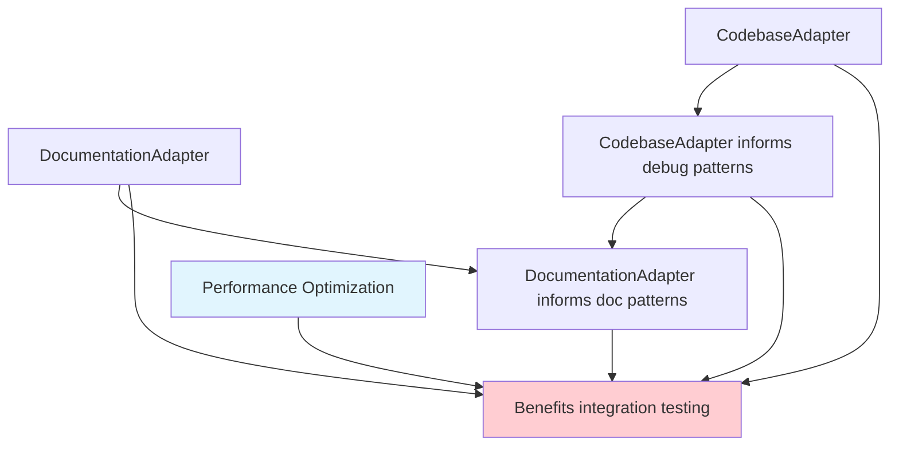

# Task Breakdown: Next Phase Implementation

## Task Organization Strategy

### Parallel Development Streams
Tasks are organized into three parallel streams that can be developed simultaneously:

1. **Stream A: Domain Adapters** (CodebaseAdapter, DocumentationAdapter)
2. **Stream B: Lens Implementations** (DebugLens, DocumentationLens)
3. **Stream C: Integration & Polish** (Performance optimization, integration testing)

Each task is formatted for direct processing by the `/groom` command and ready for test-driven implementation.

---

## Stream A: Domain Adapter Implementation

### Task A1: CodebaseAdapter Implementation

#### One-liner
Build enhanced code analysis adapter for TypeScript/JavaScript codebases with function, class, and dependency detection

#### Complexity
Medium

#### Context
Extend the proven NovelAdapter pattern to create a specialized adapter for code analysis. This demonstrates system versatility in technical domains and provides essential developer tooling functionality.

#### Scope
**Included**:
- TypeScript/JavaScript file analysis using compiler API
- Function, class, interface, and module entity extraction
- Import/export dependency relationship detection
- Call graph analysis for function relationships
- Integration with existing UniversalFallbackAdapter foundation

**Excluded**:
- Multi-language support (focus on TS/JS only)
- Runtime analysis or execution tracing
- Code quality metrics or linting functionality
- Complex refactoring suggestions

**Key files to modify**:
- Create: `/app/src/adapters/CodebaseAdapter.ts`
- Create: `/app/tests/adapters/codebase.test.ts`
- Create: `/app/examples/codebase-adapter-demo.ts`

#### Dependencies
- **Prerequisites**: UniversalFallbackAdapter ✅ COMPLETED, TypeScript compiler API available
- **Blockers**: None - can start immediately
- **Unblocks**: Advanced code intelligence features, developer workflow automation

#### Acceptance Criteria (Test-Ready)
- [ ] Extracts function definitions with parameters, return types, and JSDoc comments
- [ ] Identifies class definitions with methods, properties, and inheritance chains
- [ ] Detects import/export statements and creates dependency relationships
- [ ] Creates call graph relationships between functions
- [ ] Handles TypeScript-specific constructs (interfaces, types, generics)
- [ ] Processes files >50KB in <200ms
- [ ] Achieves >90% test coverage with comprehensive error handling
- [ ] Integrates seamlessly with existing storage and query systems
- [ ] Extends UniversalFallbackAdapter without breaking base functionality

#### Implementation Guide
1. **Setup Phase**: Create CodebaseAdapter class extending UniversalFallbackAdapter
2. **TypeScript Integration**: Initialize TypeScript compiler API for AST parsing
3. **Entity Extraction**: Implement extractCodeStructure() method for functions, classes, modules
4. **Relationship Detection**: Override detectRelationships() for call graphs and dependencies
5. **Testing**: Comprehensive test suite covering all code constructs and edge cases
6. **Performance**: Benchmark and optimize for large codebase processing
7. **Documentation**: Create demo showcasing code analysis capabilities

#### Estimated Effort
- **Size**: Medium
- **Complexity**: Medium (TypeScript compiler API integration)

#### Grooming Notes
- **Watch out for**: TypeScript compiler API complexity, performance with large files
- **Related work**: Pattern established by NovelAdapter, can reuse testing approaches
- **Parent context**: [next-phase-implementation/](../next-phase-implementation/) - Domain versatility stream

---

### Task A2: DocumentationAdapter Implementation

#### One-liner
Build documentation-focused adapter for API docs, README files, and technical writing with code example analysis

#### Complexity
Medium

#### Context
Create specialized adapter for documentation analysis, emphasizing API documentation patterns, code examples, and cross-references between docs and code. Complements CodebaseAdapter for complete developer workflow support.

#### Scope
**Included**:
- Markdown and documentation file structure analysis
- API endpoint and function signature detection
- Code block extraction and analysis within documentation
- Cross-reference resolution between docs and code entities
- Documentation quality assessment (missing docs, outdated examples)

**Excluded**:
- Complex natural language processing
- Multi-language documentation translation
- Visual documentation (diagrams, images) analysis
- Content generation or auto-documentation

**Key files to modify**:
- Create: `/app/src/adapters/DocumentationAdapter.ts`
- Create: `/app/tests/adapters/documentation.test.ts`
- Create: `/app/examples/documentation-adapter-demo.ts`

#### Dependencies
- **Prerequisites**: UniversalFallbackAdapter ✅ COMPLETED, Markdown parsing capabilities
- **Blockers**: None - can start immediately
- **Unblocks**: Documentation workflow automation, API documentation intelligence

#### Acceptance Criteria (Test-Ready)
- [ ] Parses markdown documentation structure (headings, sections, code blocks)
- [ ] Identifies API endpoints with HTTP methods and parameters
- [ ] Extracts code examples and validates syntax
- [ ] Detects function signatures and API interfaces in documentation
- [ ] Creates cross-references between documentation and code entities
- [ ] Identifies missing or outdated documentation sections
- [ ] Processes large documentation files (>100KB) in <300ms
- [ ] Achieves >90% test coverage with error handling
- [ ] Integrates with existing lens and storage systems

#### Implementation Guide
1. **Foundation**: Create DocumentationAdapter extending UniversalFallbackAdapter
2. **Markdown Parsing**: Implement robust markdown structure analysis
3. **API Detection**: Pattern matching for REST endpoints, function signatures
4. **Code Block Analysis**: Extract and analyze embedded code examples
5. **Cross-Reference Logic**: Link documentation entities to code entities
6. **Quality Assessment**: Identify documentation gaps and inconsistencies
7. **Testing**: Comprehensive test suite with real-world documentation examples
8. **Demo**: Showcase documentation intelligence with example projects

#### Estimated Effort
- **Size**: Medium
- **Complexity**: Medium (documentation pattern recognition)

#### Grooming Notes
- **Watch out for**: Markdown parsing edge cases, code example validation complexity
- **Related work**: Can reuse UniversalFallbackAdapter markdown parsing, coordinate with CodebaseAdapter
- **Parent context**: [next-phase-implementation/](../next-phase-implementation/) - Domain versatility stream

---

## Stream B: Lens Implementation

### Task B1: DebugLens Implementation

#### One-liner
Build first concrete lens implementation focusing on debugging context with error handling, logging, and test framework emphasis

#### Complexity
Medium

#### Context
Create the first user-facing lens that demonstrates intelligent context adaptation. DebugLens transforms queries to emphasize debugging-relevant code patterns, proving the lens system's value for developer workflows.

#### Scope
**Included**:
- Error handling pattern detection (try/catch, error types)
- Logging statement analysis (console.log, logger calls)
- Test framework pattern recognition (describe, it, assertions)
- Debug statement detection (debugger, breakpoints)
- Context confidence scoring for activation
- Query transformation for debug emphasis

**Excluded**:
- Runtime debugging integration
- Debugger protocol implementation
- Performance profiling features
- Complex static analysis beyond pattern matching

**Key files to modify**:
- Create: `/app/src/context/lenses/built-in/DebugLens.ts`
- Create: `/app/tests/context/lenses/DebugLens.test.ts`
- Create: `/app/examples/debug-lens-demo.ts`

#### Dependencies
- **Prerequisites**: Lens foundation ✅ COMPLETED, ActivationDetector ✅ WORKING
- **Blockers**: None - lens foundation is ready
- **Unblocks**: Lens system validation, user-facing intelligence features

#### Acceptance Criteria (Test-Ready)
- [ ] Detects error handling patterns with >95% accuracy
- [ ] Identifies logging statements across common frameworks
- [ ] Recognizes test framework patterns (Jest, Vitest, Mocha)
- [ ] Calculates context confidence scores for activation
- [ ] Transforms queries to emphasize debug-relevant entities
- [ ] Activates correctly in debugging scenarios (test files, error contexts)
- [ ] Processes context analysis in <50ms
- [ ] Achieves >90% test coverage including edge cases
- [ ] Integrates with ActivationDetector and LensRegistry

#### Implementation Guide
1. **Pattern Definition**: Define comprehensive debug pattern recognition
2. **Lens Class**: Create DebugLens extending BaseLens with core interface implementation
3. **Context Analysis**: Implement matchesContext() with confidence scoring
4. **Query Transformation**: Implement transformQuery() for debug emphasis
5. **Result Processing**: Implement processResults() for debug highlighting
6. **Activation Logic**: Integration with ActivationDetector patterns
7. **Testing**: Comprehensive test suite with real debugging scenarios
8. **Performance**: Optimize pattern matching for responsiveness

#### Estimated Effort
- **Size**: Medium
- **Complexity**: Medium (pattern recognition and lens integration)

#### Grooming Notes
- **Watch out for**: Pattern matching performance, false positive detection
- **Related work**: ActivationDetector provides foundation, can coordinate with DocumentationLens
- **Parent context**: [next-phase-implementation/](../next-phase-implementation/) - Intelligence stream

---

### Task B2: DocumentationLens Implementation

#### One-liner
Build second concrete lens implementation for API documentation context with public interface emphasis and usage example highlighting

#### Complexity
Medium

#### Context
Create complementary lens to DebugLens that focuses on public API surfaces and documentation contexts. Demonstrates lens system versatility and provides value for documentation workflows.

#### Scope
**Included**:
- Public API surface detection (exports, public methods)
- Interface and type definition recognition
- JSDoc and documentation comment analysis
- Usage example pattern matching
- API endpoint detection for REST services
- Query transformation for documentation emphasis

**Excluded**:
- Auto-documentation generation
- Natural language documentation analysis
- Cross-language API documentation
- Complex semantic analysis of documentation quality

**Key files to modify**:
- Create: `/app/src/context/lenses/built-in/DocumentationLens.ts`
- Create: `/app/tests/context/lenses/DocumentationLens.test.ts`
- Create: `/app/examples/documentation-lens-demo.ts`

#### Dependencies
- **Prerequisites**: Lens foundation ✅ COMPLETED, DebugLens implementation for pattern reference
- **Blockers**: None - can develop in parallel with DebugLens
- **Unblocks**: Multi-lens composition testing, lens system validation

#### Acceptance Criteria (Test-Ready)
- [ ] Identifies exported functions and public interfaces
- [ ] Detects API endpoints and HTTP method patterns
- [ ] Analyzes JSDoc comments for API documentation
- [ ] Recognizes usage examples in comments and documentation
- [ ] Calculates API relevance scores for documentation contexts
- [ ] Transforms queries to prioritize public interface information
- [ ] Activates appropriately in documentation editing scenarios
- [ ] Processes API analysis in <50ms
- [ ] Achieves >90% test coverage with API pattern edge cases

#### Implementation Guide
1. **API Pattern Recognition**: Define patterns for public interfaces and exports
2. **Lens Implementation**: Create DocumentationLens with full interface compliance
3. **Context Matching**: Implement documentation context detection
4. **Query Enhancement**: Transform queries to emphasize public APIs
5. **Result Processing**: Highlight documentation-relevant entities
6. **Integration Testing**: Test with DebugLens for multi-lens scenarios
7. **Performance Optimization**: Ensure fast API surface analysis
8. **Demo Creation**: Showcase documentation workflow improvements

#### Estimated Effort
- **Size**: Medium
- **Complexity**: Medium (API pattern recognition)

#### Grooming Notes
- **Watch out for**: Public vs private API detection accuracy, documentation context recognition
- **Related work**: Coordinate with DebugLens patterns, use DocumentationAdapter insights
- **Parent context**: [next-phase-implementation/](../next-phase-implementation/) - Intelligence stream

---

## Stream C: Integration & Polish

### Task C1: Performance Optimization & Refactoring

#### One-liner
Optimize system performance and refactor large methods for maintainability while ensuring production readiness

#### Complexity
Small

#### Context
Address technical debt identified during foundation development, particularly large method refactoring and performance optimization opportunities. Ensures production-quality standards across all components.

#### Scope
**Included**:
- Refactor extractMarkdownEntities method (144 lines → <50 line methods)
- Optimize large file processing performance
- Implement caching strategies for expensive operations
- Performance benchmarking and monitoring integration
- Memory usage optimization

**Excluded**:
- Major architectural changes
- Algorithm rewrites (focus on optimization, not replacement)
- External dependency updates
- New feature development

**Key files to modify**:
- Modify: `/app/src/adapters/UniversalFallbackAdapter.ts`
- Modify: `/app/src/context/analyzers/SimilarityAnalyzer.ts`
- Create: `/app/src/utils/PerformanceOptimizer.ts`
- Update: Performance monitoring integration points

#### Dependencies
- **Prerequisites**: Existing foundation code ✅ AVAILABLE
- **Blockers**: None - optimization work independent
- **Unblocks**: Production deployment readiness, better developer experience

#### Acceptance Criteria (Test-Ready)
- [ ] extractMarkdownEntities method broken into focused sub-methods (<50 lines each)
- [ ] Large file processing improved by >20% (benchmark against current performance)
- [ ] Memory usage optimized for files >1MB
- [ ] All existing tests continue to pass without modification
- [ ] Performance benchmarks meet existing standards (<100ms operations)
- [ ] Code complexity metrics improved (lower cyclomatic complexity)
- [ ] No regression in functionality or error handling
- [ ] Caching implementation for frequently accessed patterns

#### Implementation Guide
1. **Method Refactoring**: Extract focused methods from large extractMarkdownEntities
2. **Performance Profiling**: Identify bottlenecks in current implementation
3. **Caching Strategy**: Implement intelligent caching for expensive operations
4. **Memory Optimization**: Optimize memory usage patterns for large files
5. **Benchmark Testing**: Validate performance improvements quantitatively
6. **Regression Testing**: Ensure no functionality loss during optimization
7. **Documentation**: Update internal documentation with performance guidelines

#### Estimated Effort
- **Size**: Small
- **Complexity**: Low (optimization work, not new features)

#### Grooming Notes
- **Watch out for**: Introducing bugs during refactoring, performance regression
- **Related work**: Benefits all adapter implementations, especially new ones
- **Parent context**: [next-phase-implementation/](../next-phase-implementation/) - Integration stream

---

### Task C2: Integration Testing & Demo Development

#### One-liner
Create comprehensive integration tests and demo applications showcasing complete workflows with multiple components

#### Complexity
Small

#### Context
Ensure all new components work together seamlessly and create compelling demonstrations of system capabilities for user validation and stakeholder communication.

#### Scope
**Included**:
- Integration tests for adapter + lens combinations
- End-to-end workflow testing
- Demo applications for each major component
- Performance testing under realistic load
- Error handling validation across components

**Excluded**:
- Unit testing (covered in individual component tasks)
- UI development for demos
- External system integration testing
- Load testing beyond realistic usage patterns

**Key files to modify**:
- Create: `/app/tests/integration/adapter-lens-integration.test.ts`
- Create: `/app/tests/integration/end-to-end-workflows.test.ts`
- Create: `/app/examples/complete-workflow-demo.ts`
- Create: `/app/examples/multi-component-showcase.ts`

#### Dependencies
- **Prerequisites**: At least one adapter and one lens implementation completed
- **Blockers**: Depends on completion of A1/A2 (adapters) and B1/B2 (lenses)
- **Unblocks**: Production deployment confidence, user validation

#### Acceptance Criteria (Test-Ready)
- [ ] Integration tests for all adapter-lens combinations
- [ ] End-to-end workflow tests covering realistic user scenarios
- [ ] Demo applications for CodebaseAdapter + DebugLens workflow
- [ ] Demo applications for DocumentationAdapter + DocumentationLens workflow
- [ ] Performance testing with multiple components active simultaneously
- [ ] Error propagation testing across component boundaries
- [ ] Memory usage testing for integrated workflows
- [ ] All integration scenarios achieve target response times

#### Implementation Guide
1. **Integration Test Framework**: Set up comprehensive integration testing
2. **Workflow Testing**: Create realistic user scenario tests
3. **Demo Development**: Build compelling demonstration applications
4. **Performance Integration**: Test performance with multiple active components
5. **Error Scenario Testing**: Validate graceful error handling across components
6. **Documentation**: Create usage guides and best practices
7. **Stakeholder Demos**: Prepare presentations showcasing capabilities

#### Estimated Effort
- **Size**: Small
- **Complexity**: Low (testing and demonstration work)

#### Grooming Notes
- **Watch out for**: Integration complexity, realistic testing scenarios
- **Related work**: Validates all other task implementations
- **Parent context**: [next-phase-implementation/](../next-phase-implementation/) - Integration stream

---

## Task Dependencies and Sequencing

### Dependency Graph

### Recommended Implementation Order

#### Week 1: Foundation Extensions (Parallel)
- **Stream A**: Start CodebaseAdapter (A1)
- **Stream B**: Start DebugLens (B1)
- **Stream C**: Begin Performance Optimization (C1)

#### Week 2: Domain Completion (Parallel)
- **Stream A**: Complete CodebaseAdapter, Start DocumentationAdapter (A2)
- **Stream B**: Complete DebugLens, Start DocumentationLens (B2)
- **Stream C**: Complete Performance Optimization

#### Week 3: Integration & Polish
- **Stream A**: Complete DocumentationAdapter
- **Stream B**: Complete DocumentationLens
- **Stream C**: Complete Integration Testing & Demos (C2)

### Success Criteria Summary

#### Technical Success Metrics
- **Test Coverage**: >90% for all new components
- **Performance**: <100ms response time for all operations
- **Integration**: Seamless component interaction without performance regression
- **Quality**: Zero regression in existing functionality

#### User Value Metrics
- **Domain Coverage**: 3 domain adapters (Universal, Novel ✅, Codebase, Documentation)
- **Intelligence Features**: 2 concrete lens implementations with demonstrable context improvement
- **Workflow Support**: Complete workflows for debugging and documentation tasks
- **Production Readiness**: All components meet established quality and security standards

#### Architecture Success Metrics
- **Extension Validation**: Pattern works for diverse domain implementations
- **Lens System Validation**: Concrete lens implementations prove architecture value
- **Foundation Strength**: All extensions built without modifying foundation components
- **Development Velocity**: Established patterns enable rapid future development

---

## Implementation Readiness Checklist

### Understanding
- [x] Problem clearly defined with user value articulation
- [x] Requirements documented with specific success criteria
- [x] Constraints identified (performance, compatibility, security)
- [x] Assumptions validated against existing foundation

### Design
- [x] Architecture documented with component interaction patterns
- [x] Interfaces specified for all new components
- [x] Data models defined (entity types, relationships, metadata)
- [x] Design patterns chosen (extend existing patterns)

### Planning
- [x] Tasks broken down into groom-ready format with detailed acceptance criteria
- [x] Dependencies mapped with clear sequencing
- [x] Risks assessed with mitigation strategies
- [x] Implementation order determined for optimal parallel development
- [x] Navigation hierarchy established with clear parent context

### Preparation
- [x] Foundation components ready (Universal Adapter, Lens Foundation)
- [x] Tools available (TypeScript compiler API, testing framework)
- [x] Development environment validated
- [x] Quality gates established (test coverage, performance benchmarks)

### Groom Integration Ready
- [x] All tasks formatted for `/groom` command processing
- [x] One-liner summaries provided for quick understanding
- [x] Complexity estimates provided (Trivial/Small/Medium/Large)
- [x] Acceptance criteria defined for test-driven development
- [x] Parent planning context clearly established and integrated