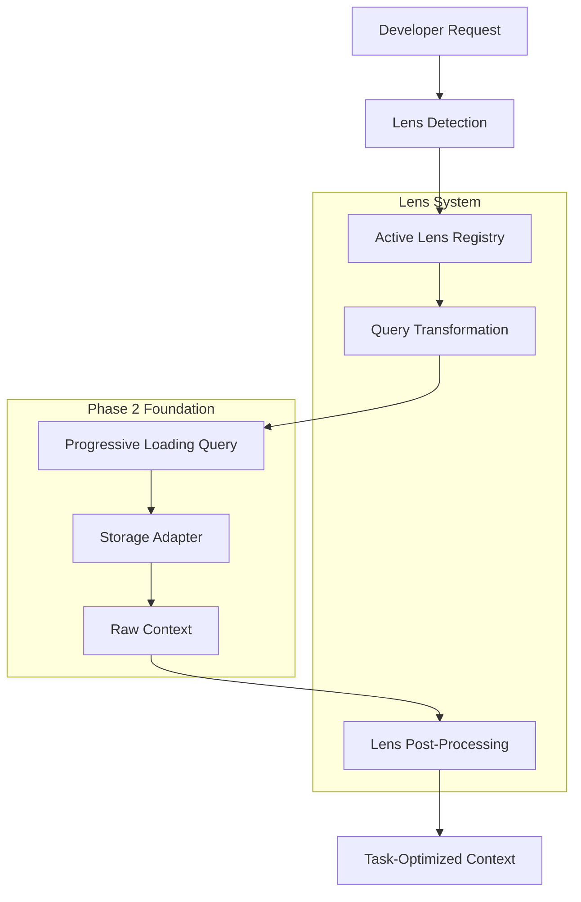

# Architecture Design: Phase 3 Lens System

## Classification
- **Domain**: Planning
- **Stability**: Semi-stable
- **Abstraction**: Structural
- **Confidence**: Established
- **Parent Context**: [requirements.md](./requirements.md)

## High-Level Architecture

### Core Concept: Context Lens as Query Transformer
A **Context Lens** is a composable query transformer that modifies context retrieval behavior based on developer task context. Lenses operate at the query level, transforming requests before they reach storage adapters.



## Component Architecture

### 1. Core Lens Interfaces

```typescript
/**
 * Core lens interface for context transformation
 */
interface ContextLens {
  readonly id: string
  readonly name: string
  readonly priority: number

  // Query transformation
  transformQuery<T>(query: Query<T>): Query<T>

  // Result post-processing
  processResults<T>(results: T[], context: QueryContext): T[]

  // Activation logic
  shouldActivate(context: ActivationContext): boolean

  // Configuration
  configure(config: LensConfig): void
}

/**
 * Lens activation context
 */
interface ActivationContext {
  readonly currentFiles: string[]
  readonly recentActions: DeveloperAction[]
  readonly projectContext: ProjectMetadata
  readonly manualOverride?: string
}

/**
 * Lens configuration
 */
interface LensConfig {
  readonly enabled: boolean
  readonly priority: number
  readonly activationRules: ActivationRule[]
  readonly queryModifications: QueryModification[]
  readonly resultTransformations: ResultTransformation[]
}
```

### 2. Lens Registry System

```typescript
/**
 * Central lens management system
 */
class LensRegistry {
  private lenses: Map<string, ContextLens> = new Map()
  private activeLenses: ContextLens[] = []
  private config: LensRegistryConfig

  // Lens lifecycle
  register(lens: ContextLens): void
  unregister(lensId: string): void

  // Activation management
  detectAndActivate(context: ActivationContext): ContextLens[]
  activate(lensId: string): void
  deactivate(lensId: string): void
  getActiveLenses(): ContextLens[]

  // Query processing
  transformQuery<T>(query: Query<T>, context: QueryContext): Query<T>
  processResults<T>(results: T[], context: QueryContext): T[]
}
```

### 3. Built-in Lens Implementations

#### 3.1 DebugLens Architecture
```typescript
class DebugLens implements ContextLens {
  readonly id = 'debug'
  readonly name = 'Debug Context Lens'
  readonly priority = 10

  transformQuery<T>(query: Query<T>): Query<T> {
    return query
      .withDepth(ContextDepth.DETAILED) // Need full context for debugging
      .where('properties.hasErrorHandling', true)
      .orWhere('properties.hasLogging', true)
      .orWhere('relationships.type', 'throws')
      .orderBy('properties.complexityScore', 'desc')
      .withHint('emphasize', ['error', 'exception', 'log', 'debug'])
  }

  processResults<T>(results: T[], context: QueryContext): T[] {
    // Post-process to highlight debug-relevant information
    return results.map(result => ({
      ...result,
      _lensMetadata: {
        relevanceScore: this.calculateDebugRelevance(result),
        highlightedProperties: this.getDebugHighlights(result),
        relatedPatterns: this.findDebugPatterns(result)
      }
    }))
  }

  shouldActivate(context: ActivationContext): boolean {
    const debugIndicators = [
      context.recentActions.some(action => action.type === 'debugger_start'),
      context.currentFiles.some(file => file.includes('.test.') || file.includes('spec')),
      context.recentActions.some(action => action.type === 'error_occurrence'),
      context.currentFiles.some(file => this.hasRecentFailures(file))
    ]

    return debugIndicators.filter(Boolean).length >= 2
  }
}
```

#### 3.2 DocumentationLens Architecture
```typescript
class DocumentationLens implements ContextLens {
  readonly id = 'documentation'
  readonly name = 'Documentation Context Lens'
  readonly priority = 8

  transformQuery<T>(query: Query<T>): Query<T> {
    return query
      .withDepth(ContextDepth.SEMANTIC) // Focus on public interfaces
      .where('properties.visibility', 'public')
      .orWhere('properties.isExported', true)
      .orderBy('properties.usageCount', 'desc')
      .withHint('emphasize', ['public', 'api', 'interface', 'example'])
  }

  processResults<T>(results: T[], context: QueryContext): T[] {
    return results.map(result => ({
      ...result,
      _lensMetadata: {
        apiRelevanceScore: this.calculateApiRelevance(result),
        documentationStatus: this.getDocumentationStatus(result),
        usageExamples: this.findUsageExamples(result),
        publicInterface: this.extractPublicInterface(result)
      }
    }))
  }

  shouldActivate(context: ActivationContext): boolean {
    return context.recentActions.some(action =>
      action.type === 'file_open' &&
      (action.file.endsWith('.md') || action.file.includes('README'))
    ) || context.manualOverride === 'documentation'
  }
}
```

### 4. Lens Composition System

```typescript
/**
 * Manages multiple active lenses and their interactions
 */
class LensCompositionEngine {
  private activeLenses: ContextLens[]
  private conflictResolver: LensConflictResolver

  composeTransformation<T>(query: Query<T>, context: QueryContext): Query<T> {
    // Apply lenses in priority order
    const sortedLenses = this.activeLenses.sort((a, b) => b.priority - a.priority)

    return sortedLenses.reduce((transformedQuery, lens) => {
      try {
        const lensQuery = lens.transformQuery(transformedQuery)
        return this.conflictResolver.resolve(transformedQuery, lensQuery, lens)
      } catch (error) {
        console.warn(`Lens ${lens.id} failed to transform query:`, error)
        return transformedQuery // Graceful degradation
      }
    }, query)
  }

  composeResults<T>(results: T[], context: QueryContext): T[] {
    // Apply post-processing from all active lenses
    return this.activeLenses.reduce((processedResults, lens) => {
      try {
        return lens.processResults(processedResults, context)
      } catch (error) {
        console.warn(`Lens ${lens.id} failed to process results:`, error)
        return processedResults // Graceful degradation
      }
    }, results)
  }
}
```

## Integration Architecture

### 1. QueryBuilder Integration

```typescript
/**
 * Extended QueryBuilder with lens support
 */
class LensAwareQueryBuilder<T> extends QueryBuilder<T> {
  private lensRegistry: LensRegistry

  constructor(lensRegistry: LensRegistry, initialState?: Partial<QueryState<T>>) {
    super(initialState)
    this.lensRegistry = lensRegistry
  }

  /**
   * Enable automatic lens detection and application
   */
  withLensDetection(context: ActivationContext): LensAwareQueryBuilder<T> {
    const detectedLenses = this.lensRegistry.detectAndActivate(context)
    return this.withLenses(detectedLenses.map(lens => lens.id))
  }

  /**
   * Apply specific lenses to this query
   */
  withLenses(lensIds: string[]): LensAwareQueryBuilder<T> {
    const lenses = lensIds.map(id => this.lensRegistry.getLens(id))
    const transformedQuery = this.applyLensTransformations(lenses)

    return this.createNew({
      ...transformedQuery.getState(),
      _activeLenses: lenses
    })
  }

  /**
   * Override lens detection for manual control
   */
  withLens(lensId: string): LensAwareQueryBuilder<T> {
    return this.withLenses([lensId])
  }

  /**
   * Disable all lenses for this query
   */
  withoutLenses(): QueryBuilder<T> {
    return new QueryBuilder(this.state) // Return base QueryBuilder
  }

  private applyLensTransformations(lenses: ContextLens[]): Query<T> {
    const compositionEngine = new LensCompositionEngine(lenses)
    return compositionEngine.composeTransformation(this, this.getQueryContext())
  }
}
```

### 2. Progressive Loading Integration

The lens system leverages Phase 2's Progressive Loading by:

1. **Depth Awareness**: Lenses can recommend optimal depths for their use cases
2. **Property Filtering**: Lenses work with depth-based property projection
3. **Performance Optimization**: Lens-specific depth selection reduces memory usage

```typescript
/**
 * Integration point between lenses and progressive loading
 */
class LensProgressiveLoadingAdapter {
  static getOptimalDepth(lenses: ContextLens[]): ContextDepth {
    // Debug lens needs detailed context, documentation lens needs semantic
    const depthRequirements = lenses.map(lens => lens.getPreferredDepth())
    return Math.max(...depthRequirements) as ContextDepth
  }

  static projectForLenses<T>(entity: DepthAwareEntity, lenses: ContextLens[]): Partial<T> {
    const baseProjection = projectEntity(entity, this.getOptimalDepth(lenses))

    // Apply lens-specific property filtering
    return lenses.reduce((projection, lens) => {
      return lens.filterProperties(projection)
    }, baseProjection)
  }
}
```

## Performance Architecture

### 1. Caching Strategy

```typescript
/**
 * Lens-aware caching system
 */
class LensCache {
  private cache: Map<string, CacheEntry> = new Map()

  getCachedResults<T>(
    queryKey: string,
    activeLenses: ContextLens[]
  ): T[] | null {
    const lensKey = this.generateLensKey(activeLenses)
    const cacheKey = `${queryKey}:${lensKey}`

    const entry = this.cache.get(cacheKey)
    if (entry && !this.isExpired(entry)) {
      return entry.results
    }

    return null
  }

  setCachedResults<T>(
    queryKey: string,
    activeLenses: ContextLens[],
    results: T[]
  ): void {
    const lensKey = this.generateLensKey(activeLenses)
    const cacheKey = `${queryKey}:${lensKey}`

    this.cache.set(cacheKey, {
      results,
      timestamp: Date.now(),
      lensFingerprint: lensKey
    })
  }

  private generateLensKey(lenses: ContextLens[]): string {
    return lenses
      .map(lens => `${lens.id}:${lens.getConfigurationHash()}`)
      .sort()
      .join('|')
  }
}
```

### 2. Lazy Evaluation

```typescript
/**
 * Lazy lens evaluation for performance optimization
 */
class LazyLensEvaluator {
  evaluateOnDemand<T>(
    results: T[],
    lenses: ContextLens[],
    requestedProperties: string[]
  ): T[] {
    // Only apply lens processing for actually requested properties
    const relevantLenses = lenses.filter(lens =>
      this.lensAffectsProperties(lens, requestedProperties)
    )

    return relevantLenses.reduce((processedResults, lens) => {
      return lens.processResults(processedResults, this.createLazyContext())
    }, results)
  }
}
```

## Error Handling & Resilience

### 1. Graceful Degradation

```typescript
/**
 * Fault-tolerant lens execution
 */
class FaultTolerantLensExecutor {
  executeWithFallback<T>(
    operation: () => T,
    fallback: () => T,
    lensId: string
  ): T {
    try {
      return operation()
    } catch (error) {
      console.warn(`Lens ${lensId} failed, falling back to default behavior:`, error)
      this.reportLensFailure(lensId, error)
      return fallback()
    }
  }

  private reportLensFailure(lensId: string, error: Error): void {
    // Report to monitoring system
    this.metricsCollector.incrementCounter('lens_failures', { lens_id: lensId })
    this.errorLogger.logLensError(lensId, error)
  }
}
```

### 2. Circuit Breaker Pattern

```typescript
/**
 * Circuit breaker for problematic lenses
 */
class LensCircuitBreaker {
  private failureCounts: Map<string, number> = new Map()
  private openCircuits: Set<string> = new Set()

  isLensAvailable(lensId: string): boolean {
    if (this.openCircuits.has(lensId)) {
      return this.shouldAttemptReset(lensId)
    }
    return true
  }

  recordFailure(lensId: string): void {
    const failures = (this.failureCounts.get(lensId) || 0) + 1
    this.failureCounts.set(lensId, failures)

    if (failures >= CIRCUIT_BREAKER_THRESHOLD) {
      this.openCircuits.add(lensId)
      console.warn(`Circuit breaker opened for lens ${lensId}`)
    }
  }

  recordSuccess(lensId: string): void {
    this.failureCounts.delete(lensId)
    this.openCircuits.delete(lensId)
  }
}
```

## Configuration Architecture

### 1. Lens Configuration Schema

```typescript
interface LensSystemConfig {
  globalSettings: {
    enabled: boolean
    maxConcurrentLenses: number
    cacheTimeout: number
    performanceThresholds: {
      maxSwitchTime: number
      maxMemoryOverhead: number
    }
  }

  defaultLenses: {
    [projectType: string]: string[]
  }

  lensConfigurations: {
    [lensId: string]: LensConfig
  }

  activationRules: ActivationRule[]
}
```

### 2. Dynamic Configuration

```typescript
/**
 * Runtime lens configuration management
 */
class DynamicLensConfiguration {
  private config: LensSystemConfig
  private watchers: ConfigurationWatcher[]

  updateLensConfiguration(lensId: string, config: Partial<LensConfig>): void {
    this.config.lensConfigurations[lensId] = {
      ...this.config.lensConfigurations[lensId],
      ...config
    }

    this.notifyConfigurationChange(lensId, config)
  }

  addActivationRule(rule: ActivationRule): void {
    this.config.activationRules.push(rule)
    this.recompileActivationRules()
  }
}
```

This architecture provides a robust, performant, and extensible foundation for the Phase 3 Lens System, building seamlessly on the Progressive Loading System while enabling sophisticated context presentation capabilities.