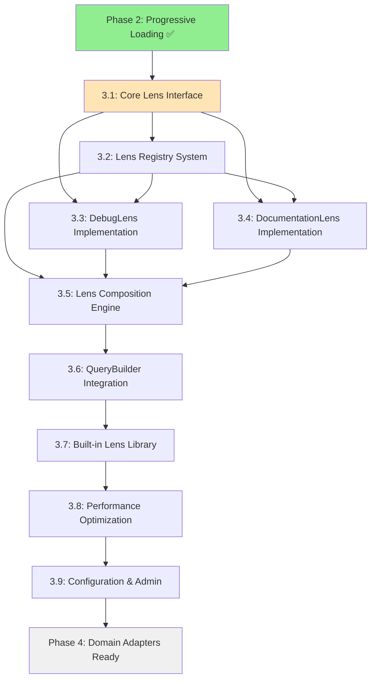

# Dependencies: Phase 3 Lens System

## Classification
- **Domain**: Planning
- **Stability**: Semi-stable
- **Abstraction**: Structural
- **Confidence**: Established
- **Parent Context**: [task-breakdown.md](./task-breakdown.md)

## Dependency Graph

## Critical Path Analysis

### Primary Critical Path (Week 1-5)
1. **Task 3.1** (Core Lens Interface) → **Task 3.2** (Lens Registry) → **Task 3.5** (Composition Engine) → **Task 3.6** (QueryBuilder Integration) → **Task 3.8** (Performance Optimization)

**Why Critical**: This path establishes the fundamental lens infrastructure that all other functionality depends on.

### Secondary Critical Path (Week 2-4)
1. **Task 3.3** (DebugLens) → **Task 3.4** (DocumentationLens) → **Task 3.7** (Lens Library) → **Task 3.8** (Performance Optimization)

**Why Critical**: Lens implementations are needed to validate and optimize the system architecture.

## External Dependencies

### ✅ Phase 2 Dependencies (COMPLETED)
- **Progressive Loading System**: ✅ COMPLETED
  - **Provides**: ContextDepth enum, depth-aware queries, entity projection
  - **Required For**: Lens integration with depth system
  - **Risk**: None (confirmed complete via sync analysis)

- **QueryBuilder System**: ✅ COMPLETED
  - **Provides**: Query transformation infrastructure, immutable builder pattern
  - **Required For**: Lens-aware query modification
  - **Risk**: None (existing system stable)

- **Entity System**: ✅ COMPLETED
  - **Provides**: Entity and DepthAwareEntity interfaces
  - **Required For**: Lens-based entity processing
  - **Risk**: None (well-established interfaces)

### Internal System Dependencies

#### Storage Adapters (No Changes Required)
- **KuzuStorageAdapter**: ✅ No modifications needed
- **DuckDBStorageAdapter**: ✅ No modifications needed
- **MemoryStorageAdapter**: ✅ No modifications needed
- **JSONStorageAdapter**: ✅ No modifications needed

**Lens System Integration**: Lenses operate at the query level, requiring no storage adapter changes.

#### Performance Monitoring (Existing System)
- **PerformanceMonitor**: ✅ Available
- **Required For**: Lens switching time monitoring
- **Integration**: Task 3.8 extends existing monitoring

## Task-Level Dependencies

### Task 3.1: Core Lens Interface Foundation
**Dependencies**: None (can start immediately)
**Blocks**: All other Phase 3 tasks
**Parallel Opportunities**: None (foundational task)

### Task 3.2: Lens Registry System
**Dependencies**: Task 3.1 (Core Lens Interface)
**Blocks**: Tasks 3.3, 3.4, 3.5 (lens implementations and composition)
**Parallel Opportunities**: Can develop simultaneously with Task 3.1 completion

### Task 3.3: DebugLens Implementation
**Dependencies**: Tasks 3.1, 3.2
**Blocks**: Task 3.5 (needs lens example for composition testing)
**Parallel Opportunities**: Can develop in parallel with Task 3.4 (DocumentationLens)

### Task 3.4: DocumentationLens Implementation
**Dependencies**: Tasks 3.1, 3.2
**Blocks**: Task 3.5 (needs multiple lenses for composition testing)
**Parallel Opportunities**: Can develop in parallel with Task 3.3 (DebugLens)

### Task 3.5: Lens Composition Engine
**Dependencies**: Tasks 3.1, 3.2, 3.3, 3.4 (needs functional lenses for testing)
**Blocks**: Task 3.6 (QueryBuilder integration needs composition)
**Parallel Opportunities**: None (requires all previous tasks)

### Task 3.6: QueryBuilder Integration
**Dependencies**: Task 3.5 (Lens Composition Engine)
**Blocks**: Task 3.7 (lens library needs QueryBuilder integration)
**Parallel Opportunities**: None (critical integration task)

### Task 3.7: Built-in Lens Library Expansion
**Dependencies**: Task 3.6 (QueryBuilder Integration)
**Blocks**: Task 3.8 (performance testing needs complete library)
**Parallel Opportunities**: RefactoringLens, SecurityLens, TestingLens can be developed in parallel

### Task 3.8: Performance Optimization and Caching
**Dependencies**: Task 3.7 (needs complete system for optimization)
**Blocks**: Task 3.9 (configuration needs performance baselines)
**Parallel Opportunities**: None (needs complete system)

### Task 3.9: Configuration and Administration
**Dependencies**: Task 3.8 (Performance Optimization)
**Blocks**: None (final task)
**Parallel Opportunities**: None (final polishing task)

## Dependency Risk Analysis

### High Risk Dependencies

#### Risk: QueryBuilder Integration Complexity
- **Dependency**: Task 3.6 depends on complex integration with existing QueryBuilder
- **Impact**: Could delay Phase 3 completion by 1-2 weeks
- **Mitigation**:
  - Prototype integration early during Task 3.1-3.2 development
  - Maintain strict backward compatibility
  - Plan fallback to separate LensAwareQueryBuilder if integration proves difficult

#### Risk: Lens Composition Performance
- **Dependency**: Task 3.8 depends on Task 3.5 composition engine being performant
- **Impact**: Could require architectural changes if performance targets aren't met
- **Mitigation**:
  - Design composition engine with performance in mind from start
  - Implement basic benchmarking in Task 3.5
  - Plan simplified composition fallback if needed

### Medium Risk Dependencies

#### Risk: Lens Implementation Complexity
- **Dependency**: Tasks 3.3-3.4 and 3.7 require accurate pattern detection
- **Impact**: Could result in poor lens relevance and user experience
- **Mitigation**:
  - Start with simple, reliable patterns
  - Implement extensive testing for pattern detection
  - Plan iterative improvement rather than perfect initial implementation

#### Risk: Configuration System Complexity
- **Dependency**: Task 3.9 depends on stable configuration for all previous components
- **Impact**: Could create deployment and maintenance challenges
- **Mitigation**:
  - Keep configuration simple and focused
  - Provide good defaults that work without configuration
  - Implement configuration validation early

### Low Risk Dependencies

#### Risk: External Library Changes
- **Dependency**: Potential changes to existing Phase 2 implementations
- **Impact**: Could require lens system adjustments
- **Mitigation**:
  - Phase 2 is stable and complete
  - Lens system designed to be isolated from Phase 2 internals
  - Integration limited to well-defined interfaces

## Parallel Development Opportunities

### Week 1: Foundation Phase
- **Sequential**: Task 3.1 (Core Lens Interface) - Must complete first
- **Parallel**: Task 3.2 can begin as soon as Task 3.1 interfaces are defined

### Week 2: Lens Implementation Phase
- **Parallel**: Tasks 3.3 (DebugLens) and 3.4 (DocumentationLens) can be developed simultaneously
- **Requirement**: Both tasks require Tasks 3.1 and 3.2 completion

### Week 3: Advanced Features Phase
- **Sequential**: Task 3.5 (Composition Engine) requires all previous tasks
- **Preparation**: Begin Task 3.6 design while Task 3.5 is being implemented

### Week 4: Integration Phase
- **Sequential**: Task 3.6 (QueryBuilder Integration) is critical path
- **Parallel**: Begin Task 3.7 individual lens implementations once integration basics work

### Week 5: Optimization Phase
- **Sequential**: Tasks 3.8 and 3.9 must be completed in order
- **Parallel**: Documentation and administrative utilities can be developed simultaneously

## Resource Allocation Recommendations

### Single Developer Scenario
Follow the critical path strictly: 3.1 → 3.2 → 3.3 → 3.4 → 3.5 → 3.6 → 3.7 → 3.8 → 3.9

### Multiple Developer Scenario
- **Week 1**: Developer A (Task 3.1), Developer B (planning Task 3.2)
- **Week 2**: Developer A (Task 3.3), Developer B (Task 3.4)
- **Week 3**: Developer A (Task 3.5), Developer B (Task 3.6 design)
- **Week 4**: Developer A (Task 3.6), Developer B (Task 3.7 individual lenses)
- **Week 5**: Developer A (Task 3.8), Developer B (Task 3.9)

## Dependency Validation Checklist

### Before Starting Phase 3
- [ ] Progressive Loading System is complete and tested ✅
- [ ] QueryBuilder supports depth-aware queries ✅
- [ ] Entity system supports depth-aware projection ✅
- [ ] Performance monitoring infrastructure exists ✅
- [ ] Test infrastructure is ready for lens system testing ✅

### Before Task 3.2 (Lens Registry)
- [ ] ContextLens interface is stable and tested
- [ ] Basic lens configuration system works
- [ ] Lens lifecycle methods are defined

### Before Task 3.5 (Composition Engine)
- [ ] At least two lens implementations exist and work
- [ ] Lens Registry manages multiple lenses correctly
- [ ] Basic lens conflict scenarios are understood

### Before Task 3.6 (QueryBuilder Integration)
- [ ] Lens composition works reliably
- [ ] Performance characteristics are understood
- [ ] Integration approach is validated through prototyping

### Before Task 3.8 (Performance Optimization)
- [ ] Complete lens system is functional
- [ ] Performance benchmarks establish baseline
- [ ] Optimization targets are validated as achievable

This dependency analysis ensures Phase 3 development can proceed smoothly with clear understanding of task relationships and potential risks.