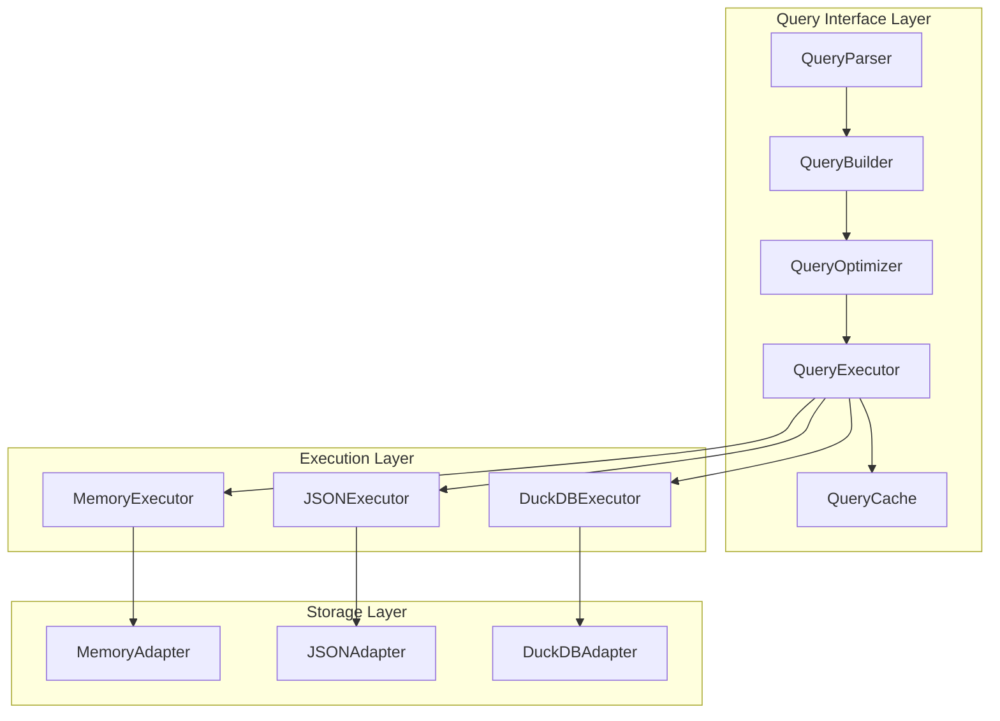
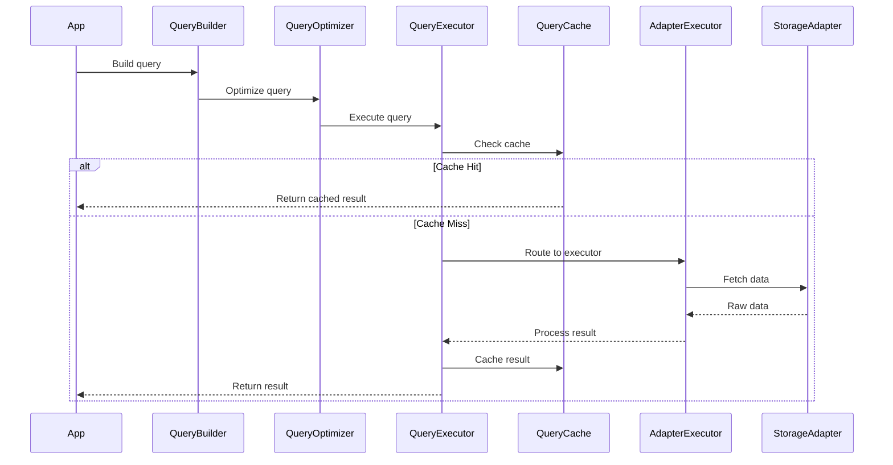

# Query Interface Layer - Architecture Design

## High-Level Architecture

### Component Overview



### Core Components

#### 1. QueryBuilder
**Purpose**: Provides fluent API for constructing queries programmatically

**Responsibilities**:
- Type-safe query construction
- Query validation
- Immutable query objects
- Query serialization

**Key Interfaces**:
```typescript
interface QueryBuilder<T> {
  where(condition: Condition<T>): QueryBuilder<T>
  orderBy(field: keyof T, order?: 'asc' | 'desc'): QueryBuilder<T>
  limit(n: number): QueryBuilder<T>
  offset(n: number): QueryBuilder<T>
  select(...fields: (keyof T)[]): QueryBuilder<T>
  groupBy(...fields: (keyof T)[]): QueryBuilder<T>
  having(condition: Condition<T>): QueryBuilder<T>
  withDepth(depth: ContextDepth): QueryBuilder<T>  // IMPLEMENTED
  build(): Query<T>
}
```

#### 2. QueryParser (Optional - P2)
**Purpose**: Parses string-based DSL into query objects

**Responsibilities**:
- Lexical analysis
- Syntax validation
- AST generation
- Error reporting

**Example DSL**:
```
SELECT name, age 
FROM users 
WHERE age > 18 AND status = 'active'
ORDER BY age DESC
LIMIT 10
```

#### 3. QueryOptimizer
**Purpose**: Optimizes queries based on adapter capabilities and data statistics

**Responsibilities**:
- Query plan generation
- Cost estimation
- Index selection
- Query rewriting
- Adapter capability matching

**Optimization Strategies**:
- Push filters down to storage
- Reorder operations for efficiency
- Use indexes when available
- Batch similar queries
- Cache frequent patterns

#### 4. QueryExecutor
**Purpose**: Routes queries to appropriate adapter-specific executors

**Responsibilities**:
- Adapter selection
- Query translation
- Result aggregation
- Error handling
- Performance monitoring

**Key Interfaces**:
```typescript
interface QueryExecutor<T> {
  execute(query: Query<T>, adapter: Storage<T>): Promise<QueryResult<T>>
  stream(query: Query<T>, adapter: Storage<T>): AsyncIterator<T>
  explain(query: Query<T>, adapter: Storage<T>): Promise<QueryPlan>
}
```

#### 5. QueryCache
**Purpose**: Caches query results for improved performance

**Responsibilities**:
- Result caching
- Cache invalidation
- TTL management
- Memory limits
- Hit/miss tracking

**Caching Strategy**:
- LRU eviction
- Query-based keys
- Adapter-aware invalidation
- Size-based limits

### Adapter-Specific Executors

#### MemoryExecutor
**Capabilities**: Full in-memory query execution

**Implementation Strategy**:
- Use JavaScript array methods
- Build indexes on-demand
- Stream processing for large datasets
- Custom sort comparators

#### JSONExecutor
**Capabilities**: File-based query with memory processing

**Implementation Strategy**:
- Load data into memory
- Delegate to MemoryExecutor
- Optional: Maintain indexes in separate files
- Lazy loading for large files

#### DuckDBExecutor
**Capabilities**: Native SQL execution

**Implementation Strategy**:
- Translate Query to SQL
- Use prepared statements
- Leverage DuckDB indexes
- Stream results for large datasets

## Data Flow

### Query Execution Flow



## Type System Design

### Query Types

```typescript
// Core query representation
interface Query<T> {
  source: string
  conditions: Condition<T>[]
  ordering: OrderBy<T>[]
  projection?: Projection<T>
  grouping?: GroupBy<T>
  pagination?: Pagination
  aggregations?: Aggregation<T>[]
  depth?: ContextDepth                    // IMPLEMENTED
  performanceHints?: QueryPerformanceHints // IMPLEMENTED
}

// Condition types
type Condition<T> = 
  | EqualityCondition<T>
  | ComparisonCondition<T>
  | PatternCondition<T>
  | CompositeCondition<T>

// Result types
interface QueryResult<T> {
  data: T[]
  metadata: QueryMetadata
  errors?: QueryError[]
}

interface QueryMetadata {
  totalCount?: number
  executionTime: number
  fromCache: boolean
  plan?: QueryPlan
}
```

### Type Safety Strategy

1. **Generic Constraints**: Use TypeScript generics to maintain type safety
2. **Keyof Operators**: Ensure field references are valid
3. **Conditional Types**: Adapter-specific type refinements
4. **Branded Types**: Distinguish between different query stages
5. **Template Literals**: Type-safe DSL construction

## Integration Patterns

### Storage Adapter Integration

```typescript
interface QueryableStorage<T> extends Storage<T> {
  query(query: Query<T>): Promise<QueryResult<T>>
  stream(query: Query<T>): AsyncIterator<T>
  capabilities(): AdapterCapabilities
}

interface AdapterCapabilities {
  filtering: FilterCapabilities
  sorting: boolean
  aggregation: AggregationCapabilities
  indexing: IndexCapabilities
  streaming: boolean
}
```

### AttributeIndex Integration

```typescript
class QueryableAttributeIndex extends AttributeIndex {
  query(query: Query<Entity>): Set<string> {
    // Leverage existing findByAttributes
    // Add advanced query capabilities
  }
}
```

## Performance Optimizations

### Query Planning
1. **Cost-Based Optimization**: Estimate operation costs
2. **Statistics Collection**: Track data distribution
3. **Index Awareness**: Use available indexes
4. **Pushdown Optimization**: Execute operations at lowest level
5. **Parallel Execution**: Run independent operations concurrently

### Caching Strategy
1. **Multi-Level Cache**: Memory > Disk > Remote
2. **Intelligent Invalidation**: Track dependencies
3. **Partial Results**: Cache intermediate computations
4. **Query Normalization**: Canonical query representation
5. **Adaptive TTL**: Based on query patterns

### Memory Management
1. **Streaming Results**: Process data in chunks
2. **Lazy Evaluation**: Defer computation until needed
3. **Resource Pooling**: Reuse buffers and connections
4. **Backpressure**: Handle slow consumers
5. **Memory Limits**: Enforce maximum memory usage

## Extensibility Points

### Custom Operations
```typescript
interface QueryOperation<T, R> {
  name: string
  execute(data: T[]): R
  canPushdown(adapter: AdapterCapabilities): boolean
}

// Registration
queryRegistry.register('customOp', customOperation)
```

### Custom Functions
```typescript
interface QueryFunction<T, R> {
  name: string
  evaluate(value: T): R
  deterministic: boolean
}

// Usage in queries
query.where(field => customFn(field) > 10)
```

### Result Transformers
```typescript
interface ResultTransformer<T, R> {
  transform(result: QueryResult<T>): QueryResult<R>
}

// Pipeline
query.pipe(
  filterTransformer,
  mapTransformer,
  aggregateTransformer
)
```

## Error Handling Strategy

### Error Types
1. **Syntax Errors**: Invalid query construction
2. **Semantic Errors**: Invalid field references
3. **Runtime Errors**: Execution failures
4. **Resource Errors**: Memory/timeout limits
5. **Adapter Errors**: Storage-specific issues

### Error Recovery
1. **Graceful Degradation**: Fallback to simpler operations
2. **Partial Results**: Return what succeeded
3. **Error Collection**: Aggregate all errors
4. **Retry Logic**: Transient failure handling
5. **Circuit Breaking**: Prevent cascading failures

## Progressive Loading Integration

### Overview
The Progressive Loading System has been implemented as a core component of the Query Interface Layer, providing 5-level depth-based entity loading for memory optimization.

**Status**: ✅ IMPLEMENTED (September 2024)

### Key Capabilities
- **Memory Reduction**: Up to 80% memory savings at SIGNATURE depth
- **Depth Levels**: 5 levels from SIGNATURE to HISTORICAL
- **QueryBuilder Integration**: `withDepth()` method for depth-aware queries
- **Performance Hints**: Automatic optimization metadata generation
- **Dual Entity Support**: Works with both structured and flat entities

### Implementation Details

#### Depth Levels
```typescript
enum ContextDepth {
  SIGNATURE = 1,    // id, type, name (0.05x memory)
  STRUCTURE = 2,    // + relationships, hierarchy (0.2x memory)
  SEMANTIC = 3,     // + tags, categories, summary (0.4x memory)
  DETAILED = 4,     // + content, properties (0.8x memory)
  HISTORICAL = 5    // + versions, audit trail (1.5x memory)
}
```

#### Query Integration
```typescript
const query = QueryBuilder.create<Entity>()
  .where('type', '=', 'document')
  .withDepth(ContextDepth.SIGNATURE)
  .build()

// Automatic performance hints
console.log(query.performanceHints?.estimatedMemoryFactor) // 0.05
```

#### Entity Projection
```typescript
const projected = projectEntityToDepth(entity, ContextDepth.SEMANTIC)
// Returns entity with only fields appropriate for semantic depth
```

### Integration Points with Storage Adapters

**Current Status**: QueryBuilder depth support implemented
**Next Phase**: Storage adapter integration

#### Planned Adapter Integration
```typescript
interface DepthAwareAdapter<T> extends Storage<T> {
  queryWithDepth(query: Query<T>): Promise<QueryResult<T>>
  // Uses query.depth and query.performanceHints for optimization
}
```

**See**: [ADR-005: Progressive Loading System](../../decisions/adr-005-progressive-loading-system.md)

## Migration Strategy

### Phase 1: Core Implementation ✅ COMPLETED
- Basic QueryBuilder
- Simple filtering and sorting
- Memory executor only
- **Progressive Loading System with depth support**

### Phase 2: Advanced Features
- All executors with depth awareness
- Query optimization using performance hints
- Depth-aware result caching

### Phase 3: DSL Support
- Query parser
- DSL to builder conversion
- Query validation
- DSL depth syntax

### Phase 4: Performance
- Advanced depth-based optimizations
- Streaming support with progressive loading
- Distributed execution with depth hints