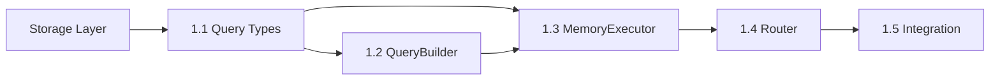
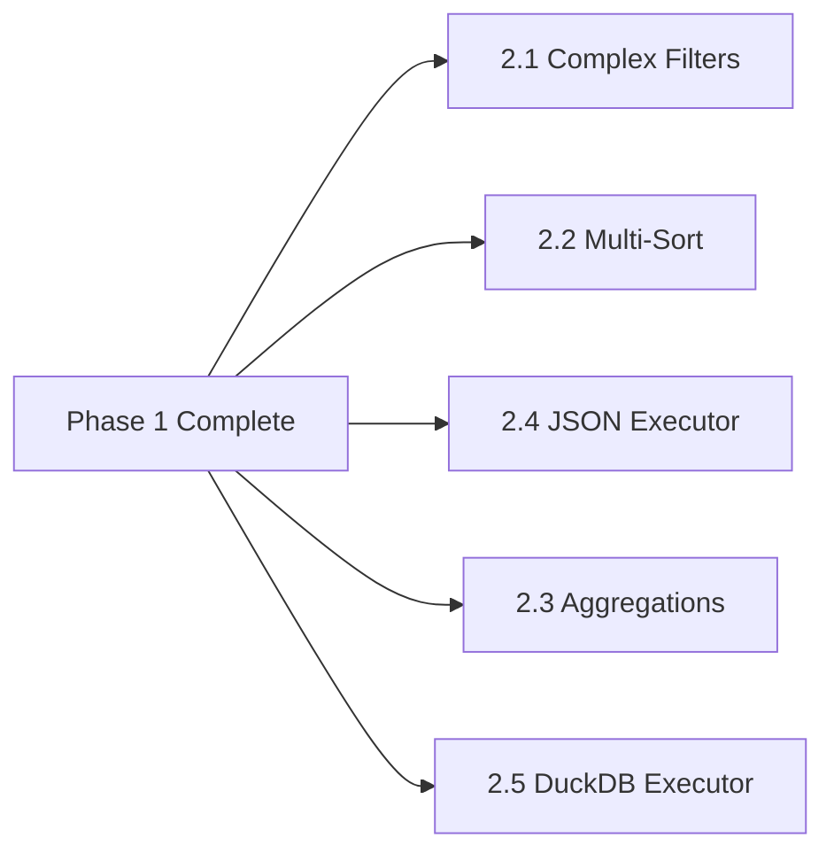

# Query Interface Layer - Dependencies

## Internal Dependencies

### Required Components (Must be complete before starting)

#### Storage Abstraction Layer ✅
- **Status**: COMPLETE
- **Components Needed**:
  - Storage<T> interface
  - BaseStorageAdapter
  - All three adapters (Memory, JSON, DuckDB)
- **Risk if missing**: Cannot build query layer

#### Type System (Entity/Attribute) ✅
- **Status**: COMPLETE
- **Components Needed**:
  - Entity type definitions
  - Attribute types
  - AttributeIndex
- **Risk if missing**: Type safety compromised

#### Test Infrastructure ✅
- **Status**: COMPLETE
- **Components Needed**:
  - Vitest setup
  - Test utilities
  - Mock helpers
- **Risk if missing**: Cannot validate implementation

### Optional Dependencies (Enhance but not required)

#### Caching Layer
- **Status**: NOT IMPLEMENTED
- **Impact**: Would improve query performance
- **Workaround**: Implement basic caching in Phase 3

#### Monitoring System
- **Status**: NOT IMPLEMENTED
- **Impact**: Would provide performance insights
- **Workaround**: Add basic logging initially

#### Configuration Management
- **Status**: PARTIAL
- **Impact**: Would allow query tuning
- **Workaround**: Use hardcoded defaults

## External Dependencies

### Build Tools
- **TypeScript**: 5.0+ (for satisfies operator)
- **Vitest**: Current version
- **Node.js**: 18+ (for native test runner)

### Optional Libraries (to evaluate)

#### Query Building
- **sift.js**: MongoDB-style queries in JavaScript
  - Pros: Battle-tested, familiar API
  - Cons: Additional dependency, different pattern
  - Decision: Evaluate during implementation

#### Type Safety
- **ts-pattern**: Pattern matching for TypeScript
  - Pros: Elegant pattern matching
  - Cons: Learning curve
  - Decision: Consider for query conditions

#### Performance
- **p-limit**: Concurrency control
  - Pros: Simple API, well-tested
  - Cons: Additional dependency
  - Decision: Use if needed for parallel execution

## Data Dependencies

### Test Data Requirements
- Small dataset (100 records)
- Medium dataset (10K records)
- Large dataset (100K records)
- Edge cases dataset (nulls, undefined, empty)
- Complex nested data
- Various data types

### Performance Baselines
- Current adapter performance metrics
- Memory usage profiles
- Query complexity examples
- Real-world query patterns

## Task Dependencies

### Phase 1 Dependencies

### Phase 2 Dependencies

### Cross-Component Dependencies

#### QueryBuilder → Storage
- Needs to understand Storage<T> interface
- Must work with adapter capabilities

#### Executors → Adapters
- Direct dependency on adapter implementation
- Need access to internal data structures

#### Cache → Query
- Needs stable query serialization
- Requires invalidation hooks

## API Dependencies

### Backward Compatibility Requirements
- Storage<T> interface must remain unchanged
- Existing adapter methods must work
- AttributeIndex integration non-breaking

### Forward Compatibility Considerations
- Reserve namespace for future features
- Extensible type system
- Plugin architecture design

## Development Dependencies

### Team Skills Required
- TypeScript advanced types
- Query optimization knowledge
- Performance profiling
- Async/streaming patterns

### Documentation Dependencies
- API reference templates
- Example code patterns
- Performance testing guides
- Migration documentation

## Integration Dependencies

### Upstream Systems
- Entity extraction system
- Attribute indexing
- Storage persistence

### Downstream Systems
- Future analytics features
- Reporting system
- API layer
- UI query builder

## Risk Dependencies

### Critical Path Items
1. Storage adapter stability
2. Type system completeness
3. Test data availability
4. Performance requirements clarity

### Non-Critical but Helpful
1. Production query patterns
2. User feedback on API design
3. Performance profiling tools
4. Code review resources

## Dependency Management Strategy

### Monitoring
- Daily check of blocking dependencies
- Weekly dependency status review
- Escalation for blocked items

### Mitigation
- Mock missing dependencies
- Parallel development where possible
- Early integration testing
- Continuous dependency validation

### Communication
- Clear dependency documentation
- Regular sync with dependent teams
- Early warning for delays
- Dependency status dashboard