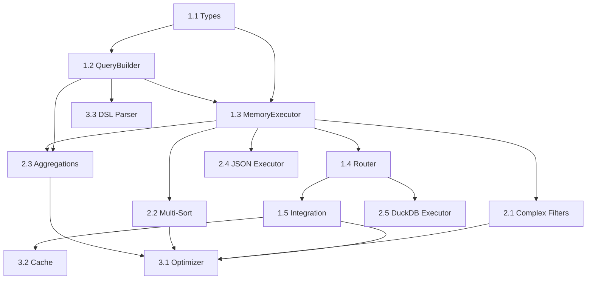

# Query Interface Layer - Task Breakdown

## Task Overview

The Query Interface implementation is divided into 4 phases with 16 discrete tasks. Each task is independently testable and delivers incremental value.

## Phase 1: Foundation (Must Have - P0)

### Task 1.1: Core Query Types and Interfaces
**Size**: Small (4-6 hours)
**Complexity**: Low

**Scope**:
- Define Query<T> interface
- Create Condition types (equality, comparison, composite)
- Define QueryResult<T> interface
- Create QueryMetadata type
- Setup error types

**Success Criteria**:
- [ ] All types compile without errors
- [ ] Types provide full IntelliSense support
- [ ] Generic constraints properly enforced
- [ ] JSDoc documentation complete

**Dependencies**: None

**Deliverables**:
- `/app/src/query/types.ts`
- `/app/tests/query/types.test.ts`

---

### Task 1.2: Basic QueryBuilder Implementation
**Size**: Medium (8-12 hours)
**Complexity**: Medium

**Scope**:
- Implement fluent QueryBuilder class
- Support where() with basic conditions
- Support orderBy() for single field
- Support limit() and offset()
- Implement build() method

**Success Criteria**:
- [ ] Fluent interface works correctly
- [ ] Immutable query objects
- [ ] Type-safe field references
- [ ] 95%+ test coverage

**Dependencies**: Task 1.1

**Deliverables**:
- `/app/src/query/QueryBuilder.ts`
- `/app/tests/query/QueryBuilder.test.ts`

---

### Task 1.3: Memory Query Executor
**Size**: Large (12-16 hours)
**Complexity**: Medium

**Scope**:
- Implement MemoryQueryExecutor
- Support filtering with all condition types
- Support sorting (single field)
- Support pagination
- Handle edge cases (empty data, null values)

**Success Criteria**:
- [ ] All query operations work in-memory
- [ ] Performance < 10ms for 1K records
- [ ] Proper null/undefined handling
- [ ] Comprehensive test suite

**Dependencies**: Tasks 1.1, 1.2

**Deliverables**:
- `/app/src/query/executors/MemoryQueryExecutor.ts`
- `/app/tests/query/executors/MemoryQueryExecutor.test.ts`

---

### Task 1.4: Query Executor Router
**Size**: Medium (6-8 hours)
**Complexity**: Low

**Scope**:
- Create main QueryExecutor class
- Route queries to appropriate executor
- Detect storage adapter type
- Handle executor errors
- Provide fallback behavior

**Success Criteria**:
- [ ] Correctly routes to executors
- [ ] Graceful error handling
- [ ] Works with all storage adapters
- [ ] Clean abstraction layer

**Dependencies**: Task 1.3

**Deliverables**:
- `/app/src/query/QueryExecutor.ts`
- `/app/tests/query/QueryExecutor.test.ts`

---

### Task 1.5: Storage Adapter Integration
**Size**: Medium (6-8 hours)
**Complexity**: Medium

**Scope**:
- Add query() method to Storage interface
- Implement query support in BaseStorageAdapter
- Wire up QueryExecutor
- Update existing adapters

**Success Criteria**:
- [ ] All adapters support query()
- [ ] Backward compatibility maintained
- [ ] No regression in existing tests
- [ ] Integration tests pass

**Dependencies**: Task 1.4

**Deliverables**:
- Updates to `/app/src/storage/interfaces/Storage.ts`
- Updates to `/app/src/storage/base/BaseStorageAdapter.ts`
- Integration tests

## Phase 2: Advanced Operations (Should Have - P1)

### Task 2.1: Complex Filtering
**Size**: Medium (8-10 hours)
**Complexity**: Medium

**Scope**:
- Pattern matching (contains, startsWith, endsWith)
- Range queries (between, in)
- Null/undefined checks
- Nested field access
- NOT operator support

**Success Criteria**:
- [ ] All filter types working
- [ ] Proper type inference
- [ ] Edge case handling
- [ ] Performance acceptable

**Dependencies**: Task 1.3

**Deliverables**:
- Updates to QueryBuilder and MemoryQueryExecutor
- Comprehensive test coverage

---

### Task 2.2: Multi-field Sorting
**Size**: Small (4-6 hours)
**Complexity**: Low

**Scope**:
- Multiple orderBy() calls
- Sort priority handling
- Null value positioning
- Custom comparators
- Stable sort guarantee

**Success Criteria**:
- [ ] Multi-field sorting works
- [ ] Correct sort stability
- [ ] Nulls handled properly
- [ ] Performance acceptable

**Dependencies**: Task 1.3

**Deliverables**:
- Enhanced sorting in MemoryQueryExecutor
- Additional test cases

---

### Task 2.3: Basic Aggregations
**Size**: Large (12-16 hours)
**Complexity**: High

**Scope**:
- Count and countDistinct
- Sum, avg, min, max
- Group by single field
- Having clause support
- Aggregation result types

**Success Criteria**:
- [ ] All aggregations accurate
- [ ] Group by working correctly
- [ ] Type-safe aggregation results
- [ ] Memory efficient implementation

**Dependencies**: Tasks 1.2, 1.3

**Deliverables**:
- `/app/src/query/aggregations.ts`
- Updates to QueryBuilder and executors
- Extensive test suite

---

### Task 2.4: JSON Query Executor
**Size**: Small (4-6 hours)
**Complexity**: Low

**Scope**:
- Implement JSONQueryExecutor
- Load data and delegate to MemoryQueryExecutor
- Handle file I/O errors
- Optimize for repeated queries

**Success Criteria**:
- [ ] Works with JSONStorageAdapter
- [ ] Proper error handling
- [ ] No memory leaks
- [ ] Test coverage

**Dependencies**: Task 1.3

**Deliverables**:
- `/app/src/query/executors/JSONQueryExecutor.ts`
- Tests

---

### Task 2.5: DuckDB Query Executor
**Size**: Large (12-16 hours)
**Complexity**: High

**Scope**:
- Implement DuckDBQueryExecutor
- Translate Query to SQL
- Use prepared statements
- Handle type conversions
- Optimize for DuckDB features

**Success Criteria**:
- [ ] Correct SQL generation
- [ ] SQL injection prevention
- [ ] Native performance benefits
- [ ] All query types supported

**Dependencies**: Tasks 1.1-1.4

**Deliverables**:
- `/app/src/query/executors/DuckDBQueryExecutor.ts`
- `/app/src/query/translators/SQLTranslator.ts`
- Comprehensive tests

## Phase 3: Optimization (Nice to Have - P2)

### Task 3.1: Query Optimizer
**Size**: Large (16-20 hours)
**Complexity**: High

**Scope**:
- Create QueryOptimizer class
- Cost-based optimization
- Query plan generation
- Statistics collection
- Adapter capability detection

**Success Criteria**:
- [ ] Measurable performance improvement
- [ ] Query plans accurate
- [ ] No incorrect optimizations
- [ ] Debugging support

**Dependencies**: Phase 2 complete

**Deliverables**:
- `/app/src/query/QueryOptimizer.ts`
- `/app/src/query/QueryPlanner.ts`
- Performance benchmarks

---

### Task 3.2: Result Caching
**Size**: Medium (8-10 hours)
**Complexity**: Medium

**Scope**:
- Implement QueryCache
- LRU eviction strategy
- Cache key generation
- Invalidation logic
- Memory limits

**Success Criteria**:
- [ ] Cache hits improve performance
- [ ] Correct invalidation
- [ ] Memory bounds respected
- [ ] Cache statistics available

**Dependencies**: Phase 1 complete

**Deliverables**:
- `/app/src/query/QueryCache.ts`
- Cache tests and benchmarks

---

### Task 3.3: Query DSL Parser
**Size**: Extra Large (20-24 hours)
**Complexity**: High

**Scope**:
- Design DSL syntax
- Implement lexer
- Build parser
- Generate QueryBuilder calls
- Error reporting

**Success Criteria**:
- [ ] DSL fully specified
- [ ] Parser handles all valid queries
- [ ] Clear error messages
- [ ] Good performance

**Dependencies**: Task 1.2

**Deliverables**:
- `/app/src/query/parser/`
- DSL documentation
- Parser tests

## Phase 4: Advanced Features (Future - P3)

### Task 4.1: Streaming Results
**Size**: Large (12-16 hours)
**Complexity**: High

**Scope**:
- AsyncIterator support
- Backpressure handling
- Memory management
- Stream transformations

**Dependencies**: Phase 2 complete

---

### Task 4.2: Custom Functions
**Size**: Medium (8-10 hours)
**Complexity**: Medium

**Scope**:
- Function registration
- Type-safe function calls
- Adapter pushdown support

**Dependencies**: Phase 2 complete

---

### Task 4.3: Query Interceptors
**Size**: Medium (6-8 hours)
**Complexity**: Low

**Scope**:
- Before/after hooks
- Query modification
- Result transformation
- Audit logging

**Dependencies**: Phase 1 complete

## Task Dependencies Graph

## Implementation Order

### Sprint 1 (Week 1-2)
1. Task 1.1: Core Types (Day 1-2)
2. Task 1.2: QueryBuilder (Day 2-4)
3. Task 1.3: MemoryExecutor (Day 5-8)
4. Task 1.4: Router (Day 9-10)

### Sprint 2 (Week 3-4)
1. Task 1.5: Integration (Day 1-2)
2. Task 2.1: Complex Filters (Day 3-5)
3. Task 2.2: Multi-Sort (Day 6-7)
4. Task 2.4: JSON Executor (Day 8-9)
5. Testing & Documentation (Day 10)

### Sprint 3 (Week 5-6)
1. Task 2.3: Aggregations (Day 1-4)
2. Task 2.5: DuckDB Executor (Day 5-8)
3. Task 3.2: Caching (Day 9-10)

### Future Sprints
- Task 3.1: Optimizer
- Task 3.3: DSL Parser
- Phase 4 tasks as needed

## Resource Requirements

### Development
- 1-2 Senior developers
- 160-200 total development hours
- 3-4 sprints

### Testing
- 40-50 hours test development
- Performance testing environment
- Multiple dataset sizes for benchmarking

### Documentation
- API documentation
- Query DSL specification
- Performance tuning guide
- Migration guide