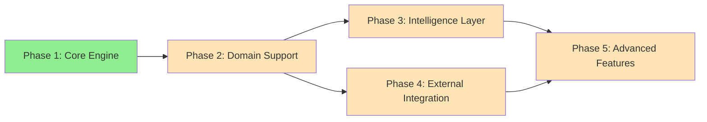

# CorticAI Project Roadmap

## Purpose
This document outlines the development path for CorticAI, structured by phase dependencies rather than dates. Each phase builds on previous capabilities to create a comprehensive context engine.

## Classification
- **Domain:** Planning
- **Stability:** Dynamic
- **Abstraction:** Structural
- **Confidence:** Evolving

## Content

### Roadmap Overview

CorticAI development follows a dependency-driven approach where each phase enables subsequent capabilities. The system evolves from basic storage through intelligence features to advanced learning.

### Current Phase

**Phase: Planning & Design**
**Status: In Progress**

Currently documenting the system architecture, making technology decisions, and organizing the context network before beginning implementation.

### Development Phases

#### Phase 1: Core Engine Foundation
- **Status:** Not Started
- **Description:** Establish the dual-database storage layer and basic operations
- **Key Deliverables:**
  - Kuzu graph database initialization
  - DuckDB analytics database setup
  - File monitoring system
  - Basic CRUD API
  - Simple query interface
- **Dependencies:**
  - None (foundation phase)
- **Enables:**
  - All subsequent phases

#### Phase 2: Domain Support
- **Status:** Not Started
- **Description:** Enable the engine to understand different file types and domains
- **Key Deliverables:**
  - Domain adapter interface
  - Code domain adapter (TypeScript/JavaScript)
  - Document domain adapter (Markdown/text)
  - Universal pattern detection
  - Cross-domain relationships
- **Dependencies:**
  - Phase 1: Core Engine
- **Enables:**
  - Phase 3: Intelligence features
  - Cross-domain insights

#### Phase 3: Intelligence Layer
- **Status:** Not Started
- **Description:** Add intelligent features for deduplication, context management, and maintenance
- **Key Deliverables:**
  - Continuity Cortex (deduplication engine)
  - Lens system for task-specific views
  - Progressive context loading
  - Automated consolidation process
  - Maintenance agents
- **Dependencies:**
  - Phase 2: Domain Support
- **Enables:**
  - Phase 5: Advanced learning

#### Phase 4: External Integration
- **Status:** Not Started
- **Description:** Connect to external systems for complete context
- **Key Deliverables:**
  - GitHub integration
  - Issue tracker connections
  - Bi-directional synchronization
  - External data augmentation
  - Decision governance integration
- **Dependencies:**
  - Phase 1: Core Engine
- **Can Run Parallel To:**
  - Phase 3: Intelligence Layer
- **Enables:**
  - Complete context capture

#### Phase 5: Advanced Features
- **Status:** Not Started
- **Description:** Implement sophisticated learning and temporal features
- **Key Deliverables:**
  - Meta-repository pattern
  - Temporal queries and time-travel
  - Pattern learning from usage
  - Cross-project insights
  - Predictive capabilities
- **Dependencies:**
  - Phase 3: Intelligence Layer
  - Phase 4: External Integration
- **Enables:**
  - Full vision realization

### Integration Milestones

#### Mastra Framework Integration
- **Phase:** 2-3
- **Description:** Deep integration with Mastra agent framework
- **Components:**
  - Agent memory persistence
  - Tool context enrichment
  - Workflow state management

#### Decision Governance Integration
- **Phase:** 4
- **Description:** Implement decision approval system
- **Components:**
  - Decision interception
  - Policy management
  - Trust evolution

### Technical Risk Mitigation

| Risk | Impact | Mitigation Strategy |
|------|--------|---------------------|
| Database performance at scale | High | Incremental indexing, lazy loading, caching |
| Memory usage for large projects | Medium | Three-tier memory architecture, consolidation |
| Query response times | Medium | Materialized views, query optimization |
| Complexity of dual databases | Low | Clear separation of concerns, good abstractions |

### Success Indicators

**Phase 1 Success:**
- Basic storage and retrieval working
- File changes tracked accurately

**Phase 2 Success:**
- Multiple file types understood
- Cross-domain patterns detected

**Phase 3 Success:**
- No more duplicate file creation
- Context automatically maintained

**Phase 4 Success:**
- External context integrated
- Complete project view available

**Phase 5 Success:**
- System learns and improves
- Historical insights available

## Relationships
- **Parent Nodes:** [foundation/project_definition.md]
- **Child Nodes:** [planning/milestones.md]
- **Related Nodes:** 
  - [foundation/structure.md] - implements - Structure supports roadmap features
  - [processes/creation.md] - executes - Creation processes execute roadmap items

## Navigation Guidance
- **Access Context:** Use this document when planning work, prioritizing features, or communicating timelines
- **Common Next Steps:** After reviewing the roadmap, typically explore specific milestones or feature details
- **Related Tasks:** Sprint planning, resource allocation, stakeholder communication
- **Update Patterns:** This document should be updated quarterly or when significant changes to the plan occur

## Metadata
- **Created:** [Date]
- **Last Updated:** [Date]
- **Updated By:** [Role/Agent]

## Change History
- [Date]: Initial creation of roadmap template
