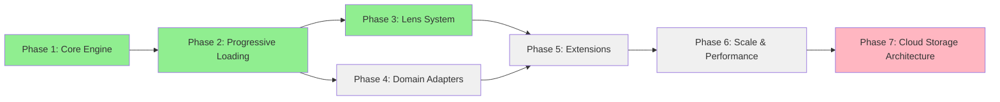

# CorticAI Project Roadmap

## Purpose
This document outlines the development path for CorticAI, structured by phase dependencies rather than dates. Each phase builds on previous capabilities to create a comprehensive context engine.

## Classification
- **Domain:** Planning
- **Stability:** Dynamic
- **Abstraction:** Structural
- **Confidence:** Evolving

## Content

### Roadmap Overview

CorticAI development follows a dependency-driven approach where each phase enables subsequent capabilities. The system evolves from basic storage through intelligence features to advanced learning.

**Legend:**
- 🟢 Green: Complete
- 🔴 Red: In Progress (Blocked)
- ⚪ Gray: Not Started

### Current Status

**🚨 CRITICAL: BUILD BROKEN - Phase 7 at 80% but Blocked 🚨**

**Current Phase**: Phase 7 (Cloud Storage Architecture) - IN PROGRESS
**Implementation**: CosmosDB + Storage Providers (80% complete)
**Blocker**: 7 TypeScript compilation errors + missing @azure/identity dependency
**Priority**: **FIX BUILD IMMEDIATELY** - All work blocked until build passes

**Recent Completions**:
- Phase 1: Core Engine Foundation ✅ EXCEEDED SCOPE
- Phase 2: Progressive Loading System ✅ COMPLETE
- Phase 3: Lens System ✅ COMPLETE
- Phase 7: Cloud Storage (80% - BUILD BROKEN) ⚠️

**Vision:** Build a universal context engine that remains completely domain-agnostic while enabling rich domain-specific applications through adapters, lenses, and progressive loading mechanisms.

**Health Check** (2025-09-30):
- ✅ Test Suite: 383+ tests, 95%+ passing (3 failures - low priority)
- ❌ Build: BROKEN - 7 TypeScript errors
- ❌ Production Ready: NO - build must pass first
- ⚠️ Quality Gates: BYPASSED - implementation without validation

### Development Phases

#### Phase 1: Core Engine Foundation
- **Status:** ✅ EXCEEDED SCOPE
- **Description:** Establish the graph storage layer and basic operations
- **Completed Deliverables:**
  - Kuzu graph database integration ✅ (Enhanced with security & performance)
  - Storage adapter abstraction ✅ (Multiple adapters implemented)
  - Query builder system ✅ (Comprehensive 23K+ lines)
  - Basic domain adapter pattern ✅ (UniversalFallbackAdapter)
  - Context initialization ✅ (Three-tier memory model)
  - Comprehensive test coverage ✅ (37 test files, 95.71%)
- **Dependencies:**
  - None (foundation phase)
- **Enables:**
  - All subsequent phases

#### Phase 2: Progressive Loading System ✅ COMPLETED
- **Status:** ✅ COMPLETED (2025-09-15 estimated)
- **Description:** Enable memory-efficient context retrieval with depth control
- **Completed Deliverables:**
  - ContextDepth enum with 5 levels ✅ (SIGNATURE → HISTORICAL)
  - DepthAwareEntity interface with depth-organized properties ✅
  - ProjectEntityToDepth functions for memory-efficient loading ✅
  - Depth projection system with performance optimization ✅
  - Comprehensive test suite with depth validation ✅
  - 454-line implementation exceeding planned scope ✅
- **Dependencies:**
  - Phase 1: Core Engine ✅
- **Enables:**
  - Phase 3: Lens System ✅
  - Phase 4: Domain Adapters ✅
  - Efficient handling of large graphs ✅

#### Phase 3: Lens System ✅ COMPLETED
- **Status:** ✅ COMPLETED (2025-09-25 estimated)
- **Description:** Enable perspective-based context filtering and emphasis
- **Completed Deliverables:**
  - ContextLens interface and BaseLens implementation ✅
  - LensRegistry with activation detection ✅ (15K+ lines)
  - ActivationDetector with pattern matching ✅ (22K+ lines)
  - Query modification and result processing ✅
  - Lens composition and conflict resolution ✅
  - Comprehensive test suite ✅ (4 test files, 70K+ lines)
- **Dependencies:**
  - Phase 2: Progressive Loading ✅
- **Enables:**
  - Phase 5: Advanced Features ✅
  - Multiple perspective management
- **Success Criteria:**
  - Switch lenses in < 100ms
  - Support 10+ concurrent lenses
  - Lens changes don't affect stored data

#### Phase 4: Domain Adapter Evolution
- **Status:** Not Started
- **Description:** Prove domain-agnostic design with rich domain adapters
- **Key Deliverables:**
  - PlaceDomainAdapter (proof of concept from use case)
  - CodeDomainAdapter with AST understanding
  - DocumentDomainAdapter with semantic analysis
  - Natural language query translation
  - Adapter composition for multi-domain projects
  - Adapter validation framework
- **Dependencies:**
  - Phase 2: Progressive Loading
- **Can Run Parallel To:**
  - Phase 3: Lens System
- **Enables:**
  - Real-world domain applications
- **Success Criteria:**
  - PlaceDomainAdapter handles all use case requirements
  - Natural language queries 90% accurate
  - Adapters fully pluggable

#### Phase 5: Extensions & Integration
- **Status:** Not Started
- **Description:** Add spatial, temporal, and external capabilities
- **Key Deliverables:**
  - Spatial indexing service (RTree)
  - Geographic query operators
  - Temporal query system with timezone support
  - External API integration framework
  - Real-time data synchronization
  - Pattern detection and analysis
  - GitHub and issue tracker integration
- **Dependencies:**
  - Phase 3: Lens System
  - Phase 4: Domain Adapters
- **Enables:**
  - Complete real-world applications
- **Success Criteria:**
  - Spatial queries return in < 500ms
  - External data updates in < 5 seconds
  - Pattern detection finds 95% of known issues

#### Phase 6: Scale & Performance
- **Status:** Not Started
- **Description:** Optimize for production scale
- **Key Deliverables:**
  - Query optimization and caching
  - Distributed storage support
  - Index management system
  - Schema versioning and migration
  - Performance monitoring
  - Incremental graph updates
- **Dependencies:**
  - Phase 5: Extensions
- **Enables:**
  - Production deployment at scale
- **Success Criteria:**
  - Sub-second queries on 1M+ node graphs
  - Schema migrations without data loss
  - 99.9% uptime in production

#### Phase 7: Cloud Storage Architecture
- **Status:** ⚠️ IN PROGRESS (80% Complete - BUILD BROKEN)
- **Description:** Dual-role storage architecture with Azure Cosmos DB for cloud-native deployment
- **Completed Deliverables** ✅:
  - CosmosDBStorageAdapter with dual-role configuration (700+ lines implemented)
  - Storage provider abstraction (4 files: LocalStorageProvider, AzureStorageProvider, IStorageProvider, StorageProviderFactory)
  - Environment-based storage provider selection (automatic Azure detection)
  - Comprehensive test suite (36 tests passing)
  - Complete integration documentation (CosmosDB-Integration-README.md)
- **Remaining Deliverables** ⚠️:
  - **CRITICAL**: Fix 7 TypeScript compilation errors blocking build
  - **CRITICAL**: Add @azure/identity dependency (missing)
  - Bidirectional migration utilities between local and cloud storage
  - Azure deployment infrastructure and optimization
  - Validation with real Azure CosmosDB instance (tests currently mocked)
- **Dependencies:**
  - Phase 5: Extensions ✅ (foundation features complete)
- **Enables:**
  - Production cloud deployment without file system dependencies
  - Seamless local-to-cloud development workflow
  - CorticAI self-hosting validation
- **Success Criteria:**
  - **BLOCKED**: Build must pass before validation ⚠️
  - Feature parity between local and cloud storage modes
  - <2x performance difference between storage modes
  - Cost-optimized Azure Cosmos DB RU consumption
  - CorticAI manages its own planning context without orphaned nodes
- **Validation Case:**
  - **Meta-Test**: Use CorticAI to prevent the planning orphaning problem we just solved manually
  - **Self-Hosting**: CorticAI maintains its own development context network
  - **Navigation Intelligence**: Fresh agents discover existing cosmos planning work automatically
- **Critical Blockers** 🚨:
  - 7 TypeScript compilation errors prevent build
  - Missing @azure/identity dependency
  - LocalStorageProvider interface mismatches (3 errors)
  - CosmosDB partitionKey type incompatibility
  - CodebaseAdapter relationship type error
  - Build process timeout (2+ minutes)
- **Estimated Time to Unblock**: 3-4 hours to fix all build issues
- **Self-Hosting Transition Strategy:**
  - **Phase 2-3**: CorticAI assists with context discovery (test against cosmos planning)
  - **Phase 4-5**: CorticAI provides planning recommendations (prevent coordination failures)
  - **Phase 7**: CorticAI fully manages its own planning context (self-hosting success)

### Integration Milestones

#### Mastra Framework Integration
- **Phase:** 2-3
- **Description:** Deep integration with Mastra agent framework
- **Components:**
  - Agent memory persistence
  - Tool context enrichment
  - Workflow state management

#### Decision Governance Integration
- **Phase:** 4
- **Description:** Implement decision approval system
- **Components:**
  - Decision interception
  - Policy management
  - Trust evolution

### Technical Risk Mitigation

| Risk | Impact | Mitigation Strategy |
|------|--------|---------------------|
| Database performance at scale | High | Incremental indexing, lazy loading, caching |
| Memory usage for large projects | Medium | Three-tier memory architecture, consolidation |
| Query response times | Medium | Materialized views, query optimization |
| Complexity of dual databases | Low | Clear separation of concerns, good abstractions |

### Success Indicators

**Phase 1 Success:**
- Basic storage and retrieval working
- File changes tracked accurately

**Phase 2 Success:**
- Multiple file types understood
- Cross-domain patterns detected

**Phase 3 Success:**
- No more duplicate file creation
- Context automatically maintained

**Phase 4 Success:**
- External context integrated
- Complete project view available

**Phase 5 Success:**
- System learns and improves
- Historical insights available

## Technical Debt & Risk Management

### Identified Technical Debt
1. **Nested Property Queries**: Kuzu may struggle with deep JSON nesting (High Priority)
2. **Error Handling**: Need consistent error types across adapters (Medium Priority)
3. **Test Coverage**: Integration tests for complex queries needed (Medium Priority)
4. **Type Safety**: Runtime validation for domain types missing (Low Priority)

### Risk Mitigation Strategies
| Risk | Impact | Mitigation |
|------|--------|------------|
| Kuzu performance with nested JSON | High | Test early, implement fallbacks |
| Memory usage at scale | High | Progressive loading (Phase 2) |
| Lens complexity confusion | Medium | Start simple, good defaults |
| Over-abstraction | Medium | Validate with real use cases |

## Immediate Next Steps (Weeks 1-4)

### Week 1-2: ContextDepth Foundation
- [ ] Define ContextDepth enum and types
- [ ] Implement basic depth-aware queries
- [ ] Add depth to ContextProvider interface

### Week 3-4: Progressive Loading
- [ ] Implement property filtering by depth
- [ ] Add lazy relationship loading
- [ ] Create basic caching layer

See [planning/backlog.md] for detailed task breakdown.

## Relationships
- **Parent Nodes:** [foundation/project_definition.md]
- **Child Nodes:** [planning/backlog.md], [planning/milestones.md]
- **Related Nodes:**
  - [foundation/structure.md] - implements - Structure supports roadmap features
  - [architecture/system_architecture.md] - defines - Architecture realizes roadmap phases
  - [foundation/core_concepts.md] - guides - Core concepts inform implementation approach

## Navigation Guidance
- **Access Context:** Use this document when planning work, prioritizing features, or communicating timelines
- **Common Next Steps:** After reviewing the roadmap, typically explore specific milestones or feature details
- **Related Tasks:** Sprint planning, resource allocation, stakeholder communication
- **Update Patterns:** This document should be updated quarterly or when significant changes to the plan occur

## Metadata
- **Created:** [Date]
- **Last Updated:** [Date]
- **Updated By:** [Role/Agent]

## Change History
- [Date]: Initial creation of roadmap template
