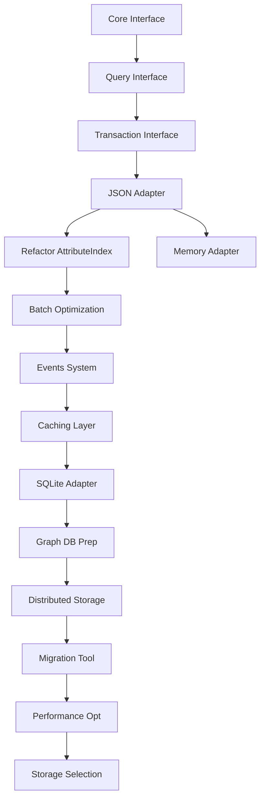

# Storage Abstraction Task Sequence

## Stage 1: Storage Interface Definition

### Task 1.1: Core Storage Interface
**Size**: S
**Complexity**: Low
**Dependencies**: None

#### Scope
- Define base `Storage` interface
- Define `StorageOptions` configuration type
- Define `StorageResult` types
- Define error types

#### Interface Design
```typescript
interface Storage<T = any> {
  // Basic operations
  get(key: string): Promise<T | undefined>
  set(key: string, value: T): Promise<void>
  delete(key: string): Promise<boolean>
  has(key: string): Promise<boolean>
  clear(): Promise<void>
  
  // Batch operations
  getMany(keys: string[]): Promise<Map<string, T>>
  setMany(entries: Map<string, T>): Promise<void>
  deleteMany(keys: string[]): Promise<number>
  
  // Metadata
  size(): Promise<number>
  keys(): AsyncIterator<string>
}
```

#### Success Criteria
- [ ] Interface covers all current AttributeIndex storage needs
- [ ] Types are generic and reusable
- [ ] Documentation complete with examples
- [ ] No implementation code, only types

---

### Task 1.2: Query Interface
**Size**: M
**Complexity**: Medium
**Dependencies**: Task 1.1

#### Scope
- Define `QueryableStorage` interface extending `Storage`
- Define query pattern types
- Define query result types
- Support for complex queries

#### Interface Design
```typescript
interface QueryableStorage<T> extends Storage<T> {
  query(pattern: QueryPattern): AsyncIterator<QueryResult<T>>
  count(pattern: QueryPattern): Promise<number>
  aggregate(pattern: AggregatePattern): Promise<AggregateResult>
}

interface QueryPattern {
  where?: WhereClause
  orderBy?: OrderClause
  limit?: number
  offset?: number
}
```

#### Success Criteria
- [ ] Query interface supports AttributeIndex use cases
- [ ] Pattern matching capabilities defined
- [ ] Result streaming supported
- [ ] Type-safe query builders

---

### Task 1.3: Transaction Interface
**Size**: M
**Complexity**: Medium
**Dependencies**: Task 1.1, 1.2

#### Scope
- Define `TransactionalStorage` interface
- Define transaction lifecycle
- Define isolation levels
- Define rollback behavior

#### Interface Design
```typescript
interface TransactionalStorage<T> extends QueryableStorage<T> {
  transaction<R>(
    operation: (tx: Transaction<T>) => Promise<R>,
    options?: TransactionOptions
  ): Promise<R>
}

interface Transaction<T> extends Storage<T> {
  commit(): Promise<void>
  rollback(): Promise<void>
  savepoint(name: string): Promise<void>
}
```

#### Success Criteria
- [ ] ACID properties supported
- [ ] Nested transactions considered
- [ ] Deadlock handling defined
- [ ] Resource cleanup guaranteed

---

## Stage 2: Current State Adapter

### Task 2.1: JSON Storage Adapter
**Size**: L
**Complexity**: Low
**Dependencies**: Stage 1 complete

#### Scope
- Implement `Storage` interface for JSON files
- Extract current AttributeIndex storage logic
- Maintain exact current behavior
- Add proper error handling

#### Implementation Plan
```typescript
class JSONStorageAdapter<T> implements Storage<T> {
  private cache: Map<string, T>
  private filePath: string
  private dirty: boolean
  
  constructor(options: JSONStorageOptions) {
    // Initialize with file path
  }
  
  async load(): Promise<void> {
    // Load from file into cache
  }
  
  async save(): Promise<void> {
    // Save cache to file
  }
}
```

#### Success Criteria
- [ ] All current AttributeIndex tests pass with adapter
- [ ] No behavior changes from user perspective
- [ ] Performance parity with current implementation
- [ ] Proper error handling and recovery

---

### Task 2.2: Refactor AttributeIndex
**Size**: M
**Complexity**: Medium
**Dependencies**: Task 2.1

#### Scope
- Inject storage adapter into AttributeIndex
- Remove direct file I/O code
- Maintain public API compatibility
- Update tests to use adapter

#### Refactoring Steps
1. Add storage parameter to constructor
2. Replace save/load with storage operations
3. Update internal data structures
4. Maintain backward compatibility

#### Success Criteria
- [ ] All existing tests pass
- [ ] Storage is fully abstracted
- [ ] No public API changes
- [ ] Documentation updated

---

### Task 2.3: Memory Storage Adapter
**Size**: S
**Complexity**: Low
**Dependencies**: Task 2.1

#### Scope
- Implement in-memory storage for testing
- Support all Storage interface methods
- Enable fast unit testing
- Optional persistence to snapshot

#### Implementation
```typescript
class MemoryStorageAdapter<T> implements Storage<T> {
  private store: Map<string, T>
  
  constructor(initial?: Map<string, T>) {
    this.store = new Map(initial)
  }
  
  // Fast in-memory operations
}
```

#### Success Criteria
- [ ] All interface methods implemented
- [ ] Used in unit tests
- [ ] 100x faster than file I/O
- [ ] Snapshot/restore capability

---

## Stage 3: Enhanced Capabilities

### Task 3.1: Batch Operations Optimization
**Size**: M
**Complexity**: Medium
**Dependencies**: Stage 2 complete

#### Scope
- Optimize batch operations in adapters
- Add bulk loading capabilities
- Implement write batching
- Add operation pipelining

#### Enhancements
```typescript
interface BatchOperations<T> {
  bulkLoad(source: AsyncIterator<[string, T]>): Promise<number>
  bulkExport(destination: WritableStream): Promise<number>
  batchWrite(operations: Operation[]): Promise<BatchResult>
}
```

#### Success Criteria
- [ ] 10x improvement for bulk operations
- [ ] Memory-efficient streaming
- [ ] Progress reporting
- [ ] Cancellation support

---

### Task 3.2: Storage Events System
**Size**: M
**Complexity**: Medium
**Dependencies**: Task 3.1

#### Scope
- Add event emitter to storage
- Define storage lifecycle events
- Enable storage middleware
- Support async event handlers

#### Event Types
```typescript
interface StorageEvents<T> {
  'before:get': (key: string) => void
  'after:get': (key: string, value: T | undefined) => void
  'before:set': (key: string, value: T) => void
  'after:set': (key: string, value: T) => void
  'before:delete': (key: string) => void
  'after:delete': (key: string, existed: boolean) => void
  'error': (error: StorageError) => void
}
```

#### Success Criteria
- [ ] All operations emit events
- [ ] Event handlers don't block operations
- [ ] Error events properly propagated
- [ ] Memory leak prevention

---

### Task 3.3: Caching Layer
**Size**: L
**Complexity**: Medium
**Dependencies**: Task 3.2

#### Scope
- Add caching decorator for any storage
- Implement LRU cache strategy
- Support cache invalidation
- Add cache statistics

#### Implementation
```typescript
class CachedStorage<T> implements Storage<T> {
  private cache: LRUCache<string, T>
  private backend: Storage<T>
  
  constructor(backend: Storage<T>, options: CacheOptions) {
    // Setup cache with size limits
  }
  
  // Cache-aware operations
}
```

#### Success Criteria
- [ ] Configurable cache size
- [ ] Hit/miss statistics
- [ ] Invalidation strategies
- [ ] Write-through/write-back modes

---

## Stage 4: Alternative Backends

### Task 4.1: SQLite Storage Adapter
**Size**: L
**Complexity**: High
**Dependencies**: Stage 3 complete

#### Scope
- Implement Storage interface for SQLite
- Design key-value schema
- Support JSON field queries
- Add index management

#### Schema Design
```sql
CREATE TABLE storage (
  key TEXT PRIMARY KEY,
  value JSON NOT NULL,
  type TEXT,
  created_at INTEGER,
  updated_at INTEGER
);

CREATE INDEX idx_type ON storage(type);
CREATE INDEX idx_json ON storage(json_extract(value, '$.type'));
```

#### Success Criteria
- [ ] Full Storage interface implementation
- [ ] ACID transaction support
- [ ] JSON query capabilities
- [ ] Performance benchmarks documented

---

### Task 4.2: Graph Database Adapter Preparation
**Size**: M
**Complexity**: High
**Dependencies**: Task 4.1

#### Scope
- Research graph database options
- Design graph storage mapping
- Create adapter interface extensions
- Plan migration strategy

#### Graph Mapping
```typescript
interface GraphStorage<T> extends QueryableStorage<T> {
  // Node operations
  createNode(id: string, data: T): Promise<void>
  
  // Edge operations
  createEdge(from: string, to: string, type: string): Promise<void>
  
  // Traversal
  traverse(start: string, pattern: TraversalPattern): AsyncIterator<T>
}
```

#### Success Criteria
- [ ] Graph database selected
- [ ] Mapping strategy defined
- [ ] Performance projections
- [ ] Migration path clear

---

### Task 4.3: Distributed Storage Adapter
**Size**: XL
**Complexity**: Very High
**Dependencies**: Task 4.2

#### Scope
- Design distributed storage strategy
- Implement sharding logic
- Add replication support
- Handle consistency models

#### Architecture
```typescript
class DistributedStorage<T> implements Storage<T> {
  private shards: Map<number, Storage<T>>
  private hashRing: ConsistentHash
  
  // Distributed operations with consistency guarantees
}
```

#### Success Criteria
- [ ] Horizontal scaling proven
- [ ] Consistency model implemented
- [ ] Failure handling robust
- [ ] Performance scales linearly

---

## Stage 5: Migration and Optimization

### Task 5.1: Migration Tool
**Size**: L
**Complexity**: Medium
**Dependencies**: Stage 4 complete

#### Scope
- Create storage migration framework
- Support schema evolution
- Enable zero-downtime migration
- Add rollback capabilities

#### Migration Framework
```typescript
interface Migration {
  version: string
  up(oldStorage: Storage, newStorage: Storage): Promise<void>
  down(newStorage: Storage, oldStorage: Storage): Promise<void>
  validate(storage: Storage): Promise<boolean>
}
```

#### Success Criteria
- [ ] Automated migration execution
- [ ] Progress tracking
- [ ] Rollback tested
- [ ] Data integrity verified

---

### Task 5.2: Performance Optimization
**Size**: M
**Complexity**: Medium
**Dependencies**: Task 5.1

#### Scope
- Profile all storage adapters
- Optimize hot paths
- Add performance monitoring
- Implement adaptive strategies

#### Optimization Areas
- Query planning and execution
- Index optimization
- Connection pooling
- Read/write splitting

#### Success Criteria
- [ ] Benchmarks for all adapters
- [ ] Performance regression tests
- [ ] Monitoring dashboard
- [ ] Auto-tuning capabilities

---

### Task 5.3: Storage Selection Strategy
**Size**: M
**Complexity**: Medium
**Dependencies**: Task 5.2

#### Scope
- Create intelligent storage selector
- Define selection criteria
- Support hybrid storage modes
- Enable runtime switching

#### Strategy Implementation
```typescript
class StorageSelector {
  selectOptimal(
    requirements: StorageRequirements
  ): Storage {
    // Choose best storage based on:
    // - Data size
    // - Query patterns
    // - Performance needs
    // - Consistency requirements
  }
}
```

#### Success Criteria
- [ ] Automatic storage selection
- [ ] Hybrid mode support
- [ ] Runtime adaptation
- [ ] Performance validated

---

## Implementation Order & Dependencies



## Critical Path

The critical path that determines minimum completion:
1. Core Interface → Query Interface → Transaction Interface
2. JSON Adapter → Refactor AttributeIndex
3. Batch Optimization → Events System → Caching Layer
4. SQLite Adapter → Graph DB Prep
5. Migration Tool → Performance Optimization

## Parallel Work Opportunities

Tasks that can be worked on simultaneously:
- Memory Adapter (parallel with AttributeIndex refactor)
- Documentation (ongoing throughout)
- Performance benchmarking framework (early setup)
- Graph database research (while building other adapters)

## Success Metrics

### Stage Completion Criteria
- **Stage 1**: All interfaces defined and documented
- **Stage 2**: Current functionality preserved with new abstraction
- **Stage 3**: Enhanced capabilities demonstrable
- **Stage 4**: Multiple backends operational
- **Stage 5**: Seamless migration and optimization

### Overall Success Metrics
- Zero breaking changes to existing code
- 100% test coverage maintained
- Performance within 5% of original (or better)
- Support for 3+ storage backends
- Migration completed without data loss