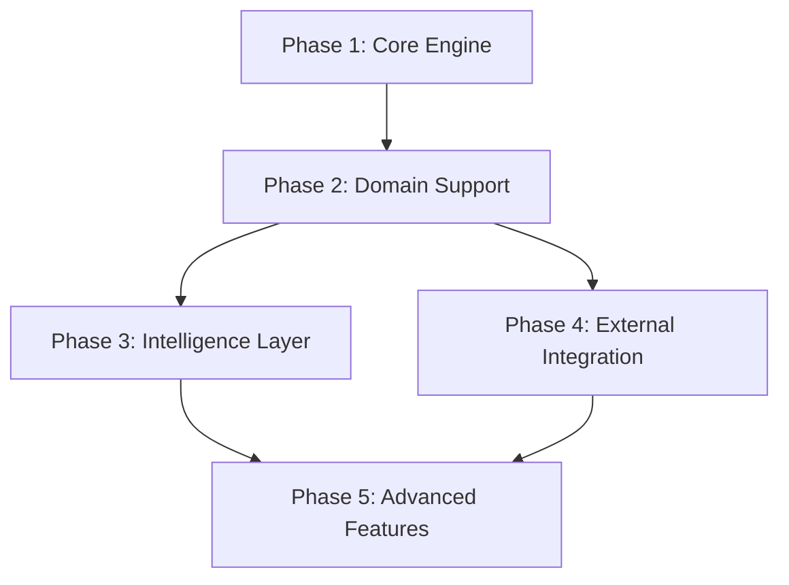

# Universal Context Engine - Documentation Set

## Document Structure

This documentation set contains five interconnected documents:

1. **Problem Analysis & Requirements** - Understanding what we're solving
2. **Context Networks: From Concept to Implementation** - Evolution of the solution
3. **System Architecture & Design** - How the new system works
4. **Implementation Guide** - How to build it
5. **API Reference & Agent Guidelines** - How to use it

---

# Document 1: Problem Analysis & Requirements

## Executive Summary

Modern software development, content creation, and knowledge work face a fundamental problem: information exists in isolated fragments across files, tools, and human memory. This fragmentation creates cognitive overhead, knowledge loss, and duplicated effort. The Universal Context Engine solves this by providing an intelligent context management layer that works across all file-based projects.

## Core Problems

### 1. The Single Hierarchy Limitation

**Problem**: File systems enforce a "table of contents" organization where each file exists in exactly one location. However, understanding requires "index-like" access where the same content can be accessed from multiple perspectives.

**Example**: A payment processing function exists in `/controllers/PaymentController.ts`, but it's simultaneously:
- Part of the payment flow
- A security-sensitive component  
- A performance bottleneck
- An integration point with Stripe
- A source of customer issues

**Impact**: Developers must mentally maintain these multiple views, leading to:
- Missed connections between related code
- Difficulty finding relevant information
- Incomplete understanding of change impacts

### 2. Context Fragmentation

**Problem**: Project knowledge exists across disconnected systems:
- Code in git repositories
- Issues in GitHub/Jira
- Documentation in wikis
- Decisions in Slack/email
- Patterns in developer memory

**Example**: Understanding why a particular architectural decision was made requires:
- Finding the original issue
- Locating related discussions
- Identifying the commit that implemented it
- Remembering who was involved

**Impact**: 
- Knowledge loss when team members leave
- Repeated mistakes and re-learning
- Incomplete context for decisions
- Time wasted searching for information

### 3. The Amnesia Loop

**Problem**: AI agents and developers repeatedly create duplicate artifacts because they can't see or don't recognize existing ones.

**Example**: An agent asked "what should we work on next?" creates `current_tasks.md`, not seeing the existing:
- `current_tasks.md` (created last week)
- `todo.md` (created yesterday)  
- `next_steps.md` (created this morning)
- `action_items.md` (also current)

**Impact**:
- Proliferation of duplicate files
- Stale information persisting
- Confusion about source of truth
- Wasted effort on recreation

### 4. Historical Context Loss

**Problem**: Traditional version control preserves code history but loses:
- Experimental branches (deleted after merge)
- Decision rationale (why, not just what)
- Failed attempts (valuable learning)
- Evolution of understanding

**Example**: A team tries three different approaches to solve a race condition. Only the final solution remains in git history. The knowledge about why the first two failed is lost.

**Impact**:
- Repeated failed experiments
- Loss of learning from mistakes
- Inability to understand evolution
- Missing context for current design

### 5. Static Organization

**Problem**: Different tasks require different organizational views, but current tools provide fixed hierarchies.

**Context-Dependent Needs**:
- **Debugging**: Need error paths, logs, recent changes
- **Feature Development**: Need architecture, patterns, examples
- **Refactoring**: Need dependencies, coupling, test coverage
- **Onboarding**: Need high-level structure, key concepts

**Impact**:
- Cognitive overhead switching contexts
- Relevant information hidden by irrelevant
- Mental effort maintaining multiple views
- Inefficient navigation patterns

### 6. Maintenance Burden

**Problem**: When the same agents responsible for primary work also maintain documentation and context, both tasks suffer.

**Observable Pattern**: Documentation quality follows this trajectory:
1. Initial enthusiasm - detailed docs
2. Pressure to deliver - docs lag
3. Accumulation of debt - docs become stale
4. Abandonment - docs become misleading

**Impact**:
- Context becomes unreliable
- Trust in documentation erodes
- Valuable knowledge isn't captured
- Onboarding becomes difficult

## Requirements

### Functional Requirements

#### Core Capabilities
- **FR1**: Multi-perspective access to the same information
- **FR2**: Automatic deduplication and consolidation
- **FR3**: Historical context preservation including deleted branches
- **FR4**: Cross-domain pattern recognition
- **FR5**: Progressive detail loading based on relevance
- **FR6**: Bidirectional linking between files and external resources

#### Intelligence Layer
- **FR7**: Semantic search across all project information
- **FR8**: Automatic staleness detection and refresh
- **FR9**: Pattern learning from usage
- **FR10**: Context-aware file operation interception

#### Integration
- **FR11**: Connection to issue tracking systems
- **FR12**: Git history analysis and preservation
- **FR13**: API for agent/tool access
- **FR14**: Support for multiple concurrent users/agents

### Non-Functional Requirements

#### Performance
- **NFR1**: Query response < 100ms for indexed content
- **NFR2**: File change propagation < 500ms
- **NFR3**: Support for repositories with 100k+ files
- **NFR4**: Incremental processing for large changes

#### Reliability
- **NFR5**: Context recoverable from source files
- **NFR6**: Graceful handling of corrupted indices
- **NFR7**: Atomic updates to prevent inconsistency
- **NFR8**: Backup and version control of context itself

#### Usability
- **NFR9**: Work with any file-based project
- **NFR10**: No modification of source files required
- **NFR11**: Progressive adoption path
- **NFR12**: Clear mental model for users

#### Extensibility
- **NFR13**: Domain-agnostic core with adapters
- **NFR14**: Plugin architecture for extensions
- **NFR15**: Custom lens definitions
- **NFR16**: Scriptable maintenance operations

## Success Criteria

### Quantitative Metrics
- 50% reduction in duplicate file creation
- 75% reduction in time to find related information
- 90% of queries answered without full codebase scan
- 95% accuracy in deduplication detection

### Qualitative Metrics
- Developers report improved understanding of codebase
- AI agents maintain context across sessions
- Reduced cognitive load during task switches
- Improved onboarding experience for new team members

---

# Document 2: Context Networks - From Concept to Implementation

## The Evolution of Context Networks

### Origins: Project-Based Context Networks

Context networks began as a solution to information organization in complex projects. The fundamental insight was that information doesn't exist in isolation - it exists in a web of relationships that give it meaning.

**Initial Implementation (Markdown-based)**:
- Folders of interlinked markdown files
- Explicit relationship documentation
- Manual maintenance by developers
- Used successfully in 50-75 projects

**Key Lessons Learned**:
1. The pattern works across all domains (code, writing, contracts)
2. Manual maintenance degrades over time
3. Agents need selective context loading
4. Historical context dramatically improves understanding
5. Multiple perspectives on the same information are essential

### Conceptual Foundation

#### The Index vs. Table of Contents Insight

Traditional organization follows a "table of contents" model:
- Every piece of information has one location
- Hierarchical structure
- Single path to each item

Context networks follow an "index" model:
- Information can be accessed from multiple angles
- Network structure
- Multiple paths to each item

This mirrors how human memory works - we don't retrieve memories from a single location, we reconstruct them from distributed representations.

#### The Three Pillars of Context Networks

1. **Information Nodes**: Atomic units of knowledge
2. **Relationship Edges**: Connections that give meaning
3. **Access Lenses**: Perspectives that filter and emphasize

### Current Implementation

#### Structure
```
context-network/
├── foundation/          # Core project information
├── domains/            # Domain-specific knowledge
├── decisions/          # Architectural decisions
├── planning/           # Roadmaps and plans
└── discoveries/        # Learning and insights
```

#### Strengths
- Flexible and adaptable
- Human-readable
- Version controllable
- No special tools required

#### Limitations
- Manual maintenance burden
- No semantic search
- Limited cross-referencing
- Agents struggle with maintenance
- No automatic deduplication
- Static organization

### The Next Evolution: Intelligent Context Engine

The Universal Context Engine represents the next evolution, addressing current limitations while preserving strengths.

#### Key Innovations

**1. Separation of Concerns**
- Primary work (coding, writing) separate from context maintenance
- Dedicated subsystems for context management
- Automatic synchronization

**2. Progressive Schema Evolution**
- Start with flexible JSON
- Materialize patterns as they stabilize
- Learn optimal organization through usage

**3. Multi-Lens Architecture**
- Different views for different tasks
- Dynamic emphasis based on context
- Learned effectiveness patterns

**4. Memory-Inspired Storage**
- Working memory for active context
- Consolidation processes
- Long-term semantic storage
- Episodic archive for full history

## Conceptual Mapping

### From Markdown to Database

#### Current (Markdown)
```markdown
# Payment Processing

## Related Components
- [[StripeService]] - Payment provider integration
- [[OrderService]] - Order management
- [[EmailService]] - Payment notifications

## Decisions
- Chose Stripe for PCI compliance (2024-01-15)
- Async processing for reliability (2024-02-01)
```

#### New (Context Engine)
```typescript
// Graph Database (Kuzu)
Node: {
  id: "payment_processing",
  type: "component",
  properties: {
    domain: "payments",
    criticality: "high",
    security_sensitive: true
  }
}

Edges: [
  { from: "payment_processing", to: "stripe_service", type: "uses" },
  { from: "payment_processing", to: "order_service", type: "triggers" },
  { from: "payment_processing", to: "email_service", type: "notifies" }
]

// Analytics Database (DuckDB) - Materialized View
payment_components_view:
  | component | provider | async | pci_compliant | decision_date |
  |-----------|----------|-------|---------------|---------------|
  | payment   | stripe   | true  | true          | 2024-01-15    |
```

### From Static to Dynamic

#### Current: Fixed Organization
- Same structure for all users
- Same detail level always
- Manual updates required

#### New: Adaptive Organization
- Task-specific lenses
- Progressive detail loading
- Automatic maintenance
- Learning from usage

### From Isolated to Connected

#### Current: File-Centric
- Context lives with files
- Limited to local relationships
- No external connections

#### New: Network-Centric
- Context spans entire project
- Unlimited relationship types
- External system integration
- Cross-project patterns

## Migration Path

### Phase 1: Parallel Operation
- Keep existing markdown networks
- Run context engine alongside
- Gradual migration of patterns
- Validate improvements

### Phase 2: Primary Transition
- Context engine becomes primary
- Markdown becomes backup
- Automated synchronization
- Full feature utilization

### Phase 3: Full Migration
- Context engine only
- Legacy markdown archived
- Advanced features enabled
- Cross-project learning

---

# Document 3: System Architecture & Design

## System Overview

The Universal Context Engine is a dual-layer system that provides intelligent context management for any file-based project. It maintains a separation between primary artifacts (code, documents) and their contextual relationships, enabling multi-perspective access, automatic maintenance, and progressive understanding.

## Architecture Principles

### 1. Separation of Concerns
- Primary artifacts remain in their native structure
- Context layer operates independently
- No modification of source files required

### 2. Progressive Enhancement
- Start with minimal structure
- Learn patterns through usage
- Materialize optimizations as patterns stabilize

### 3. Universal Patterns with Domain Adapters
- Core engine is domain-agnostic
- Adapters provide domain-specific mappings
- Cross-domain learning enabled

### 4. Memory-Inspired Processing
- Working memory for active context
- Consolidation during quiet periods
- Long-term storage for established patterns
- Episodic archive for full history

## Core Components

### Storage Layer

#### Dual Database Architecture

**Kuzu (Graph Database)**
- Purpose: Relationship storage and traversal
- Schema: Flexible JSON properties
- Operations: Pattern matching, path finding
- Optimized for: Graph queries, relationship discovery

**DuckDB (Analytics Database)**
- Purpose: Materialized views and analytics
- Schema: Typed columns from stabilized patterns
- Operations: Aggregation, full-text search
- Optimized for: Fast queries, bulk analysis

#### Storage Hierarchy

```
.context/
├── working/            # Active working memory
│   ├── graph.kuzu     # Current relationships
│   └── sessions.db    # Active session data
├── semantic/          # Long-term knowledge
│   ├── patterns.db    # Established patterns
│   └── analytics.duckdb # Materialized views
├── episodic/          # Historical archive
│   ├── glacier/       # Append-only episode log
│   └── versions/      # Historical versions
└── meta/              # System metadata
    ├── schema/        # Schema evolution
    └── config.yaml    # Configuration
```

### Intelligence Layer

#### The Continuity Cortex

Provides persistent intelligence across agent sessions:

```typescript
class ContinuityCortex {
  // Intercept file operations
  interceptWrite(request: WriteRequest): WriteResponse
  
  // Detect duplicates and staleness
  findSimilar(request: WriteRequest): SimilarFile[]
  
  // Maintain freshness
  refreshStaleDocuments(): void
  
  // Learn patterns
  learnFromActions(action: Action): void
}
```

#### Lens System

Provides task-specific views:

```typescript
interface ContextLens {
  id: string
  activation: ActivationRules
  highlighting: HighlightRules
  loading: LoadingStrategy
  effectiveness: number  // Learned from usage
}
```

#### Pattern Detection

Identifies cross-domain patterns:

```typescript
class PatternDetector {
  // Universal patterns (work across domains)
  detectCircularDependency(): Pattern
  detectGodObject(): Pattern
  detectOrphan(): Pattern
  
  // Domain patterns (specific to domain)
  detectDomainPattern(domain: string): Pattern[]
  
  // Learn new patterns
  learnFromUsage(usage: UsageData): Pattern
}
```

### Domain Adapters

Enable universal engine to work with specific domains:

```typescript
interface DomainAdapter {
  // Define domain concepts
  nodeTypes: NodeTypeDefinition[]
  edgeTypes: EdgeTypeDefinition[]
  
  // Extract from files
  extract(files: File[]): Entity[]
  
  // Map to graph
  toGraph(entities: Entity[]): GraphElements
  
  // Domain-specific operations
  operations: DomainOperation[]
}
```

### API Layer

#### Query Interface

```typescript
interface QueryAPI {
  // Natural language queries
  query(text: string, lens?: Lens): Result[]
  
  // Graph queries
  traverse(start: Node, pattern: Pattern): Path[]
  
  // Temporal queries
  getAsOf(node: Node, timestamp: Date): HistoricalNode
  
  // Progressive loading
  load(node: Node, depth: ContextDepth): NodeWithContext
}
```

#### Maintenance Interface

```typescript
interface MaintenanceAPI {
  // Consolidation
  consolidate(): ConsolidationResult
  
  // Deduplication
  deduplicate(): DeduplicationResult
  
  // Staleness management
  refresh(): RefreshResult
  
  // Pattern learning
  learn(): LearnedPatterns
}
```

## Memory Architecture

### Three-Tier Memory Model

#### Tier 1: Working Memory (Hot)
- Recent changes and active patterns
- High detail, quick access
- Limited capacity
- Cleared after consolidation

#### Tier 2: Semantic Memory (Warm)
- Established patterns and relationships
- Optimized representations
- Indexed for search
- Updated through consolidation

#### Tier 3: Episodic Archive (Cold)
- Complete historical record
- Append-only storage
- Compressed for space
- Accessed for conflict resolution

### Consolidation Process

```typescript
class MemoryConsolidation {
  async consolidate() {
    // Extract patterns from working memory
    const patterns = await this.detectPatterns()
    
    // Resolve contradictions
    const resolved = await this.resolveConflicts(patterns)
    
    // Update semantic memory
    await this.updateSemantic(resolved)
    
    // Archive episodes
    await this.archiveEpisodes()
    
    // Clear working memory
    await this.clearWorking()
  }
}
```

### Provenance Tracking

Every piece of knowledge maintains its lineage:

```typescript
interface Provenance {
  sources: EpisodeReference[]      // Original sources
  transformations: Transform[]     // How it was derived
  confidence: number               // Certainty level
  conflicts: Contradiction[]       // Alternative interpretations
  history: Version[]              // Historical versions
}
```

## Data Flow

### Ingestion Flow
1. File changes detected
2. Domain adapter extracts entities
3. Relationships identified
4. Working memory updated
5. Indices refreshed

### Query Flow
1. Natural language processed
2. Lens activated if applicable
3. Graph query generated
4. Progressive loading applied
5. Results ranked and returned

### Consolidation Flow
1. Quiet period detected
2. Patterns extracted from working memory
3. Conflicts resolved
4. Semantic memory updated
5. Episodes archived
6. Working memory cleared

## Scalability Considerations

### Performance Optimizations
- Incremental processing for changes
- Materialized views for common queries
- Lazy loading for historical data
- Caching for frequently accessed patterns

### Storage Optimizations
- Compression for episodic storage
- Deduplication at multiple levels
- Partitioning by time and domain
- Archival of stale data

### Concurrency Support
- Read-write locks for consistency
- Session isolation for agents
- Eventual consistency for indices
- Conflict-free replicated data types (CRDTs) for distributed operation

---

# Document 4: Implementation Guide

## Implementation Strategy

### Development Approach

The implementation follows a dependency-driven sequence where each phase enables the next. The system is designed for incremental development with value delivery at each phase.

### Phase Dependencies



## Phase 1: Core Engine [Foundation]

### Goals
- Establish storage infrastructure
- Implement basic operations
- Create minimal API

### Implementation Tasks

#### 1.1 Storage Setup
```typescript
// Initialize dual database system
class StorageInitializer {
  async initialize(projectPath: string) {
    // Create .context directory
    const contextPath = path.join(projectPath, '.context')
    await fs.mkdir(contextPath, { recursive: true })
    
    // Initialize Kuzu for graph storage
    const kuzu = await KuzuDB.create(
      path.join(contextPath, 'graph.kuzu')
    )
    
    // Create minimal schema
    await kuzu.execute(`
      CREATE NODE TABLE nodes (
        id UUID PRIMARY KEY,
        type VARCHAR,
        properties JSON,
        created TIMESTAMP,
        modified TIMESTAMP
      )
    `)
    
    await kuzu.execute(`
      CREATE REL TABLE edges (
        from UUID,
        to UUID,
        type VARCHAR,
        properties JSON
      )
    `)
    
    // Initialize DuckDB for analytics
    const duckdb = await DuckDB.create(
      path.join(contextPath, 'analytics.duckdb')
    )
    
    return { kuzu, duckdb }
  }
}
```

#### 1.2 File Monitoring
```typescript
class FileMonitor {
  watch(projectPath: string, callback: (event: FileEvent) => void) {
    const watcher = chokidar.watch(projectPath, {
      ignored: /(^|[\/\\])\../,  // Ignore dotfiles
      persistent: true
    })
    
    watcher
      .on('add', path => callback({ type: 'add', path }))
      .on('change', path => callback({ type: 'change', path }))
      .on('unlink', path => callback({ type: 'delete', path }))
  }
}
```

#### 1.3 Basic API
```typescript
class ContextEngineAPI {
  async addNode(node: Node): Promise<void> {
    await this.kuzu.execute(
      'CREATE (n:Node {id: $id, type: $type, properties: $props})',
      { id: node.id, type: node.type, props: node.properties }
    )
  }
  
  async addEdge(edge: Edge): Promise<void> {
    await this.kuzu.execute(
      'MATCH (a {id: $from}), (b {id: $to}) ' +
      'CREATE (a)-[r:REL {type: $type, properties: $props}]->(b)',
      { from: edge.from, to: edge.to, type: edge.type, props: edge.properties }
    )
  }
  
  async query(pattern: string): Promise<Result[]> {
    return await this.kuzu.execute(pattern)
  }
}
```

### Completion Criteria
- Storage initialized and accessible
- File changes detected and logged
- Basic CRUD operations working
- Simple queries returning results

## Phase 2: Domain Support [Depends on: Phase 1]

### Goals
- Implement domain adapter interface
- Create code and document adapters
- Enable multi-domain indexing

### Implementation Tasks

#### 2.1 Domain Adapter Interface
```typescript
abstract class BaseDomainAdapter {
  abstract nodeTypes: Map<string, NodeTypeDefinition>
  abstract edgeTypes: Map<string, EdgeTypeDefinition>
  
  abstract async extract(file: File): Promise<Entity[]>
  abstract async toGraph(entities: Entity[]): Promise<GraphElements>
  
  // Common functionality
  async process(file: File): Promise<void> {
    const entities = await this.extract(file)
    const graph = await this.toGraph(entities)
    await this.store(graph)
  }
}
```

#### 2.2 Code Domain Adapter
```typescript
class CodeDomainAdapter extends BaseDomainAdapter {
  nodeTypes = new Map([
    ['function', { required: ['name', 'signature'], optional: ['complexity'] }],
    ['class', { required: ['name'], optional: ['methods', 'properties'] }],
    ['import', { required: ['source'], optional: ['symbols'] }]
  ])
  
  async extract(file: File): Promise<Entity[]> {
    const ast = await parseAST(file.content)
    const entities: Entity[] = []
    
    // Extract functions
    ast.findAll('FunctionDeclaration').forEach(node => {
      entities.push({
        type: 'function',
        properties: {
          name: node.name,
          signature: node.signature,
          location: `${file.path}:${node.line}`
        }
      })
    })
    
    return entities
  }
}
```

#### 2.3 Universal Pattern Detection
```typescript
class UniversalPatternDetector {
  patterns = [
    {
      name: 'circular_dependency',
      query: 'MATCH (n)-[r*2..10]->(n) RETURN n, r',
      domains: {
        code: 'Circular imports',
        document: 'Circular references',
        contract: 'Circular obligations'
      }
    },
    {
      name: 'god_object',
      query: 'MATCH (n) WHERE COUNT((n)-[]-()) > $threshold RETURN n',
      domains: {
        code: 'Class with too many responsibilities',
        document: 'Document covering too many topics',
        contract: 'Party with too many obligations'
      }
    }
  ]
  
  async detect(domain: string): Promise<Pattern[]> {
    const detected: Pattern[] = []
    
    for (const pattern of this.patterns) {
      const results = await this.engine.query(pattern.query)
      if (results.length > 0) {
        detected.push({
          ...pattern,
          instances: results,
          interpretation: pattern.domains[domain]
        })
      }
    }
    
    return detected
  }
}
```

### Completion Criteria
- Multiple domain adapters working
- Cross-domain patterns detected
- Successful indexing of mixed content
- Domain-specific queries returning correct results

## Phase 3: Intelligence Layer [Depends on: Phase 2]

### Goals
- Implement lens system
- Create continuity cortex
- Enable progressive loading
- Build maintenance agents

### Implementation Tasks

#### 3.1 Lens System
```typescript
class LensManager {
  lenses: Map<string, ContextLens> = new Map()
  
  registerLens(lens: ContextLens) {
    this.lenses.set(lens.id, lens)
  }
  
  async activateLens(lensId: string, context: QueryContext): Promise<ActiveLens> {
    const lens = this.lenses.get(lensId)
    
    return {
      lens,
      emphasize: await this.engine.query(lens.highlighting.emphasize),
      deemphasize: await this.engine.query(lens.highlighting.deemphasize),
      loadingStrategy: lens.loading
    }
  }
  
  detectAppropriateLens(query: string, context: Context): ContextLens {
    // Score each lens for relevance
    const scores = Array.from(this.lenses.values()).map(lens => ({
      lens,
      score: this.scoreLens(lens, query, context)
    }))
    
    return scores.sort((a, b) => b.score - a.score)[0].lens
  }
}
```

#### 3.2 Continuity Cortex
```typescript
class ContinuityCortex {
  private patterns: DuplicatePatterns
  private memory: AgentMemory
  
  async interceptWrite(request: WriteRequest): Promise<WriteResponse> {
    // Check for existing similar files
    const similar = await this.findSimilar(request)
    
    if (similar.length > 0) {
      const best = similar[0]
      
      if (this.shouldMerge(best, request)) {
        return {
          action: 'merge',
          target: best,
          merged: await this.mergeContent(best, request.content)
        }
      } else {
        return {
          action: 'update',
          target: best,
          message: `Updating existing file: ${best.path}`
        }
      }
    }
    
    // No duplicates, allow creation
    return { action: 'create' }
  }
  
  async findSimilar(request: WriteRequest): Promise<SimilarFile[]> {
    const candidates = await Promise.all([
      this.findByName(request.filename),
      this.findBySemantic(request.content),
      this.findByPattern(request)
    ])
    
    return this.rankBySimilarity(
      candidates.flat(),
      request
    ).slice(0, 5)
  }
}
```

#### 3.3 Progressive Loading
```typescript
class ProgressiveLoader {
  async load(
    nodeId: string, 
    depth: ContextDepth,
    lens?: ContextLens
  ): Promise<NodeWithContext> {
    const node = await this.getNode(nodeId)
    
    const context = {
      [ContextDepth.SIGNATURE]: await this.loadSignature(node),
      [ContextDepth.STRUCTURE]: await this.loadStructure(node),
      [ContextDepth.SEMANTIC]: await this.loadSemantic(node),
      [ContextDepth.DETAILED]: await this.loadDetailed(node),
      [ContextDepth.HISTORICAL]: await this.loadHistorical(node)
    }
    
    // Load up to requested depth
    const result: NodeWithContext = { ...node }
    
    for (let d = 1; d <= depth; d++) {
      Object.assign(result, context[d])
    }
    
    // Apply lens filtering if provided
    if (lens) {
      result = this.applyLens(result, lens)
    }
    
    return result
  }
}
```

### Completion Criteria
- Lens system activating appropriately
- Duplicate detection preventing recreation
- Progressive loading reducing context size
- Maintenance agents running successfully

## Phase 4: External Integration [Depends on: Phase 1, Parallel to: Phase 3]

### Goals
- Connect to GitHub/GitLab
- Integrate with issue trackers
- Enable bi-directional sync
- Augment context with external data

### Implementation Tasks

#### 4.1 GitHub Integration
```typescript
class GitHubConnector {
  private octokit: Octokit
  
  async syncIssues(repo: string): Promise<Issue[]> {
    const issues = await this.octokit.issues.listForRepo({
      owner: repo.owner,
      repo: repo.name,
      state: 'all'
    })
    
    return issues.map(issue => ({
      id: `github-${issue.number}`,
      title: issue.title,
      body: issue.body,
      labels: issue.labels.map(l => l.name),
      references: this.extractReferences(issue),
      created: issue.created_at,
      updated: issue.updated_at
    }))
  }
  
  async linkToCode(issue: Issue): Promise<void> {
    // Find code references in issue
    const refs = this.extractCodeRefs(issue.body)
    
    for (const ref of refs) {
      await this.engine.addEdge({
        from: issue.id,
        to: ref.fileId,
        type: 'references',
        properties: {
          line: ref.line,
          context: ref.context
        }
      })
    }
  }
}
```

#### 4.2 Bi-directional Sync
```typescript
class SyncManager {
  async syncWithExternal(): Promise<SyncResult> {
    const result = { added: 0, updated: 0, conflicts: [] }
    
    // Pull from external
    const external = await this.fetchExternal()
    
    // Compare with local
    for (const item of external) {
      const local = await this.findLocal(item.id)
      
      if (!local) {
        await this.addItem(item)
        result.added++
      } else if (this.hasChanged(local, item)) {
        const resolution = await this.resolveConflict(local, item)
        if (resolution.conflict) {
          result.conflicts.push(resolution)
        } else {
          await this.updateItem(resolution.merged)
          result.updated++
        }
      }
    }
    
    return result
  }
}
```

### Completion Criteria
- Issues imported and linked to code
- External changes synchronized
- Conflicts detected and resolved
- Augmented context available in queries

## Phase 5: Advanced Features [Depends on: Phases 3 & 4]

### Goals
- Implement meta-repository pattern
- Add temporal queries
- Build pattern learning
- Enable cross-domain insights

### Implementation Tasks

#### 5.1 Meta-Repository
```typescript
class MetaRepository {
  private contextRepo: Repository
  
  async preserveBranch(branch: string): Promise<void> {
    // Before branch deletion, preserve in context repo
    await this.contextRepo.fetch(branch)
    await this.contextRepo.createBranch(`preserved/${branch}`)
  }
  
  async analyzeEvolution(): Promise<Evolution> {
    const branches = await this.contextRepo.getAllBranches()
    const evolution = new Evolution()
    
    for (const branch of branches) {
      const commits = await this.contextRepo.getCommits(branch)
      const patterns = await this.detectPatterns(commits)
      evolution.add(branch, patterns)
    }
    
    return evolution
  }
}
```

#### 5.2 Temporal Queries
```typescript
class TemporalQuery {
  async getAsOf(nodeId: string, date: Date): Promise<HistoricalNode> {
    const versions = await this.getVersions(nodeId)
    const version = versions.find(v => 
      v.validFrom <= date && v.validUntil > date
    )
    
    if (version) {
      return await this.reconstructNode(version)
    }
    
    throw new Error(`No version found for ${nodeId} at ${date}`)
  }
  
  async getEvolution(
    nodeId: string, 
    start: Date, 
    end: Date
  ): Promise<Evolution> {
    const versions = await this.getVersionRange(nodeId, start, end)
    const changes = []
    
    for (let i = 1; i < versions.length; i++) {
      changes.push({
        from: versions[i-1],
        to: versions[i],
        diff: this.diff(versions[i-1], versions[i])
      })
    }
    
    return { nodeId, changes }
  }
}
```

#### 5.3 Pattern Learning
```typescript
class PatternLearner {
  async learnFromUsage(usage: UsageData): Promise<LearnedPattern[]> {
    const patterns = []
    
    // Identify frequently co-accessed nodes
    const coAccess = this.findCoAccessPatterns(usage)
    if (coAccess.significance > this.threshold) {
      patterns.push({
        type: 'co_access',
        nodes: coAccess.nodes,
        confidence: coAccess.significance
      })
    }
    
    // Identify navigation patterns
    const navigation = this.findNavigationPatterns(usage)
    patterns.push(...navigation)
    
    // Identify query patterns
    const queries = this.findQueryPatterns(usage)
    patterns.push(...queries)
    
    return patterns
  }
  
  async applyLearnedPatterns(patterns: LearnedPattern[]): Promise<void> {
    for (const pattern of patterns) {
      if (pattern.confidence > 0.8) {
        // Create materialized view
        await this.createView(pattern)
        
        // Update indices
        await this.updateIndices(pattern)
        
        // Adjust lens definitions
        await this.adjustLenses(pattern)
      }
    }
  }
}
```

### Completion Criteria
- Full history preserved and queryable
- Temporal queries working correctly
- Patterns learned and applied
- Cross-domain insights discovered

## Testing Strategy

### Unit Tests
- Storage operations
- Domain adapter extraction
- Pattern detection
- Deduplication logic

### Integration Tests
- File monitoring to storage pipeline
- Query execution across both databases
- External system synchronization
- Consolidation process

### Performance Tests
- Large repository indexing
- Concurrent agent access
- Query response times
- Memory consolidation efficiency

### User Acceptance Tests
- Agent context continuity
- Duplicate prevention effectiveness
- Query result relevance
- System usability

---

# Document 5: API Reference & Agent Guidelines

## API Reference

### Core API

#### Initialization

```typescript
import { ContextEngine } from '@context-engine/core'

const engine = await ContextEngine.initialize({
  projectPath: '/path/to/project',
  config: {
    autoConsolidate: true,
    consolidationInterval: '1h',
    enableLenses: true,
    externalIntegrations: ['github', 'jira']
  }
})
```

#### Query Operations

```typescript
// Natural language query
const results = await engine.query('Find all payment processing code')

// Graph query
const paths = await engine.traverse({
  start: 'PaymentController',
  pattern: 'DEPENDS_ON',
  maxDepth: 3
})

// Temporal query
const historical = await engine.getAsOf(
  'payment_service',
  new Date('2024-01-01')
)

// Progressive loading
const node = await engine.load('PaymentService', {
  depth: ContextDepth.SEMANTIC,
  lens: 'debugging'
})
```

#### Write Operations

```typescript
// Add node (automatically deduplicates)
await engine.addNode({
  type: 'component',
  properties: {
    name: 'PaymentProcessor',
    domain: 'payments'
  }
})

// Add relationship
await engine.addEdge({
  from: 'PaymentProcessor',
  to: 'StripeAPI',
  type: 'USES',
  properties: {
    version: '2.0'
  }
})

// Update with cortex protection
const result = await engine.writeFile({
  path: 'docs/current_tasks.md',
  content: '# Current Tasks\n...'
})
// Returns: { action: 'merged', target: 'existing/current_tasks.md' }
```

#### Lens Operations

```typescript
// Register custom lens
engine.registerLens({
  id: 'performance',
  name: 'Performance Analysis',
  activation: {
    patterns: ['optimize', 'slow', 'performance'],
    contexts: ['profiling', 'optimization']
  },
  highlighting: {
    emphasize: 'MATCH (n) WHERE n.performance_critical = true',
    deemphasize: 'MATCH (n) WHERE n.type = "test"'
  }
})

// Activate lens for query
const results = await engine.query('Show me the code', {
  lens: 'performance'
})
```

#### Maintenance Operations

```typescript
// Manual consolidation
await engine.consolidate()

// Refresh stale content
await engine.refresh()

// Deduplicate files
const deduped = await engine.deduplicate()
console.log(`Merged ${deduped.count} duplicate files`)

// Learn patterns
const patterns = await engine.learn()
console.log(`Discovered ${patterns.length} new patterns`)
```

### Advanced API

#### Historical Operations

```typescript
// Get version history
const history = await engine.getHistory('component_id')

// Compare versions
const diff = await engine.compareVersions(
  'component_id',
  'v1',
  'v2'
)

// Restore version
await engine.restoreVersion('component_id', 'v1')
```

#### Pattern Operations

```typescript
// Detect patterns
const patterns = await engine.detectPatterns({
  domain: 'code',
  threshold: 0.8
})

// Apply pattern
await engine.applyPattern('circular_dependency', {
  action: 'refactor',
  strategy: 'extract_interface'
})
```

#### External Integration

```typescript
// Sync with GitHub
await engine.sync('github', {
  repo: 'owner/repo',
  includeIssues: true,
  includePRs: true
})

// Link issue to code
await engine.linkIssue({
  issueId: 'github-123',
  files: ['src/payment.ts'],
  relationship: 'fixes'
})
```

## Agent Guidelines

### For LLM Agents

#### Context Management

**ALWAYS** check for existing files before creating new ones:
```typescript
// Before creating any file
const similar = await engine.findSimilar({
  filename: 'proposed_name.md',
  content: 'proposed content'
})

if (similar.length > 0) {
  // Update existing instead of creating new
  await engine.updateFile(similar[0].path, newContent)
} else {
  await engine.createFile(path, content)
}
```

**NEVER** create these common duplicates:
- `current_tasks.md`, `todo.md`, `next_steps.md` → Update `context-network/active/current_tasks.md`
- `architecture.md`, `design.md` → Update `context-network/architecture/system_design.md`
- `notes.md`, `thoughts.md` → Update appropriate existing document

#### Progressive Context Loading

Load only what you need:
```typescript
// Start with minimal context
const overview = await engine.load(nodeId, ContextDepth.SIGNATURE)

// If more detail needed
if (needsMoreDetail) {
  const detailed = await engine.load(nodeId, ContextDepth.SEMANTIC)
}

// Only load full history for conflicts
if (hasConflict) {
  const full = await engine.load(nodeId, ContextDepth.HISTORICAL)
}
```

#### Lens Usage

Activate appropriate lens for your task:
```typescript
// For debugging tasks
const debugContext = await engine.activateLens('debug')

// For feature development
const featureContext = await engine.activateLens('feature')

// For refactoring
const refactorContext = await engine.activateLens('refactor')
```

### For Human Users

#### Best Practices

1. **Let the engine handle organization**
   - Don't worry about perfect file placement
   - The engine will deduplicate and organize

2. **Use natural language queries**
   - "Show me recent changes to payment processing"
   - "Find all error handling code"
   - "What broke in the last deployment?"

3. **Trust the consolidation process**
   - Runs automatically during quiet periods
   - Cleans up duplicates
   - Refreshes stale content

4. **Leverage temporal queries**
   - "How did this evolve?"
   - "What did this look like last month?"
   - "Show me all attempts to fix this bug"

#### Configuration

Customize for your workflow:
```yaml
# .context/config.yaml
consolidation:
  schedule: "daily"
  time: "02:00"
  
lenses:
  default: "development"
  auto_activate: true
  
integrations:
  github:
    enabled: true
    sync_interval: "1h"
  
storage:
  archive_after: "90d"
  compress_archives: true
```

#### Troubleshooting

**Issue**: Queries returning too much/too little
```typescript
// Adjust depth
engine.setDefaultDepth(ContextDepth.STRUCTURE)

// Use specific lens
engine.setDefaultLens('focused')
```

**Issue**: Consolidation taking too long
```yaml
# Adjust consolidation settings
consolidation:
  batch_size: 100
  parallel_workers: 4
```

**Issue**: Duplicate files still being created
```typescript
// Check cortex status
const status = await engine.cortexStatus()
console.log(status.patterns_detected)
console.log(status.intercept_rate)

// Force pattern learning
await engine.learnPatterns()
```

## Integration Examples

### VS Code Extension

```typescript
// Extension activation
export async function activate(context: vscode.ExtensionContext) {
  const engine = await ContextEngine.initialize({
    projectPath: vscode.workspace.rootPath
  })
  
  // Register commands
  context.subscriptions.push(
    vscode.commands.registerCommand('context.query', async () => {
      const query = await vscode.window.showInputBox({
        prompt: 'Enter your query'
      })
      
      const results = await engine.query(query)
      // Display results in panel
    })
  )
  
  // File save interceptor
  vscode.workspace.onWillSaveTextDocument(async (event) => {
    const result = await engine.interceptWrite({
      path: event.document.fileName,
      content: event.document.getText()
    })
    
    if (result.action === 'merge') {
      // Show merge UI
    }
  })
}
```

### CLI Tool

```bash
# Query context
context query "find payment code"

# Activate lens
context lens activate debug

# Show duplicates
context duplicates show

# Force consolidation
context consolidate --now

# View history
context history PaymentService

# Sync external
context sync github --repo owner/repo
```

### GitHub Action

```yaml
name: Context Engine Maintenance

on:
  schedule:
    - cron: '0 */6 * * *'  # Every 6 hours
  push:
    branches: [main]

jobs:
  maintain:
    runs-on: ubuntu-latest
    steps:
      - uses: actions/checkout@v2
      
      - name: Setup Context Engine
        uses: context-engine/setup-action@v1
        
      - name: Consolidate Context
        run: context consolidate
        
      - name: Detect Patterns
        run: context learn
        
      - name: Sync Issues
        run: context sync github
        
      - name: Commit Updates
        run: |
          git config --local user.email "context-engine[bot]"
          git config --local user.name "Context Engine"
          git add .context/
          git commit -m "Context engine maintenance" || echo "No changes"
          git push
```

## Migration Guide

### From Markdown Context Networks

1. **Install Context Engine**
```bash
npm install -g @context-engine/cli
```

2. **Initialize in existing project**
```bash
cd your-project
context init --import-markdown context-network/
```

3. **Verify import**
```bash
context stats
# Shows: Nodes imported, relationships created, patterns detected
```

4. **Test queries**
```bash
context query "test the import"
```

5. **Enable auto-maintenance**
```bash
context config set auto_consolidate true
```

### From No Context System

1. **Initialize fresh**
```bash
context init
```

2. **Initial indexing**
```bash
context index --full
```

3. **Connect external sources**
```bash
context connect github --repo owner/repo
context connect jira --project KEY
```

4. **Train patterns**
```bash
context learn --iterations 10
```

## Performance Considerations

### Query Optimization
- Use lenses to reduce search space
- Specify depth to limit loading
- Cache frequently accessed patterns

### Storage Optimization
- Regular consolidation reduces working memory
- Archive old episodic data
- Use compression for glacier storage

### Concurrency
- Read operations are lock-free
- Write operations use optimistic locking
- Consolidation runs in isolated transaction

## Conclusion

The Universal Context Engine provides a powerful foundation for intelligent context management across any file-based project. By following these guidelines and leveraging the API effectively, both human users and AI agents can maintain better context, avoid duplication, and build deeper understanding of their projects.

---

# Document 6: Decision Governance Integration

## Overview
The Decision Approval System provides governance for agent actions, 
preventing unilateral architectural decisions while building trust progressively.

## Integration Architecture

### Data Flow
1. Agent proposes action
2. Decision Gateway evaluates if approval needed
3. Context Engine provides historical context
4. Decision is presented with context
5. Approval is obtained (human or policy)
6. Decision is logged to context network
7. Action proceeds through Cortex for deduplication
8. Results are tracked for learning

### Storage Integration
- Decisions are first-class nodes in the context graph
- Decision outcomes create edges to affected components
- Trust policies are stored in context network
- Decision patterns are learned like other patterns

---

## Summary

This documentation set provides everything needed to understand, build, and use the Universal Context Engine:

1. **Problem Analysis** defines what we're solving and why
2. **Context Networks Evolution** shows the journey from concept to current design
3. **System Architecture** details how the system works
4. **Implementation Guide** provides step-by-step building instructions
5. **API Reference** documents how to use the system

The Universal Context Engine represents a fundamental shift in how we manage project context, moving from static file organization to dynamic, intelligent context management that adapts to how we actually work.