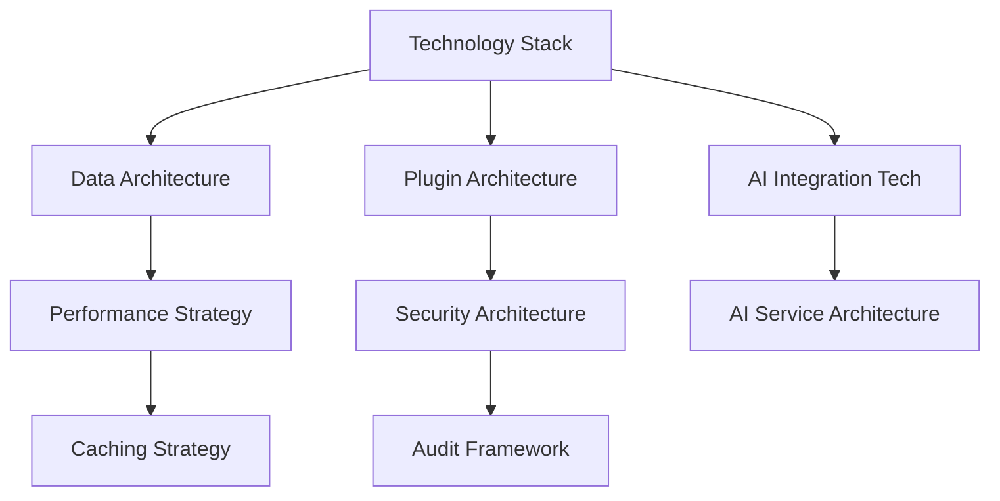

# Decisions Index

## Purpose
Contains key architectural and technical decisions made during the development of Pliers v3, with rationale and implications documented for future reference.

## Classification
- **Domain:** Supporting Element
- **Stability:** Static
- **Abstraction:** Structural
- **Confidence:** Established

## Decision Categories

### Technology Choices
- **[technology_stack.md](technology_stack.md)** - Core technology stack decisions *(to be created)*
  - Database technology selection (PostgreSQL vs alternatives)
  - Backend framework choice (Node.js + TypeScript)
  - Validation library selection (Zod vs alternatives)
  - Event processing technology choice

- **[ai_integration_tech.md](ai_integration_tech.md)** - AI and ML technology decisions *(to be created)*
  - LLM provider selection strategy
  - Vector database integration approach
  - Embedding model choices
  - AI service architecture patterns

### Architectural Decisions
- **[data_architecture.md](data_architecture.md)** - Data storage and management architecture *(to be created)*
  - JSONB vs relational schema approach
  - Event sourcing implementation decisions
  - Caching strategy choices
  - Database optimization approaches

- **[plugin_architecture.md](plugin_architecture.md)** - Plugin system design decisions *(to be created)*
  - Plugin isolation mechanisms
  - Priority and specificity system design
  - Plugin lifecycle management approach
  - Security and sandboxing decisions

### Development Process Decisions
- **[development_preferences.md](development_preferences.md)** - Team development preferences and standards
  - Docker volume configuration (relative paths)
  - DevContainer workflow preferences
  - Environment configuration strategy
  - Code style and organization standards

- **[agent_development_approach.md](agent_development_approach.md)** - LLM agent development methodology *(to be created)*
  - Agent task specification standards
  - Quality assurance approaches
  - Agent coordination strategies
  - Human oversight requirements

- **[testing_strategy.md](testing_strategy.md)** - Testing approach and tool decisions *(to be created)*
  - Testing framework selections
  - Integration testing strategies
  - Performance testing approaches
  - AI testing methodologies

### Security and Compliance Decisions
- **[security_architecture.md](security_architecture.md)** - Security framework and implementation decisions *(to be created)*
  - Authentication and authorization approaches
  - Data protection strategies
  - API security patterns
  - Audit and compliance frameworks

## Decision Record Template

All decisions follow this standardized format for consistency and traceability:

```markdown
# Decision: [Decision Title]

## Status
[Proposed | Accepted | Superseded | Deprecated]

## Date
[Decision date]

## Context
[Description of the situation that led to this decision]

## Decision
[Clear statement of what was decided]

## Rationale
### Factors Considered
- [Factor 1 and its weight in the decision]
- [Factor 2 and its weight in the decision]
- [Factor 3 and its weight in the decision]

### Alternatives Considered
1. **[Alternative 1]**
   - Pros: [Benefits of this alternative]
   - Cons: [Drawbacks of this alternative]
   - Why rejected: [Specific reasons]

2. **[Alternative 2]**
   - Pros: [Benefits of this alternative]
   - Cons: [Drawbacks of this alternative]
   - Why rejected: [Specific reasons]

### Decision Criteria
- [Criterion 1: Weight and evaluation]
- [Criterion 2: Weight and evaluation]
- [Criterion 3: Weight and evaluation]

## Consequences
### Positive
- [Benefit 1]
- [Benefit 2]
- [Benefit 3]

### Negative
- [Drawback 1 and mitigation strategy]
- [Drawback 2 and mitigation strategy]
- [Drawback 3 and mitigation strategy]

### Risks
- [Risk 1: Description and mitigation]
- [Risk 2: Description and mitigation]

## Implementation
### Required Changes
- [Change 1: Description and effort estimate]
- [Change 2: Description and effort estimate]

### Dependencies
- [Dependency 1]
- [Dependency 2]

### Timeline
- [Implementation timeline and milestones]

## Review and Validation
### Success Criteria
- [How to measure if this decision was correct]

### Review Schedule
- [When to review this decision]

### Validation Metrics
- [Specific metrics to track decision success]

## Related Decisions
- [Reference to related or dependent decisions]
- [Reference to decisions this supersedes]

## Metadata
- **Created:** [Date]
- **Last Updated:** [Date]
- **Updated By:** [Role/Agent]
- **Reviewers:** [List of reviewers]
```

## Key Architectural Decisions Summary

### Technology Stack Core Decisions
1. **PostgreSQL with JSONB** - Chosen over EAV model for performance and simplicity
2. **TypeScript + Zod** - Selected for type safety and runtime validation
3. **Event Sourcing** - Implemented for audit trail and plugin processing
4. **GraphQL API** - Chosen for type safety and real-time capabilities

### AI Integration Core Decisions
1. **Multi-Provider Strategy** - Support multiple LLM providers for flexibility
2. **Vector Search Integration** - PostgreSQL vector extensions for semantic search
3. **Context-Aware AI** - Rich context building for better AI responses
4. **Cost-Optimized AI Usage** - Intelligent caching and model selection

### Development Process Core Decisions
1. **Agent-First Development** - All implementation by LLM agents
2. **Context Network Approach** - Comprehensive documentation for agent understanding
3. **Incremental Implementation** - Phased approach with early validation
4. **Quality-First Process** - Strict quality standards for agent work

## Decision Tracking and Updates

### When to Create Decision Records
- Technology or framework selections
- Architectural pattern choices
- Process or methodology decisions
- Security or compliance approaches
- Any decision with long-term implications

### Decision Review Process
- **Quarterly Reviews** - Assess decision outcomes and validity
- **Impact Assessment** - Evaluate consequences of each decision
- **Course Correction** - Update or supersede decisions when needed
- **Lessons Learned** - Document insights from decision outcomes

### Decision Dependencies


## Relationships
- **Parent Nodes:** [discovery.md] - organizes - Decisions organized within context network
- **Child Nodes:** [Individual decision records] - details - Specific decision documentation
- **Related Nodes:**
  - [foundation/legacy_analysis.md] - informs - Legacy analysis informs technology decisions
  - [elements/architecture/modern_design.md] - implements - Architecture implements decisions
  - [planning/roadmap/overview.md] - schedules - Decisions affect roadmap and implementation

## Navigation Guidance
- **Access Context**: Reference when understanding architectural rationale or making related decisions
- **Common Next Steps**: Review specific decision records or related architectural documentation
- **Related Tasks**: Architecture planning, technology evaluation, implementation validation
- **Update Patterns**: Update when decisions change, new decisions are made, or outcomes are evaluated

## Metadata
- **Created:** 2025-09-20
- **Last Updated:** 2025-01-22
- **Updated By:** Claude/Development Setup

## Change History
- 2025-09-20: Initial decisions index structure with template and decision tracking framework
- 2025-01-22: Added development_preferences.md for team standards