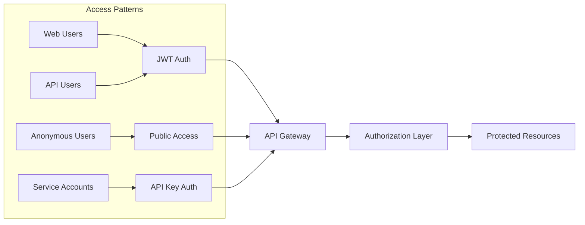

# Anonymous and Service Account Authentication

## Purpose
This document defines the authentication and authorization patterns for anonymous users accessing public forms and service accounts accessing APIs programmatically. It extends the existing authentication system to support unauthenticated access patterns and machine-to-machine communication.

## Classification
- **Domain:** Security/Authentication
- **Stability:** Core
- **Abstraction:** Implementation
- **Confidence:** Established

## Content

### Authentication Scenarios Overview

The Pliers v3 authentication system supports four primary access patterns:

1. **Authenticated Web Users** - Traditional user login with JWT tokens
2. **Anonymous Form Submissions** - Public form access without authentication
3. **User API Access** - API access using user JWT tokens
4. **Service Account API Access** - Machine-to-machine API access using API keys



### Anonymous Form Submission

#### Overview

Anonymous form submission allows unauthenticated users to submit data to designated public forms. This is essential for contact forms, surveys, feedback collection, and lead generation.

#### Implementation

```typescript
interface AnonymousSubmissionConfig {
  // Form-level configuration
  formSettings: {
    allowAnonymous: boolean;
    requireCaptcha: boolean;
    requireEmailVerification: boolean;
    anonymousRateLimit: number;      // Submissions per hour
    cooldownPeriod: number;          // Minutes between submissions
  };

  // Security measures
  security: {
    captchaProvider: 'recaptcha' | 'hcaptcha' | 'custom';
    honeypotFields: string[];
    ipBlacklist: string[];
    geoRestrictions?: string[];      // Country codes
  };

  // Data handling
  dataHandling: {
    retentionDays: number;           // How long to keep anonymous data
    allowedFields: string[];          // Fields anonymous users can submit
    requiredConsent: boolean;        // GDPR consent checkbox
  };
}

class AnonymousAuthenticationStrategy implements AuthStrategy {
  canHandle(request: Request): boolean {
    // Check if this is a public form submission
    return request.path.includes('/public/') ||
           request.path.includes('/anonymous/') ||
           request.headers['x-submission-type'] === 'anonymous';
  }

  async authenticate(request: Request): Promise<AuthResult> {
    // Generate temporary session for tracking
    const anonymousSession = {
      id: generateAnonymousSessionId(),
      ipAddress: this.extractIpAddress(request),
      userAgent: request.headers['user-agent'],
      createdAt: new Date(),
      expiresAt: new Date(Date.now() + 3600000), // 1 hour
    };

    // Check rate limits
    const rateLimitCheck = await this.checkAnonymousRateLimit(
      anonymousSession.ipAddress
    );

    if (!rateLimitCheck.allowed) {
      return {
        success: false,
        error: 'Rate limit exceeded',
        retryAfter: rateLimitCheck.retryAfter
      };
    }

    // Verify CAPTCHA if required
    if (request.body.captchaToken) {
      const captchaValid = await this.verifyCaptcha(
        request.body.captchaToken,
        anonymousSession.ipAddress
      );

      if (!captchaValid) {
        return {
          success: false,
          error: 'CAPTCHA verification failed'
        };
      }
    }

    // Create anonymous auth context
    return {
      success: true,
      user: {
        id: anonymousSession.id,
        type: 'anonymous',
        ipAddress: anonymousSession.ipAddress,
        sessionId: anonymousSession.id,
        permissions: ['read:public_form', 'create:anonymous_submission']
      }
    };
  }

  private async checkAnonymousRateLimit(ipAddress: string): Promise<RateLimitResult> {
    const key = `anon_rate:${ipAddress}`;
    const limit = 10; // 10 submissions per hour
    const window = 3600; // 1 hour in seconds

    const current = await this.redis.incr(key);

    if (current === 1) {
      await this.redis.expire(key, window);
    }

    if (current > limit) {
      const ttl = await this.redis.ttl(key);
      return {
        allowed: false,
        retryAfter: ttl
      };
    }

    return {
      allowed: true,
      remaining: limit - current
    };
  }

  private async verifyCaptcha(token: string, ipAddress: string): Promise<boolean> {
    const response = await fetch('https://www.google.com/recaptcha/api/siteverify', {
      method: 'POST',
      headers: { 'Content-Type': 'application/x-www-form-urlencoded' },
      body: `secret=${process.env.RECAPTCHA_SECRET}&response=${token}&remoteip=${ipAddress}`
    });

    const data = await response.json();
    return data.success && data.score > 0.5;
  }
}
```

#### Database Schema

```sql
-- Anonymous submissions tracking
CREATE TABLE anonymous_submissions (
    id UUID PRIMARY KEY DEFAULT gen_random_uuid(),
    form_id UUID NOT NULL REFERENCES forms(id),
    submission_id UUID NOT NULL REFERENCES form_submissions(id),

    -- Anonymous user tracking
    anonymous_session_id VARCHAR(255) NOT NULL,
    ip_address INET NOT NULL,
    user_agent TEXT,

    -- Verification
    email_address VARCHAR(255),
    email_verified BOOLEAN DEFAULT false,
    verification_token VARCHAR(255),
    verification_sent_at TIMESTAMPTZ,

    -- Security
    captcha_verified BOOLEAN DEFAULT false,
    risk_score DECIMAL(3,2),
    blocked BOOLEAN DEFAULT false,
    blocked_reason TEXT,

    -- Metadata
    submitted_at TIMESTAMPTZ NOT NULL DEFAULT now(),
    country_code VARCHAR(2),
    region VARCHAR(100),

    CONSTRAINT valid_risk_score CHECK (risk_score >= 0 AND risk_score <= 1)
);

-- Rate limiting for anonymous users
CREATE TABLE anonymous_rate_limits (
    ip_address INET PRIMARY KEY,
    submission_count INTEGER DEFAULT 0,
    window_start TIMESTAMPTZ NOT NULL DEFAULT now(),
    last_submission_at TIMESTAMPTZ,
    blocked_until TIMESTAMPTZ
);

-- Index for rate limit cleanup
CREATE INDEX idx_rate_limit_window ON anonymous_rate_limits(window_start);
```

### Service Account Authentication

#### Overview

Service accounts provide programmatic access to APIs for automation, integrations, and backend services. They use API keys for authentication and have customizable permissions.

#### Implementation

```typescript
interface ServiceAccount {
  id: string;
  organizationId: string;
  name: string;
  description: string;

  // Authentication
  apiKeyId: string;
  apiKeyPrefix: string;              // Visible prefix for identification

  // Permissions
  permissions: ServiceAccountPermission[];
  scopes: APIScope[];
  resourceAccess: ResourceAccessRule[];

  // Restrictions
  ipWhitelist?: string[];
  allowedOrigins?: string[];
  validFrom?: Date;
  validUntil?: Date;

  // Usage
  lastUsedAt?: Date;
  requestCount: number;
  monthlyQuota?: number;

  // Metadata
  createdBy: string;
  createdAt: Date;
  updatedAt: Date;
  isActive: boolean;
}

interface ServiceAccountPermission {
  resource: string;
  actions: string[];
  conditions?: PermissionCondition[];
  dataFilter?: DataFilter;
}

interface APIScope {
  name: string;
  description: string;
  endpoints: string[];
  rateLimit?: number;
}

class ServiceAccountAuthStrategy implements AuthStrategy {
  canHandle(request: Request): boolean {
    return request.headers['x-api-key'] !== undefined ||
           request.headers['authorization']?.startsWith('ApiKey ');
  }

  async authenticate(request: Request): Promise<AuthResult> {
    const apiKey = this.extractApiKey(request);

    if (!apiKey) {
      return {
        success: false,
        error: 'API key required'
      };
    }

    // Validate API key format
    if (!this.isValidApiKeyFormat(apiKey)) {
      return {
        success: false,
        error: 'Invalid API key format'
      };
    }

    // Look up service account by API key
    const serviceAccount = await this.getServiceAccountByApiKey(apiKey);

    if (!serviceAccount) {
      // Log failed attempt for security monitoring
      await this.auditService.logSecurityEvent({
        type: 'INVALID_API_KEY',
        apiKeyPrefix: apiKey.substring(0, 12),
        ipAddress: this.extractIpAddress(request),
        timestamp: new Date()
      });

      return {
        success: false,
        error: 'Invalid API key'
      };
    }

    // Check if account is active
    if (!serviceAccount.isActive) {
      return {
        success: false,
        error: 'Service account is disabled'
      };
    }

    // Validate time restrictions
    const now = new Date();
    if (serviceAccount.validFrom && now < serviceAccount.validFrom) {
      return {
        success: false,
        error: 'API key not yet valid'
      };
    }

    if (serviceAccount.validUntil && now > serviceAccount.validUntil) {
      return {
        success: false,
        error: 'API key expired'
      };
    }

    // Check IP whitelist
    if (serviceAccount.ipWhitelist?.length > 0) {
      const clientIp = this.extractIpAddress(request);
      if (!this.isIpWhitelisted(clientIp, serviceAccount.ipWhitelist)) {
        await this.auditService.logSecurityEvent({
          type: 'API_KEY_IP_VIOLATION',
          serviceAccountId: serviceAccount.id,
          clientIp,
          timestamp: new Date()
        });

        return {
          success: false,
          error: 'Access denied from this IP address'
        };
      }
    }

    // Check rate limits
    const rateLimitCheck = await this.checkServiceAccountRateLimit(
      serviceAccount.id
    );

    if (!rateLimitCheck.allowed) {
      return {
        success: false,
        error: 'Rate limit exceeded',
        retryAfter: rateLimitCheck.retryAfter
      };
    }

    // Update last used timestamp
    await this.updateServiceAccountUsage(serviceAccount.id);

    // Build auth context
    return {
      success: true,
      user: {
        id: serviceAccount.id,
        type: 'service_account',
        organizationId: serviceAccount.organizationId,
        name: serviceAccount.name,
        permissions: this.mapServiceAccountPermissions(serviceAccount),
        scopes: serviceAccount.scopes,
        rateLimit: serviceAccount.monthlyQuota
      }
    };
  }

  private async getServiceAccountByApiKey(apiKey: string): Promise<ServiceAccount | null> {
    // Hash the API key for comparison
    const keyHash = await this.hashApiKey(apiKey);

    const result = await this.db.query(`
      SELECT
        sa.*,
        ak.scopes,
        ak.rate_limit_per_minute
      FROM service_accounts sa
      JOIN api_keys ak ON sa.api_key_id = ak.id
      WHERE ak.key_hash = $1
        AND ak.revoked_at IS NULL
    `, [keyHash]);

    return result.rows[0] || null;
  }

  private async hashApiKey(apiKey: string): Promise<string> {
    return crypto
      .createHash('sha256')
      .update(apiKey + process.env.API_KEY_SALT)
      .digest('hex');
  }

  private mapServiceAccountPermissions(account: ServiceAccount): string[] {
    const permissions: string[] = [];

    for (const perm of account.permissions) {
      for (const action of perm.actions) {
        permissions.push(`${action}:${perm.resource}`);
      }
    }

    // Add scope-based permissions
    for (const scope of account.scopes) {
      permissions.push(...scope.endpoints.map(ep => `access:${ep}`));
    }

    return permissions;
  }
}
```

#### API Key Management

```typescript
class APIKeyManager {
  private readonly KEY_PREFIX_LENGTH = 8;
  private readonly KEY_LENGTH = 32;

  async generateAPIKey(serviceAccountId: string, type: 'production' | 'test'): Promise<APIKeyResult> {
    // Generate cryptographically secure random key
    const keyBytes = crypto.randomBytes(this.KEY_LENGTH);
    const apiKey = keyBytes.toString('base64url');

    // Create identifiable prefix
    const prefix = type === 'production' ? 'pk_live_' : 'pk_test_';
    const fullKey = prefix + apiKey;

    // Hash for storage
    const keyHash = await this.hashApiKey(fullKey);

    // Store in database
    await this.db.query(`
      INSERT INTO api_keys (
        organization_id,
        name,
        key_hash,
        prefix,
        key_type,
        service_account_id,
        created_by,
        created_at
      ) VALUES ($1, $2, $3, $4, $5, $6, $7, $8)
    `, [
      organizationId,
      `Service Account Key - ${new Date().toISOString()}`,
      keyHash,
      fullKey.substring(0, 12) + '...',
      'service_account',
      serviceAccountId,
      createdBy,
      new Date()
    ]);

    return {
      apiKey: fullKey,
      prefix: fullKey.substring(0, 12),
      createdAt: new Date(),
      // Only return full key once, never stored in plain text
      warning: 'Store this key securely. It will not be shown again.'
    };
  }

  async rotateAPIKey(serviceAccountId: string): Promise<APIKeyResult> {
    // Revoke existing key
    await this.db.query(`
      UPDATE api_keys
      SET
        revoked_at = NOW(),
        revoked_by = $1
      WHERE service_account_id = $2
        AND revoked_at IS NULL
    `, [currentUserId, serviceAccountId]);

    // Generate new key
    return this.generateAPIKey(serviceAccountId, 'production');
  }

  async validateAPIKey(apiKey: string): Promise<boolean> {
    const keyHash = await this.hashApiKey(apiKey);

    const result = await this.db.query(`
      SELECT COUNT(*) as valid
      FROM api_keys
      WHERE key_hash = $1
        AND revoked_at IS NULL
        AND (expires_at IS NULL OR expires_at > NOW())
    `, [keyHash]);

    return result.rows[0].valid > 0;
  }
}
```

### Public Form Access

#### URL Generation and Access

```typescript
class PublicFormManager {
  async generatePublicURL(formId: string): Promise<PublicFormURL> {
    // Check if form allows public access
    const form = await this.formService.getForm(formId);

    if (form.visibility !== 'public') {
      throw new Error('Form must be public to generate public URL');
    }

    // Generate unique public identifier
    const publicId = crypto.randomBytes(16).toString('hex');

    // Store public access configuration
    await this.db.query(`
      INSERT INTO public_form_access (
        form_id,
        public_id,
        url_slug,
        expires_at,
        max_submissions,
        require_captcha,
        allowed_domains,
        created_at
      ) VALUES ($1, $2, $3, $4, $5, $6, $7, $8)
    `, [
      formId,
      publicId,
      form.slug,
      expiresAt,
      maxSubmissions,
      requireCaptcha,
      allowedDomains,
      new Date()
    ]);

    return {
      url: `${process.env.PUBLIC_FORM_BASE_URL}/f/${publicId}`,
      embedCode: this.generateEmbedCode(publicId),
      qrCode: await this.generateQRCode(publicId),
      expiresAt,
      settings: {
        requireCaptcha,
        maxSubmissions,
        allowedDomains
      }
    };
  }

  private generateEmbedCode(publicId: string): string {
    return `
      <iframe
        src="${process.env.PUBLIC_FORM_BASE_URL}/embed/${publicId}"
        width="100%"
        height="600"
        frameborder="0"
        sandbox="allow-forms allow-scripts allow-same-origin">
      </iframe>
    `;
  }

  async validatePublicAccess(publicId: string, request: Request): Promise<PublicAccessResult> {
    const access = await this.getPublicAccess(publicId);

    if (!access) {
      return { valid: false, reason: 'Invalid form URL' };
    }

    // Check expiration
    if (access.expiresAt && new Date() > access.expiresAt) {
      return { valid: false, reason: 'Form URL expired' };
    }

    // Check submission limit
    if (access.maxSubmissions) {
      const count = await this.getSubmissionCount(publicId);
      if (count >= access.maxSubmissions) {
        return { valid: false, reason: 'Maximum submissions reached' };
      }
    }

    // Check domain restrictions
    if (access.allowedDomains?.length > 0) {
      const origin = request.headers.origin;
      if (!access.allowedDomains.includes(origin)) {
        return { valid: false, reason: 'Access denied from this domain' };
      }
    }

    return {
      valid: true,
      formId: access.formId,
      requireCaptcha: access.requireCaptcha
    };
  }
}
```

### Authentication Strategy Manager

```typescript
class AuthenticationManager {
  private strategies: AuthStrategy[] = [
    new UserJWTStrategy(),
    new ServiceAccountAuthStrategy(),
    new AnonymousAuthenticationStrategy(),
    new SessionCookieStrategy()
  ];

  async authenticate(request: Request): Promise<AuthResult> {
    // Try each strategy in order of priority
    for (const strategy of this.strategies) {
      if (strategy.canHandle(request)) {
        const result = await strategy.authenticate(request);

        if (result.success) {
          // Log successful authentication
          await this.auditService.logAuthEvent({
            type: 'AUTH_SUCCESS',
            strategy: strategy.constructor.name,
            userId: result.user.id,
            userType: result.user.type,
            timestamp: new Date()
          });

          return result;
        }
      }
    }

    // No strategy could handle the request
    return {
      success: false,
      error: 'No authentication method provided'
    };
  }

  registerStrategy(strategy: AuthStrategy, priority: number = 0): void {
    this.strategies.splice(priority, 0, strategy);
  }
}
```

### Authorization Extensions

#### Anonymous User Permissions

```typescript
const ANONYMOUS_PERMISSIONS = {
  // What anonymous users can do
  allowed: [
    'read:public_form',
    'create:anonymous_submission',
    'read:public_content',
    'view:embedded_form'
  ],

  // Explicitly denied
  denied: [
    'read:private_form',
    'update:submission',
    'delete:submission',
    'access:dashboard',
    'manage:*'
  ],

  // Rate limits specific to anonymous users
  rateLimits: {
    'create:anonymous_submission': {
      requests: 10,
      window: '1h',
      burstAllowed: false
    },
    'read:public_form': {
      requests: 100,
      window: '1h',
      burstAllowed: true
    }
  }
};
```

#### Service Account Permissions

```typescript
const SERVICE_ACCOUNT_TEMPLATES = {
  READ_ONLY: {
    name: 'Read Only Access',
    permissions: [
      'read:forms',
      'read:submissions',
      'read:reports'
    ],
    scopes: ['read']
  },

  FORM_MANAGER: {
    name: 'Form Management',
    permissions: [
      'create:form',
      'read:form',
      'update:form',
      'delete:form',
      'read:submission'
    ],
    scopes: ['forms', 'submissions:read']
  },

  INTEGRATION: {
    name: 'Integration Account',
    permissions: [
      'create:submission',
      'read:submission',
      'update:submission:status',
      'trigger:webhook'
    ],
    scopes: ['integrations']
  },

  ANALYTICS: {
    name: 'Analytics Access',
    permissions: [
      'read:reports',
      'read:analytics',
      'export:data'
    ],
    scopes: ['analytics', 'export']
  }
};
```

### Security Considerations

#### Anonymous Access Security

1. **Rate Limiting**: Strict rate limits for anonymous users
2. **CAPTCHA**: Required for all anonymous submissions
3. **IP Blocking**: Automatic blocking of suspicious IPs
4. **Data Validation**: Extra validation for anonymous data
5. **Honeypot Fields**: Hidden fields to catch bots
6. **Email Verification**: Optional email verification for anonymous submitters

#### Service Account Security

1. **Key Rotation**: Regular API key rotation policy
2. **Scope Limitation**: Minimal necessary permissions
3. **IP Whitelisting**: Restrict to known IP addresses
4. **Audit Logging**: Comprehensive logging of all actions
5. **Expiration**: Time-limited API keys
6. **Secret Management**: Secure key storage practices

### Monitoring and Audit

```typescript
interface AnonymousAccessAudit {
  timestamp: Date;
  formId: string;
  ipAddress: string;
  userAgent: string;
  country: string;
  action: 'view' | 'submit' | 'blocked';
  reason?: string;
  riskScore: number;
}

interface ServiceAccountAudit {
  timestamp: Date;
  accountId: string;
  accountName: string;
  action: string;
  resource: string;
  ipAddress: string;
  success: boolean;
  responseTime: number;
}

class SecurityMonitor {
  async detectAnomalies(): Promise<Anomaly[]> {
    const anomalies: Anomaly[] = [];

    // Check for unusual anonymous submission patterns
    const anonymousPatterns = await this.analyzeAnonymousPatterns();
    if (anonymousPatterns.suspicious) {
      anomalies.push({
        type: 'SUSPICIOUS_ANONYMOUS_ACTIVITY',
        severity: 'HIGH',
        details: anonymousPatterns
      });
    }

    // Check for service account abuse
    const serviceAccountUsage = await this.analyzeServiceAccountUsage();
    if (serviceAccountUsage.abnormal) {
      anomalies.push({
        type: 'SERVICE_ACCOUNT_ABUSE',
        severity: 'CRITICAL',
        details: serviceAccountUsage
      });
    }

    return anomalies;
  }
}
```

## Relationships
- **Parent Nodes:** [authentication.md] - extends authentication system
- **Child Nodes:** None
- **Related Nodes:**
  - [authorization.md] - defines permissions for anonymous and service accounts
  - [api/overview.md] - implements API access patterns
  - [form-engine/api.md] - handles public form rendering

## Navigation Guidance
- **Access Context:** Use when implementing public forms or service integrations
- **Common Next Steps:** Review rate limiting configuration or security measures
- **Related Tasks:** Public form setup, API integration development
- **Update Patterns:** Update when adding new public access patterns

## Metadata
- **Created:** 2025-09-23
- **Last Updated:** 2025-09-23
- **Updated By:** Claude/Authentication Enhancement

## Change History
- 2025-09-23: Initial creation of anonymous and service account authentication documentation