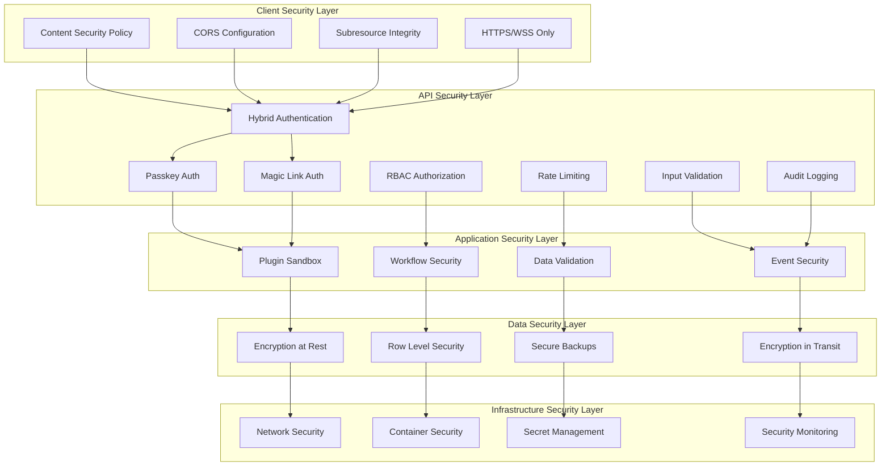
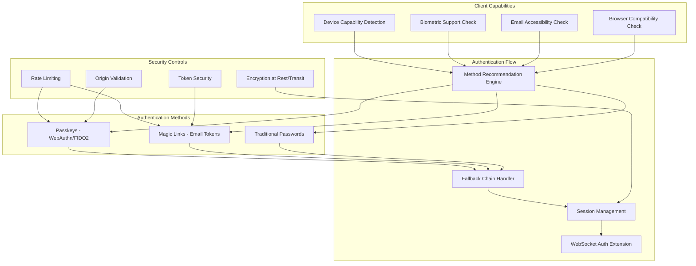

# Security Architecture

## Purpose
This document defines the comprehensive security architecture for Pliers v3, including authentication, authorization, data protection, and threat mitigation strategies. It provides implementation-ready specifications for all security components.

## Classification
- **Domain:** Security
- **Stability:** Core
- **Abstraction:** Architectural
- **Confidence:** Established

## Content

### Security Architecture Overview

Pliers v3 implements a defense-in-depth security model with multiple layers of protection across the entire platform. The security architecture is designed to protect against OWASP Top 10 vulnerabilities while meeting SOC2 compliance requirements.



### Core Security Principles

#### Zero Trust Architecture
- Never trust, always verify
- Verify identity and device before granting access
- Least privilege access by default
- Continuous monitoring and validation

#### Defense in Depth
- Multiple layers of security controls
- No single point of failure
- Progressive authorization
- Fail-secure mechanisms

#### Data Protection First
- Encryption by default
- Data classification and handling
- Privacy by design
- Minimal data collection

#### Compliance Ready
- SOC2 Type II alignment
- GDPR compliance
- OWASP best practices
- Industry standard frameworks

### Security Components Architecture

#### Passwordless Authentication Architecture

Pliers v3 implements hybrid passwordless authentication supporting both WebAuthn passkeys and email magic links, providing users with secure, convenient authentication options while maintaining backwards compatibility with traditional password-based authentication.



**Hybrid Authentication Strategy:**
1. **Capability Detection:** Analyze device/browser capabilities to recommend optimal authentication method
2. **Progressive Enhancement:** Start with traditional passwords, enhance with passwordless options
3. **Intelligent Fallbacks:** Automatic fallback chains ensure authentication always succeeds
4. **Security First:** All methods maintain equivalent security guarantees

**Implementation Components:**
- **Passkey Service:** WebAuthn ceremony management, credential storage, device management
- **Magic Link Service:** Token generation, email delivery, verification, cleanup
- **Capability Detector:** Browser/device feature detection, recommendation engine
- **Hybrid Router:** Authentication method routing and fallback handling
- **WebSocket Extension:** Passwordless token support in real-time connections

#### Authentication Infrastructure

```typescript
interface SecurityConfig {
  authentication: {
    jwt: {
      accessTokenTTL: number;        // 15 minutes
      refreshTokenTTL: number;       // 7 days
      algorithm: 'RS256';
      issuer: string;
      audience: string[];
    };
    passwordless: {
      passkeys: {
        enabled: boolean;
        timeout: number;               // 60 seconds
        userVerification: 'required' | 'preferred' | 'discouraged';
        attestation: 'none' | 'indirect' | 'direct';
        rpId: string;                  // Relying party identifier
        rpName: string;                // Relying party name
      };
      magicLinks: {
        enabled: boolean;
        tokenTTL: number;              // 5-15 minutes
        maxTokensPerHour: number;      // 3-5 tokens
        emailProvider: 'sendgrid' | 'ses' | 'smtp';
        tokenLength: number;           // 256+ bits
        singleUse: boolean;
      };
    };
    apiKeys: {
      enabled: boolean;
      hashAlgorithm: 'SHA-256';
      prefixes: string[];             // ['pk_', 'sk_']
    };
    mfa: {
      enabled: boolean;
      providers: ['totp', 'email', 'passkey'];
      required: boolean;
    };
    sessionManagement: {
      maxSessions: number;            // 5 concurrent sessions
      deviceTracking: boolean;
      geoLocationCheck: boolean;
    };
  };
  authorization: {
    rbac: {
      enabled: boolean;
      hierarchical: boolean;
      inheritance: boolean;
    };
    permissions: {
      granular: boolean;
      fieldLevel: boolean;
      resourceBased: boolean;
    };
    policies: {
      engine: 'casbin' | 'opa';
      cacheEnabled: boolean;
      cacheTTL: number;
    };
  };
  encryption: {
    atRest: {
      algorithm: 'AES-256-GCM';
      keyRotation: boolean;
      rotationInterval: number;       // 90 days
    };
    inTransit: {
      tlsVersion: '1.3';
      cipherSuites: string[];
      hsts: boolean;
    };
    fieldLevel: {
      enabled: boolean;
      sensitiveFields: string[];
      keyDerivation: 'PBKDF2' | 'Argon2id';
    };
  };
  monitoring: {
    auditLogging: {
      enabled: boolean;
      retention: number;              // 2555 days (7 years)
      logLevel: 'info' | 'debug';
    };
    securityEvents: {
      failedLogins: boolean;
      privilegeEscalation: boolean;
      dataAccess: boolean;
      configChanges: boolean;
      passkeyRegistrations: boolean;
      magicLinkGeneration: boolean;
      authMethodSwitching: boolean;
      suspiciousAuthPatterns: boolean;
    };
    alerting: {
      enabled: boolean;
      thresholds: SecurityThresholds;
      channels: AlertChannel[];
    };
  };
}

interface SecurityThresholds {
  failedLoginAttempts: number;        // 5 attempts
  suspiciousIpThreshold: number;      // 10 requests/minute
  dataExportVolume: number;           // 1000 records/hour
  privilegedActionRate: number;       // 50 actions/hour
  magicLinkGenerationRate: number;    // 3-5 per hour per user
  passkeyRegistrationRate: number;    // 10 per day per user
  authMethodSwitchRate: number;       // 20 per hour per user
}

interface AlertChannel {
  type: 'email' | 'slack' | 'webhook';
  endpoint: string;
  severity: 'low' | 'medium' | 'high' | 'critical';
  enabled: boolean;
}
```

#### Authorization Model

```typescript
interface AuthorizationModel {
  users: {
    roles: Role[];
    permissions: Permission[];
    tenancy: TenantAccess[];
    context: SecurityContext;
  };
  roles: {
    hierarchy: RoleHierarchy;
    permissions: RolePermission[];
    inheritance: boolean;
    temporal: TemporalAccess;
  };
  permissions: {
    actions: Action[];
    resources: Resource[];
    conditions: Condition[];
    fieldLevel: FieldPermission[];
  };
  policies: {
    engine: PolicyEngine;
    rules: PolicyRule[];
    evaluation: PolicyEvaluation;
    caching: PolicyCache;
  };
}

interface Role {
  id: string;
  name: string;
  description: string;
  level: number;                      // Hierarchy level
  parentRoles: string[];
  permissions: string[];
  constraints: RoleConstraint[];
  metadata: RoleMetadata;
}

interface Permission {
  id: string;
  action: string;                     // create, read, update, delete, execute
  resource: string;                   // forms, submissions, workflows, plugins
  conditions: string[];               // owner, tenant, time-based
  effect: 'allow' | 'deny';
  priority: number;
}

interface PolicyRule {
  id: string;
  subject: string;                    // user, role, group
  action: string;                     // HTTP method or business action
  resource: string;                   // Resource path or identifier
  effect: 'allow' | 'deny';
  conditions: PolicyCondition[];
  metadata: PolicyMetadata;
}
```

#### Data Protection Framework

```typescript
interface DataProtectionFramework {
  classification: {
    levels: DataClassification[];
    rules: ClassificationRule[];
    automation: boolean;
    labeling: boolean;
  };
  encryption: {
    algorithms: EncryptionAlgorithm[];
    keyManagement: KeyManagement;
    fieldLevel: FieldEncryption;
    transparent: boolean;
  };
  privacy: {
    dataMinimization: boolean;
    purposeLimitation: boolean;
    consentManagement: ConsentFramework;
    rightsManagement: DataSubjectRights;
  };
  retention: {
    policies: RetentionPolicy[];
    automation: boolean;
    archiving: ArchiveStrategy;
    deletion: DeletionStrategy;
  };
}

interface DataClassification {
  level: 'public' | 'internal' | 'confidential' | 'restricted';
  description: string;
  protectionRequirements: ProtectionRequirement[];
  handlingInstructions: string[];
  retentionPeriod: number;
}

interface FieldEncryption {
  enabled: boolean;
  fields: EncryptedField[];
  keyDerivation: KeyDerivationConfig;
  searchable: boolean;                // For encrypted search
}

interface EncryptedField {
  tableName: string;
  columnName: string;
  encryptionType: 'deterministic' | 'randomized';
  keyId: string;
  searchEnabled: boolean;
}
```

### Security Implementation Patterns

#### Secure API Design

```typescript
// API Security Middleware Stack
interface APISecurityStack {
  rateLimiting: RateLimitConfig;
  authentication: AuthenticationMiddleware;
  authorization: AuthorizationMiddleware;
  validation: ValidationMiddleware;
  sanitization: SanitizationMiddleware;
  logging: AuditLoggingMiddleware;
  headers: SecurityHeadersMiddleware;
}

// Rate Limiting Configuration
interface RateLimitConfig {
  global: {
    requests: number;               // 1000 requests
    window: number;                 // per 15 minutes
    skipSuccessfulRequests: false;
  };
  perUser: {
    requests: number;               // 100 requests
    window: number;                 // per minute
    skipFailedRequests: false;
  };
  perEndpoint: {
    [endpoint: string]: {
      requests: number;
      window: number;
      method?: string[];
    };
  };
  enforcement: {
    blockOnExceed: boolean;
    delayResponse: boolean;
    logViolations: boolean;
  };
}

// Security Headers Configuration
interface SecurityHeaders {
  contentSecurityPolicy: {
    directives: CSPDirectives;
    reportOnly: boolean;
    reportUri: string;
  };
  httpStrictTransportSecurity: {
    maxAge: number;                 // 31536000 (1 year)
    includeSubDomains: boolean;
    preload: boolean;
  };
  xFrameOptions: 'DENY' | 'SAMEORIGIN';
  xContentTypeOptions: 'nosniff';
  referrerPolicy: 'strict-origin-when-cross-origin';
  permissionsPolicy: PermissionsPolicy;
}
```

#### Plugin Security Sandbox

```typescript
interface PluginSecuritySandbox {
  isolation: {
    processIsolation: boolean;
    memoryLimits: MemoryLimits;
    cpuLimits: CPULimits;
    networkAccess: NetworkPolicy;
    fileSystemAccess: FileSystemPolicy;
  };
  permissions: {
    apiAccess: APIPermissions;
    dataAccess: DataPermissions;
    systemAccess: SystemPermissions;
    runtimePermissions: RuntimePermissions;
  };
  monitoring: {
    resourceUsage: boolean;
    securityViolations: boolean;
    performanceMetrics: boolean;
    behaviorAnalysis: boolean;
  };
  enforcement: {
    violationActions: ViolationAction[];
    escalationPolicies: EscalationPolicy[];
    quarantine: QuarantinePolicy;
    termination: TerminationPolicy;
  };
}

interface NetworkPolicy {
  allowedHosts: string[];
  blockedHosts: string[];
  protocols: ('http' | 'https' | 'ws' | 'wss')[];
  maxConnections: number;
  timeoutSeconds: number;
}

interface DataPermissions {
  readPermissions: DataAccessRule[];
  writePermissions: DataAccessRule[];
  fieldLevelAccess: FieldAccessRule[];
  encryptionRequired: boolean;
}
```

### Security Monitoring and Incident Response

#### Security Operations Center (SOC) Framework

```typescript
interface SOCFramework {
  monitoring: {
    realTime: RealTimeMonitoring;
    behaviorAnalytics: BehaviorAnalytics;
    threatIntelligence: ThreatIntelligence;
    vulnerabilityScanning: VulnerabilityScanning;
  };
  detection: {
    rules: DetectionRule[];
    ml: MachineLearningDetection;
    correlation: EventCorrelation;
    indicators: ThreatIndicators;
  };
  response: {
    automation: ResponseAutomation;
    playbooks: IncidentPlaybook[];
    escalation: EscalationMatrix;
    communication: CommunicationPlan;
  };
  forensics: {
    dataCollection: ForensicsCollection;
    analysis: ForensicsAnalysis;
    preservation: EvidencePreservation;
    reporting: ForensicsReporting;
  };
}

interface DetectionRule {
  id: string;
  name: string;
  description: string;
  severity: SecuritySeverity;
  conditions: DetectionCondition[];
  actions: DetectionAction[];
  metadata: RuleMetadata;
}

interface IncidentPlaybook {
  triggerConditions: TriggerCondition[];
  responseSteps: ResponseStep[];
  stakeholders: Stakeholder[];
  slaRequirements: SLARequirement[];
  documentation: PlaybookDocumentation;
}
```

### Security Testing and Validation

#### Continuous Security Testing

```typescript
interface SecurityTestingFramework {
  staticAnalysis: {
    codeScanning: CodeScanningConfig;
    dependencyScanning: DependencyScanning;
    secretsDetection: SecretsDetection;
    configurationReview: ConfigurationReview;
  };
  dynamicAnalysis: {
    vulnerabilityScanning: VulnerabilityScanning;
    penetrationTesting: PenetrationTesting;
    behaviorTesting: BehaviorTesting;
    performanceTesting: SecurityPerformanceTesting;
  };
  compliance: {
    frameworkValidation: ComplianceFramework[];
    auditTrails: AuditTrailValidation;
    dataProtection: DataProtectionValidation;
    accessControls: AccessControlValidation;
  };
  automation: {
    cicdIntegration: SecurityCICDConfig;
    continuousMonitoring: ContinuousMonitoring;
    reportGeneration: SecurityReporting;
    remediation: AutomatedRemediation;
  };
}
```

### Implementation Guidelines

#### Development Security Requirements

1. **Secure Coding Standards**
   - OWASP Secure Coding Practices
   - Input validation on all data
   - Output encoding for all outputs
   - Parameterized queries for database access
   - Proper error handling without information disclosure

2. **Code Review Security Checklist**
   - Authentication and authorization checks
   - Input validation and sanitization
   - SQL injection prevention
   - XSS prevention measures
   - CSRF protection implementation
   - Sensitive data handling
   - Error handling and logging

3. **Security Testing Integration**
   - Unit tests for security functions
   - Integration tests for auth flows
   - Automated security scanning in CI/CD
   - Regular penetration testing
   - Dependency vulnerability scanning

#### Deployment Security Requirements

1. **Infrastructure Security**
   - Encrypted communication (TLS 1.3)
   - Network segmentation
   - Firewall configuration
   - Intrusion detection systems
   - Security monitoring and logging

2. **Container Security**
   - Minimal base images
   - Non-root container execution
   - Security scanning of images
   - Runtime protection
   - Secret management integration

3. **Database Security**
   - Encryption at rest and in transit
   - Row-level security policies
   - Database access controls
   - Backup encryption
   - Audit logging

### Success Metrics

#### Security KPIs

| Metric | Target | Measurement |
|--------|--------|-------------|
| Security Incidents | 0 critical/month | Incident tracking |
| Vulnerability Remediation | <7 days critical, <30 days high | MTTR tracking |
| Authentication Failures | <1% of total requests | Auth metrics |
| Failed Authorization | <0.1% of authenticated requests | AuthZ metrics |
| Security Test Coverage | >95% of security functions | Test automation |
| Compliance Score | 100% SOC2 requirements | Audit results |
| Security Training | 100% team completion | Training tracking |
| Penetration Test Score | No critical findings | External testing |

#### Monitoring and Alerting

1. **Real-time Security Alerts**
   - Authentication failures exceeding threshold
   - Privilege escalation attempts
   - Unusual data access patterns
   - Security configuration changes
   - Suspected attack patterns

2. **Security Dashboards**
   - Authentication success/failure rates
   - Authorization denials by resource
   - Security event trends
   - Vulnerability status
   - Compliance status indicators

3. **Regular Security Reports**
   - Weekly security posture summary
   - Monthly vulnerability assessment
   - Quarterly penetration test results
   - Annual compliance audit reports

## Relationships
- **Parent Nodes:** [foundation/structure.md] - implements security requirements
- **Child Nodes:**
  - [authentication.md] - details - Authentication implementation
  - [authorization.md] - details - Authorization model
  - [threats.md] - addresses - Threat model and mitigations
  - [compliance.md] - ensures - Compliance requirements
- **Related Nodes:**
  - [elements/architecture/service_contracts.md] - integrates - Service security contracts
  - [decisions/security_decisions.md] - justifies - Security technology choices
  - [elements/data-models/security_models.md] - implements - Security data models

## Navigation Guidance
- **Access Context:** Use this document when implementing security features or reviewing security requirements
- **Common Next Steps:** Review specific security component documentation or implementation tasks
- **Related Tasks:** AUTH-001 (Authentication Infrastructure), AUTH-002 (Magic Links), AUTH-004 (Passkeys), security testing tasks, compliance validation
- **Update Patterns:** Update when security requirements change or new threats are identified

## Metadata
- **Created:** 2025-01-22
- **Last Updated:** 2025-09-25
- **Updated By:** Claude/DOC-005 Implementation

## Change History
- 2025-01-22: Initial creation of comprehensive security architecture (DOC-005)
- 2025-09-25: Added passwordless authentication architecture (passkeys and magic links)