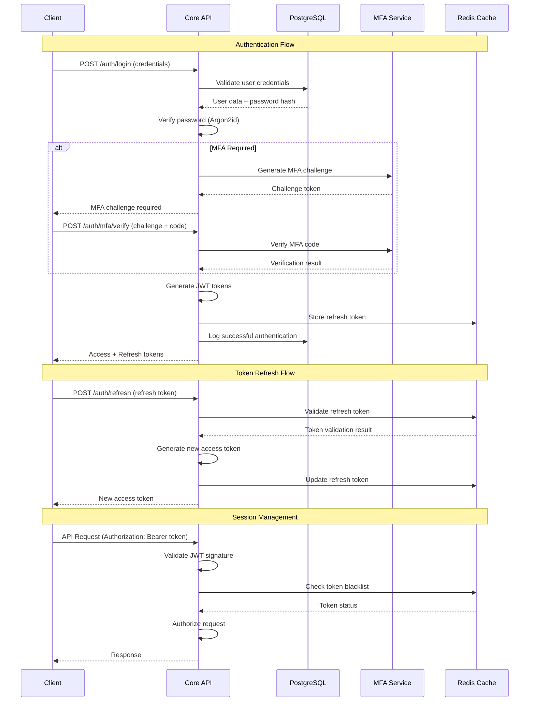

# Authentication and Session Management

## Purpose
This document provides detailed specifications for authentication mechanisms, session management, and identity verification in Pliers v3. It covers JWT implementation, multi-factor authentication, session handling, and security best practices.

## Classification
- **Domain:** Security/Authentication
- **Stability:** Core
- **Abstraction:** Implementation
- **Confidence:** Established

## Content

### Authentication Architecture Overview

Pliers v3 implements a multi-layered authentication system supporting various authentication methods while maintaining security best practices and user experience.



### JWT Token Implementation

#### Token Structure and Configuration

```typescript
interface JWTConfig {
  accessToken: {
    algorithm: 'RS256';               // RSA SHA-256 for asymmetric signing
    expiresIn: '15m';                // 15 minutes for security
    issuer: 'pliers-api';
    audience: ['pliers-web', 'pliers-mobile', 'pliers-api'];
  };
  refreshToken: {
    algorithm: 'HS256';              // HMAC SHA-256 for symmetric signing
    expiresIn: '7d';                 // 7 days
    issuer: 'pliers-api';
    audience: ['pliers-auth'];
  };
  keys: {
    publicKeyPath: '/secrets/jwt-public.pem';
    privateKeyPath: '/secrets/jwt-private.pem';
    hmacSecret: string;              // From environment
    keyRotation: {
      enabled: boolean;
      intervalDays: number;          // 90 days
      gracePeriodDays: number;       // 7 days overlap
    };
  };
}

interface AccessTokenPayload {
  // Standard claims
  sub: string;                       // User ID
  iss: string;                       // Issuer (pliers-api)
  aud: string[];                     // Audience
  exp: number;                       // Expiration timestamp
  iat: number;                       // Issued at timestamp
  jti: string;                       // JWT ID for tracking

  // Custom claims
  email: string;                     // User email
  roles: string[];                   // User roles
  permissions: string[];             // Computed permissions
  tenantId: string;                  // Current tenant context
  sessionId: string;                 // Session identifier
  deviceId?: string;                 // Device fingerprint
  mfaVerified: boolean;             // MFA completion status

  // Security metadata
  ipAddress: string;                 // Client IP for validation
  userAgent: string;                 // Client user agent hash
  lastPasswordChange: number;        // Timestamp of last password change

  // Feature flags
  features: string[];                // Enabled features for user
  limitations: TokenLimitation[];    // Any access limitations
}

interface RefreshTokenPayload {
  // Standard claims
  sub: string;                       // User ID
  iss: string;                       // Issuer
  aud: string[];                     // Audience
  exp: number;                       // Expiration timestamp
  iat: number;                       // Issued at timestamp
  jti: string;                       // JWT ID

  // Custom claims
  sessionId: string;                 // Session identifier
  deviceId: string;                  // Device fingerprint
  family: string;                    // Token family for rotation
  version: number;                   // Token version for invalidation

  // Security metadata
  ipAddress: string;                 // Original IP address
  lastUsed: number;                  // Last usage timestamp
}

interface TokenLimitation {
  type: 'rate_limit' | 'feature_access' | 'data_access' | 'time_restriction';
  description: string;
  parameters: Record<string, any>;
  expiresAt?: number;
}
```

#### Token Generation and Validation

```typescript
class JWTService {
  private publicKey: Buffer;
  private privateKey: Buffer;
  private hmacSecret: string;
  private config: JWTConfig;

  constructor(config: JWTConfig) {
    this.config = config;
    this.loadKeys();
  }

  async generateAccessToken(user: User, session: Session): Promise<string> {
    const permissions = await this.computeUserPermissions(user);

    const payload: AccessTokenPayload = {
      // Standard claims
      sub: user.id,
      iss: this.config.accessToken.issuer,
      aud: this.config.accessToken.audience,
      exp: Math.floor(Date.now() / 1000) + (15 * 60), // 15 minutes
      iat: Math.floor(Date.now() / 1000),
      jti: generateUUID(),

      // Custom claims
      email: user.email,
      roles: user.roles.map(r => r.name),
      permissions: permissions,
      tenantId: session.tenantId,
      sessionId: session.id,
      deviceId: session.deviceId,
      mfaVerified: session.mfaVerified,

      // Security metadata
      ipAddress: session.ipAddress,
      userAgent: hashUserAgent(session.userAgent),
      lastPasswordChange: user.lastPasswordChange.getTime(),

      // Feature flags
      features: await this.getUserFeatures(user),
      limitations: await this.getUserLimitations(user),
    };

    return jwt.sign(payload, this.privateKey, {
      algorithm: 'RS256',
      keyid: this.getCurrentKeyId(),
    });
  }

  async generateRefreshToken(user: User, session: Session): Promise<string> {
    const payload: RefreshTokenPayload = {
      // Standard claims
      sub: user.id,
      iss: this.config.refreshToken.issuer,
      aud: this.config.refreshToken.audience,
      exp: Math.floor(Date.now() / 1000) + (7 * 24 * 60 * 60), // 7 days
      iat: Math.floor(Date.now() / 1000),
      jti: generateUUID(),

      // Custom claims
      sessionId: session.id,
      deviceId: session.deviceId,
      family: session.tokenFamily,
      version: session.tokenVersion,

      // Security metadata
      ipAddress: session.ipAddress,
      lastUsed: Date.now(),
    };

    const token = jwt.sign(payload, this.hmacSecret, {
      algorithm: 'HS256',
    });

    // Store refresh token in cache with metadata
    await this.cacheService.setRefreshToken(payload.jti, {
      userId: user.id,
      sessionId: session.id,
      deviceId: session.deviceId,
      issuedAt: payload.iat,
      expiresAt: payload.exp,
    });

    return token;
  }

  async validateAccessToken(token: string): Promise<AccessTokenPayload> {
    try {
      // Decode and verify signature
      const decoded = jwt.verify(token, this.publicKey, {
        algorithms: ['RS256'],
        issuer: this.config.accessToken.issuer,
        audience: this.config.accessToken.audience,
      }) as AccessTokenPayload;

      // Additional validation checks
      await this.validateTokenSecurity(decoded);

      return decoded;
    } catch (error) {
      throw new AuthenticationError('Invalid access token', {
        code: 'INVALID_TOKEN',
        reason: error.message,
      });
    }
  }

  private async validateTokenSecurity(payload: AccessTokenPayload): Promise<void> {
    // Check if token is blacklisted
    const isBlacklisted = await this.cacheService.isTokenBlacklisted(payload.jti);
    if (isBlacklisted) {
      throw new AuthenticationError('Token has been revoked');
    }

    // Validate session is still active
    const session = await this.sessionService.getSession(payload.sessionId);
    if (!session || !session.isActive) {
      throw new AuthenticationError('Session is no longer active');
    }

    // Check for password change after token issuance
    if (payload.lastPasswordChange && payload.iat < payload.lastPasswordChange / 1000) {
      throw new AuthenticationError('Token invalid due to password change');
    }

    // Validate IP address if enabled
    if (this.config.validateIpAddress && session.ipAddress !== payload.ipAddress) {
      // Log suspicious activity
      await this.auditService.logSecurityEvent({
        type: 'SUSPICIOUS_IP_CHANGE',
        userId: payload.sub,
        sessionId: payload.sessionId,
        originalIp: payload.ipAddress,
        currentIp: session.ipAddress,
      });

      throw new AuthenticationError('Token used from unauthorized IP address');
    }
  }
}
```

### Multi-Factor Authentication (MFA)

#### TOTP Implementation

```typescript
interface MFAConfig {
  totp: {
    issuer: string;                  // 'Pliers'
    window: number;                  // 1 (30-second window)
    algorithm: 'SHA1' | 'SHA256';    // SHA1 for compatibility
    digits: 6 | 8;                   // 6 digits
    period: number;                  // 30 seconds
  };
  backup: {
    codeCount: number;               // 10 backup codes
    codeLength: number;              // 8 characters
    hashAlgorithm: 'SHA-256';
  };
  email: {
    enabled: boolean;
    codeLength: number;              // 6 digits
    expirationMinutes: number;       // 10 minutes
    maxAttempts: number;             // 3 attempts
  };
  enforcement: {
    required: boolean;               // Force MFA for all users
    gracePeriodDays: number;         // 30 days for setup
    adminRequired: boolean;          // Always required for admin roles
    highRiskRequired: boolean;       // Required for high-risk actions
  };
}

class MFAService {
  private config: MFAConfig;
  private totpService: TOTPService;
  private emailService: EmailService;

  async setupTOTP(userId: string): Promise<TOTPSetupResult> {
    // Generate secret key
    const secret = generateSecret({
      length: 32,
      name: `Pliers (${user.email})`,
      issuer: this.config.totp.issuer,
    });

    // Store temporary secret (not yet verified)
    await this.storeTemporarySecret(userId, secret.base32);

    // Generate QR code
    const qrCodeUrl = await qrcode.toDataURL(secret.otpauth_url);

    return {
      secret: secret.base32,
      qrCode: qrCodeUrl,
      backupCodes: await this.generateBackupCodes(userId),
      setupInstructions: this.getSetupInstructions(),
    };
  }

  async verifyTOTPSetup(userId: string, token: string): Promise<void> {
    const tempSecret = await this.getTemporarySecret(userId);
    if (!tempSecret) {
      throw new MFAError('No pending TOTP setup found');
    }

    const isValid = this.verifyTOTPToken(tempSecret, token);
    if (!isValid) {
      throw new MFAError('Invalid TOTP code');
    }

    // Move from temporary to permanent storage
    await this.confirmTOTPSecret(userId, tempSecret);
    await this.clearTemporarySecret(userId);

    // Log MFA setup
    await this.auditService.logSecurityEvent({
      type: 'MFA_TOTP_ENABLED',
      userId,
      timestamp: new Date(),
    });
  }

  async verifyTOTP(userId: string, token: string): Promise<boolean> {
    const user = await this.userService.getUser(userId);
    if (!user.mfaEnabled || !user.totpSecret) {
      throw new MFAError('TOTP not enabled for user');
    }

    // Check if it's a backup code
    if (await this.isBackupCode(userId, token)) {
      await this.useBackupCode(userId, token);
      return true;
    }

    // Verify TOTP token
    const isValid = this.verifyTOTPToken(user.totpSecret, token);

    if (isValid) {
      await this.updateLastMFAVerification(userId);
    } else {
      await this.logFailedMFAAttempt(userId, 'TOTP');
    }

    return isValid;
  }

  private verifyTOTPToken(secret: string, token: string): boolean {
    return authenticator.verify({
      token,
      secret,
      window: this.config.totp.window,
    });
  }

  async generateBackupCodes(userId: string): Promise<string[]> {
    const codes = Array.from({ length: this.config.backup.codeCount }, () =>
      this.generateSecureCode(this.config.backup.codeLength)
    );

    // Hash and store backup codes
    const hashedCodes = await Promise.all(
      codes.map(code => this.hashBackupCode(code))
    );

    await this.storeBackupCodes(userId, hashedCodes);

    return codes; // Return plain codes to user (only time they're shown)
  }

  private async hashBackupCode(code: string): Promise<string> {
    return crypto.createHash('sha256').update(code).digest('hex');
  }
}
```

#### Email-based MFA

```typescript
class EmailMFAService {
  async sendEmailMFACode(userId: string, email: string): Promise<void> {
    // Generate 6-digit code
    const code = this.generateNumericCode(6);
    const expiresAt = new Date(Date.now() + this.config.email.expirationMinutes * 60 * 1000);

    // Store code with attempt tracking
    await this.storeMFACode(userId, {
      code: await this.hashMFACode(code),
      expiresAt,
      attempts: 0,
      maxAttempts: this.config.email.maxAttempts,
    });

    // Send email
    await this.emailService.send({
      to: email,
      subject: 'Pliers - Verification Code',
      template: 'mfa-code',
      data: {
        code,
        expirationMinutes: this.config.email.expirationMinutes,
        supportEmail: process.env.SUPPORT_EMAIL,
      },
    });

    // Log MFA code sent
    await this.auditService.logSecurityEvent({
      type: 'MFA_EMAIL_SENT',
      userId,
      email: this.maskEmail(email),
      timestamp: new Date(),
    });
  }

  async verifyEmailMFACode(userId: string, code: string): Promise<boolean> {
    const storedCode = await this.getMFACode(userId);
    if (!storedCode) {
      throw new MFAError('No verification code found');
    }

    if (storedCode.expiresAt < new Date()) {
      await this.deleteMFACode(userId);
      throw new MFAError('Verification code has expired');
    }

    if (storedCode.attempts >= storedCode.maxAttempts) {
      await this.deleteMFACode(userId);
      throw new MFAError('Maximum verification attempts exceeded');
    }

    // Increment attempt counter
    await this.incrementMFAAttempts(userId);

    // Verify code
    const hashedCode = await this.hashMFACode(code);
    const isValid = hashedCode === storedCode.code;

    if (isValid) {
      await this.deleteMFACode(userId);
      await this.updateLastMFAVerification(userId);
    } else {
      await this.logFailedMFAAttempt(userId, 'EMAIL');
    }

    return isValid;
  }

  private generateNumericCode(length: number): string {
    const digits = '0123456789';
    let code = '';

    for (let i = 0; i < length; i++) {
      code += digits[crypto.randomInt(0, digits.length)];
    }

    return code;
  }

  private async hashMFACode(code: string): Promise<string> {
    return crypto.createHash('sha256').update(code + process.env.MFA_SALT).digest('hex');
  }

  private maskEmail(email: string): string {
    const [local, domain] = email.split('@');
    const maskedLocal = local.charAt(0) + '*'.repeat(local.length - 2) + local.charAt(local.length - 1);
    return `${maskedLocal}@${domain}`;
  }
}
```

### Session Management

#### Session Lifecycle

```typescript
interface SessionConfig {
  maxSessions: number;               // 5 concurrent sessions per user
  absoluteTimeout: number;           // 8 hours maximum session duration
  inactivityTimeout: number;         // 30 minutes of inactivity
  deviceTracking: boolean;           // Track device fingerprints
  geoLocationCheck: boolean;         // Validate geographic location
  sessionExtension: boolean;         // Allow session extension
  secureSessionsOnly: boolean;       // HTTPS/WSS only
}

interface Session {
  id: string;
  userId: string;
  tenantId: string;
  deviceId: string;
  ipAddress: string;
  userAgent: string;
  geoLocation?: GeoLocation;

  // Timestamps
  createdAt: Date;
  lastActivityAt: Date;
  expiresAt: Date;

  // Security
  mfaVerified: boolean;
  mfaVerifiedAt?: Date;
  tokenFamily: string;               // For refresh token rotation
  tokenVersion: number;              // For token invalidation

  // Status
  isActive: boolean;
  terminationReason?: SessionTerminationReason;

  // Metadata
  loginMethod: 'password' | 'sso' | 'api_key';
  riskScore: number;                 // 0-100 risk assessment
  flags: SessionFlag[];
}

interface GeoLocation {
  country: string;
  region: string;
  city: string;
  latitude: number;
  longitude: number;
  timezone: string;
}

enum SessionTerminationReason {
  USER_LOGOUT = 'user_logout',
  TIMEOUT = 'timeout',
  SECURITY_VIOLATION = 'security_violation',
  ADMIN_TERMINATION = 'admin_termination',
  PASSWORD_CHANGE = 'password_change',
  MFA_SETUP_CHANGE = 'mfa_setup_change',
  SUSPICIOUS_ACTIVITY = 'suspicious_activity'
}

enum SessionFlag {
  HIGH_RISK = 'high_risk',
  NEW_DEVICE = 'new_device',
  NEW_LOCATION = 'new_location',
  PRIVILEGED_ACCESS = 'privileged_access',
  API_ACCESS = 'api_access'
}

class SessionManager {
  private config: SessionConfig;
  private cache: RedisService;
  private geoService: GeoLocationService;

  async createSession(user: User, loginContext: LoginContext): Promise<Session> {
    // Check session limits
    await this.enforceSessionLimits(user.id);

    // Generate device fingerprint
    const deviceId = this.generateDeviceFingerprint(loginContext);

    // Get geolocation
    const geoLocation = await this.geoService.getLocation(loginContext.ipAddress);

    // Calculate risk score
    const riskScore = await this.calculateRiskScore(user, loginContext, geoLocation);

    // Create session
    const session: Session = {
      id: generateUUID(),
      userId: user.id,
      tenantId: user.defaultTenantId,
      deviceId,
      ipAddress: loginContext.ipAddress,
      userAgent: loginContext.userAgent,
      geoLocation,

      createdAt: new Date(),
      lastActivityAt: new Date(),
      expiresAt: new Date(Date.now() + this.config.absoluteTimeout),

      mfaVerified: false,
      tokenFamily: generateUUID(),
      tokenVersion: 1,

      isActive: true,
      loginMethod: loginContext.method,
      riskScore,
      flags: this.determineSessionFlags(user, loginContext, riskScore),
    };

    // Store session
    await this.storeSession(session);

    // Log session creation
    await this.auditService.logSecurityEvent({
      type: 'SESSION_CREATED',
      userId: user.id,
      sessionId: session.id,
      deviceId,
      ipAddress: loginContext.ipAddress,
      riskScore,
      timestamp: new Date(),
    });

    return session;
  }

  async updateSessionActivity(sessionId: string): Promise<void> {
    const session = await this.getSession(sessionId);
    if (!session || !session.isActive) {
      return;
    }

    // Check for inactivity timeout
    const inactiveTime = Date.now() - session.lastActivityAt.getTime();
    if (inactiveTime > this.config.inactivityTimeout) {
      await this.terminateSession(sessionId, SessionTerminationReason.TIMEOUT);
      return;
    }

    // Update last activity
    session.lastActivityAt = new Date();

    // Extend session if enabled and not near expiration
    if (this.config.sessionExtension) {
      const timeUntilExpiry = session.expiresAt.getTime() - Date.now();
      if (timeUntilExpiry < 30 * 60 * 1000) { // Less than 30 minutes
        session.expiresAt = new Date(Date.now() + this.config.absoluteTimeout);
      }
    }

    await this.storeSession(session);
  }

  async terminateSession(sessionId: string, reason: SessionTerminationReason): Promise<void> {
    const session = await this.getSession(sessionId);
    if (!session) {
      return;
    }

    // Mark session as inactive
    session.isActive = false;
    session.terminationReason = reason;
    await this.storeSession(session);

    // Blacklist all tokens for this session
    await this.blacklistSessionTokens(session);

    // Log session termination
    await this.auditService.logSecurityEvent({
      type: 'SESSION_TERMINATED',
      userId: session.userId,
      sessionId,
      reason,
      timestamp: new Date(),
    });
  }

  async terminateAllUserSessions(userId: string, reason: SessionTerminationReason): Promise<void> {
    const sessions = await this.getUserSessions(userId);

    await Promise.all(
      sessions.map(session => this.terminateSession(session.id, reason))
    );
  }

  private async enforceSessionLimits(userId: string): Promise<void> {
    const activeSessions = await this.getUserActiveSessions(userId);

    if (activeSessions.length >= this.config.maxSessions) {
      // Terminate oldest session
      const oldestSession = activeSessions.sort((a, b) =>
        a.lastActivityAt.getTime() - b.lastActivityAt.getTime()
      )[0];

      await this.terminateSession(oldestSession.id, SessionTerminationReason.USER_LOGOUT);
    }
  }

  private async calculateRiskScore(
    user: User,
    context: LoginContext,
    geoLocation: GeoLocation
  ): Promise<number> {
    let riskScore = 0;

    // Check for new device
    const isKnownDevice = await this.isKnownDevice(user.id, context.deviceFingerprint);
    if (!isKnownDevice) {
      riskScore += 30;
    }

    // Check for new location
    const isKnownLocation = await this.isKnownLocation(user.id, geoLocation);
    if (!isKnownLocation) {
      riskScore += 25;
    }

    // Check login time patterns
    const isUnusualTime = await this.isUnusualLoginTime(user.id, new Date());
    if (isUnusualTime) {
      riskScore += 15;
    }

    // Check for recent security events
    const hasRecentSecurityEvents = await this.hasRecentSecurityEvents(user.id);
    if (hasRecentSecurityEvents) {
      riskScore += 20;
    }

    // Check for privileged roles
    const hasPrivilegedRoles = user.roles.some(role => role.isPrivileged);
    if (hasPrivilegedRoles) {
      riskScore += 10;
    }

    return Math.min(riskScore, 100);
  }

  private determineSessionFlags(
    user: User,
    context: LoginContext,
    riskScore: number
  ): SessionFlag[] {
    const flags: SessionFlag[] = [];

    if (riskScore >= 50) {
      flags.push(SessionFlag.HIGH_RISK);
    }

    if (context.isNewDevice) {
      flags.push(SessionFlag.NEW_DEVICE);
    }

    if (context.isNewLocation) {
      flags.push(SessionFlag.NEW_LOCATION);
    }

    if (user.roles.some(role => role.isPrivileged)) {
      flags.push(SessionFlag.PRIVILEGED_ACCESS);
    }

    if (context.method === 'api_key') {
      flags.push(SessionFlag.API_ACCESS);
    }

    return flags;
  }
}
```

### Password Security

#### Password Policy and Hashing

```typescript
interface PasswordPolicy {
  minLength: number;                 // 12 characters
  maxLength: number;                 // 128 characters
  requireUppercase: boolean;         // At least 1 uppercase letter
  requireLowercase: boolean;         // At least 1 lowercase letter
  requireNumbers: boolean;           // At least 1 number
  requireSymbols: boolean;           // At least 1 special character
  symbolSet: string;                 // Allowed special characters

  // Security rules
  preventCommonPasswords: boolean;   // Check against common password list
  preventUserInfo: boolean;          // Prevent email/name in password
  preventReuse: number;              // Last 12 passwords
  maxAge: number;                    // 90 days (optional)

  // Strength requirements
  minEntropy: number;                // Minimum entropy bits
  zxcvbnMinScore: number;            // Minimum zxcvbn score (3)

  // Attack prevention
  rateLimiting: {
    attempts: number;                // 5 attempts
    windowMinutes: number;           // per 15 minutes
    lockoutMinutes: number;          // 30 minutes lockout
  };
}

class PasswordService {
  private policy: PasswordPolicy;
  private commonPasswords: Set<string>;

  constructor(policy: PasswordPolicy) {
    this.policy = policy;
    this.loadCommonPasswords();
  }

  async hashPassword(password: string): Promise<string> {
    // Validate password meets policy
    await this.validatePassword(password);

    // Use Argon2id for password hashing
    return argon2.hash(password, {
      type: argon2.argon2id,
      memoryCost: 65536,              // 64 MB
      timeCost: 3,                    // 3 iterations
      parallelism: 4,                 // 4 parallel threads
      hashLength: 32,                 // 32 byte output
    });
  }

  async verifyPassword(password: string, hash: string): Promise<boolean> {
    try {
      return await argon2.verify(hash, password);
    } catch (error) {
      // Log potential hash corruption or attack
      await this.auditService.logSecurityEvent({
        type: 'PASSWORD_VERIFICATION_ERROR',
        error: error.message,
        timestamp: new Date(),
      });
      return false;
    }
  }

  async validatePassword(password: string, userInfo?: UserInfo): Promise<ValidationResult> {
    const errors: string[] = [];

    // Length validation
    if (password.length < this.policy.minLength) {
      errors.push(`Password must be at least ${this.policy.minLength} characters long`);
    }
    if (password.length > this.policy.maxLength) {
      errors.push(`Password must be no more than ${this.policy.maxLength} characters long`);
    }

    // Character requirements
    if (this.policy.requireUppercase && !/[A-Z]/.test(password)) {
      errors.push('Password must contain at least one uppercase letter');
    }
    if (this.policy.requireLowercase && !/[a-z]/.test(password)) {
      errors.push('Password must contain at least one lowercase letter');
    }
    if (this.policy.requireNumbers && !/[0-9]/.test(password)) {
      errors.push('Password must contain at least one number');
    }
    if (this.policy.requireSymbols && !new RegExp(`[${this.policy.symbolSet.replace(/[.*+?^${}()|[\]\\]/g, '\\$&')}]`).test(password)) {
      errors.push('Password must contain at least one special character');
    }

    // Common password check
    if (this.policy.preventCommonPasswords && this.isCommonPassword(password)) {
      errors.push('Password is too common, please choose a more unique password');
    }

    // User info check
    if (this.policy.preventUserInfo && userInfo) {
      if (this.containsUserInfo(password, userInfo)) {
        errors.push('Password cannot contain your email or personal information');
      }
    }

    // Strength validation using zxcvbn
    const strengthResult = zxcvbn(password, userInfo ? [userInfo.email, userInfo.name] : []);
    if (strengthResult.score < this.policy.zxcvbnMinScore) {
      errors.push(`Password is too weak. ${strengthResult.feedback.warning || 'Please choose a stronger password'}`);
      if (strengthResult.feedback.suggestions.length > 0) {
        errors.push(`Suggestions: ${strengthResult.feedback.suggestions.join(', ')}`);
      }
    }

    // Entropy check
    const entropy = this.calculateEntropy(password);
    if (entropy < this.policy.minEntropy) {
      errors.push(`Password entropy is too low (${entropy.toFixed(1)} bits, minimum ${this.policy.minEntropy} required)`);
    }

    return {
      isValid: errors.length === 0,
      errors,
      strength: {
        score: strengthResult.score,
        entropy,
        estimatedCrackTime: strengthResult.crack_times_display.offline_slow_hashing_1e4_per_second,
      },
    };
  }

  async checkPasswordReuse(userId: string, newPassword: string): Promise<boolean> {
    const passwordHistory = await this.getPasswordHistory(userId, this.policy.preventReuse);

    for (const oldHash of passwordHistory) {
      if (await this.verifyPassword(newPassword, oldHash)) {
        return true; // Password has been used before
      }
    }

    return false;
  }

  private isCommonPassword(password: string): boolean {
    return this.commonPasswords.has(password.toLowerCase());
  }

  private containsUserInfo(password: string, userInfo: UserInfo): boolean {
    const lowerPassword = password.toLowerCase();
    const email = userInfo.email.toLowerCase();
    const [emailLocal] = email.split('@');

    // Check if password contains email or parts of email
    if (lowerPassword.includes(email) || lowerPassword.includes(emailLocal)) {
      return true;
    }

    // Check if password contains name parts
    if (userInfo.name) {
      const nameParts = userInfo.name.toLowerCase().split(/\s+/);
      for (const part of nameParts) {
        if (part.length >= 3 && lowerPassword.includes(part)) {
          return true;
        }
      }
    }

    return false;
  }

  private calculateEntropy(password: string): number {
    const charsets = {
      lowercase: /[a-z]/,
      uppercase: /[A-Z]/,
      numbers: /[0-9]/,
      symbols: new RegExp(`[${this.policy.symbolSet.replace(/[.*+?^${}()|[\]\\]/g, '\\$&')}]`),
    };

    let charsetSize = 0;
    for (const [name, regex] of Object.entries(charsets)) {
      if (regex.test(password)) {
        switch (name) {
          case 'lowercase': charsetSize += 26; break;
          case 'uppercase': charsetSize += 26; break;
          case 'numbers': charsetSize += 10; break;
          case 'symbols': charsetSize += this.policy.symbolSet.length; break;
        }
      }
    }

    return Math.log2(Math.pow(charsetSize, password.length));
  }

  private async loadCommonPasswords(): Promise<void> {
    // Load from common password lists (rockyou, haveibeenpwned, etc.)
    // This would typically be loaded from a file or database
    this.commonPasswords = new Set([
      'password', 'password123', '123456', 'qwerty', 'admin',
      'letmein', 'welcome', 'monkey', '1234567890', 'abc123',
      // ... thousands more common passwords
    ]);
  }
}
```

### Security Monitoring and Audit

#### Authentication Event Logging

```typescript
interface AuthenticationEvent {
  type: AuthEventType;
  userId?: string;
  sessionId?: string;
  email?: string;
  ipAddress: string;
  userAgent: string;
  deviceId?: string;

  // Event details
  success: boolean;
  errorCode?: string;
  errorMessage?: string;

  // Security metadata
  riskScore?: number;
  mfaRequired?: boolean;
  mfaMethod?: 'totp' | 'email' | 'backup';

  // Timestamps
  timestamp: Date;
  processingTime: number;           // Milliseconds

  // Context
  geoLocation?: GeoLocation;
  referrer?: string;
  clientVersion?: string;

  // Correlation
  traceId: string;
  requestId: string;
}

enum AuthEventType {
  LOGIN_ATTEMPT = 'login_attempt',
  LOGIN_SUCCESS = 'login_success',
  LOGIN_FAILURE = 'login_failure',
  MFA_CHALLENGE = 'mfa_challenge',
  MFA_SUCCESS = 'mfa_success',
  MFA_FAILURE = 'mfa_failure',
  TOKEN_REFRESH = 'token_refresh',
  TOKEN_REVOCATION = 'token_revocation',
  SESSION_CREATED = 'session_created',
  SESSION_TERMINATED = 'session_terminated',
  PASSWORD_CHANGE = 'password_change',
  PASSWORD_RESET = 'password_reset',
  ACCOUNT_LOCKOUT = 'account_lockout',
  SUSPICIOUS_ACTIVITY = 'suspicious_activity',
}

class AuthenticationAuditService {
  async logAuthEvent(event: AuthenticationEvent): Promise<void> {
    // Store in audit log
    await this.storeAuditEvent(event);

    // Real-time security monitoring
    await this.processSecurityAlerts(event);

    // Update security metrics
    await this.updateSecurityMetrics(event);
  }

  private async processSecurityAlerts(event: AuthenticationEvent): Promise<void> {
    // Failed login threshold
    if (event.type === AuthEventType.LOGIN_FAILURE) {
      await this.checkFailedLoginThreshold(event);
    }

    // Suspicious IP activity
    if (event.riskScore && event.riskScore > 70) {
      await this.alertHighRiskActivity(event);
    }

    // Multiple MFA failures
    if (event.type === AuthEventType.MFA_FAILURE) {
      await this.checkMFAFailurePattern(event);
    }

    // Geographic anomalies
    if (event.geoLocation) {
      await this.checkGeographicAnomalies(event);
    }
  }

  private async checkFailedLoginThreshold(event: AuthenticationEvent): Promise<void> {
    const recentFailures = await this.getRecentFailedLogins(event.email, 15); // Last 15 minutes

    if (recentFailures.length >= 5) {
      // Trigger account protection
      await this.lockAccount(event.email, 'EXCESSIVE_FAILED_LOGINS');

      // Send security alert
      await this.alertService.sendSecurityAlert({
        type: 'ACCOUNT_LOCKOUT',
        severity: 'HIGH',
        email: event.email,
        ipAddress: event.ipAddress,
        failureCount: recentFailures.length,
        timestamp: event.timestamp,
      });
    }
  }

  private async alertHighRiskActivity(event: AuthenticationEvent): Promise<void> {
    await this.alertService.sendSecurityAlert({
      type: 'HIGH_RISK_LOGIN',
      severity: 'MEDIUM',
      userId: event.userId,
      ipAddress: event.ipAddress,
      riskScore: event.riskScore,
      geoLocation: event.geoLocation,
      timestamp: event.timestamp,
    });
  }
}
```

## Relationships
- **Parent Nodes:** [architecture.md] - implements authentication architecture
- **Child Nodes:** None
- **Related Nodes:**
  - [authorization.md] - integrates - Authorization after authentication
  - [compliance.md] - supports - Compliance requirements
  - [threats.md] - mitigates - Authentication-related threats

## Navigation Guidance
- **Access Context:** Use when implementing authentication features or reviewing auth security
- **Common Next Steps:** Review authorization model or compliance requirements
- **Related Tasks:** IMPL-003 (Authentication System implementation)
- **Update Patterns:** Update when authentication requirements change or security threats evolve

## Metadata
- **Created:** 2025-01-22
- **Last Updated:** 2025-01-22
- **Updated By:** Claude/DOC-005 Implementation

## Change History
- 2025-01-22: Initial creation of authentication and session management documentation (DOC-005)