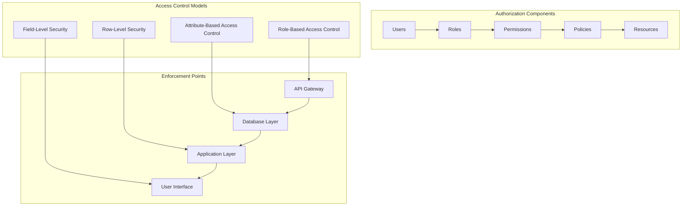

# Authorization and Access Control

## Purpose
This document defines the comprehensive authorization model for Pliers v3, including Role-Based Access Control (RBAC), permissions management, resource-level security, and field-level access controls. It provides implementation-ready specifications for all authorization components.

## Classification
- **Domain:** Security/Authorization
- **Stability:** Core
- **Abstraction:** Implementation
- **Confidence:** Established

## Content

### Authorization Architecture Overview

Pliers v3 implements a hierarchical Role-Based Access Control (RBAC) system with fine-grained permissions, resource-level security, and dynamic policy evaluation. The system supports multi-tenancy, field-level access controls, and context-aware authorization decisions.



### Core Authorization Model

#### User-Role-Permission Hierarchy

```typescript
interface AuthorizationModel {
  users: UserEntity[];
  roles: RoleEntity[];
  permissions: PermissionEntity[];
  policies: PolicyEntity[];
  tenants: TenantEntity[];
  resources: ResourceEntity[];
}

interface UserEntity {
  id: string;
  email: string;
  tenantId: string;

  // Role assignments
  roles: UserRoleAssignment[];
  directPermissions: UserPermissionAssignment[];

  // Constraints
  constraints: UserConstraint[];

  // Metadata
  createdAt: Date;
  updatedAt: Date;
  lastLogin: Date;
  isActive: boolean;
}

interface UserRoleAssignment {
  roleId: string;
  assignedAt: Date;
  assignedBy: string;
  expiresAt?: Date;

  // Context-specific assignments
  tenantId?: string;           // Role only applies to specific tenant
  resourceId?: string;         // Role only applies to specific resource
  conditions: AssignmentCondition[];
}

interface UserPermissionAssignment {
  permissionId: string;
  assignedAt: Date;
  assignedBy: string;
  expiresAt?: Date;

  // Override settings
  effect: 'allow' | 'deny';    // Direct permission or explicit denial
  priority: number;            // Higher numbers take precedence

  // Context
  resourceId?: string;
  conditions: AssignmentCondition[];
}

interface RoleEntity {
  id: string;
  name: string;
  description: string;

  // Hierarchy
  level: number;               // 0 = highest level (admin)
  parentRoles: string[];       // Roles this role inherits from
  childRoles: string[];        // Roles that inherit from this role

  // Permissions
  permissions: RolePermissionAssignment[];

  // Scope and constraints
  scope: RoleScope;
  constraints: RoleConstraint[];

  // Metadata
  isSystemRole: boolean;       // Cannot be deleted
  isPrivileged: boolean;       // Requires additional security
  tenantId?: string;           // Tenant-specific role

  // Lifecycle
  createdAt: Date;
  updatedAt: Date;
  isActive: boolean;
}

interface PermissionEntity {
  id: string;
  name: string;
  description: string;

  // Action definition
  action: PermissionAction;
  resource: string;
  resourceType: ResourceType;

  // Conditions
  conditions: PermissionCondition[];

  // Metadata
  category: PermissionCategory;
  isSystemPermission: boolean;
  requiredMFA: boolean;

  // Lifecycle
  createdAt: Date;
  isActive: boolean;
}

enum PermissionAction {
  // CRUD operations
  CREATE = 'create',
  READ = 'read',
  UPDATE = 'update',
  DELETE = 'delete',

  // Special operations
  EXECUTE = 'execute',
  APPROVE = 'approve',
  PUBLISH = 'publish',
  ARCHIVE = 'archive',

  // Administrative
  MANAGE = 'manage',
  CONFIGURE = 'configure',
  AUDIT = 'audit',

  // System operations
  SYSTEM_ADMIN = 'system_admin',
  TENANT_ADMIN = 'tenant_admin',
  USER_ADMIN = 'user_admin'
}

enum ResourceType {
  FORM = 'form',
  SUBMISSION = 'submission',
  WORKFLOW = 'workflow',
  PLUGIN = 'plugin',
  USER = 'user',
  ROLE = 'role',
  TENANT = 'tenant',
  REPORT = 'report',
  SYSTEM = 'system'
}

enum PermissionCategory {
  FORM_MANAGEMENT = 'form_management',
  DATA_ACCESS = 'data_access',
  USER_MANAGEMENT = 'user_management',
  SYSTEM_ADMINISTRATION = 'system_administration',
  REPORTING = 'reporting',
  INTEGRATION = 'integration'
}
```

#### Role Hierarchy and Inheritance

```typescript
interface RoleHierarchy {
  levels: RoleLevel[];
  inheritanceRules: InheritanceRule[];
  conflictResolution: ConflictResolutionStrategy;
}

interface RoleLevel {
  level: number;
  name: string;
  description: string;
  maxUsers?: number;           // Limit users at this level
  requiresApproval: boolean;   // Assignment requires approval
  requiredMFA: boolean;        // Always requires MFA
}

interface InheritanceRule {
  parentRole: string;
  childRole: string;
  inheritanceType: InheritanceType;
  conditions: InheritanceCondition[];
}

enum InheritanceType {
  FULL = 'full',               // Inherits all permissions
  PARTIAL = 'partial',         // Inherits specific permissions
  ADDITIVE = 'additive',       // Adds to existing permissions
  OVERRIDE = 'override'        // Can override parent permissions
}

// Predefined role hierarchy
const SYSTEM_ROLES = {
  SUPER_ADMIN: {
    id: 'super_admin',
    name: 'Super Administrator',
    level: 0,
    description: 'Full system access across all tenants',
    permissions: ['system_admin:*'],
    isSystemRole: true,
    isPrivileged: true,
  },

  TENANT_ADMIN: {
    id: 'tenant_admin',
    name: 'Tenant Administrator',
    level: 1,
    description: 'Full access within tenant',
    permissions: ['tenant_admin:*'],
    parentRoles: [],
    isSystemRole: true,
    isPrivileged: true,
  },

  FORM_ADMIN: {
    id: 'form_admin',
    name: 'Form Administrator',
    level: 2,
    description: 'Manage forms and workflows',
    permissions: [
      'create:form',
      'read:form',
      'update:form',
      'delete:form',
      'manage:workflow',
      'read:submission'
    ],
    parentRoles: [],
    isSystemRole: true,
  },

  FORM_EDITOR: {
    id: 'form_editor',
    name: 'Form Editor',
    level: 3,
    description: 'Create and edit forms',
    permissions: [
      'create:form',
      'read:form',
      'update:form',
      'read:submission'
    ],
    parentRoles: ['form_admin'],
    isSystemRole: true,
  },

  FORM_VIEWER: {
    id: 'form_viewer',
    name: 'Form Viewer',
    level: 4,
    description: 'View forms and submissions',
    permissions: [
      'read:form',
      'read:submission'
    ],
    parentRoles: ['form_editor'],
    isSystemRole: true,
  },

  END_USER: {
    id: 'end_user',
    name: 'End User',
    level: 5,
    description: 'Submit forms only',
    permissions: [
      'create:submission',
      'read:submission:own'
    ],
    parentRoles: [],
    isSystemRole: true,
  }
};
```

#### Policy-Based Access Control

```typescript
interface PolicyEngine {
  evaluator: PolicyEvaluator;
  cache: PolicyCache;
  rules: PolicyRuleEngine;
  context: PolicyContext;
}

interface PolicyEntity {
  id: string;
  name: string;
  description: string;

  // Policy definition
  rules: PolicyRule[];
  effect: PolicyEffect;
  priority: number;

  // Scope
  subjects: PolicySubject[];     // Who the policy applies to
  resources: PolicyResource[];   // What resources are affected
  actions: PolicyAction[];       // What actions are controlled

  // Conditions
  conditions: PolicyCondition[];
  timeConstraints: TimeConstraint[];

  // Metadata
  version: number;
  isActive: boolean;
  createdAt: Date;
  updatedAt: Date;
  createdBy: string;
}

interface PolicyRule {
  id: string;
  condition: string;             // CEL expression or similar
  effect: PolicyEffect;
  description: string;

  // Rule metadata
  category: PolicyCategory;
  severity: PolicySeverity;
  bypassable: boolean;
}

enum PolicyEffect {
  ALLOW = 'allow',
  DENY = 'deny',
  AUDIT = 'audit',               // Allow but log
  MFA_REQUIRED = 'mfa_required'  // Allow but require MFA
}

enum PolicyCategory {
  ACCESS_CONTROL = 'access_control',
  DATA_PROTECTION = 'data_protection',
  COMPLIANCE = 'compliance',
  SECURITY = 'security',
  OPERATIONAL = 'operational'
}

// Example policy definitions
const STANDARD_POLICIES = {
  TENANT_ISOLATION: {
    name: 'Tenant Data Isolation',
    rules: [
      {
        condition: 'user.tenantId == resource.tenantId',
        effect: PolicyEffect.ALLOW,
        description: 'Users can only access resources in their tenant'
      },
      {
        condition: 'user.tenantId != resource.tenantId && !user.hasRole("super_admin")',
        effect: PolicyEffect.DENY,
        description: 'Cross-tenant access denied except for super admins'
      }
    ]
  },

  SENSITIVE_DATA_ACCESS: {
    name: 'Sensitive Data Access Control',
    rules: [
      {
        condition: 'resource.classification == "sensitive" && !user.hasPermission("read:sensitive_data")',
        effect: PolicyEffect.DENY,
        description: 'Sensitive data requires special permission'
      },
      {
        condition: 'resource.classification == "restricted" && user.mfaVerified == false',
        effect: PolicyEffect.MFA_REQUIRED,
        description: 'Restricted data requires MFA verification'
      }
    ]
  },

  BUSINESS_HOURS_ACCESS: {
    name: 'Business Hours Access Control',
    rules: [
      {
        condition: 'time.hour < 6 || time.hour > 22',
        effect: PolicyEffect.AUDIT,
        description: 'Log after-hours access'
      },
      {
        condition: 'time.weekday in [6, 7] && user.hasRole("admin")',
        effect: PolicyEffect.MFA_REQUIRED,
        description: 'Weekend admin access requires MFA'
      }
    ]
  }
};

class PolicyEvaluator {
  async evaluateAccess(request: AccessRequest): Promise<AccessDecision> {
    const context = await this.buildPolicyContext(request);
    const applicablePolicies = await this.findApplicablePolicies(request);

    let finalDecision: AccessDecision = {
      effect: PolicyEffect.DENY,
      reason: 'No applicable policies found',
      appliedPolicies: [],
      requiredActions: []
    };

    // Evaluate policies in priority order
    for (const policy of applicablePolicies.sort((a, b) => b.priority - a.priority)) {
      const policyDecision = await this.evaluatePolicy(policy, context);

      if (policyDecision.effect === PolicyEffect.DENY) {
        // Explicit deny always wins
        return {
          effect: PolicyEffect.DENY,
          reason: `Denied by policy: ${policy.name}`,
          appliedPolicies: [policy.id],
          requiredActions: []
        };
      }

      if (policyDecision.effect === PolicyEffect.ALLOW) {
        finalDecision = {
          effect: PolicyEffect.ALLOW,
          reason: `Allowed by policy: ${policy.name}`,
          appliedPolicies: [...finalDecision.appliedPolicies, policy.id],
          requiredActions: [...finalDecision.requiredActions, ...policyDecision.requiredActions]
        };
      }

      if (policyDecision.effect === PolicyEffect.MFA_REQUIRED) {
        finalDecision.requiredActions.push({
          type: 'MFA_VERIFICATION',
          description: 'Multi-factor authentication required'
        });
      }
    }

    return finalDecision;
  }

  private async evaluatePolicy(policy: PolicyEntity, context: PolicyContext): Promise<PolicyDecision> {
    const ruleResults: RuleResult[] = [];

    for (const rule of policy.rules) {
      const result = await this.evaluateRule(rule, context);
      ruleResults.push(result);

      // If any rule denies, policy denies
      if (result.effect === PolicyEffect.DENY) {
        return {
          effect: PolicyEffect.DENY,
          matchedRules: [rule.id],
          requiredActions: []
        };
      }
    }

    // Determine overall policy effect
    const allowingRules = ruleResults.filter(r => r.effect === PolicyEffect.ALLOW);
    const mfaRequiredRules = ruleResults.filter(r => r.effect === PolicyEffect.MFA_REQUIRED);

    if (allowingRules.length > 0) {
      return {
        effect: mfaRequiredRules.length > 0 ? PolicyEffect.MFA_REQUIRED : PolicyEffect.ALLOW,
        matchedRules: [...allowingRules.map(r => r.ruleId), ...mfaRequiredRules.map(r => r.ruleId)],
        requiredActions: mfaRequiredRules.map(r => ({ type: 'MFA_VERIFICATION', description: r.description }))
      };
    }

    return {
      effect: PolicyEffect.DENY,
      matchedRules: [],
      requiredActions: []
    };
  }
}
```

### Resource-Level Security

#### Resource Access Control

```typescript
interface ResourceSecurity {
  id: string;
  resourceType: ResourceType;
  resourceId: string;

  // Access control
  ownerUserId: string;
  tenantId: string;
  visibility: ResourceVisibility;

  // Permissions
  accessRules: ResourceAccessRule[];
  fieldLevelSecurity: FieldAccessRule[];

  // Data classification
  classification: DataClassification;
  sensitiveFields: string[];

  // Audit and compliance
  auditRequired: boolean;
  retentionPolicy: RetentionPolicy;

  // Metadata
  createdAt: Date;
  updatedAt: Date;
  lastAccessedAt: Date;
}

enum ResourceVisibility {
  PRIVATE = 'private',         // Only owner and explicit grants
  TENANT = 'tenant',           // All tenant users can access
  PUBLIC = 'public',           // Anyone can access
  RESTRICTED = 'restricted'    // Special approval required
}

interface ResourceAccessRule {
  id: string;
  subjectType: 'user' | 'role' | 'group';
  subjectId: string;
  permissions: PermissionAction[];

  // Conditions
  conditions: AccessCondition[];
  timeConstraints: TimeConstraint[];

  // Metadata
  grantedBy: string;
  grantedAt: Date;
  expiresAt?: Date;
  reason?: string;
}

interface FieldAccessRule {
  fieldName: string;
  permission: FieldPermission;
  conditions: FieldCondition[];

  // Masking rules
  maskingRule?: MaskingRule;
  encryptionRequired: boolean;
}

enum FieldPermission {
  NONE = 'none',               // No access
  READ = 'read',               // Can read value
  WRITE = 'write',             // Can read and modify
  MASKED = 'masked',           // Can see masked version
  ENCRYPTED = 'encrypted'      // Only see encrypted form
}

interface MaskingRule {
  type: MaskingType;
  pattern?: string;            // Custom masking pattern
  preserveLength: boolean;
  preserveFormat: boolean;
}

enum MaskingType {
  FULL = 'full',               // Replace with ***
  PARTIAL = 'partial',         // Show first/last chars
  EMAIL = 'email',             // Mask email domains
  PHONE = 'phone',             // Mask phone numbers
  SSN = 'ssn',                 // Mask SSN format
  CUSTOM = 'custom'            // Custom pattern
}

class ResourceAccessManager {
  async checkResourceAccess(
    userId: string,
    resourceId: string,
    action: PermissionAction,
    context: AccessContext
  ): Promise<ResourceAccessResult> {

    // Get resource security configuration
    const resourceSecurity = await this.getResourceSecurity(resourceId);
    if (!resourceSecurity) {
      throw new AuthorizationError('Resource security configuration not found');
    }

    // Check tenant isolation
    const user = await this.userService.getUser(userId);
    if (resourceSecurity.tenantId !== user.tenantId && !user.hasRole('super_admin')) {
      return {
        allowed: false,
        reason: 'Cross-tenant access denied',
        fieldAccess: new Map()
      };
    }

    // Check ownership
    if (resourceSecurity.ownerUserId === userId) {
      return await this.getOwnerAccess(resourceSecurity, action);
    }

    // Check explicit access rules
    const explicitAccess = await this.checkExplicitAccess(userId, resourceSecurity, action);
    if (explicitAccess.found) {
      return explicitAccess.result;
    }

    // Check role-based access
    const roleAccess = await this.checkRoleBasedAccess(userId, resourceSecurity, action);
    if (roleAccess.allowed) {
      return roleAccess;
    }

    // Check visibility-based access
    return await this.checkVisibilityAccess(userId, resourceSecurity, action, context);
  }

  async getFieldLevelAccess(
    userId: string,
    resourceId: string,
    fieldNames: string[]
  ): Promise<Map<string, FieldAccessResult>> {

    const resourceSecurity = await this.getResourceSecurity(resourceId);
    const userPermissions = await this.getUserPermissions(userId);
    const fieldAccess = new Map<string, FieldAccessResult>();

    for (const fieldName of fieldNames) {
      const fieldRule = resourceSecurity.fieldLevelSecurity.find(
        rule => rule.fieldName === fieldName
      );

      if (!fieldRule) {
        // Default field access based on resource access
        fieldAccess.set(fieldName, {
          permission: FieldPermission.READ,
          maskingRule: null,
          encryptionRequired: false
        });
        continue;
      }

      // Evaluate field-specific conditions
      const conditionResults = await Promise.all(
        fieldRule.conditions.map(condition =>
          this.evaluateFieldCondition(condition, userId, resourceSecurity)
        )
      );

      if (conditionResults.every(result => result.satisfied)) {
        fieldAccess.set(fieldName, {
          permission: fieldRule.permission,
          maskingRule: fieldRule.maskingRule,
          encryptionRequired: fieldRule.encryptionRequired
        });
      } else {
        fieldAccess.set(fieldName, {
          permission: FieldPermission.NONE,
          maskingRule: null,
          encryptionRequired: false
        });
      }
    }

    return fieldAccess;
  }

  async applyFieldMasking(
    data: Record<string, any>,
    fieldAccess: Map<string, FieldAccessResult>
  ): Promise<Record<string, any>> {

    const maskedData = { ...data };

    for (const [fieldName, access] of fieldAccess.entries()) {
      if (!(fieldName in maskedData)) continue;

      switch (access.permission) {
        case FieldPermission.NONE:
          delete maskedData[fieldName];
          break;

        case FieldPermission.MASKED:
          if (access.maskingRule) {
            maskedData[fieldName] = this.applyMasking(
              maskedData[fieldName],
              access.maskingRule
            );
          }
          break;

        case FieldPermission.ENCRYPTED:
          if (access.encryptionRequired) {
            maskedData[fieldName] = '[ENCRYPTED]';
          }
          break;

        case FieldPermission.READ:
        case FieldPermission.WRITE:
          // No modification needed
          break;
      }
    }

    return maskedData;
  }

  private applyMasking(value: any, rule: MaskingRule): string {
    if (typeof value !== 'string') {
      value = String(value);
    }

    switch (rule.type) {
      case MaskingType.FULL:
        return '*'.repeat(rule.preserveLength ? value.length : 8);

      case MaskingType.PARTIAL:
        if (value.length <= 4) return '***';
        return value.substring(0, 2) + '*'.repeat(value.length - 4) + value.substring(value.length - 2);

      case MaskingType.EMAIL:
        const [local, domain] = value.split('@');
        if (!domain) return '***@***.com';
        return local.charAt(0) + '***@' + domain;

      case MaskingType.PHONE:
        return value.replace(/\d/g, '*').replace(/^\*{3}/, value.substring(0, 3));

      case MaskingType.SSN:
        return '***-**-' + value.substring(value.length - 4);

      case MaskingType.CUSTOM:
        if (rule.pattern) {
          return value.replace(new RegExp(rule.pattern, 'g'), '*');
        }
        return '***';

      default:
        return '***';
    }
  }
}
```

### Database Row-Level Security

#### PostgreSQL RLS Implementation

```sql
-- Enable RLS on all tables
ALTER TABLE users ENABLE ROW LEVEL SECURITY;
ALTER TABLE forms ENABLE ROW LEVEL SECURITY;
ALTER TABLE form_submissions ENABLE ROW LEVEL SECURITY;
ALTER TABLE workflows ENABLE ROW LEVEL SECURITY;
ALTER TABLE plugins ENABLE ROW LEVEL SECURITY;

-- Tenant isolation policies
CREATE POLICY tenant_isolation_users ON users
  FOR ALL
  TO authenticated_user
  USING (tenant_id = current_setting('app.current_tenant_id')::uuid OR
         current_setting('app.user_role') = 'super_admin');

CREATE POLICY tenant_isolation_forms ON forms
  FOR ALL
  TO authenticated_user
  USING (tenant_id = current_setting('app.current_tenant_id')::uuid OR
         current_setting('app.user_role') = 'super_admin');

CREATE POLICY tenant_isolation_submissions ON form_submissions
  FOR ALL
  TO authenticated_user
  USING (tenant_id = current_setting('app.current_tenant_id')::uuid OR
         current_setting('app.user_role') = 'super_admin');

-- Owner-based access policies
CREATE POLICY owner_access_forms ON forms
  FOR ALL
  TO authenticated_user
  USING (created_by = current_setting('app.current_user_id')::uuid OR
         current_setting('app.user_role') IN ('admin', 'form_admin'));

CREATE POLICY owner_access_submissions ON form_submissions
  FOR SELECT
  TO authenticated_user
  USING (submitted_by = current_setting('app.current_user_id')::uuid OR
         current_setting('app.user_role') IN ('admin', 'form_admin') OR
         EXISTS (
           SELECT 1 FROM form_permissions fp
           WHERE fp.form_id = form_submissions.form_id
           AND fp.user_id = current_setting('app.current_user_id')::uuid
           AND fp.permission_type = 'read_submissions'
         ));

-- Role-based policies
CREATE POLICY admin_full_access ON users
  FOR ALL
  TO authenticated_user
  USING (current_setting('app.user_role') IN ('super_admin', 'tenant_admin'));

CREATE POLICY form_editor_access ON forms
  FOR ALL
  TO authenticated_user
  USING (current_setting('app.user_role') IN ('super_admin', 'tenant_admin', 'form_admin', 'form_editor') OR
         created_by = current_setting('app.current_user_id')::uuid OR
         EXISTS (
           SELECT 1 FROM user_role_assignments ura
           JOIN roles r ON ura.role_id = r.id
           WHERE ura.user_id = current_setting('app.current_user_id')::uuid
           AND r.name IN ('form_editor', 'form_admin')
           AND (ura.resource_id IS NULL OR ura.resource_id = forms.id)
         ));

-- Time-based access policies
CREATE POLICY business_hours_access ON form_submissions
  FOR INSERT
  TO authenticated_user
  WITH CHECK (
    EXTRACT(hour FROM NOW()) BETWEEN 6 AND 22 OR
    current_setting('app.user_role') IN ('admin', 'form_admin') OR
    EXISTS (
      SELECT 1 FROM forms f
      WHERE f.id = form_submissions.form_id
      AND f.allow_after_hours_submission = true
    )
  );

-- Data classification policies
CREATE POLICY sensitive_data_access ON form_submissions
  FOR SELECT
  TO authenticated_user
  USING (
    -- Non-sensitive data accessible to all authorized users
    (SELECT classification FROM forms WHERE id = form_submissions.form_id) IN ('public', 'internal') OR
    -- Sensitive data requires special permission
    (
      (SELECT classification FROM forms WHERE id = form_submissions.form_id) = 'sensitive' AND
      EXISTS (
        SELECT 1 FROM user_permissions up
        WHERE up.user_id = current_setting('app.current_user_id')::uuid
        AND up.permission = 'read:sensitive_data'
        AND up.is_active = true
      )
    ) OR
    -- Restricted data requires admin role
    (
      (SELECT classification FROM forms WHERE id = form_submissions.form_id) = 'restricted' AND
      current_setting('app.user_role') IN ('super_admin', 'tenant_admin')
    )
  );
```

#### Dynamic RLS Context

```typescript
class RLSContextManager {
  async setSecurityContext(
    userId: string,
    sessionId: string,
    tenantId: string,
    roles: string[]
  ): Promise<void> {

    // Get database connection
    const connection = await this.database.getConnection();

    // Set security context variables
    await connection.query('SET app.current_user_id = $1', [userId]);
    await connection.query('SET app.current_session_id = $1', [sessionId]);
    await connection.query('SET app.current_tenant_id = $1', [tenantId]);
    await connection.query('SET app.user_roles = $1', [roles.join(',')]);

    // Set primary role (highest privilege)
    const primaryRole = this.determinePrimaryRole(roles);
    await connection.query('SET app.user_role = $1', [primaryRole]);

    // Set additional security context
    const securityContext = await this.buildSecurityContext(userId, sessionId);
    await connection.query('SET app.security_context = $1', [JSON.stringify(securityContext)]);

    // Log context change for audit
    await this.auditService.logSecurityEvent({
      type: 'RLS_CONTEXT_SET',
      userId,
      sessionId,
      tenantId,
      roles,
      timestamp: new Date()
    });
  }

  async clearSecurityContext(): Promise<void> {
    const connection = await this.database.getConnection();

    // Clear all security context variables
    await connection.query('RESET app.current_user_id');
    await connection.query('RESET app.current_session_id');
    await connection.query('RESET app.current_tenant_id');
    await connection.query('RESET app.user_roles');
    await connection.query('RESET app.user_role');
    await connection.query('RESET app.security_context');
  }

  private determinePrimaryRole(roles: string[]): string {
    // Role hierarchy (highest to lowest privilege)
    const roleHierarchy = [
      'super_admin',
      'tenant_admin',
      'form_admin',
      'form_editor',
      'form_viewer',
      'end_user'
    ];

    for (const role of roleHierarchy) {
      if (roles.includes(role)) {
        return role;
      }
    }

    return 'end_user'; // Default role
  }

  private async buildSecurityContext(userId: string, sessionId: string): Promise<SecurityContext> {
    const user = await this.userService.getUser(userId);
    const session = await this.sessionService.getSession(sessionId);

    return {
      mfaVerified: session.mfaVerified,
      lastPasswordChange: user.lastPasswordChange,
      accountLocked: user.isLocked,
      ipAddress: session.ipAddress,
      deviceTrusted: await this.deviceService.isDeviceTrusted(session.deviceId),
      riskScore: session.riskScore,
      businessHours: this.isBusinessHours(),
      maintenanceMode: await this.systemService.isMaintenanceMode()
    };
  }
}
```

### Permission Evaluation and Caching

#### Permission Cache Layer

```typescript
interface PermissionCache {
  storage: CacheStorage;
  ttl: CacheTTL;
  invalidation: CacheInvalidation;
  warming: CacheWarming;
}

interface CachedPermission {
  userId: string;
  resourceId: string;
  resourceType: ResourceType;
  action: PermissionAction;

  // Decision
  allowed: boolean;
  reason: string;
  appliedPolicies: string[];
  requiredActions: RequiredAction[];

  // Metadata
  computedAt: Date;
  expiresAt: Date;
  version: number;
  contextHash: string;        // Hash of relevant context data
}

class PermissionCacheService {
  private cache: RedisService;
  private defaultTTL = 300; // 5 minutes

  async getPermission(
    userId: string,
    resourceId: string,
    action: PermissionAction,
    context: AccessContext
  ): Promise<CachedPermission | null> {

    const cacheKey = this.buildCacheKey(userId, resourceId, action, context);
    const cached = await this.cache.get(cacheKey);

    if (!cached) {
      return null;
    }

    const permission: CachedPermission = JSON.parse(cached);

    // Check if cache entry is still valid
    if (permission.expiresAt < new Date()) {
      await this.cache.delete(cacheKey);
      return null;
    }

    // Verify context hasn't changed
    const currentContextHash = this.hashContext(context);
    if (permission.contextHash !== currentContextHash) {
      await this.cache.delete(cacheKey);
      return null;
    }

    return permission;
  }

  async setPermission(
    userId: string,
    resourceId: string,
    action: PermissionAction,
    context: AccessContext,
    decision: AccessDecision
  ): Promise<void> {

    const permission: CachedPermission = {
      userId,
      resourceId,
      resourceType: context.resourceType,
      action,
      allowed: decision.effect === PolicyEffect.ALLOW,
      reason: decision.reason,
      appliedPolicies: decision.appliedPolicies,
      requiredActions: decision.requiredActions,
      computedAt: new Date(),
      expiresAt: new Date(Date.now() + this.defaultTTL * 1000),
      version: 1,
      contextHash: this.hashContext(context)
    };

    const cacheKey = this.buildCacheKey(userId, resourceId, action, context);
    await this.cache.setex(
      cacheKey,
      this.defaultTTL,
      JSON.stringify(permission)
    );
  }

  async invalidateUserPermissions(userId: string): Promise<void> {
    const pattern = `perm:${userId}:*`;
    const keys = await this.cache.keys(pattern);

    if (keys.length > 0) {
      await this.cache.del(...keys);
    }

    // Log cache invalidation
    await this.auditService.logSecurityEvent({
      type: 'PERMISSION_CACHE_INVALIDATED',
      userId,
      keyCount: keys.length,
      timestamp: new Date()
    });
  }

  async invalidateResourcePermissions(resourceId: string): Promise<void> {
    const pattern = `perm:*:${resourceId}:*`;
    const keys = await this.cache.keys(pattern);

    if (keys.length > 0) {
      await this.cache.del(...keys);
    }
  }

  async warmCache(userId: string): Promise<void> {
    // Pre-compute common permissions for user
    const user = await this.userService.getUser(userId);
    const userResources = await this.resourceService.getUserResources(userId);

    const commonActions = [
      PermissionAction.READ,
      PermissionAction.UPDATE,
      PermissionAction.DELETE
    ];

    for (const resource of userResources) {
      for (const action of commonActions) {
        // This will compute and cache the permission
        await this.authorizationService.checkPermission(
          userId,
          resource.id,
          action,
          { resourceType: resource.type }
        );
      }
    }
  }

  private buildCacheKey(
    userId: string,
    resourceId: string,
    action: PermissionAction,
    context: AccessContext
  ): string {
    return `perm:${userId}:${resourceId}:${action}:${this.hashContext(context)}`;
  }

  private hashContext(context: AccessContext): string {
    // Create hash of relevant context data
    const contextData = {
      tenantId: context.tenantId,
      ipAddress: context.ipAddress,
      mfaVerified: context.mfaVerified,
      deviceTrusted: context.deviceTrusted,
      resourceType: context.resourceType,
      timestamp: Math.floor(Date.now() / 300000) // 5-minute buckets
    };

    return crypto
      .createHash('sha256')
      .update(JSON.stringify(contextData))
      .digest('hex')
      .substring(0, 16);
  }
}
```

### Authorization Middleware and Integration

#### API Authorization Middleware

```typescript
interface AuthorizationMiddleware {
  authenticate: AuthenticationMiddleware;
  authorize: (requiredPermission: RequiredPermission) => Middleware;
  resourceGuard: (resourceExtractor: ResourceExtractor) => Middleware;
  fieldLevelFilter: (fieldFilter: FieldFilter) => Middleware;
}

class HonoAuthorizationMiddleware {
  constructor(
    private authService: AuthenticationService,
    private authzService: AuthorizationService,
    private auditService: AuditService
  ) {}

  authenticate(): Middleware {
    return async (c, next) => {
      const authHeader = c.req.header('Authorization');
      if (!authHeader || !authHeader.startsWith('Bearer ')) {
        return c.json({ error: 'Authentication required' }, 401);
      }

      try {
        const token = authHeader.substring(7);
        const tokenPayload = await this.authService.validateAccessToken(token);

        // Set user context
        c.set('user', {
          id: tokenPayload.sub,
          email: tokenPayload.email,
          roles: tokenPayload.roles,
          permissions: tokenPayload.permissions,
          tenantId: tokenPayload.tenantId,
          sessionId: tokenPayload.sessionId,
          mfaVerified: tokenPayload.mfaVerified
        });

        // Update session activity
        await this.authService.updateSessionActivity(tokenPayload.sessionId);

        await next();
      } catch (error) {
        return c.json({ error: 'Invalid authentication token' }, 401);
      }
    };
  }

  authorize(requiredPermission: RequiredPermission): Middleware {
    return async (c, next) => {
      const user = c.get('user');
      if (!user) {
        return c.json({ error: 'Authentication required' }, 401);
      }

      try {
        // Build access context
        const context: AccessContext = {
          tenantId: user.tenantId,
          ipAddress: c.req.header('x-forwarded-for') || 'unknown',
          userAgent: c.req.header('user-agent') || 'unknown',
          mfaVerified: user.mfaVerified,
          deviceTrusted: false, // TODO: Implement device trust
          resourceType: requiredPermission.resourceType,
          sessionId: user.sessionId
        };

        // Check permission
        const decision = await this.authzService.checkPermission(
          user.id,
          requiredPermission.resourceId || '*',
          requiredPermission.action,
          context
        );

        if (!decision.allowed) {
          await this.auditService.logSecurityEvent({
            type: 'ACCESS_DENIED',
            userId: user.id,
            resourceId: requiredPermission.resourceId,
            action: requiredPermission.action,
            reason: decision.reason,
            timestamp: new Date()
          });

          return c.json({
            error: 'Insufficient permissions',
            reason: decision.reason
          }, 403);
        }

        // Handle required actions
        if (decision.requiredActions.length > 0) {
          const mfaRequired = decision.requiredActions.some(
            action => action.type === 'MFA_VERIFICATION'
          );

          if (mfaRequired && !user.mfaVerified) {
            return c.json({
              error: 'Multi-factor authentication required',
              requiredActions: decision.requiredActions
            }, 403);
          }
        }

        // Set authorization context for downstream middleware
        c.set('authorization', {
          decision,
          appliedPolicies: decision.appliedPolicies,
          requiredActions: decision.requiredActions
        });

        await next();
      } catch (error) {
        return c.json({ error: 'Authorization check failed' }, 500);
      }
    };
  }

  resourceGuard(resourceExtractor: ResourceExtractor): Middleware {
    return async (c, next) => {
      const user = c.get('user');
      const resourceId = resourceExtractor(c);

      if (!resourceId) {
        return c.json({ error: 'Resource identifier required' }, 400);
      }

      // Check resource access
      const hasAccess = await this.authzService.checkResourceAccess(
        user.id,
        resourceId,
        this.extractActionFromMethod(c.req.method),
        this.buildAccessContext(c, user)
      );

      if (!hasAccess.allowed) {
        return c.json({
          error: 'Resource access denied',
          reason: hasAccess.reason
        }, 403);
      }

      // Set field-level access for response filtering
      c.set('fieldAccess', hasAccess.fieldAccess);

      await next();
    };
  }

  fieldLevelFilter(fieldFilter: FieldFilter): Middleware {
    return async (c, next) => {
      await next();

      // Apply field-level filtering to response
      const fieldAccess = c.get('fieldAccess');
      if (fieldAccess && c.res.headers.get('content-type')?.includes('application/json')) {
        const body = await c.res.json();
        const filteredBody = await this.authzService.applyFieldMasking(body, fieldAccess);
        return c.json(filteredBody);
      }
    };
  }
}

// Usage example
const app = new Hono();

// Global authentication
app.use('*', authMiddleware.authenticate());

// Route-specific authorization
app.get('/forms/:id',
  authMiddleware.authorize({
    action: PermissionAction.READ,
    resourceType: ResourceType.FORM,
    resourceId: (c) => c.req.param('id')
  }),
  authMiddleware.resourceGuard((c) => c.req.param('id')),
  authMiddleware.fieldLevelFilter({}),
  async (c) => {
    // Route handler
  }
);
```

## Relationships
- **Parent Nodes:** [architecture.md] - implements authorization architecture
- **Child Nodes:** None
- **Related Nodes:**
  - [authentication.md] - follows - Authentication establishes identity for authorization
  - [compliance.md] - supports - Authorization supports compliance requirements
  - [threats.md] - mitigates - Authorization prevents unauthorized access threats

## Navigation Guidance
- **Access Context:** Use when implementing authorization features or reviewing access control requirements
- **Common Next Steps:** Review threat model or compliance requirements
- **Related Tasks:** IMPL-003 (Authentication System implementation), database RLS setup
- **Update Patterns:** Update when authorization requirements change or new access patterns are needed

## Metadata
- **Created:** 2025-01-22
- **Last Updated:** 2025-01-22
- **Updated By:** Claude/DOC-005 Implementation

## Change History
- 2025-01-22: Initial creation of authorization and access control documentation (DOC-005)