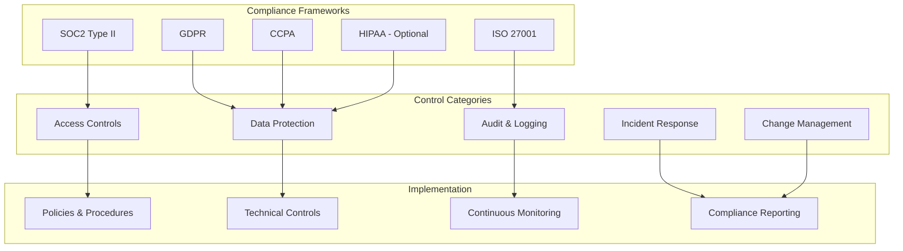

# Compliance and Audit Requirements

## Purpose
This document defines comprehensive compliance requirements for Pliers v3, including SOC2 Type II, GDPR, and other regulatory frameworks. It provides implementation guidance for audit trails, data protection compliance, and continuous compliance monitoring.

## Classification
- **Domain:** Security/Compliance
- **Stability:** Core
- **Abstraction:** Implementation
- **Confidence:** Established

## Content

### Compliance Framework Overview

Pliers v3 is designed to meet multiple compliance frameworks while maintaining operational efficiency and user experience. The platform implements a compliance-by-design approach with automated controls and continuous monitoring.



### SOC2 Type II Compliance

#### Trust Service Categories

```typescript
interface SOC2Compliance {
  security: SecurityControls;
  availability: AvailabilityControls;
  confidentiality: ConfidentialityControls;
  processingIntegrity: ProcessingIntegrityControls;
  privacy: PrivacyControls;
}

interface SecurityControls {
  // Common Criteria 1.0 - Control Environment
  controlEnvironment: {
    organizationStructure: 'Defined security roles and responsibilities';
    managementOversight: 'Executive security oversight and commitment';
    competency: 'Security competency requirements for personnel';
    accountability: 'Individual accountability for security objectives';
  };

  // Common Criteria 2.0 - Communication and Information
  communication: {
    securityObjectives: 'Communicated security objectives and policies';
    internalComm: 'Internal security communication processes';
    externalComm: 'External security communication protocols';
    informationSystems: 'Information systems supporting security objectives';
  };

  // Common Criteria 3.0 - Risk Assessment
  riskAssessment: {
    identification: 'Security risk identification processes';
    analysis: 'Security risk analysis and evaluation';
    response: 'Security risk response and mitigation';
    changeAssessment: 'Risk assessment for significant changes';
  };

  // Common Criteria 4.0 - Monitoring Activities
  monitoring: {
    ongoingMonitoring: 'Ongoing security monitoring activities';
    evaluation: 'Security control evaluation processes';
    deficiencyReporting: 'Security deficiency reporting and remediation';
    communication: 'Security monitoring communication';
  };

  // Common Criteria 5.0 - Control Activities
  controlActivities: {
    policies: 'Security policies and procedures';
    implementation: 'Security control implementation';
    technology: 'Technology security controls';
    segregationOfDuties: 'Segregation of duties in security processes';
  };

  // Common Criteria 6.0 - Logical and Physical Access Controls
  accessControls: {
    logicalAccess: LogicalAccessControls;
    physicalAccess: PhysicalAccessControls;
  };

  // Common Criteria 7.0 - System Operations
  systemOperations: {
    jobProcessing: 'System job processing controls';
    backupRecovery: 'Backup and recovery procedures';
    systemMonitoring: 'System monitoring and alerting';
    changeManagement: 'System change management processes';
  };

  // Common Criteria 8.0 - Change Management
  changeManagement: {
    authorizationProcess: 'Change authorization processes';
    systemChanges: 'System change procedures';
    infrastructure: 'Infrastructure change management';
    software: 'Software change management';
    emergencyChanges: 'Emergency change procedures';
  };

  // Common Criteria 9.0 - Risk Mitigation
  riskMitigation: {
    identification: 'Risk mitigation identification';
    implementation: 'Risk mitigation implementation';
    monitoring: 'Risk mitigation monitoring';
    vendorManagement: 'Vendor risk management';
  };
}

interface LogicalAccessControls {
  userManagement: {
    provisioning: 'User account provisioning procedures';
    modification: 'User account modification procedures';
    deprovisioning: 'User account deprovisioning procedures';
    review: 'Periodic user access reviews';
  };

  authentication: {
    requirements: 'Authentication requirements and standards';
    mechanisms: 'Multi-factor authentication implementation';
    passwordPolicy: 'Password policy and management';
    sessionManagement: 'Session management controls';
  };

  authorization: {
    accessModel: 'Role-based access control model';
    privilegedAccess: 'Privileged access management';
    segregationOfDuties: 'Segregation of duties implementation';
    accessReview: 'Regular access rights reviews';
  };

  systemAccess: {
    networkAccess: 'Network access controls';
    applicationAccess: 'Application access controls';
    databaseAccess: 'Database access controls';
    remoteAccess: 'Remote access security';
  };
}

interface PhysicalAccessControls {
  facilityAccess: {
    accessControl: 'Physical facility access controls';
    monitoring: 'Physical access monitoring and logging';
    visitorManagement: 'Visitor access management';
    keyManagement: 'Physical key management';
  };

  environmentalProtection: {
    fireProtection: 'Fire protection systems';
    climateControl: 'Environmental climate controls';
    powerProtection: 'Electrical power protection';
    waterProtection: 'Water damage protection';
  };

  equipmentSecurity: {
    secureAreas: 'Secure equipment areas';
    equipmentMaintenance: 'Equipment maintenance procedures';
    disposal: 'Secure equipment disposal';
    offSiteBackup: 'Off-site backup storage security';
  };
}
```

#### SOC2 Control Implementation

```typescript
class SOC2ComplianceManager {
  async implementSecurityControls(): Promise<SecurityControlsResult> {
    const controls: SecurityControlsImplementation = {
      // CC1.1 - Management establishes structures, reporting lines, and authorities
      organizationalStructure: {
        implementation: 'Defined CISO role and security team structure',
        evidence: [
          'Organizational chart with security roles',
          'Job descriptions for security positions',
          'Security team charter and responsibilities'
        ],
        testing: 'Annual review of organizational structure',
        frequency: 'Annually'
      },

      // CC2.1 - Management communicates information internally
      securityCommunication: {
        implementation: 'Security policies communicated to all employees',
        evidence: [
          'Security policy documentation',
          'Employee acknowledgment records',
          'Security training records'
        ],
        testing: 'Review communication effectiveness',
        frequency: 'Quarterly'
      },

      // CC3.1 - Entity specifies suitable objectives
      securityObjectives: {
        implementation: 'Documented security objectives aligned with business goals',
        evidence: [
          'Security objectives documentation',
          'Board/management approval records',
          'Quarterly security reporting'
        ],
        testing: 'Review objective achievement',
        frequency: 'Quarterly'
      },

      // CC4.1 - Entity monitors the system
      securityMonitoring: {
        implementation: 'Continuous security monitoring with SIEM',
        evidence: [
          'SIEM configuration and rules',
          'Security monitoring reports',
          'Incident detection records'
        ],
        testing: 'Test monitoring effectiveness',
        frequency: 'Monthly'
      },

      // CC5.1 - Entity establishes control activities
      controlActivities: {
        implementation: 'Comprehensive security controls implemented',
        evidence: [
          'Control procedure documentation',
          'Control testing results',
          'Control effectiveness reviews'
        ],
        testing: 'Control design and operating effectiveness',
        frequency: 'Quarterly'
      },

      // CC6.1 - Logical access controls
      logicalAccessControls: {
        implementation: 'RBAC with automated provisioning/deprovisioning',
        evidence: [
          'Access control matrices',
          'User access reviews',
          'Automated provisioning logs'
        ],
        testing: 'Access review and testing',
        frequency: 'Quarterly'
      },

      // CC7.1 - System operations
      systemOperations: {
        implementation: 'Standardized operational procedures',
        evidence: [
          'Operational runbooks',
          'Change management records',
          'Incident response logs'
        ],
        testing: 'Operational procedure compliance',
        frequency: 'Monthly'
      },

      // CC8.1 - Change management
      changeManagement: {
        implementation: 'Formal change management process',
        evidence: [
          'Change request documentation',
          'Change approval records',
          'Change testing results'
        ],
        testing: 'Change process compliance',
        frequency: 'Monthly'
      },

      // CC9.1 - Risk mitigation
      riskMitigation: {
        implementation: 'Risk-based security program',
        evidence: [
          'Risk assessment reports',
          'Risk mitigation plans',
          'Risk monitoring reports'
        ],
        testing: 'Risk mitigation effectiveness',
        frequency: 'Quarterly'
      }
    };

    return {
      controlsImplemented: Object.keys(controls).length,
      controlsStatus: controls,
      complianceScore: await this.calculateComplianceScore(controls),
      lastAssessment: new Date(),
      nextAssessment: this.calculateNextAssessment()
    };
  }

  async generateSOC2Report(): Promise<SOC2Report> {
    const reportPeriod = {
      startDate: new Date(Date.now() - 365 * 24 * 60 * 60 * 1000), // 1 year ago
      endDate: new Date()
    };

    const controlTesting = await this.performControlTesting(reportPeriod);
    const exceptions = await this.identifyExceptions(controlTesting);
    const managementResponse = await this.getManagementResponse(exceptions);

    return {
      reportType: 'SOC2 Type II',
      reportPeriod,
      serviceOrganization: {
        name: 'Pliers Platform',
        description: 'Cloud-based forms and workflow management platform',
        boundaries: 'Core API, AI Service, Frontend Application'
      },
      trustServiceCategories: ['Security', 'Availability', 'Confidentiality'],
      controlObjectives: await this.getControlObjectives(),
      controlTesting,
      exceptions,
      managementResponse,
      auditOpinion: await this.getAuditOpinion(exceptions)
    };
  }
}
```

### GDPR Compliance

#### Data Protection Implementation

```typescript
interface GDPRCompliance {
  legalBasis: LegalBasisFramework;
  dataSubjectRights: DataSubjectRights;
  dataProcessing: DataProcessingPrinciples;
  dataProtection: DataProtectionMeasures;
  governance: DataGovernance;
}

interface LegalBasisFramework {
  consent: {
    implementation: 'Granular consent management with clear opt-in';
    requirements: [
      'Freely given consent without coercion',
      'Specific consent for each processing purpose',
      'Informed consent with clear information',
      'Unambiguous consent indication',
      'Withdrawable consent at any time'
    ];
    evidence: [
      'Consent records with timestamps',
      'Consent withdrawal logs',
      'Privacy policy acceptance records'
    ];
  };

  contractualNecessity: {
    implementation: 'Processing necessary for contract performance';
    requirements: [
      'Processing directly related to contract',
      'Necessary for contract execution',
      'Proportionate to contract purpose'
    ];
    evidence: [
      'Contract documentation',
      'Processing purpose documentation',
      'Necessity assessments'
    ];
  };

  legitimateInterest: {
    implementation: 'Legitimate interest assessment and balancing';
    requirements: [
      'Legitimate interest identification',
      'Necessity assessment',
      'Balancing test with data subject rights',
      'Less intrusive alternatives considered'
    ];
    evidence: [
      'Legitimate interest assessments',
      'Balancing test documentation',
      'Alternative analysis records'
    ];
  };
}

interface DataSubjectRights {
  rightToInformation: {
    implementation: 'Transparent privacy notices and data collection information';
    requirements: [
      'Identity of controller and contact details',
      'Purposes and legal basis for processing',
      'Categories of personal data',
      'Recipients of personal data',
      'Retention periods',
      'Data subject rights information'
    ];
    fulfillment: 'Privacy policy and collection notices';
  };

  rightOfAccess: {
    implementation: 'Automated data access portal for data subjects';
    requirements: [
      'Confirmation of processing',
      'Copy of personal data',
      'Processing information',
      'Response within one month'
    ];
    fulfillment: 'Self-service data export functionality';
  };

  rightToRectification: {
    implementation: 'Data correction mechanisms';
    requirements: [
      'Correction of inaccurate data',
      'Completion of incomplete data',
      'Response within one month',
      'Notification to recipients'
    ];
    fulfillment: 'User profile management and admin correction tools';
  };

  rightToErasure: {
    implementation: 'Right to be forgotten implementation';
    requirements: [
      'Erasure when no longer necessary',
      'Erasure when consent withdrawn',
      'Erasure for unlawful processing',
      'Response within one month'
    ];
    fulfillment: 'Automated data deletion with cascade rules';
  };

  rightToRestriction: {
    implementation: 'Processing restriction mechanisms';
    requirements: [
      'Restriction when accuracy contested',
      'Restriction for unlawful processing',
      'Restriction when no longer needed',
      'Response within one month'
    ];
    fulfillment: 'Data flagging and processing controls';
  };

  rightToPortability: {
    implementation: 'Structured data export capability';
    requirements: [
      'Machine-readable format',
      'Commonly used format',
      'Direct transmission when possible',
      'Response within one month'
    ];
    fulfillment: 'JSON/CSV export with standardized schemas';
  };

  rightToObject: {
    implementation: 'Objection handling processes';
    requirements: [
      'Object to legitimate interest processing',
      'Object to direct marketing',
      'Object to automated decision-making',
      'Response within one month'
    ];
    fulfillment: 'Objection forms and automated processing controls';
  };
}

class GDPRComplianceManager {
  async implementDataSubjectRights(): Promise<DataSubjectRightsImplementation> {
    return {
      accessImplementation: await this.implementDataAccess(),
      rectificationImplementation: await this.implementDataRectification(),
      erasureImplementation: await this.implementDataErasure(),
      restrictionImplementation: await this.implementProcessingRestriction(),
      portabilityImplementation: await this.implementDataPortability(),
      objectionImplementation: await this.implementObjectionHandling()
    };
  }

  private async implementDataAccess(): Promise<DataAccessImplementation> {
    return {
      userPortal: {
        endpoint: '/api/data-subject/access',
        authentication: 'Multi-factor authentication required',
        format: 'JSON with human-readable summary',
        inclusions: [
          'All personal data across all systems',
          'Processing purposes and legal basis',
          'Data recipients and transfers',
          'Retention periods',
          'Automated decision-making information'
        ],
        excludions: [
          'Data about other individuals',
          'Commercially sensitive information',
          'Legal privilege information'
        ]
      },

      automatedProcessing: {
        dataAggregation: 'Automated collection from all data stores',
        formatConversion: 'Standardized JSON schema with metadata',
        anonymization: 'Remove data about other individuals',
        verification: 'Data integrity verification before delivery'
      },

      deliveryMethods: [
        'Secure download link with expiration',
        'Encrypted email delivery',
        'In-application secure viewing',
        'API endpoint for automated retrieval'
      ],

      responseTime: {
        standard: '30 days maximum',
        complex: '90 days with explanation',
        urgent: '72 hours for security incidents'
      }
    };
  }

  private async implementDataErasure(): Promise<DataErasureImplementation> {
    return {
      erasureScope: {
        personalData: 'All identifiable personal data',
        derivedData: 'Analytics and derived insights',
        backups: 'All backup copies and archives',
        logs: 'Personal data in system logs',
        cache: 'Cached personal data'
      },

      erasureExceptions: {
        legalObligation: 'Data required for legal compliance',
        publicInterest: 'Data for public health or safety',
        establishmentOfClaims: 'Data for legal claims',
        freedomOfExpression: 'Data for freedom of expression'
      },

      erasureProcess: {
        verification: 'Identity verification before erasure',
        impactAssessment: 'Assess impact on other data subjects',
        cascadeDeletion: 'Automated cascade deletion across systems',
        confirmation: 'Erasure confirmation to data subject',
        logging: 'Immutable log of erasure actions'
      },

      technicalImplementation: {
        hardDeletion: 'Secure deletion with overwriting',
        cryptographicErasure: 'Key deletion for encrypted data',
        anonymization: 'Irreversible anonymization where applicable',
        markedDeletion: 'Marking for deletion with processing restriction'
      }
    };
  }

  async conductDataProtectionImpactAssessment(
    processingActivity: ProcessingActivity
  ): Promise<DPIAResult> {

    const riskAssessment = await this.assessPrivacyRisks(processingActivity);
    const mitigationMeasures = await this.identifyMitigationMeasures(riskAssessment);
    const residualRisk = await this.calculateResidualRisk(riskAssessment, mitigationMeasures);

    return {
      processingActivity,
      riskAssessment,
      mitigationMeasures,
      residualRisk,
      consultation: residualRisk.level === 'high' ? await this.consultDPA() : null,
      recommendation: this.generateDPIARecommendation(residualRisk),
      reviewDate: this.calculateReviewDate(processingActivity),
      approval: await this.getDPOApproval()
    };
  }
}
```

### Audit Trail Implementation

#### Comprehensive Audit Logging

```typescript
interface AuditFramework {
  auditLog: AuditLogSpecification;
  retention: RetentionPolicies;
  integrity: IntegrityProtection;
  access: AuditAccess;
  reporting: AuditReporting;
}

interface AuditLogSpecification {
  events: AuditableEvents;
  format: AuditLogFormat;
  storage: AuditStorage;
  processing: AuditProcessing;
}

interface AuditableEvents {
  authentication: [
    'login_attempt',
    'login_success',
    'login_failure',
    'logout',
    'session_timeout',
    'password_change',
    'mfa_enrollment',
    'mfa_challenge',
    'account_lockout',
    'password_reset'
  ];

  authorization: [
    'permission_grant',
    'permission_deny',
    'role_assignment',
    'role_removal',
    'privilege_escalation_attempt',
    'access_violation',
    'policy_evaluation'
  ];

  dataAccess: [
    'data_read',
    'data_create',
    'data_update',
    'data_delete',
    'data_export',
    'data_import',
    'bulk_operation',
    'search_query'
  ];

  system: [
    'configuration_change',
    'system_startup',
    'system_shutdown',
    'service_start',
    'service_stop',
    'backup_start',
    'backup_complete',
    'restore_operation'
  ];

  security: [
    'security_event',
    'vulnerability_detected',
    'intrusion_attempt',
    'malware_detected',
    'security_scan',
    'incident_created',
    'incident_resolved'
  ];

  compliance: [
    'data_subject_request',
    'consent_given',
    'consent_withdrawn',
    'data_breach_detected',
    'retention_policy_applied',
    'anonymization_performed'
  ];
}

interface AuditLogFormat {
  structure: 'Structured JSON with standardized fields';
  fields: AuditLogFields;
  encryption: 'Field-level encryption for sensitive data';
  signing: 'Digital signatures for integrity verification';
}

interface AuditLogFields {
  // Standard fields (always present)
  eventId: string;           // Unique event identifier
  timestamp: string;         // ISO 8601 timestamp with timezone
  eventType: string;         // Type of event (from AuditableEvents)
  severity: string;          // Event severity (low, medium, high, critical)
  source: string;            // System component generating event

  // Actor information
  userId?: string;           // User performing action
  sessionId?: string;        // Session identifier
  ipAddress: string;         // Source IP address
  userAgent?: string;        // User agent string
  deviceId?: string;         // Device identifier

  // Target information
  resourceType?: string;     // Type of resource affected
  resourceId?: string;       // Identifier of resource affected
  tenantId?: string;         // Tenant context

  // Event details
  action: string;            // Specific action performed
  outcome: string;           // Success, failure, or error
  details: Record<string, any>; // Event-specific details

  // Security context
  authMethod?: string;       // Authentication method used
  mfaVerified?: boolean;     // MFA verification status
  riskScore?: number;        // Risk assessment score

  // Compliance context
  legalBasis?: string;       // GDPR legal basis
  dataCategories?: string[]; // Categories of data involved
  processingPurpose?: string; // Purpose of processing

  // Technical context
  correlationId?: string;    // Request correlation ID
  traceId?: string;          // Distributed tracing ID
  applicationVersion?: string; // Application version
}

class AuditLogger {
  private logStorage: AuditStorage;
  private encryptionService: EncryptionService;
  private signingService: DigitalSigningService;

  async logEvent(event: AuditEvent): Promise<void> {
    // Validate event structure
    const validatedEvent = await this.validateEvent(event);

    // Enrich with system context
    const enrichedEvent = await this.enrichEvent(validatedEvent);

    // Encrypt sensitive fields
    const encryptedEvent = await this.encryptSensitiveFields(enrichedEvent);

    // Sign for integrity
    const signedEvent = await this.signEvent(encryptedEvent);

    // Store immutably
    await this.storeEvent(signedEvent);

    // Real-time processing
    await this.processRealTime(signedEvent);
  }

  private async enrichEvent(event: AuditEvent): Promise<EnrichedAuditEvent> {
    return {
      ...event,
      eventId: generateUUID(),
      timestamp: new Date().toISOString(),
      source: process.env.SERVICE_NAME || 'pliers-api',
      applicationVersion: process.env.APPLICATION_VERSION,
      serverHostname: process.env.HOSTNAME,
      processId: process.pid,

      // Geo-location enrichment
      geoLocation: event.ipAddress ? await this.getGeoLocation(event.ipAddress) : null,

      // Threat intelligence enrichment
      threatIntel: event.ipAddress ? await this.getThreatIntelligence(event.ipAddress) : null,

      // User context enrichment
      userContext: event.userId ? await this.getUserContext(event.userId) : null
    };
  }

  private async encryptSensitiveFields(event: EnrichedAuditEvent): Promise<EncryptedAuditEvent> {
    const sensitiveFields = ['personalData', 'credentials', 'tokens', 'privateKeys'];
    const encryptedEvent = { ...event };

    for (const field of sensitiveFields) {
      if (field in encryptedEvent && encryptedEvent[field]) {
        encryptedEvent[field] = await this.encryptionService.encrypt(
          JSON.stringify(encryptedEvent[field]),
          'audit-log-encryption-key'
        );
      }
    }

    return encryptedEvent;
  }

  private async signEvent(event: EncryptedAuditEvent): Promise<SignedAuditEvent> {
    const eventHash = this.calculateEventHash(event);
    const signature = await this.signingService.sign(eventHash);

    return {
      ...event,
      integrity: {
        hash: eventHash,
        signature,
        signingTime: new Date().toISOString(),
        signingKeyId: this.signingService.getCurrentKeyId()
      }
    };
  }

  async verifyEventIntegrity(eventId: string): Promise<IntegrityVerificationResult> {
    const event = await this.retrieveEvent(eventId);
    if (!event || !event.integrity) {
      return { valid: false, reason: 'Event not found or no integrity data' };
    }

    // Recalculate hash
    const { integrity, ...eventWithoutIntegrity } = event;
    const calculatedHash = this.calculateEventHash(eventWithoutIntegrity);

    if (calculatedHash !== integrity.hash) {
      return { valid: false, reason: 'Hash mismatch - event may be tampered' };
    }

    // Verify signature
    const signatureValid = await this.signingService.verify(
      integrity.hash,
      integrity.signature,
      integrity.signingKeyId
    );

    if (!signatureValid) {
      return { valid: false, reason: 'Digital signature verification failed' };
    }

    return {
      valid: true,
      verifiedAt: new Date(),
      signingTime: new Date(integrity.signingTime),
      keyId: integrity.signingKeyId
    };
  }
}
```

### Continuous Compliance Monitoring

#### Automated Compliance Validation

```typescript
interface ComplianceMonitoring {
  controls: ComplianceControls;
  monitoring: ContinuousMonitoring;
  reporting: ComplianceReporting;
  remediation: AutomatedRemediation;
}

class ComplianceMonitor {
  async runComplianceChecks(): Promise<ComplianceCheckResults> {
    const checks = await Promise.all([
      this.checkAccessControls(),
      this.checkDataProtection(),
      this.checkAuditLogging(),
      this.checkIncidentResponse(),
      this.checkChangeManagement(),
      this.checkVendorManagement(),
      this.checkDataRetention(),
      this.checkPrivacyControls()
    ]);

    const overallScore = this.calculateComplianceScore(checks);
    const criticalIssues = checks.filter(check =>
      check.issues.some(issue => issue.severity === 'critical')
    );

    if (criticalIssues.length > 0) {
      await this.triggerCriticalIncident(criticalIssues);
    }

    return {
      timestamp: new Date(),
      overallScore,
      frameworkScores: {
        soc2: this.calculateSOC2Score(checks),
        gdpr: this.calculateGDPRScore(checks),
        iso27001: this.calculateISO27001Score(checks)
      },
      checks,
      criticalIssues,
      recommendations: await this.generateRecommendations(checks)
    };
  }

  private async checkAccessControls(): Promise<ComplianceCheck> {
    const issues: ComplianceIssue[] = [];

    // Check user access reviews
    const lastAccessReview = await this.getLastAccessReview();
    if (!lastAccessReview || this.daysSince(lastAccessReview) > 90) {
      issues.push({
        id: 'AC-001',
        severity: 'high',
        description: 'User access review overdue (90+ days)',
        requirement: 'SOC2 CC6.1 - Access reviews every 90 days',
        remediation: 'Conduct immediate user access review'
      });
    }

    // Check privileged access
    const privilegedUsers = await this.getPrivilegedUsers();
    for (const user of privilegedUsers) {
      if (!user.mfaEnabled) {
        issues.push({
          id: 'AC-002',
          severity: 'critical',
          description: `Privileged user ${user.email} missing MFA`,
          requirement: 'SOC2 CC6.1 - MFA for privileged access',
          remediation: 'Enable MFA for privileged user'
        });
      }
    }

    // Check dormant accounts
    const dormantAccounts = await this.getDormantAccounts(90); // 90 days
    if (dormantAccounts.length > 0) {
      issues.push({
        id: 'AC-003',
        severity: 'medium',
        description: `${dormantAccounts.length} dormant accounts detected`,
        requirement: 'SOC2 CC6.1 - Inactive account management',
        remediation: 'Disable or remove dormant accounts'
      });
    }

    return {
      category: 'Access Controls',
      status: issues.length === 0 ? 'compliant' : 'non-compliant',
      score: this.calculateCheckScore(issues),
      issues,
      lastChecked: new Date()
    };
  }

  private async checkDataProtection(): Promise<ComplianceCheck> {
    const issues: ComplianceIssue[] = [];

    // Check encryption compliance
    const unencryptedData = await this.findUnencryptedSensitiveData();
    if (unencryptedData.length > 0) {
      issues.push({
        id: 'DP-001',
        severity: 'critical',
        description: `${unencryptedData.length} sensitive data fields not encrypted`,
        requirement: 'GDPR Article 32 - Encryption of personal data',
        remediation: 'Encrypt all sensitive data fields'
      });
    }

    // Check data retention compliance
    const expiredData = await this.findExpiredRetentionData();
    if (expiredData.length > 0) {
      issues.push({
        id: 'DP-002',
        severity: 'high',
        description: `${expiredData.length} records exceed retention period`,
        requirement: 'GDPR Article 5(e) - Data minimization and retention',
        remediation: 'Delete or anonymize expired data'
      });
    }

    // Check consent records
    const missingConsent = await this.findMissingConsentRecords();
    if (missingConsent.length > 0) {
      issues.push({
        id: 'DP-003',
        severity: 'high',
        description: `${missingConsent.length} data subjects missing consent records`,
        requirement: 'GDPR Article 6 - Lawful basis for processing',
        remediation: 'Obtain valid consent or establish alternative legal basis'
      });
    }

    return {
      category: 'Data Protection',
      status: issues.length === 0 ? 'compliant' : 'non-compliant',
      score: this.calculateCheckScore(issues),
      issues,
      lastChecked: new Date()
    };
  }

  async generateComplianceReport(framework: ComplianceFramework): Promise<ComplianceReport> {
    const checkResults = await this.runComplianceChecks();
    const controlResults = await this.assessControls(framework);
    const riskAssessment = await this.performRiskAssessment();

    return {
      framework,
      reportPeriod: {
        startDate: new Date(Date.now() - 90 * 24 * 60 * 60 * 1000), // 90 days
        endDate: new Date()
      },
      executiveSummary: await this.generateExecutiveSummary(checkResults, controlResults),
      complianceScore: checkResults.overallScore,
      controlAssessment: controlResults,
      riskAssessment,
      findings: this.consolidateFindings(checkResults.checks),
      remediation: await this.generateRemediationPlan(checkResults.checks),
      recommendations: await this.generateStrategicRecommendations(checkResults, riskAssessment),
      nextSteps: await this.defineNextSteps(checkResults),
      appendices: {
        detailedFindings: checkResults.checks,
        evidencePackage: await this.generateEvidencePackage(),
        controlTesting: await this.getControlTestingResults(),
        managementResponse: await this.getManagementResponse()
      }
    };
  }
}
```

### Data Classification and Handling

#### Data Classification Framework

```typescript
interface DataClassificationFramework {
  classificationLevels: DataClassificationLevel[];
  handlingRequirements: DataHandlingRequirements;
  automatedClassification: AutomatedClassification;
  lifecycle: DataLifecycleManagement;
}

interface DataClassificationLevel {
  level: 'public' | 'internal' | 'confidential' | 'restricted';
  description: string;
  examples: string[];
  protectionRequirements: ProtectionRequirement[];
  handlingInstructions: HandlingInstruction[];
  retentionPeriod: RetentionPeriod;
  accessControls: AccessControlRequirement[];
}

const DATA_CLASSIFICATION_LEVELS = {
  public: {
    level: 'public',
    description: 'Information intended for public consumption',
    examples: [
      'Marketing materials',
      'Published documentation',
      'Public website content'
    ],
    protectionRequirements: [
      'Standard backup procedures',
      'Version control'
    ],
    handlingInstructions: [
      'No special handling required',
      'Can be freely shared'
    ],
    retentionPeriod: { duration: 'indefinite', basis: 'business_need' },
    accessControls: ['none_required']
  },

  internal: {
    level: 'internal',
    description: 'Information for internal use within organization',
    examples: [
      'Internal procedures',
      'Employee directories',
      'General business communications'
    ],
    protectionRequirements: [
      'Access control implementation',
      'Encrypted storage',
      'Secure transmission'
    ],
    handlingInstructions: [
      'Restrict access to authorized personnel',
      'Use secure communication channels'
    ],
    retentionPeriod: { duration: '7_years', basis: 'legal_requirement' },
    accessControls: ['authentication_required', 'tenant_isolation']
  },

  confidential: {
    level: 'confidential',
    description: 'Sensitive information requiring protection',
    examples: [
      'Personal identifiable information',
      'Financial data',
      'Business strategies',
      'Customer data'
    ],
    protectionRequirements: [
      'Strong access controls',
      'Encryption at rest and in transit',
      'Audit logging',
      'Data loss prevention'
    ],
    handlingInstructions: [
      'Need-to-know basis only',
      'Multi-factor authentication required',
      'Encrypted communication required'
    ],
    retentionPeriod: { duration: 'policy_based', basis: 'legal_and_business' },
    accessControls: ['mfa_required', 'rbac_enforced', 'audit_logged']
  },

  restricted: {
    level: 'restricted',
    description: 'Highly sensitive information with strict access controls',
    examples: [
      'Security credentials',
      'Encryption keys',
      'Legal privileged information',
      'Regulated health data'
    ],
    protectionRequirements: [
      'Maximum security controls',
      'Hardware security modules',
      'Zero trust access',
      'Continuous monitoring'
    ],
    handlingInstructions: [
      'Explicit authorization required',
      'Segregated storage required',
      'Physical security measures'
    ],
    retentionPeriod: { duration: 'minimal', basis: 'strict_necessity' },
    accessControls: ['explicit_authorization', 'privileged_access', 'continuous_monitoring']
  }
};

class DataClassificationService {
  async classifyData(data: any, context: ClassificationContext): Promise<DataClassification> {
    // Automated classification based on patterns
    const automaticClassification = await this.performAutomaticClassification(data);

    // Context-based classification
    const contextClassification = await this.performContextClassification(context);

    // Rule-based classification
    const ruleBasedClassification = await this.performRuleBasedClassification(data, context);

    // Combine classifications and determine final level
    const finalClassification = this.combineClassifications([
      automaticClassification,
      contextClassification,
      ruleBasedClassification
    ]);

    // Apply handling requirements
    const handlingRequirements = this.getHandlingRequirements(finalClassification.level);

    return {
      level: finalClassification.level,
      confidence: finalClassification.confidence,
      reasons: finalClassification.reasons,
      handlingRequirements,
      classifiedAt: new Date(),
      classifiedBy: 'automated-system',
      reviewRequired: finalClassification.reviewRequired,
      expiresAt: this.calculateClassificationExpiry(finalClassification.level)
    };
  }

  private async performAutomaticClassification(data: any): Promise<ClassificationResult> {
    const patterns = {
      email: /\b[A-Za-z0-9._%+-]+@[A-Za-z0-9.-]+\.[A-Z|a-z]{2,}\b/g,
      ssn: /\b\d{3}-\d{2}-\d{4}\b/g,
      creditCard: /\b\d{4}[\s-]?\d{4}[\s-]?\d{4}[\s-]?\d{4}\b/g,
      phone: /\b\d{3}[-.]?\d{3}[-.]?\d{4}\b/g,
      ipAddress: /\b\d{1,3}\.\d{1,3}\.\d{1,3}\.\d{1,3}\b/g
    };

    const dataString = JSON.stringify(data).toLowerCase();
    const detectedPatterns: string[] = [];

    for (const [patternName, regex] of Object.entries(patterns)) {
      if (regex.test(dataString)) {
        detectedPatterns.push(patternName);
      }
    }

    // Determine classification based on detected patterns
    if (detectedPatterns.includes('ssn') || detectedPatterns.includes('creditCard')) {
      return {
        level: 'restricted',
        confidence: 0.95,
        reasons: [`Detected sensitive patterns: ${detectedPatterns.join(', ')}`],
        reviewRequired: false
      };
    }

    if (detectedPatterns.includes('email') || detectedPatterns.includes('phone')) {
      return {
        level: 'confidential',
        confidence: 0.85,
        reasons: [`Detected PII patterns: ${detectedPatterns.join(', ')}`],
        reviewRequired: false
      };
    }

    return {
      level: 'internal',
      confidence: 0.6,
      reasons: ['No sensitive patterns detected'],
      reviewRequired: true
    };
  }

  async implementHandlingRequirements(
    data: any,
    classification: DataClassification
  ): Promise<HandlingImplementation> {
    const requirements = classification.handlingRequirements;
    const implementations: HandlingAction[] = [];

    for (const requirement of requirements) {
      switch (requirement.type) {
        case 'encryption':
          await this.encryptData(data, requirement.parameters);
          implementations.push({
            action: 'encrypted',
            algorithm: requirement.parameters.algorithm,
            timestamp: new Date()
          });
          break;

        case 'access_control':
          await this.applyAccessControls(data, requirement.parameters);
          implementations.push({
            action: 'access_controlled',
            controls: requirement.parameters.controls,
            timestamp: new Date()
          });
          break;

        case 'audit_logging':
          await this.enableAuditLogging(data, requirement.parameters);
          implementations.push({
            action: 'audit_enabled',
            level: requirement.parameters.level,
            timestamp: new Date()
          });
          break;

        case 'retention_policy':
          await this.applyRetentionPolicy(data, requirement.parameters);
          implementations.push({
            action: 'retention_applied',
            period: requirement.parameters.period,
            timestamp: new Date()
          });
          break;
      }
    }

    return {
      classification,
      implementations,
      appliedAt: new Date(),
      validUntil: classification.expiresAt
    };
  }
}
```

## Relationships
- **Parent Nodes:** [architecture.md] - supports security architecture compliance requirements
- **Child Nodes:** None
- **Related Nodes:**
  - [authentication.md] - supports - Authentication controls for compliance
  - [authorization.md] - supports - Authorization controls for compliance
  - [threats.md] - addresses - Compliance requirements address specific threats

## Navigation Guidance
- **Access Context:** Use when implementing compliance features or preparing for audits
- **Common Next Steps:** Review specific compliance framework requirements or audit preparation
- **Related Tasks:** Audit preparation, compliance testing, data protection implementation
- **Update Patterns:** Update when compliance requirements change or new regulations are introduced

## Metadata
- **Created:** 2025-01-22
- **Last Updated:** 2025-01-22
- **Updated By:** Claude/DOC-005 Implementation

## Change History
- 2025-01-22: Initial creation of comprehensive compliance and audit requirements documentation (DOC-005)