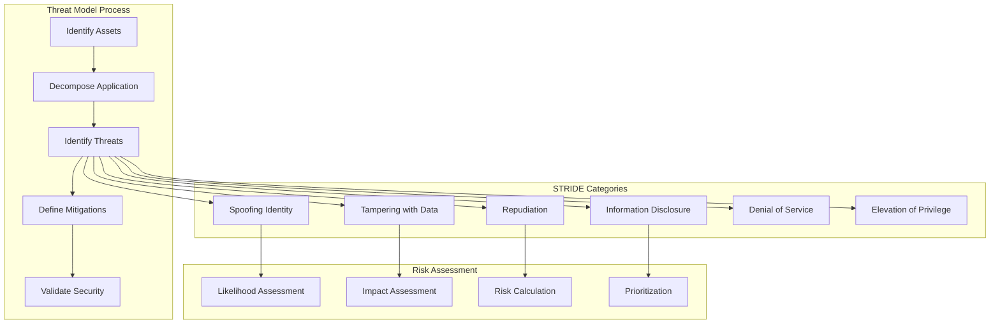

# Threat Model and Mitigations

## Purpose
This document provides a comprehensive threat model for Pliers v3, identifying potential security threats, attack vectors, and their corresponding mitigations. It follows industry-standard threat modeling methodologies and addresses OWASP Top 10 vulnerabilities.

## Classification
- **Domain:** Security/Threat Modeling
- **Stability:** Core
- **Abstraction:** Implementation
- **Confidence:** Established

## Content

### Threat Modeling Methodology

Pliers v3 uses a structured approach to threat modeling based on the STRIDE methodology (Spoofing, Tampering, Repudiation, Information Disclosure, Denial of Service, Elevation of Privilege) combined with OWASP risk assessment frameworks.



### System Assets and Attack Surface

#### Critical Assets

```typescript
interface CriticalAssets {
  data: DataAssets;
  systems: SystemAssets;
  infrastructure: InfrastructureAssets;
  reputation: ReputationAssets;
}

interface DataAssets {
  userCredentials: {
    description: 'User passwords, MFA secrets, API keys';
    classification: 'critical';
    location: ['database', 'memory', 'logs'];
    encryption: 'required';
    backup: 'encrypted';
  };

  personalData: {
    description: 'PII in form submissions and user profiles';
    classification: 'sensitive';
    location: ['database', 'cache', 'logs'];
    compliance: ['GDPR', 'SOC2'];
    retention: 'policy-based';
  };

  businessData: {
    description: 'Form definitions, workflows, business logic';
    classification: 'confidential';
    location: ['database', 'file-system'];
    intellectual_property: true;
    backup: 'encrypted';
  };

  systemSecrets: {
    description: 'JWT keys, encryption keys, service credentials';
    classification: 'critical';
    location: ['secrets-manager', 'environment'];
    rotation: 'required';
    access: 'restricted';
  };

  auditLogs: {
    description: 'Security events, access logs, system logs';
    classification: 'internal';
    location: ['database', 'log-aggregation'];
    immutable: true;
    retention: '7-years';
  };
}

interface SystemAssets {
  coreAPI: {
    description: 'Main application API service';
    criticality: 'high';
    availability: '99.9%';
    dependencies: ['database', 'cache', 'auth-service'];
  };

  aiService: {
    description: 'AI/ML processing service';
    criticality: 'medium';
    availability: '99.5%';
    dependencies: ['llm-providers', 'vector-db'];
  };

  database: {
    description: 'PostgreSQL primary database';
    criticality: 'critical';
    availability: '99.95%';
    backup: 'continuous';
  };

  authService: {
    description: 'Authentication and authorization';
    criticality: 'critical';
    availability: '99.9%';
    dependencies: ['database', 'cache'];
  };
}
```

#### Attack Surface Analysis

```typescript
interface AttackSurface {
  external: ExternalAttackSurface;
  internal: InternalAttackSurface;
  supply_chain: SupplyChainAttackSurface;
}

interface ExternalAttackSurface {
  webApplication: {
    endpoints: string[];
    authentication: 'required' | 'optional' | 'none';
    inputValidation: 'strict' | 'moderate' | 'minimal';
    rateLimit: boolean;
    waf: boolean;
  };

  apiEndpoints: {
    publicAPIs: APIEndpoint[];
    privateAPIs: APIEndpoint[];
    webhooks: WebhookEndpoint[];
    adminAPIs: AdminAPIEndpoint[];
  };

  networkServices: {
    loadBalancer: NetworkService;
    database: NetworkService;
    cache: NetworkService;
    monitoring: NetworkService;
  };
}

interface APIEndpoint {
  path: string;
  methods: string[];
  authentication: AuthenticationType;
  authorization: AuthorizationType;
  inputValidation: ValidationLevel;
  rateLimiting: RateLimitConfig;
  sensitiveData: boolean;
  publiclyAccessible: boolean;
}

// High-risk endpoints analysis
const HIGH_RISK_ENDPOINTS = {
  authentication: {
    '/auth/login': {
      threats: ['credential_stuffing', 'brute_force', 'account_takeover'],
      mitigations: ['rate_limiting', 'account_lockout', 'mfa'],
      monitoring: ['failed_attempts', 'suspicious_ips', 'timing_attacks']
    },
    '/auth/password-reset': {
      threats: ['account_takeover', 'enumeration', 'token_abuse'],
      mitigations: ['secure_tokens', 'rate_limiting', 'email_verification'],
      monitoring: ['reset_patterns', 'suspicious_requests']
    }
  },

  dataAccess: {
    '/forms/{id}/submissions': {
      threats: ['unauthorized_access', 'data_exfiltration', 'injection'],
      mitigations: ['authentication', 'authorization', 'input_validation'],
      monitoring: ['bulk_access', 'unusual_patterns', 'privilege_escalation']
    },
    '/admin/*': {
      threats: ['privilege_escalation', 'configuration_tampering', 'backdoor'],
      mitigations: ['mfa_required', 'session_validation', 'audit_logging'],
      monitoring: ['admin_actions', 'configuration_changes', 'bulk_operations']
    }
  },

  fileUpload: {
    '/forms/{id}/attachments': {
      threats: ['malware_upload', 'path_traversal', 'resource_exhaustion'],
      mitigations: ['file_scanning', 'type_validation', 'size_limits'],
      monitoring: ['file_types', 'upload_volumes', 'scan_results']
    }
  }
};
```

### STRIDE Threat Analysis

#### Spoofing Threats

```typescript
interface SpoofingThreats {
  userIdentity: {
    threat: 'Attacker impersonates legitimate user';
    scenarios: [
      'Stolen credentials used for unauthorized access',
      'Session hijacking through XSS or network sniffing',
      'Social engineering to obtain authentication factors',
      'Credential stuffing using breached password databases'
    ];
    impact: {
      confidentiality: 'high';
      integrity: 'high';
      availability: 'medium';
      compliance: 'critical';
    };
    mitigations: SpoofingMitigations;
  };

  serviceIdentity: {
    threat: 'Attacker impersonates system service';
    scenarios: [
      'Man-in-the-middle attacks on API communications',
      'DNS spoofing to redirect traffic',
      'Certificate spoofing for service impersonation',
      'Internal service compromise and lateral movement'
    ];
    impact: {
      confidentiality: 'critical';
      integrity: 'critical';
      availability: 'high';
      compliance: 'critical';
    };
    mitigations: ServiceIdentityMitigations;
  };
}

interface SpoofingMitigations {
  authentication: {
    multiFactorAuth: {
      implementation: 'TOTP and Email-based MFA';
      enforcement: 'Required for privileged accounts, optional for standard users';
      backup: 'One-time backup codes';
    };

    strongPasswords: {
      policy: 'Minimum 12 characters with complexity requirements';
      validation: 'zxcvbn strength checking';
      history: 'Prevent reuse of last 12 passwords';
    };

    sessionManagement: {
      tokenSecurity: 'JWT with RS256 signing';
      tokenLifetime: 'Access: 15 minutes, Refresh: 7 days';
      tokenRotation: 'Automatic refresh token rotation';
      sessionInvalidation: 'Immediate on suspicious activity';
    };

    accountSecurity: {
      lockoutPolicy: '5 failed attempts = 30 minute lockout';
      anomalyDetection: 'Geographic and behavioral analysis';
      deviceTrusting: 'Device fingerprinting and registration';
    };
  };

  monitoring: {
    authenticationEvents: [
      'Multiple failed login attempts',
      'Logins from new devices/locations',
      'Concurrent sessions from different locations',
      'Password reset patterns',
      'MFA bypass attempts'
    ];

    alerting: {
      realTime: 'Immediate alerts for critical events';
      thresholds: 'Configurable alert thresholds';
      escalation: 'Automatic escalation for repeated violations';
    };
  };
}

interface ServiceIdentityMitigations {
  transport: {
    tlsEncryption: 'TLS 1.3 for all communications';
    certificateValidation: 'Strict certificate validation and pinning';
    hsts: 'HTTP Strict Transport Security enabled';
  };

  serviceAuth: {
    mutualTLS: 'mTLS for service-to-service communication';
    serviceTokens: 'JWT tokens for service authentication';
    tokenScoping: 'Minimal scope service tokens';
  };

  networkSecurity: {
    networkSegmentation: 'Isolated network segments for services';
    firewallRules: 'Strict ingress/egress rules';
    intrusionDetection: 'Network-based IDS/IPS';
  };
}
```

#### Tampering Threats

```typescript
interface TamperingThreats {
  dataIntegrity: {
    threat: 'Unauthorized modification of data';
    scenarios: [
      'SQL injection attacks modifying database records',
      'Form submission tampering via client-side manipulation',
      'Workflow state manipulation through API abuse',
      'Configuration tampering by compromised accounts'
    ];
    impact: {
      confidentiality: 'medium';
      integrity: 'critical';
      availability: 'medium';
      compliance: 'high';
    };
    mitigations: DataIntegrityMitigations;
  };

  codeIntegrity: {
    threat: 'Malicious code injection or modification';
    scenarios: [
      'XSS attacks injecting malicious scripts',
      'Plugin code injection through insecure plugin system',
      'Supply chain attacks through compromised dependencies',
      'Server-side template injection'
    ];
    impact: {
      confidentiality: 'high';
      integrity: 'critical';
      availability: 'high';
      compliance: 'critical';
    };
    mitigations: CodeIntegrityMitigations;
  };
}

interface DataIntegrityMitigations {
  inputValidation: {
    serverSideValidation: 'All inputs validated on server using Zod schemas';
    sanitization: 'HTML sanitization using DOMPurify';
    typeValidation: 'Strict TypeScript typing with runtime validation';
    lengthLimits: 'Maximum length validation for all text inputs';
  };

  databaseSecurity: {
    parameterizedQueries: 'Always use parameterized queries/prepared statements';
    ormSafety: 'Use TypeORM/Prisma for safe database operations';
    transactionIntegrity: 'ACID transactions for critical operations';
    checksums: 'Data integrity checksums for critical records';
  };

  apiSecurity: {
    requestValidation: 'JSON schema validation for all API requests';
    responseValidation: 'Schema validation for API responses';
    idempotency: 'Idempotent operations where appropriate';
    versioning: 'API versioning to prevent backward compatibility issues';
  };

  auditTrail: {
    changeLogging: 'Log all data modifications with before/after values';
    userTracking: 'Track user responsible for each change';
    timestamping: 'Precise timestamps for all modifications';
    immutableLogs: 'Write-only audit logs with integrity protection';
  };
}

interface CodeIntegrityMitigations {
  xssPrevention: {
    contentSecurityPolicy: 'Strict CSP headers preventing script injection';
    outputEncoding: 'Proper encoding of all dynamic content';
    sanitization: 'HTML sanitization for user-generated content';
    trustedTypes: 'Trusted Types API for DOM manipulation safety';
  };

  injectionPrevention: {
    sqlInjection: 'Parameterized queries and ORM usage';
    commandInjection: 'Input validation and command sanitization';
    ldapInjection: 'LDAP query parameterization';
    templateInjection: 'Safe templating with input validation';
  };

  pluginSecurity: {
    sandboxing: 'Isolated execution environment for plugins';
    codeReview: 'Mandatory security review for all plugins';
    permissionModel: 'Granular permission model for plugin access';
    resourceLimits: 'CPU, memory, and network limits for plugins';
  };

  supplyChainSecurity: {
    dependencyScanning: 'Automated vulnerability scanning of dependencies';
    packageVerification: 'Package signature verification';
    lockFiles: 'Lock file management for reproducible builds';
    updateProcess: 'Controlled dependency update process';
  };
}
```

#### Information Disclosure Threats

```typescript
interface InformationDisclosureThreats {
  dataLeakage: {
    threat: 'Unauthorized access to sensitive information';
    scenarios: [
      'Broken access controls exposing other users\' data',
      'SQL injection extracting database contents',
      'Insecure direct object references',
      'Verbose error messages revealing system information',
      'Log files containing sensitive data',
      'Backup files exposed through misconfiguration'
    ];
    impact: {
      confidentiality: 'critical';
      integrity: 'low';
      availability: 'low';
      compliance: 'critical';
    };
    mitigations: DataLeakageMitigations;
  };

  systemInformation: {
    threat: 'Disclosure of system architecture and vulnerabilities';
    scenarios: [
      'Banner grabbing revealing service versions',
      'Error messages exposing system paths and configurations',
      'Source code exposure through misconfiguration',
      'Database schema exposure through injection attacks',
      'API documentation accessible without authentication'
    ];
    impact: {
      confidentiality: 'medium';
      integrity: 'low';
      availability: 'low';
      compliance: 'medium';
    };
    mitigations: SystemInformationMitigations;
  };
}

interface DataLeakageMitigations {
  accessControl: {
    authorization: 'Comprehensive RBAC with resource-level permissions';
    tenantIsolation: 'Strong tenant isolation using database RLS';
    fieldLevelSecurity: 'Field-level access controls and masking';
    dataClassification: 'Automatic data classification and protection';
  };

  encryption: {
    atRest: 'AES-256 encryption for sensitive data at rest';
    inTransit: 'TLS 1.3 for all data in transit';
    fieldLevel: 'Field-level encryption for highly sensitive data';
    keyManagement: 'Secure key management with rotation';
  };

  dataHandling: {
    minimization: 'Collect only necessary data';
    retention: 'Automatic data retention and deletion policies';
    anonymization: 'Data anonymization for analytics';
    masking: 'Data masking for non-production environments';
  };

  monitoring: {
    dataAccess: 'Monitor and log all data access patterns';
    anomalyDetection: 'Detect unusual data access patterns';
    dlp: 'Data Loss Prevention tools for sensitive data';
    exportControl: 'Control and monitor data exports';
  };
}

interface SystemInformationMitigations {
  informationHiding: {
    errorHandling: 'Generic error messages without system details';
    bannerSuppression: 'Suppress version banners and system information';
    headerSecurity: 'Remove or obfuscate identifying headers';
    pathObfuscation: 'Avoid exposing internal system paths';
  };

  secureConfiguration: {
    defaultCredentials: 'Change all default credentials';
    debugMode: 'Disable debug mode in production';
    directoryListing: 'Disable directory listing';
    filePermissions: 'Proper file and directory permissions';
  };

  apiSecurity: {
    authentication: 'Require authentication for API documentation';
    versioning: 'Proper API versioning without information leakage';
    rateLimit: 'Rate limiting to prevent reconnaissance';
    inputValidation: 'Validate all inputs to prevent information extraction';
  };
}
```

#### Denial of Service Threats

```typescript
interface DenialOfServiceThreats {
  applicationDoS: {
    threat: 'Application-level denial of service';
    scenarios: [
      'Resource exhaustion through expensive operations',
      'Memory exhaustion via large file uploads',
      'CPU exhaustion through complex regex patterns',
      'Database connection pool exhaustion',
      'API rate limit abuse',
      'Slowloris-style slow request attacks'
    ];
    impact: {
      confidentiality: 'low';
      integrity: 'low';
      availability: 'critical';
      compliance: 'medium';
    };
    mitigations: ApplicationDoSMitigations;
  };

  distributedDoS: {
    threat: 'Distributed denial of service attacks';
    scenarios: [
      'Network-level DDoS overwhelming bandwidth',
      'Application-layer DDoS targeting specific endpoints',
      'Botnet-coordinated attacks',
      'Amplification attacks using vulnerable services',
      'Geographic distributed attacks'
    ];
    impact: {
      confidentiality: 'low';
      integrity: 'low';
      availability: 'critical';
      compliance: 'high';
    };
    mitigations: DistributedDoSMitigations;
  };
}

interface ApplicationDoSMitigations {
  rateLimiting: {
    global: 'Global rate limits per IP address';
    perUser: 'Per-user rate limits for authenticated requests';
    perEndpoint: 'Endpoint-specific rate limits based on resource cost';
    adaptive: 'Adaptive rate limiting based on system load';
  };

  resourceManagement: {
    connectionPooling: 'Database connection pooling with limits';
    memoryLimits: 'Memory usage limits for request processing';
    timeouts: 'Request timeouts to prevent long-running operations';
    queueing: 'Request queuing to handle traffic spikes';
  };

  inputValidation: {
    sizeLimit: 'Maximum size limits for all inputs';
    complexityLimit: 'Complexity limits for computational operations';
    uploadLimit: 'File upload size and type restrictions';
    regexTimeout: 'Timeout limits for regex operations';
  };

  caching: {
    responseCache: 'Aggressive caching of expensive operations';
    staticContent: 'CDN for static content delivery';
    databaseCache: 'Database query result caching';
    computationCache: 'Cache expensive computation results';
  };
}

interface DistributedDoSMitigations {
  networkProtection: {
    waf: 'Web Application Firewall with DDoS protection';
    loadBalancer: 'Load balancer with DDoS mitigation';
    cdn: 'CDN with built-in DDoS protection';
    rateLimiting: 'Network-level rate limiting';
  };

  trafficAnalysis: {
    anomalyDetection: 'Real-time traffic anomaly detection';
    geoblocking: 'Geographic IP blocking for suspicious regions';
    behaviorAnalysis: 'Traffic behavior analysis and blocking';
    reputationFiltering: 'IP reputation-based filtering';
  };

  scalability: {
    autoScaling: 'Automatic scaling based on traffic patterns';
    loadDistribution: 'Traffic distribution across multiple regions';
    failover: 'Automatic failover to backup systems';
    capacityReserve: 'Reserved capacity for handling attacks';
  };

  incidentResponse: {
    playbooks: 'DDoS incident response playbooks';
    automation: 'Automated DDoS response and mitigation';
    communication: 'Incident communication procedures';
    recovery: 'Service recovery procedures';
  };
}
```

#### Elevation of Privilege Threats

```typescript
interface ElevationOfPrivilegeThreats {
  horizontalPrivilegeEscalation: {
    threat: 'Access to resources of same privilege level belonging to other users';
    scenarios: [
      'Insecure direct object references allowing cross-user access',
      'Broken access controls in multi-tenant environment',
      'Session fixation or hijacking attacks',
      'JWT token manipulation for user impersonation'
    ];
    impact: {
      confidentiality: 'high';
      integrity: 'high';
      availability: 'medium';
      compliance: 'critical';
    };
    mitigations: HorizontalEscalationMitigations;
  };

  verticalPrivilegeEscalation: {
    threat: 'Gaining higher-level privileges than intended';
    scenarios: [
      'Exploiting application logic flaws to gain admin access',
      'Race conditions in privilege checking',
      'Parameter tampering to bypass authorization',
      'SQL injection to modify user roles',
      'Plugin vulnerabilities allowing privilege escalation'
    ];
    impact: {
      confidentiality: 'critical';
      integrity: 'critical';
      availability: 'critical';
      compliance: 'critical';
    };
    mitigations: VerticalEscalationMitigations;
  };
}

interface HorizontalEscalationMitigations {
  accessControl: {
    directObjectReferences: 'Use indirect object references with authorization checks';
    tenantIsolation: 'Strict tenant isolation using database RLS and application logic';
    sessionValidation: 'Continuous session validation and context checking';
    tokenValidation: 'JWT token validation with user context verification';
  };

  authorization: {
    resourceOwnership: 'Verify resource ownership before access';
    contextualAuth: 'Context-aware authorization decisions';
    minimumPrivilege: 'Grant minimum necessary privileges';
    permissionChecking: 'Explicit permission checks for all operations';
  };

  monitoring: {
    crossUserAccess: 'Monitor and alert on cross-user access attempts';
    permissionViolations: 'Log permission violation attempts';
    anomalyDetection: 'Detect unusual access patterns';
    auditTrail: 'Comprehensive audit trail for all access decisions';
  };
}

interface VerticalEscalationMitigations {
  roleManagement: {
    roleHierarchy: 'Well-defined role hierarchy with inheritance rules';
    roleValidation: 'Strict role validation and assignment controls';
    privilegedAccess: 'Additional controls for privileged operations';
    roleAuditing: 'Regular auditing of role assignments';
  };

  codeSecurityc: {
    inputValidation: 'Comprehensive input validation to prevent injection';
    raceConditions: 'Proper synchronization to prevent race conditions';
    logicFlaws: 'Security code review to identify logic flaws';
    pluginSandbox: 'Strict sandboxing of plugin execution';
  };

  administrativeControls: {
    separationOfDuties: 'Separation of duties for critical operations';
    approvalWorkflows: 'Approval workflows for privilege changes';
    timeBasedAccess: 'Time-limited access for elevated privileges';
    emergencyAccess: 'Controlled emergency access procedures';
  };

  monitoring: {
    privilegeUse: 'Monitor all privileged operations';
    escalationAttempts: 'Alert on privilege escalation attempts';
    adminActions: 'Detailed logging of administrative actions';
    behaviorAnalysis: 'Behavioral analysis for unusual privilege usage';
  };
}
```

### OWASP Top 10 Specific Mitigations

#### A01: Broken Access Control

```typescript
interface BrokenAccessControlMitigations {
  prevention: {
    defaultDeny: 'Implement default deny access control policy';
    centralized: 'Use centralized authorization mechanisms';
    rbac: 'Implement proper role-based access control';
    testing: 'Regular access control testing and validation';
  };

  implementation: {
    serverSide: 'Enforce access controls on server side only';
    tokenValidation: 'Validate JWT tokens on every request';
    resourceAuth: 'Check authorization for every resource access';
    contextAware: 'Context-aware authorization decisions';
  };

  monitoring: {
    accessViolations: 'Log and monitor all access control violations';
    patternAnalysis: 'Analyze access patterns for anomalies';
    alerting: 'Real-time alerting for access control failures';
    reporting: 'Regular access control compliance reporting';
  };
}
```

#### A02: Cryptographic Failures

```typescript
interface CryptographicFailureMitigations {
  dataClassification: {
    identification: 'Identify all sensitive data in the system';
    classification: 'Classify data based on sensitivity levels';
    inventory: 'Maintain inventory of sensitive data locations';
    flowMapping: 'Map data flows for encryption requirements';
  };

  encryptionStandards: {
    algorithms: 'Use only approved encryption algorithms (AES-256, RSA-2048+)';
    protocols: 'Use latest TLS versions (1.3) for data in transit';
    randomness: 'Use cryptographically secure random number generators';
    keyStrength: 'Enforce minimum key strength requirements';
  };

  keyManagement: {
    generation: 'Proper key generation using secure methods';
    storage: 'Secure key storage using hardware security modules';
    rotation: 'Regular key rotation policies and procedures';
    escrow: 'Key escrow procedures for data recovery';
  };

  implementation: {
    validation: 'Validate all encryption implementations';
    testing: 'Regular cryptographic testing and auditing';
    updates: 'Keep cryptographic libraries updated';
    compliance: 'Ensure compliance with cryptographic standards';
  };
}
```

#### A03: Injection

```typescript
interface InjectionMitigations {
  sqlInjection: {
    parameterizedQueries: 'Use parameterized queries exclusively';
    orm: 'Use ORM with built-in injection protection';
    validation: 'Validate all SQL inputs';
    escaping: 'Proper SQL escaping when parameterization not possible';
  };

  nosqlInjection: {
    validation: 'Validate NoSQL query inputs';
    sanitization: 'Sanitize NoSQL query parameters';
    whitelisting: 'Whitelist allowed query operations';
    monitoring: 'Monitor NoSQL queries for injection attempts';
  };

  commandInjection: {
    avoidance: 'Avoid system command execution when possible';
    validation: 'Validate all command inputs';
    sandboxing: 'Execute commands in sandboxed environment';
    whitelisting: 'Whitelist allowed commands and parameters';
  };

  ldapInjection: {
    parameterization: 'Use parameterized LDAP queries';
    validation: 'Validate all LDAP inputs';
    escaping: 'Proper LDAP special character escaping';
    monitoring: 'Monitor LDAP queries for injection attempts';
  };
}
```

### Advanced Persistent Threat (APT) Considerations

```typescript
interface APTMitigations {
  detection: {
    behaviorAnalysis: 'Advanced behavioral analysis and anomaly detection';
    threatIntelligence: 'Integration with threat intelligence feeds';
    correlationEngine: 'Security event correlation across multiple sources';
    honeypots: 'Honeypot deployment for early threat detection';
  };

  response: {
    isolation: 'Automatic isolation of compromised systems';
    forensics: 'Digital forensics capabilities for incident analysis';
    threatHunting: 'Proactive threat hunting procedures';
    incidentResponse: 'Comprehensive incident response procedures';
  };

  resilience: {
    segmentation: 'Network segmentation to limit lateral movement';
    zeroTrust: 'Zero trust architecture implementation';
    backup: 'Secure backup and recovery procedures';
    continuity: 'Business continuity planning for extended attacks';
  };
}
```

### Threat Intelligence and Monitoring

#### Security Operations Center (SOC) Integration

```typescript
interface ThreatMonitoring {
  realTimeDetection: {
    siem: 'Security Information and Event Management integration';
    correlationRules: 'Custom correlation rules for threat detection';
    machineLearning: 'ML-based anomaly detection';
    behaviorBaselines: 'Establish normal behavior baselines';
  };

  threatIntelligence: {
    feeds: 'Integration with commercial threat intelligence feeds';
    iocs: 'Indicators of Compromise (IoC) monitoring';
    attribution: 'Threat actor attribution and tracking';
    sharing: 'Threat intelligence sharing with security community';
  };

  incidentResponse: {
    playbooks: 'Threat-specific incident response playbooks';
    automation: 'Automated response to known threats';
    escalation: 'Threat-based escalation procedures';
    communication: 'Stakeholder communication during incidents';
  };

  forensics: {
    logging: 'Comprehensive logging for forensic analysis';
    preservation: 'Evidence preservation procedures';
    analysis: 'Digital forensic analysis capabilities';
    reporting: 'Forensic reporting and documentation';
  };
}
```

### Risk Assessment and Prioritization

#### Risk Calculation Framework

```typescript
interface RiskAssessment {
  likelihood: {
    threatActorCapability: number;    // 1-5 scale
    threatActorMotivation: number;    // 1-5 scale
    vulnerabilityPrevalence: number;  // 1-5 scale
    controlEffectiveness: number;     // 1-5 scale (inverse)
  };

  impact: {
    confidentialityImpact: number;    // 1-5 scale
    integrityImpact: number;          // 1-5 scale
    availabilityImpact: number;       // 1-5 scale
    complianceImpact: number;         // 1-5 scale
  };

  calculation: {
    likelihoodScore: number;          // Average of likelihood factors
    impactScore: number;              // Maximum of impact factors
    riskScore: number;                // Likelihood × Impact
    riskLevel: 'Low' | 'Medium' | 'High' | 'Critical';
  };
}

// Risk prioritization matrix
const RISK_MATRIX = {
  critical: { min: 20, max: 25, response: 'immediate' },
  high: { min: 15, max: 19, response: '30_days' },
  medium: { min: 10, max: 14, response: '90_days' },
  low: { min: 1, max: 9, response: '180_days' }
};

const THREAT_CATALOG = {
  'T001_SQL_Injection': {
    description: 'SQL injection attacks against database',
    likelihood: { capability: 3, motivation: 4, prevalence: 3, control: 2 },
    impact: { confidentiality: 5, integrity: 5, availability: 3, compliance: 5 },
    riskScore: 17.5,
    riskLevel: 'High',
    mitigations: ['parameterized_queries', 'input_validation', 'waf']
  },

  'T002_Privilege_Escalation': {
    description: 'Unauthorized privilege escalation',
    likelihood: { capability: 4, motivation: 5, prevalence: 2, control: 2 },
    impact: { confidentiality: 5, integrity: 5, availability: 4, compliance: 5 },
    riskScore: 16.25,
    riskLevel: 'High',
    mitigations: ['rbac', 'least_privilege', 'monitoring']
  },

  'T003_Data_Breach': {
    description: 'Unauthorized access to sensitive data',
    likelihood: { capability: 3, motivation: 5, prevalence: 3, control: 2 },
    impact: { confidentiality: 5, integrity: 3, availability: 2, compliance: 5 },
    riskScore: 16.25,
    riskLevel: 'High',
    mitigations: ['encryption', 'access_control', 'monitoring']
  }
};
```

### Continuous Security Validation

#### Security Testing Framework

```typescript
interface SecurityTesting {
  staticAnalysis: {
    codeScanning: 'Static application security testing (SAST)';
    dependencyScanning: 'Software composition analysis (SCA)';
    configurationReview: 'Infrastructure as Code security review';
    secretsDetection: 'Secrets and credential scanning';
  };

  dynamicAnalysis: {
    dast: 'Dynamic application security testing';
    iast: 'Interactive application security testing';
    penetrationTesting: 'Regular penetration testing';
    redTeamExercises: 'Red team security exercises';
  };

  continuousValidation: {
    automatedScanning: 'Automated security scanning in CI/CD';
    runtimeProtection: 'Runtime application self-protection (RASP)';
    monitoring: 'Continuous security monitoring';
    threatModeling: 'Regular threat model updates';
  };

  compliance: {
    frameworks: 'Compliance framework validation (SOC2, GDPR)';
    auditing: 'Regular security audits';
    reporting: 'Security compliance reporting';
    remediation: 'Security finding remediation tracking';
  };
}
```

## Relationships
- **Parent Nodes:** [architecture.md] - addresses security threats in architecture
- **Child Nodes:** None
- **Related Nodes:**
  - [authentication.md] - mitigates - Authentication threats
  - [authorization.md] - mitigates - Authorization and privilege escalation threats
  - [compliance.md] - supports - Compliance requirements for threat mitigation

## Navigation Guidance
- **Access Context:** Use when assessing security risks or implementing threat mitigations
- **Common Next Steps:** Review specific mitigation implementations or compliance requirements
- **Related Tasks:** Security testing implementation, penetration testing, threat modeling updates
- **Update Patterns:** Update when new threats are identified or when system architecture changes

## Metadata
- **Created:** 2025-01-22
- **Last Updated:** 2025-01-22
- **Updated By:** Claude/DOC-005 Implementation

## Change History
- 2025-01-22: Initial creation of comprehensive threat model and mitigations documentation (DOC-005)