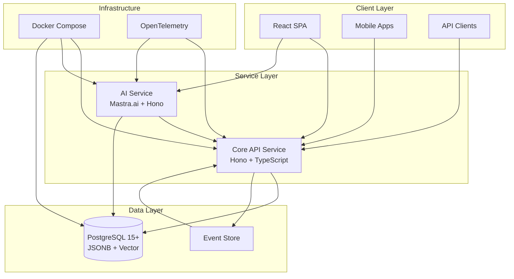
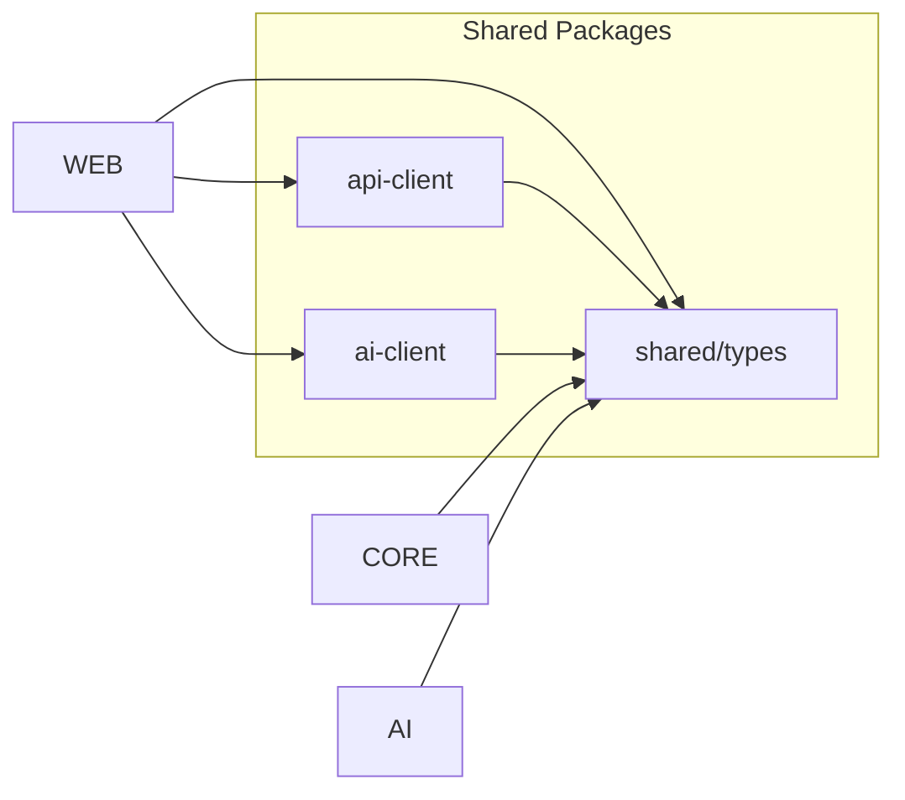

# Project Structure

## Purpose
This document provides an overview of the project structure, including key elements, their relationships, and the principles guiding their design.

## Classification
- **Domain:** Structure
- **Stability:** Semi-stable
- **Abstraction:** Structural
- **Confidence:** Established

## Content

### Structure Overview

Pliers v3 is a modern forms and workflow management platform built on a microservices architecture within a monorepo structure. The system provides dynamic form creation, submission management, workflow orchestration, and AI-enhanced capabilities through a unified event-driven architecture.

The platform consists of three primary services (Core API, AI Service, Frontend) communicating through well-defined interfaces, with PostgreSQL serving as the single source of truth for all data storage.

### Key Elements

#### Core API Service
**Purpose:** Central business logic and data management service
**Responsibilities:**
- Form definition creation, validation, and versioning
- Form submission processing and storage
- Workflow and status management
- Event processing and plugin orchestration
- Database operations and query optimization
- RESTful API endpoints for all core functionality
- WebSocket connections for real-time updates

**Key Characteristics:**
- Built with Hono framework for lightweight, high-performance APIs
- TypeScript with strict mode for type safety
- Zod schemas for runtime validation
- Horizontally scalable, stateless design
- Event-driven architecture for all state changes

#### AI Service
**Purpose:** Intelligent automation and enhancement layer
**Responsibilities:**
- LLM integration and orchestration
- Form design assistance and optimization
- Workflow automation intelligence
- Natural language query processing
- Data analysis and insights generation
- Protocol support (A2A, MCP, AG-UI)

**Key Characteristics:**
- Built with Mastra.ai framework
- Protocol abstraction for AI replaceability
- Context management for efficient LLM usage
- Streaming response support
- Vector search integration

#### Frontend Application
**Purpose:** User interface for system interaction
**Responsibilities:**
- Form designer with drag-and-drop capabilities
- Form submission and data entry interfaces
- Workflow visualization and management
- Dashboard and reporting displays
- Real-time updates and notifications
- Progressive Web App features

**Key Characteristics:**
- React with TypeScript
- Client-only SPA (no SSR)
- Tailwind CSS for styling
- WebSocket for real-time features
- Replaceable with native or alternative frameworks

#### PostgreSQL Database
**Purpose:** Single source of truth for all system data
**Responsibilities:**
- Form definition storage with versioning
- Form submission data in JSONB format
- Event store for audit trail
- Vector embeddings for AI search
- Full-text search capabilities
- Plugin metadata and configuration

**Key Characteristics:**
- PostgreSQL 15+ with extensions
- JSONB for flexible schema
- pgvector for AI capabilities
- GIN indexes for query performance
- Generated columns for common queries
- Partitioning for scalability

### Element Interactions

#### Data Flow Patterns

1. **Form Definition Flow:**
   - User creates form in Frontend → Core API validates with Zod → Stored in PostgreSQL
   - AI Service assists with field suggestions → Core API applies recommendations
   - Events generated for all changes → Plugin system processes events

2. **Submission Processing Flow:**
   - User submits form data → Core API validates against definition
   - Data stored in PostgreSQL JSONB → Events triggered for workflows
   - Status transitions managed by workflow engine → Notifications sent

3. **Query and Search Flow:**
   - Query defined as form submission → Core API translates to SQL
   - PostgreSQL executes with indexes → Results cached if appropriate
   - Real-time updates via WebSocket → Dashboard reflects changes

4. **AI Enhancement Flow:**
   - User requests assistance → Frontend calls AI Service
   - AI Service processes with LLM → Recommendations returned
   - Core API validates suggestions → Applied if accepted

#### Communication Protocols

- **REST API:** Primary communication for CRUD operations
- **GraphQL:** Type-safe queries for complex data fetching
- **WebSocket:** Real-time updates and notifications
- **Event Stream:** Asynchronous processing and plugin triggers
- **Protocol Buffers:** High-performance internal service communication

#### Dependency Management

### Tools and Methods

| Area | Tools/Methods | Justification |
|-------|--------------|---------------|
| **Database** | PostgreSQL 15+ with JSONB, pgvector | Single source of truth, eliminates sync complexity, native vector search |
| **Backend Runtime** | Node.js 18+ with TypeScript 5+ | Excellent LLM agent familiarity, strong type safety, vast ecosystem |
| **API Framework** | Hono | Lightweight, high performance, TypeScript-first, edge-compatible |
| **Schema Validation** | Zod | Runtime type validation, schema generation, excellent DX |
| **Event Processing** | Event Store / Kafka | Event sourcing for audit trail, plugin orchestration, scalability |
| **AI Framework** | Mastra.ai | Protocol support (A2A, MCP, AG-UI), LLM orchestration |
| **Frontend** | React + TypeScript | Component ecosystem, type safety, developer familiarity |
| **Testing** | Jest + TestContainers | Comprehensive testing, database isolation, integration testing |
| **Containerization** | Docker + Docker Compose | Consistent environments, easy deployment, microservices support |
| **Monitoring** | OpenTelemetry | Distributed tracing, metrics, logging, vendor-agnostic |
| **API Documentation** | OpenAPI/GraphQL SDL | Auto-generated from code, type-safe clients, developer experience |
| **Monorepo** | Turborepo/Nx | Shared packages, parallel builds, dependency management |

### Success Criteria

#### Quality
**Requirements:**
- Zero data loss for form submissions
- Accurate validation and error reporting
- Consistent user experience across platforms
- Code coverage minimum 80%

**How Structure Addresses:**
- Event sourcing provides complete audit trail and recovery capability
- Zod schemas ensure runtime type validation with clear error messages
- Shared type packages ensure consistency across services
- Jest + TestContainers enable comprehensive testing

**Metrics:**
- Test coverage >80%
- Zero critical bugs in production
- <1% validation error rate
- 100% data recovery capability

#### Scalability
**Requirements:**
- Support 10,000+ concurrent users
- Handle 1M+ form submissions per month
- Sub-second response times under load
- Horizontal scaling capability

**How Structure Addresses:**
- Stateless API services enable horizontal scaling
- PostgreSQL read replicas for query distribution
- Event-driven architecture decouples processing
- Caching layer reduces database load
- WebSocket connection pooling

**Metrics:**
- <500ms p95 API response time
- Support 10K concurrent WebSocket connections
- Linear scaling with added instances
- Database CPU <70% at peak load

#### Security
**Requirements:**
- JWT-based authentication
- Role-based access control (RBAC)
- Data encryption at rest and in transit
- SQL injection prevention
- XSS protection
- Audit trail for compliance

**How Structure Addresses:**
- JWT tokens with refresh token rotation
- PostgreSQL row-level security
- TLS for all communications
- Parameterized queries prevent SQL injection
- Zod validation prevents malicious input
- Event store provides immutable audit log

**Metrics:**
- Zero security breaches
- 100% HTTPS/WSS traffic
- Pass OWASP security audit
- SOC2 compliance ready

#### Reliability
**Requirements:**
- 99.9% uptime SLA
- Graceful degradation
- Automatic failover
- Data backup and recovery
- Error recovery mechanisms

**How Structure Addresses:**
- PostgreSQL high availability with automatic failover
- Circuit breakers for external service calls
- Retry mechanisms with exponential backoff
- Daily automated backups with point-in-time recovery
- Health checks and automatic container restarts

**Metrics:**
- >99.9% uptime
- <5 minute recovery time objective (RTO)
- <1 hour recovery point objective (RPO)
- Zero data loss incidents

#### Maintainability
**Requirements:**
- Clear code organization
- Self-documenting APIs
- Easy debugging and monitoring
- Simple deployment process
- LLM agent-friendly codebase

**How Structure Addresses:**
- Monorepo with clear service boundaries
- TypeScript provides inline documentation
- OpenTelemetry for distributed tracing
- Docker Compose for one-command deployment
- Extensive comments and documentation for AI agents

**Metrics:**
- <2 hour mean time to resolution (MTTR)
- <1 day onboarding for new developers
- 90% of tasks completable by LLM agents
- <30 minute deployment time

### Implementation Approach

The implementation follows a phased approach with LLM agents performing the majority of development work from comprehensive specifications created in Phase 1.

```mermaid
flowchart LR
    subgraph "Phase 1: Foundation"
        P1A[Context Network]
        P1B[Architecture Design]
        P1C[Task Specifications]
    end

    subgraph "Phase 2: Core Engine"
        P2A[Database Layer]
        P2B[Form Engine]
        P2C[Event System]
    end

    subgraph "Phase 3: Advanced"
        P3A[Plugin System]
        P3B[Search Engine]
        P3C[API Layer]
    end

    subgraph "Phase 4: AI Integration"
        P4A[AI Services]
        P4B[AI Workflows]
        P4C[AI Analytics]
    end

    P1A --> P1B --> P1C --> P2A
    P2A --> P2B --> P2C --> P3A
    P3A --> P3B --> P3C --> P4A
    P4A --> P4B --> P4C
```

#### Phase 1: Foundation & Planning (Current - Oct 2025)
**Focus:** Complete documentation and specifications
**Duration:** 6 weeks
**Deliverables:**
- Complete context network with all architectural documentation
- Detailed component specifications with interfaces
- Comprehensive task backlog with acceptance criteria
- Development workflow optimized for LLM agents

**Key Activities:**
- Document all system components and relationships
- Create detailed TypeScript interfaces and Zod schemas
- Define database schemas and migration strategies
- Establish testing and quality standards

#### Phase 2: Core Engine Development (Nov 2025 - Feb 2026)
**Focus:** Foundational components
**Duration:** 3 months
**Deliverables:**
- PostgreSQL database with migrations
- Form definition and submission engines
- Basic event processing system
- Simple workflow management

**Implementation Order:**
1. Development infrastructure setup (2 weeks)
2. Database schema and migrations (1 week)
3. Form engine with Zod validation (3 weeks)
4. Submission storage and retrieval (2 weeks)
5. Event store implementation (2 weeks)
6. Basic workflow transitions (2 weeks)

#### Phase 3: Advanced Features (Feb 2026 - May 2026)
**Focus:** Extensibility and advanced capabilities
**Duration:** 3 months
**Deliverables:**
- Complete plugin architecture
- Advanced search with caching
- GraphQL API with subscriptions
- Dashboard and reporting system

**Implementation Order:**
1. Plugin registry and lifecycle (3 weeks)
2. Event-driven plugin processing (2 weeks)
3. Search query system (3 weeks)
4. GraphQL schema and resolvers (2 weeks)
5. Dashboard components (2 weeks)

#### Phase 4: AI Integration (May 2026 - Jul 2026)
**Focus:** Intelligent automation
**Duration:** 2 months
**Deliverables:**
- AI service with LLM integration
- Form design assistance
- Workflow automation
- Natural language queries

**Implementation Order:**
1. AI service setup with Mastra.ai (2 weeks)
2. Form generation from descriptions (2 weeks)
3. Workflow automation logic (2 weeks)
4. Query translation and optimization (2 weeks)

#### Development Environments

1. **Local Development:**
   - Docker Compose for all services
   - Hot reload for rapid iteration
   - TestContainers for integration testing

2. **CI/CD Pipeline:**
   - GitHub Actions for automated testing
   - Docker image building and registry
   - Automated deployment to staging

3. **Staging Environment:**
   - Full production replica
   - Performance testing capability
   - User acceptance testing

4. **Production Environment:**
   - Kubernetes or Docker Swarm
   - Auto-scaling configuration
   - Blue-green deployment support

#### LLM Agent Development Process

1. **Task Assignment:**
   - Agent receives task specification from backlog
   - Reviews related context network documentation
   - Confirms understanding before implementation

2. **Implementation:**
   - Creates feature branch via worktree
   - Implements according to specifications
   - Writes comprehensive tests
   - Updates documentation

3. **Quality Assurance:**
   - Runs automated test suite
   - Performs integration testing
   - Creates pull request with description

4. **Deployment:**
   - Automated CI/CD pipeline
   - Staged rollout with monitoring
   - Automated rollback on errors

### Future Evolution

The architecture is designed for progressive enhancement and adaptation to emerging technologies while maintaining backward compatibility.

#### Planned Evolution Areas

1. **Multi-Tenant Architecture (Year 2)**
   - Database schema isolation per tenant
   - Tenant-specific plugin configurations
   - Cross-tenant analytics and insights
   - Resource quota management

2. **Advanced AI Capabilities (Ongoing)**
   - Multi-modal form inputs (voice, image)
   - Predictive workflow automation
   - Anomaly detection in submissions
   - Custom model fine-tuning per domain

3. **Edge Computing Support (Year 2)**
   - Offline-first form submission
   - Edge node deployment for global distribution
   - Conflict resolution for distributed data
   - Progressive synchronization

4. **Enhanced Plugin Ecosystem (Year 1-2)**
   - Plugin marketplace
   - Sandboxed execution environment
   - Plugin composition and chaining
   - Visual plugin builder

5. **Performance Optimizations (Ongoing)**
   - Materialized views for complex queries
   - Read-through caching with Redis
   - Query optimization AI assistant
   - Automatic index recommendations

#### Technology Migration Paths

1. **Database Evolution:**
   - Current: PostgreSQL 15+ with JSONB
   - Future: Consider CockroachDB for global distribution
   - Migration: Gradual with compatibility layer

2. **AI Service Evolution:**
   - Current: Mastra.ai with standard LLMs
   - Future: Custom models, local inference options
   - Migration: Protocol abstraction enables smooth transition

3. **Frontend Evolution:**
   - Current: React SPA
   - Future: Native mobile apps, alternative frameworks
   - Migration: API-first design enables multiple frontends

#### Extensibility Points

1. **Service Boundaries:**
   - Clean interfaces allow service replacement
   - Protocol-based communication
   - Version negotiation support

2. **Plugin Architecture:**
   - New event types can be added
   - Custom field types registration
   - Workflow step extensions

3. **Storage Abstraction:**
   - Repository pattern for data access
   - Pluggable storage providers
   - Migration tools for schema evolution

4. **AI Integration:**
   - Provider-agnostic LLM interface
   - Custom model adapters
   - Hybrid cloud/on-premise deployment

#### Scaling Strategies

1. **Horizontal Scaling:**
   - Add API service instances
   - PostgreSQL read replicas
   - Event stream partitioning

2. **Vertical Scaling:**
   - Database hardware upgrades
   - Connection pooling optimization
   - Query performance tuning

3. **Data Partitioning:**
   - Time-based table partitioning
   - Tenant-based sharding
   - Archive old submissions

4. **Caching Layers:**
   - API response caching
   - Database query caching
   - CDN for static assets

## Relationships
- **Parent Nodes:** [foundation/project_definition.md]
- **Child Nodes:** 
  - [elements/*/structure.md] - details - Element-specific structural details
  - [decisions/*] - justifies - Key decisions that shaped this structure
- **Related Nodes:** 
  - [foundation/principles.md] - guides - Principles that guided structural decisions
  - [connections/dependencies.md] - details - Dependencies between elements
  - [connections/interfaces.md] - specifies - Interfaces between elements

## Navigation Guidance
- **Access Context:** Use this document when needing to understand the overall project structure and design
- **Common Next Steps:** After reviewing this structure, typically explore specific element structures or decision records
- **Related Tasks:** Project design, element development, integration planning
- **Update Patterns:** This document should be updated when there are significant changes to the project structure or methodology

## Metadata
- **Created:** 2025-09-20
- **Last Updated:** 2025-01-22
- **Updated By:** Claude/DOC-001 Implementation

## Change History
- 2025-09-20: Initial creation of structure document template
- 2025-01-22: Complete documentation of Pliers v3 structure (DOC-001)
