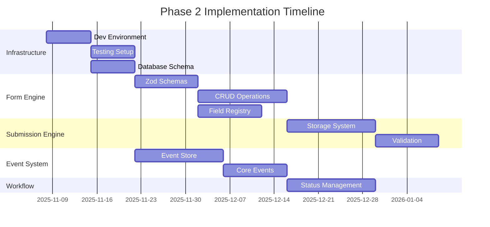

# Current Development Backlog

## Purpose
Active task backlog with detailed specifications for LLM agent implementation.

## Classification
- **Domain:** Planning
- **Stability:** Dynamic
- **Abstraction:** Detailed
- **Confidence:** Evolving

## Phase 2 Overview

**Timeline:** November 8, 2025 - February 6, 2026 (90 days)
**Theme:** Foundational system components implemented by LLM agents
**Objective:** Build the core engine components that enable form definitions, data storage, and basic workflow management.

## Task Categories and Priorities

### Epic 1: Development Infrastructure Setup
**Priority:** Critical (Blocks all other work)
**Duration:** 1-2 weeks
**Dependencies:** None

#### INFRA-001: Development Environment Setup
```markdown
**Task:** Setup Node.js + TypeScript + PostgreSQL development environment
**Agent Requirements:** Infrastructure setup experience
**Context Documents Required:**
- decisions/technology_stack.md
- elements/architecture/modern_design.md

**Acceptance Criteria:**
- [ ] Node.js 18+ LTS installed and configured
- [ ] TypeScript 5+ with strict mode configuration
- [ ] PostgreSQL 15+ with vector extensions (pgvector)
- [ ] Docker development environment with docker-compose
- [ ] ESLint + Prettier configuration following project standards
- [ ] Volta configuration for Node.js version management

**Technical Specifications:**
- Use official PostgreSQL Docker image with pgvector extension
- Configure TypeScript with strict mode and path mapping
- Setup hot reload for development
- Configure environment variable management
- Setup basic logging infrastructure

**Definition of Done:**
- [ ] All team members can run `npm run dev` and access running system
- [ ] Database migrations run successfully
- [ ] TypeScript compilation works without errors
- [ ] Docker containers start and connect properly
- [ ] Environment variables properly configured
```

#### INFRA-002: Testing Infrastructure Setup
```markdown
**Task:** Setup Jest + TestContainers testing infrastructure
**Agent Requirements:** Testing framework configuration experience
**Dependencies:** INFRA-001

**Acceptance Criteria:**
- [ ] Jest configured with TypeScript support
- [ ] TestContainers setup for PostgreSQL integration tests
- [ ] Test coverage reporting configured
- [ ] Test database seeding and cleanup automation
- [ ] Performance testing framework setup

**Technical Specifications:**
- Configure Jest with ts-jest transformer
- Setup TestContainers for isolated database testing
- Configure test coverage thresholds (minimum 80%)
- Setup test data fixtures and factories
- Configure test environment variables

**Definition of Done:**
- [ ] Unit tests run with `npm test`
- [ ] Integration tests run with `npm run test:integration`
- [ ] Coverage reports generated and meet thresholds
- [ ] Tests run in CI/CD pipeline
- [ ] Test database isolation verified
```

#### INFRA-003: Database Schema Foundation
```markdown
**Task:** Create core database schema with migration system
**Agent Requirements:** Database design and migration experience
**Dependencies:** INFRA-001

**Acceptance Criteria:**
- [ ] Migration system implemented using Kysely or similar
- [ ] Core tables created (form_definitions, form_submissions, events)
- [ ] JSONB storage patterns implemented
- [ ] Database indexes optimized for common queries
- [ ] Database constraints and validation rules

**Technical Specifications:**
- Use timestamp-based migration naming
- Implement up/down migration support
- Create JSONB validation functions
- Setup GIN indexes for JSONB queries
- Configure connection pooling

**Definition of Done:**
- [ ] Migration system runs successfully
- [ ] All core tables created with proper constraints
- [ ] Database performance meets baseline requirements
- [ ] Migration rollback functionality tested
- [ ] Database seeding for development/testing
```

### Epic 2: Form Engine Implementation
**Priority:** Critical (Foundation for all other features)
**Duration:** 3-4 weeks
**Dependencies:** Development Infrastructure

#### FORM-001: Zod Schema System Implementation
```markdown
**Task:** Implement core Zod schemas for form definitions and validation
**Agent Requirements:** TypeScript + Zod expertise
**Context Documents Required:**
- elements/core-components/form_engine.md
- elements/data-models/form_schema.md

**Acceptance Criteria:**
- [ ] FormDefinitionSchema implemented with all field types
- [ ] FieldDefinitionSchema with discriminated unions for field types
- [ ] RelationshipDefinitionSchema for form relationships
- [ ] StatusDefinitionSchema for workflow status management
- [ ] Comprehensive validation error messages

**Technical Specifications:**
```typescript
// Reference implementation structure
const FormDefinitionSchema = z.object({
  id: z.string().uuid(),
  name: z.string().min(1).max(100),
  version: z.number().int().positive(),
  fields: z.array(FieldDefinitionSchema),
  relationships: z.array(RelationshipDefinitionSchema),
  statusDefinitions: z.array(StatusDefinitionSchema),
  // ... (see form_engine.md for complete schema)
});
```

**Definition of Done:**
- [ ] All schemas compile without TypeScript errors
- [ ] Comprehensive test suite covers all validation scenarios
- [ ] Schema validation performance meets requirements (<10ms)
- [ ] Clear error messages for all validation failures
- [ ] Documentation generated from schemas
```

#### FORM-002: Form Definition CRUD Operations
```markdown
**Task:** Implement create, read, update, delete operations for form definitions
**Agent Requirements:** Database operations, TypeScript, PostgreSQL
**Dependencies:** FORM-001, INFRA-003

**Acceptance Criteria:**
- [ ] FormDefinitionService with full CRUD operations
- [ ] Database queries optimized for form definition retrieval
- [ ] Form versioning system implemented
- [ ] Form definition caching layer
- [ ] Audit trail for all form definition changes

**Technical Specifications:**
```typescript
interface FormDefinitionService {
  create(definition: FormDefinition): Promise<FormDefinition>;
  getById(id: string, version?: number): Promise<FormDefinition | null>;
  update(id: string, updates: Partial<FormDefinition>): Promise<FormDefinition>;
  delete(id: string): Promise<void>;
  list(filters?: FormFilters): Promise<FormDefinition[]>;
  search(query: string): Promise<FormDefinition[]>;
}
```

**Definition of Done:**
- [ ] All CRUD operations implemented and tested
- [ ] Performance benchmarks meet requirements
- [ ] Comprehensive error handling
- [ ] Audit trail captures all changes
- [ ] Caching reduces database load by 70%
```

#### FORM-003: Field Type Registry System
```markdown
**Task:** Implement extensible field type system with built-in types
**Agent Requirements:** Plugin architecture, TypeScript patterns
**Dependencies:** FORM-001

**Acceptance Criteria:**
- [ ] FieldTypeRegistry with registration and retrieval
- [ ] Built-in field types (text, number, date, select, file, relationship, calculated)
- [ ] Custom field type registration system
- [ ] Field validation logic for each type
- [ ] Field value formatting and parsing

**Technical Specifications:**
- Support for custom field type plugins
- Validation caching for performance
- Type-safe field configuration
- UI component generation metadata
- Field value transformation pipelines

**Definition of Done:**
- [ ] All built-in field types implemented and tested
- [ ] Custom field type registration works
- [ ] Field validation performs under 5ms per field
- [ ] Comprehensive test coverage for all field types
- [ ] Documentation for field type development
```

### Epic 3: Form Submission Engine
**Priority:** High (Enables data collection)
**Duration:** 2-3 weeks
**Dependencies:** Form Engine

#### SUBMIT-001: Form Submission Storage System
```markdown
**Task:** Implement form submission storage with JSONB and audit trail
**Agent Requirements:** Database design, JSONB queries, audit patterns
**Dependencies:** FORM-002

**Acceptance Criteria:**
- [ ] FormSubmissionService with storage operations
- [ ] JSONB storage optimized for query performance
- [ ] Audit trail for all submission changes
- [ ] Submission versioning system
- [ ] Data integrity validation

**Technical Specifications:**
```sql
CREATE TABLE form_submissions (
  id UUID PRIMARY KEY DEFAULT gen_random_uuid(),
  form_definition_id UUID NOT NULL,
  form_version INTEGER NOT NULL,
  data JSONB NOT NULL,
  status TEXT NOT NULL,
  created_at TIMESTAMPTZ DEFAULT NOW(),
  updated_at TIMESTAMPTZ DEFAULT NOW(),

  -- Generated columns for performance
  title TEXT GENERATED ALWAYS AS (data->>'title') STORED,
  priority INTEGER GENERATED ALWAYS AS ((data->>'priority')::INTEGER) STORED
);
```

**Definition of Done:**
- [ ] Submission storage performs under 100ms for typical forms
- [ ] JSONB queries properly indexed and optimized
- [ ] Audit trail captures all changes with user attribution
- [ ] Data validation prevents invalid submissions
- [ ] Comprehensive test coverage including edge cases
```

#### SUBMIT-002: Form Submission Validation
```markdown
**Task:** Implement comprehensive validation for form submissions using form definitions
**Agent Requirements:** Validation logic, error handling, performance optimization
**Dependencies:** SUBMIT-001, FORM-003

**Acceptance Criteria:**
- [ ] Real-time validation during form completion
- [ ] Server-side validation for all submissions
- [ ] Cross-field validation rules
- [ ] Custom validation rule support
- [ ] Clear, actionable validation error messages

**Technical Specifications:**
- Use form definition schemas for validation
- Support conditional validation rules
- Implement async validation for external data
- Cache validation results for performance
- Provide detailed validation error reporting

**Definition of Done:**
- [ ] All validation scenarios covered by tests
- [ ] Validation performs under 50ms for typical forms
- [ ] Error messages are clear and actionable
- [ ] Cross-field validation works correctly
- [ ] Custom validation rules can be registered
```

### Epic 4: Basic Event System
**Priority:** High (Enables plugin architecture)
**Duration:** 2-3 weeks
**Dependencies:** Form Submission Engine

#### EVENT-001: Event Store Implementation
```markdown
**Task:** Implement event sourcing foundation with event store
**Agent Requirements:** Event sourcing patterns, database design
**Dependencies:** INFRA-003

**Acceptance Criteria:**
- [ ] Event store with append-only semantics
- [ ] Event schema validation and versioning
- [ ] Event replay capability for debugging
- [ ] Event stream subscription system
- [ ] Event correlation and causation tracking

**Technical Specifications:**
```typescript
interface EventStore {
  append(events: Event[]): Promise<void>;
  getEvents(aggregateId: string, fromVersion?: number): Promise<Event[]>;
  subscribeToStream(streamName: string, handler: EventHandler): void;
  replay(aggregateId: string, toVersion?: number): Promise<Event[]>;
}
```

**Definition of Done:**
- [ ] Event append operations perform under 10ms
- [ ] Event replay works correctly for all scenarios
- [ ] Event subscriptions handle failures gracefully
- [ ] Comprehensive test coverage for event store
- [ ] Event store scales to handle expected load
```

#### EVENT-002: Core Event Types Implementation
```markdown
**Task:** Implement core event types for form and submission operations
**Agent Requirements:** Event modeling, TypeScript
**Dependencies:** EVENT-001

**Acceptance Criteria:**
- [ ] FormCreated, FormUpdated, FormDeleted events
- [ ] SubmissionCreated, SubmissionUpdated, SubmissionDeleted events
- [ ] StatusChanged events for workflow transitions
- [ ] Event payload validation with Zod schemas
- [ ] Event metadata and correlation IDs

**Technical Specifications:**
- Use discriminated unions for event types
- Include causation and correlation metadata
- Validate all event payloads at runtime
- Support event versioning for schema evolution
- Provide event factory functions for consistency

**Definition of Done:**
- [ ] All core event types implemented and tested
- [ ] Event validation prevents invalid events
- [ ] Event metadata enables proper correlation
- [ ] Event serialization/deserialization works
- [ ] Documentation covers all event types
```

### Epic 5: Basic Workflow Engine
**Priority:** Medium (Enables status management)
**Duration:** 2-3 weeks
**Dependencies:** Event System

#### WORKFLOW-001: Status Management System
```markdown
**Task:** Implement basic status transitions and workflow management
**Agent Requirements:** State machine patterns, validation logic
**Dependencies:** EVENT-002

**Acceptance Criteria:**
- [ ] Status transition validation based on form definitions
- [ ] Workflow state tracking and history
- [ ] Conditional transitions based on form data
- [ ] Status change events and notifications
- [ ] Workflow analytics and reporting

**Technical Specifications:**
- Implement state machine for status transitions
- Validate transitions against form definition rules
- Track transition history with timestamps and users
- Support conditional logic for complex workflows
- Provide workflow visualization data

**Definition of Done:**
- [ ] Status transitions work according to form definitions
- [ ] Invalid transitions are properly rejected
- [ ] Workflow history is complete and accurate
- [ ] Conditional transitions work correctly
- [ ] Performance meets requirements for high-volume workflows
```

## Task Dependencies and Sequencing



## Agent Assignment Strategy

### Infrastructure Tasks (INFRA-001 to INFRA-003)
**Recommended Agent Profile:** Infrastructure and DevOps experience
**Required Skills:** Docker, PostgreSQL, Node.js, testing frameworks
**Estimated Effort:** 2-3 weeks total

### Form Engine Tasks (FORM-001 to FORM-003)
**Recommended Agent Profile:** TypeScript and schema design expertise
**Required Skills:** Zod, PostgreSQL, caching, performance optimization
**Estimated Effort:** 3-4 weeks total

### Submission Engine Tasks (SUBMIT-001 to SUBMIT-002)
**Recommended Agent Profile:** Database and validation expertise
**Required Skills:** JSONB queries, validation logic, audit patterns
**Estimated Effort:** 2-3 weeks total

### Event System Tasks (EVENT-001 to EVENT-002)
**Recommended Agent Profile:** Event sourcing and architecture experience
**Required Skills:** Event modeling, async patterns, event stores
**Estimated Effort:** 2-3 weeks total

### Workflow Tasks (WORKFLOW-001)
**Recommended Agent Profile:** State machine and business logic expertise
**Required Skills:** State management, validation, conditional logic
**Estimated Effort:** 2-3 weeks total

## Quality Gates and Validation

### Code Quality Requirements
- [ ] TypeScript strict mode with no `any` types
- [ ] Minimum 80% test coverage for all components
- [ ] All tests passing in CI/CD pipeline
- [ ] ESLint and Prettier compliance
- [ ] No security vulnerabilities in dependencies

### Performance Requirements
- [ ] Form definition queries under 50ms
- [ ] Form submission validation under 100ms
- [ ] Event store append operations under 10ms
- [ ] Database queries optimized with proper indexing
- [ ] Memory usage within defined limits

### Integration Requirements
- [ ] All components integrate correctly
- [ ] End-to-end workflows function properly
- [ ] Error handling comprehensive and tested
- [ ] Logging and monitoring instrumented
- [ ] Documentation complete and accurate

## Risk Mitigation

### Technical Risks
1. **PostgreSQL JSONB Performance** - Mitigation: Comprehensive indexing strategy and performance testing
2. **Event Store Scalability** - Mitigation: Load testing and optimization before high-volume deployment
3. **Complex Validation Logic** - Mitigation: Thorough testing and gradual complexity increase

### Process Risks
1. **Agent Coordination** - Mitigation: Clear task dependencies and communication protocols
2. **Integration Complexity** - Mitigation: Frequent integration testing and early issue detection
3. **Quality Consistency** - Mitigation: Automated quality gates and code review processes

## Relationships
- **Parent Nodes:** [planning/roadmap/overview.md] - implements - Backlog implements roadmap phases
- **Child Nodes:** [Individual task specifications] - details - Specific implementation tasks
- **Related Nodes:**
  - [processes/agent_development_workflow.md] - guides - Tasks follow agent development workflow
  - [elements/core-components/index.md] - implements - Tasks implement core components
  - [decisions/technology_stack.md] - uses - Tasks use selected technology stack

## Navigation Guidance
- **Access Context**: Reference when assigning tasks to agents or tracking Phase 2 progress
- **Common Next Steps**: Review specific task details or agent development workflow
- **Related Tasks**: Task assignment, progress tracking, quality assurance
- **Update Patterns**: Update as tasks are completed, dependencies change, or issues are discovered

## Metadata
- **Created:** 2025-09-20
- **Last Updated:** 2025-09-20
- **Updated By:** Claude/Architecture Planning

## Change History
- 2025-09-20: Initial Phase 2 task backlog with comprehensive agent-ready specifications