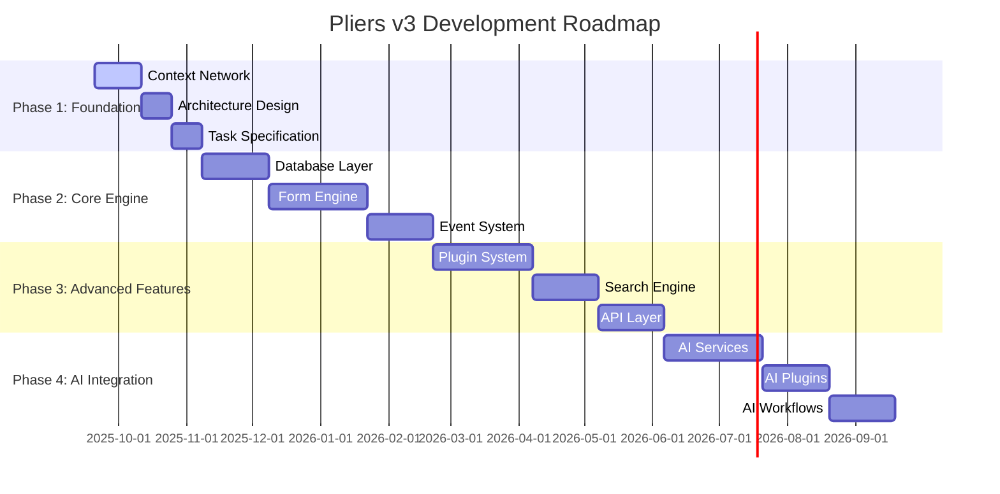

# Project Roadmap

## Purpose
This document outlines the planned development path for the project, including key milestones, features, and timelines.

## Classification
- **Domain:** Planning
- **Stability:** Dynamic
- **Abstraction:** Structural
- **Confidence:** Evolving

## Content

### Roadmap Overview

The Pliers v3 development roadmap focuses on building a comprehensive context network and documentation foundation before any implementation begins. All development work will be performed by LLM agents working from detailed task specifications.

### Current Phase

**Phase: Foundation (Context Network Development)**
**Status: In Progress**

Currently building the comprehensive context network that will serve as the foundation for all LLM agent development work. This phase focuses on documenting architecture, creating detailed specifications, and establishing development workflows optimized for AI agent implementation.

### Upcoming Milestones

#### Context Network Foundation Complete
- **Target Date:** October 11, 2025
- **Status:** In Progress
- **Description:** Complete context network with all architectural documentation, component specifications, and development workflows
- **Key Deliverables:**
  - Complete architectural design documentation
  - Core component specifications and relationships
  - AI integration points and capabilities
  - Development workflow and agent task templates
  - Comprehensive task backlog with detailed specifications
- **Dependencies:**
  - Legacy system analysis (Completed)
  - Modern architecture design (Completed)
  - Component relationship mapping (In Progress)

#### Architecture Design Validation
- **Target Date:** October 25, 2025
- **Status:** Not Started
- **Description:** Review and validate the complete architectural design with stakeholders and technical review
- **Key Deliverables:**
  - Architecture review documentation
  - Technology choice validation
  - Performance and scalability assessment
  - Security architecture review
  - Agent development workflow validation
- **Dependencies:**
  - Context Network Foundation Complete
  - All component specifications documented
  - AI integration design completed

### Feature Timeline

#### Phase 1: Foundation & Planning
- **Timeline:** September 20 - November 8, 2025
- **Theme:** Context network development and comprehensive planning for agent-driven development
- **Features:**
  - Context Network Architecture: Complete documentation structure for all system components - Priority: High
  - Legacy Analysis Documentation: Detailed analysis of previous iterations and lessons learned - Priority: High
  - Modern Architecture Design: Comprehensive technical architecture using contemporary technologies - Priority: High
  - Component Specifications: Detailed specifications for all system components and their relationships - Priority: High
  - AI Integration Planning: Complete design for LLM integration points and capabilities - Priority: High
  - Agent Task Templates: Development workflow templates optimized for LLM agent implementation - Priority: High

#### Phase 2: Core Engine Development
- **Timeline:** November 8, 2025 - February 6, 2026
- **Theme:** Foundational system components implemented by LLM agents
- **Features:**
  - Database Layer: PostgreSQL with JSONB, vector search, and schema management - Priority: High
  - Form Definition Engine: Core form schema system with Zod validation - Priority: High
  - Form Submission System: Data storage, retrieval, and relationship management - Priority: High
  - Event Processing Core: Event sourcing and basic event handling infrastructure - Priority: High
  - Basic Workflow Engine: Status management and simple workflow transitions - Priority: Medium
  - Authentication System: JWT-based authentication and basic authorization - Priority: Medium

#### Phase 3: Advanced Features
- **Timeline:** February 6 - May 7, 2026
- **Theme:** Plugin system, advanced search, and API layer
- **Features:**
  - Plugin Architecture: Complete plugin system with discovery, lifecycle, and priority management - Priority: High
  - Advanced Event Processing: Complex event handling, sagas, and workflow orchestration - Priority: High
  - Search Query System: Advanced search capabilities with form-defined queries - Priority: High
  - GraphQL API: Complete API layer with type generation and real-time subscriptions - Priority: High
  - Dashboard System: Query-based dashboard and reporting capabilities - Priority: Medium
  - Audit and Compliance: Complete audit trail and compliance reporting features - Priority: Medium

#### Phase 4: AI Integration
- **Timeline:** May 7 - July 6, 2026
- **Theme:** LLM-powered features and intelligent automation
- **Features:**
  - AI Form Design: LLM-assisted form creation and optimization - Priority: High
  - AI Workflow Automation: Intelligent routing and decision-making capabilities - Priority: High
  - AI Data Analysis: Automated insights and pattern recognition - Priority: High
  - AI Plugin Development: LLM-assisted plugin creation and optimization - Priority: Medium
  - Vector Search Integration: Semantic search and similarity matching - Priority: Medium
  - Natural Language Queries: AI-powered query generation from natural language - Priority: Low

### Release Strategy

**Agent-First Development Approach**: All implementation work will be performed by LLM agents working from comprehensive task specifications developed during Phase 1.

- **Versioning**: Semantic versioning (v3.0.0) with pre-release tags during development phases
- **Release Frequency**: Monthly alpha releases during active development phases for feedback
- **Deployment**: Containerized deployment with Docker, targeting cloud-native infrastructure
- **Testing Strategy**: Comprehensive automated testing implemented by agents alongside feature development
- **Documentation**: Living documentation generated from code and updated by development agents

### Resource Allocation

**Phase 1 (Foundation)**: 100% planning and documentation effort
- Context network development and architectural planning
- Comprehensive task specification and workflow design
- No implementation resources required

**Phase 2-4 (Development)**: 100% LLM agent implementation
- Task execution by AI agents working from detailed specifications
- Human oversight for architecture validation and quality assurance
- Minimal direct coding effort required from human stakeholders

### Risk Assessment

| Risk | Impact | Likelihood | Mitigation Strategy |
|------|--------|------------|---------------------|
| LLM Agent Limitations | High | Medium | Comprehensive task specification, iterative approach, human oversight |
| Architecture Complexity | High | Medium | Detailed planning phase, phased implementation, regular validation |
| Technology Stack Maturity | Medium | Low | Proven technology choices, fallback options documented |
| Scope Creep | Medium | Medium | Clear phase boundaries, documentation-first approach, regular reviews |
| Context Network Quality | High | Low | Extensive review process, continuous refinement, stakeholder validation |
| Plugin System Complexity | High | **Low** | **Middleware composition pattern (Hono-inspired), simpler than traditional plugins** |
| Event Ordering Issues | High | **Low** | **Aggregate versioning, outbox pattern, LISTEN/NOTIFY for real-time** |
| Multi-tenant Data Leakage | **Critical** | **Very Low** | **PostgreSQL RLS from day one, automated isolation testing** |
| Performance Degradation | Medium | Medium | **CQRS with denormalized read models, event stream partitioning** |

### Research-Informed Technical Decisions (2025-09-23)

Based on comprehensive technical research, the following architectural decisions are recommended:

#### Database & Storage
- **Event Store**: PostgreSQL with transactional outbox pattern for reliability
- **JSONB Validation**: CHECK constraints with jsonb_typeof and custom validation functions
- **Multi-tenancy**: Row-Level Security (RLS) enabled from Phase 1
- **Read Models**: Denormalized projections for CQRS (10x-1000x performance gains)

#### Architecture Patterns
- **Plugin System**: Middleware composition (Hono-inspired) instead of traditional plugins
- **Saga Implementation**: Start with choreography, add orchestration for complex workflows
- **Event Publishing**: PostgreSQL LISTEN/NOTIFY for real-time notifications
- **Event Serialization**: Default to JSONB for flexibility, optimize later if needed

#### Security & Compliance
- **Tenant Isolation**: Database-enforced RLS with session variables
- **Audit Trail**: Immutable event log with integrity protection
- **Performance**: Indexed tenant_id columns, connection pooling considerations

See [Technical Research Findings](../../discoveries/records/2025-09-23-technical-research.md) for detailed implementation patterns.

### Roadmap Review Process

**Review Frequency**: Bi-weekly reviews during Phase 1, monthly reviews during development phases

**Review Criteria**:
- Progress against defined milestones and deliverables
- Quality and completeness of context network documentation
- Agent task specification clarity and actionability
- Architecture validation and technical feasibility
- Risk assessment updates and mitigation effectiveness

**Stakeholder Involvement**:
- Product Owner: Strategic direction and priority validation
- Architecture Lead: Technical feasibility and design coherence
- Development Agents: Task clarity and implementation feedback

**Update Triggers**:
- Completion of major milestones
- Discovery of significant technical challenges or opportunities
- Changes in technology landscape or AI capabilities
- Feedback from architecture validation reviews

## Relationships
- **Parent Nodes:** [foundation/project_definition.md]
- **Child Nodes:** [planning/milestones.md]
- **Related Nodes:** 
  - [foundation/structure.md] - implements - Structure supports roadmap features
  - [processes/creation.md] - executes - Creation processes execute roadmap items

## Navigation Guidance
- **Access Context:** Use this document when planning work, prioritizing features, or communicating timelines
- **Common Next Steps:** After reviewing the roadmap, typically explore specific milestones or feature details
- **Related Tasks:** Sprint planning, resource allocation, stakeholder communication
- **Update Patterns:** This document should be updated quarterly or when significant changes to the plan occur

## Metadata
- **Created:** [Date]
- **Last Updated:** [Date]
- **Updated By:** [Role/Agent]

## Change History
- [Date]: Initial creation of roadmap template
