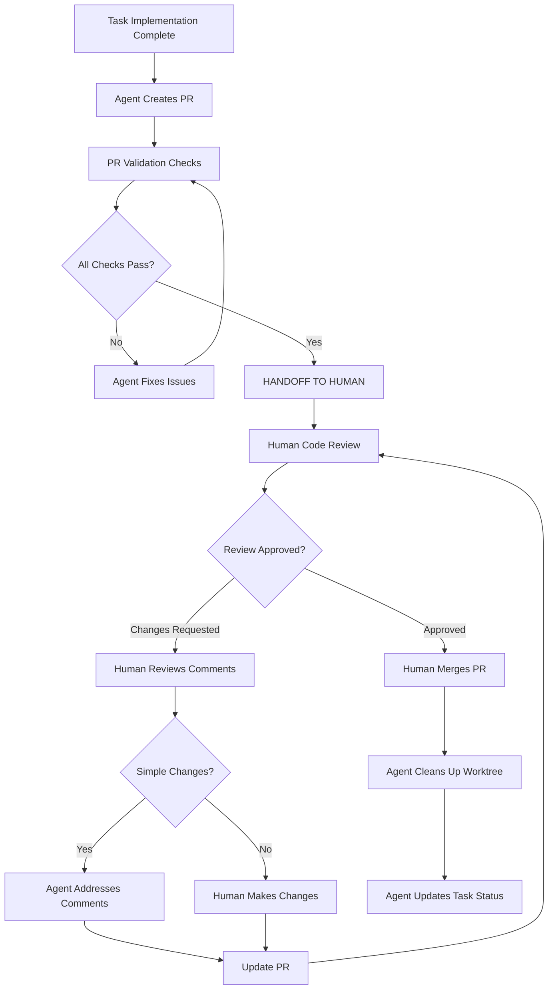

# Pull Request Workflow

## Purpose
This document defines the pull request workflow for code changes, specifically addressing the handoff points between AI agents and human reviewers.

## Classification
- **Domain:** Process
- **Stability:** Semi-stable
- **Abstraction:** Structural
- **Confidence:** Established

## Overview

Pull requests are the primary mechanism for integrating code changes into the main branch. This process includes both automated (agent) and manual (human) steps that must be clearly delineated.

## Process Flow



## Agent Responsibilities

### ✅ What Agents CAN Do

1. **Implementation Phase**
   - Write comprehensive tests following TDD principles
   - Implement code to make tests pass
   - Follow existing code patterns and conventions
   - Update inline documentation
   - Run lint, type check, and test validation

2. **PR Creation Phase**
   - Create pull request with descriptive title and body
   - Include acceptance criteria validation
   - Reference related task IDs and context
   - Add appropriate labels and reviewers
   - Set PR template fields correctly

3. **Simple Review Response Phase**
   - Address straightforward review comments (typos, formatting, simple logic fixes)
   - Update tests when requested
   - Respond to automated check failures
   - Push updates to existing PR branch

4. **Post-Merge Cleanup Phase**
   - Remove worktree after successful merge
   - Update task status to 'completed'
   - Update context network documentation
   - Archive branch if needed

### ❌ What Agents CANNOT Do

1. **Review Decision Making**
   - Merge pull requests (NEVER auto-merge)
   - Approve their own pull requests
   - Override human review decisions
   - Make architectural decisions based on review feedback

2. **Complex Review Response**
   - Handle complex architectural feedback
   - Resolve design disagreements
   - Make strategic trade-off decisions
   - Coordinate with multiple reviewers

3. **Emergency Situations**
   - Hotfix deployments
   - Emergency rollbacks
   - Production incident responses
   - Security incident handling

## Human Responsibilities

### 🔍 Code Review Responsibilities

1. **Technical Review**
   - Verify code correctness and logic
   - Check test coverage and quality
   - Validate performance implications
   - Ensure security best practices

2. **Architectural Review**
   - Assess design decisions
   - Check consistency with project patterns
   - Evaluate maintainability impact
   - Consider long-term implications

3. **Strategic Review**
   - Validate task requirements fulfillment
   - Check business logic correctness
   - Assess user experience impact
   - Consider integration implications

### ✅ Human Merge Authority

**Only humans can merge pull requests.** This is a non-negotiable safety gate that ensures:
- Human oversight of all code changes
- Proper review quality control
- Strategic decision validation
- Compliance with project standards

## PR Template Requirements

All PRs must include:

```markdown
## Task Reference
- **Task ID**: [TASK-XXX]
- **Epic**: [epic-name]
- **Priority**: [high|medium|low]

## Implementation Summary
- **What**: Brief description of changes
- **Why**: Business/technical justification
- **How**: High-level approach taken

## Test Coverage
- [ ] Unit tests written before implementation
- [ ] Integration tests updated/added
- [ ] Edge cases covered
- [ ] Error conditions tested
- Coverage: [Before]% → [After]%

## Validation Checklist
- [ ] All acceptance criteria met
- [ ] No breaking changes to existing APIs
- [ ] Performance impact assessed
- [ ] Security considerations addressed
- [ ] Documentation updated

## Review Notes
[Any specific areas requiring reviewer attention]
```

## Review Response Protocols

### For Simple Changes (Agent Handles)
- Formatting, style, linting issues
- Simple variable/method renames
- Basic test additions/modifications
- Documentation updates

### For Complex Changes (Human Required)
- Architectural modifications
- Algorithm changes
- API design modifications
- Security pattern changes
- Performance optimization strategies

## Quality Gates

### Automated Gates (Must Pass Before Human Review)
- [ ] All tests pass
- [ ] Linting and formatting pass
- [ ] Type checking passes
- [ ] Build succeeds
- [ ] No security vulnerabilities detected

### Human Gates (Manual Review Required)
- [ ] Code quality assessment
- [ ] Business logic validation
- [ ] Architecture consistency check
- [ ] Strategic alignment verification

## Emergency Procedures

### Hotfix Process
1. Human creates hotfix branch from main
2. Human implements critical fix
3. Expedited review (minimum one approval)
4. Human merges directly to main
5. Immediate deployment validation

### Failed PR Recovery
1. If agent cannot address review comments
2. Human takes over the branch
3. Complete necessary changes
4. Maintain original PR conversation thread
5. Credit both agent and human contributions

## Metrics and Monitoring

### Success Metrics
- PR review turnaround time
- First-pass approval rate
- Review comment resolution efficiency
- Agent vs human change ratio

### Warning Indicators
- PRs sitting in review >3 days
- Multiple review cycles on simple changes
- Agent attempting to merge PRs
- Review comments not addressed within 24h

## Training and Guidelines

### For New Team Members
1. Review this document thoroughly
2. Understand agent limitations clearly
3. Practice using GitHub review tools
4. Establish communication patterns with agents

### For Agent Interactions
- Be explicit about what changes are required
- Use clear, actionable language in review comments
- Distinguish between suggestions and requirements
- Provide context for architectural decisions

## Troubleshooting

### Common Issues
- **Agent tries to merge**: Remind of human-only merge policy
- **Review stalled**: Escalate to team lead after 3 days
- **Complex feedback**: Tag human developer for takeover
- **Test failures**: Agent should fix before requesting re-review

### Escalation Path
1. Agent addresses simple feedback
2. Human reviewer clarifies complex issues
3. Team lead resolves architectural disputes
4. Project owner makes strategic decisions

## Relationships
- **Parent Nodes:** [processes/delivery.md]
- **Related Nodes:**
  - [foundation/principles.md] - guided-by - PR workflow follows project principles
  - [backlog/index.md] - integrates-with - Task completion depends on PR merge
  - [processes/validation.md] - precedes - Validation occurs before PR creation

## Metadata
- **Created:** 2025-09-25
- **Last Updated:** 2025-09-25
- **Updated By:** Process Clarification Initiative

## Change History
- 2025-09-25: Created to clarify agent/human boundaries in PR workflow