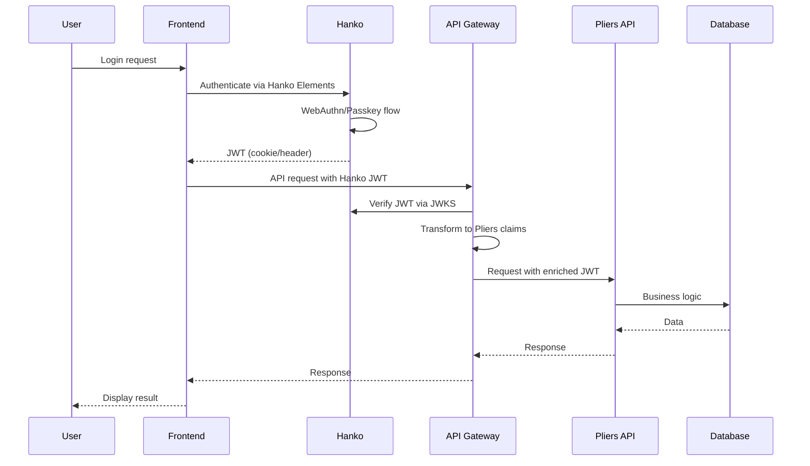

# Architecture Comparison: Pliers v3 vs Hanko Authentication

## Classification
- **Domain:** Security/Authentication/Research
- **Stability:** Dynamic
- **Abstraction:** Detailed
- **Confidence:** High

## JWT Implementation Comparison

### Pliers v3 Current Implementation

```typescript
// Current JWT structure in Pliers
interface AccessTokenPayload {
  // Standard claims
  sub: string;                       // User ID
  iss: string;                       // Issuer (pliers-api)
  aud: string[];                     // Multiple audiences
  exp: number;                       // 15-minute expiration

  // Custom claims
  email: string;
  roles: string[];
  permissions: string[];
  tenantId: string;
  sessionId: string;
  mfaVerified: boolean;

  // Security metadata
  ipAddress: string;
  userAgent: string;
  lastPasswordChange: number;

  // Feature flags
  features: string[];
  limitations: TokenLimitation[];
}
```

### Hanko JWT Implementation

```typescript
// Hanko JWT structure
interface HankoJWT {
  // Standard claims
  sub: string;                       // User UUID
  iss: string;                       // Hanko API URL
  aud: string[];                     // Configured audiences
  exp: number;                       // Configurable expiration

  // Hanko-specific claims
  email?: string;                   // If email enabled

  // Webhook JWTs include
  data?: any;                        // Object data
  evt?: string;                      // Event type
}
```

### Key Differences

| Aspect | Pliers v3 | Hanko | Compatibility |
|--------|-----------|--------|--------------|
| Token Algorithm | RS256 (asymmetric) | Configurable | ✅ Compatible |
| Token Expiration | 15 minutes | Configurable | ✅ Compatible |
| Multiple Audiences | Yes | Yes | ✅ Compatible |
| Custom Claims | Extensive | Limited | ⚠️ Requires extension |
| Refresh Tokens | HS256, 7 days | Cookie-based sessions | ⚠️ Different approach |
| MFA Status | In JWT | Separate flow | ⚠️ Architectural difference |

## Authentication Flow Comparison

### Current Pliers v3 Flow

1. User submits credentials to `/auth/login`
2. Server validates against PostgreSQL
3. Argon2id password verification
4. MFA challenge if required (TOTP/Email)
5. Generate access + refresh tokens
6. Store refresh token in Redis
7. Return tokens to client

### Hanko Authentication Flow

1. User interacts with Hanko Elements component
2. Hanko backend handles authentication:
   - Passkey (WebAuthn) primary
   - Passcode fallback
   - Optional password support
3. Session cookie or JWT via header
4. JWT verification via JWKS endpoint
5. Optional webhook notifications

### Integration Pattern



## Session Management Comparison

### Pliers v3 Sessions
- Complex session tracking with multiple concurrent sessions
- Session stored in Redis with extensive metadata
- Device fingerprinting and geolocation
- Risk scoring and session flags
- Inactivity timeout (30 min) and absolute timeout (8 hours)

### Hanko Sessions
- Server-side sessions as alternative to JWT-only
- Cookie-based by default
- Cross-domain support via headers
- Simpler session model focused on authentication state

### Recommendation
Maintain Pliers session management layer above Hanko for business logic while using Hanko for authentication state.

## Multi-Factor Authentication Comparison

### Pliers v3 MFA
- TOTP implementation with backup codes
- Email-based MFA option
- MFA status tracked in JWT
- Enforcement rules per role/risk

### Hanko MFA
- **Passkeys as primary factor** (inherently multi-factor)
- Passcode fallback via email
- No traditional TOTP support
- Modern approach prioritizing WebAuthn

### Migration Strategy
1. Enable Hanko's passkey authentication
2. Maintain TOTP for legacy users during transition
3. Gradually migrate users to passkeys
4. Deprecate TOTP after migration period

## API Integration Patterns

### Pattern 1: JWT Translation Layer (Recommended)

```typescript
// API Gateway middleware
async function translateHankoJWT(hankoToken: string): Promise<PliersJWT> {
  // Verify Hanko JWT
  const hankoPayload = await verifyHankoJWT(hankoToken);

  // Fetch additional user data
  const user = await getUserById(hankoPayload.sub);

  // Build Pliers-compatible JWT
  return {
    sub: hankoPayload.sub,
    email: hankoPayload.email,
    roles: user.roles,
    permissions: await computePermissions(user),
    tenantId: user.currentTenant,
    sessionId: generateSessionId(),
    mfaVerified: true, // Passkeys are inherently MFA
    // ... other claims
  };
}
```

### Pattern 2: Dual Authentication Support

```typescript
// Support both authentication methods during migration
interface AuthConfig {
  providers: {
    hanko: {
      enabled: true,
      apiUrl: process.env.HANKO_API_URL,
      priority: 1
    },
    legacy: {
      enabled: true,
      priority: 2
    }
  }
}
```

### Pattern 3: Hybrid Session Management

```typescript
// Combine Hanko auth with Pliers sessions
class HybridSessionManager {
  async createSession(hankoUserId: string): Promise<PliersSession> {
    // Hanko handles authentication
    // Pliers handles session business logic
    const session = {
      userId: hankoUserId,
      // Pliers-specific session data
      tenantId: await getUserTenant(hankoUserId),
      deviceId: generateDeviceFingerprint(),
      riskScore: await calculateRiskScore(),
      // ... etc
    };

    return this.sessionStore.create(session);
  }
}
```

## Database Schema Considerations

### User Table Modifications

```sql
-- Add Hanko-specific fields
ALTER TABLE users ADD COLUMN hanko_user_id UUID UNIQUE;
ALTER TABLE users ADD COLUMN auth_provider VARCHAR(50) DEFAULT 'legacy';
ALTER TABLE users ADD COLUMN passkey_registered BOOLEAN DEFAULT FALSE;

-- Create mapping table for migration
CREATE TABLE auth_migration (
  id UUID PRIMARY KEY,
  legacy_user_id UUID REFERENCES users(id),
  hanko_user_id UUID NOT NULL,
  migrated_at TIMESTAMP,
  migration_status VARCHAR(50)
);
```

## Security Comparison

| Feature | Pliers v3 | Hanko | Advantage |
|---------|-----------|--------|-----------|
| Password Hashing | Argon2id | Optional passwords | Hanko (passkey-first) |
| Phishing Resistance | Limited | Strong (WebAuthn) | Hanko |
| Replay Attack Protection | JWT expiry | WebAuthn challenge | Hanko |
| Brute Force Protection | Rate limiting | Built-in + passkeys | Hanko |
| Session Hijacking | IP validation | Domain-bound credentials | Both |
| Audit Logging | Comprehensive | Basic | Pliers |
| Risk Scoring | Advanced | Not included | Pliers |

## Performance Considerations

### JWT Verification
- **Pliers**: Local public key verification
- **Hanko**: JWKS endpoint call or session validation endpoint
- **Impact**: Additional network call, cacheable JWKS

### Authentication Speed
- **Pliers**: Database lookup + Argon2 verification (~100-200ms)
- **Hanko**: Passkey verification (~50-100ms)
- **Advantage**: Hanko faster for primary auth

### Session Management
- **Pliers**: Redis-based, sub-millisecond
- **Hanko**: Cookie/header based, no additional storage
- **Recommendation**: Keep Redis for Pliers session data

## Deployment Architecture

### Option 1: Separate Service

```yaml
services:
  hanko:
    image: ghcr.io/teamhanko/hanko:latest
    environment:
      - DATABASE_URL=postgresql://...
      - HANKO_API_URL=https://auth.pliers.io
    ports:
      - "8000:8000"

  pliers-api:
    image: pliers-api:latest
    environment:
      - HANKO_API_URL=http://hanko:8000
    depends_on:
      - hanko
```

### Option 2: Hanko Cloud

```typescript
// Configuration for Hanko Cloud
const hankoConfig = {
  apiUrl: 'https://[project-id].hanko.io',
  // No infrastructure management required
};
```

## Migration Risk Assessment

| Risk | Likelihood | Impact | Mitigation |
|------|------------|---------|------------|
| JWT claim mismatch | High | Medium | Translation layer at gateway |
| User migration failures | Medium | High | Dual auth support period |
| Session inconsistencies | Low | Medium | Hybrid session management |
| Performance degradation | Low | Low | JWKS caching, optimize calls |
| Security gaps | Low | High | Maintain Pliers authorization |