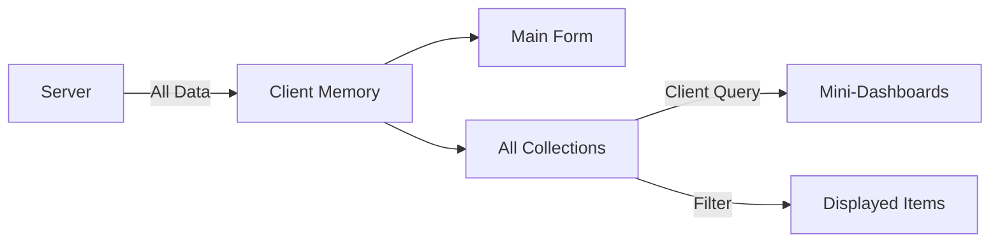
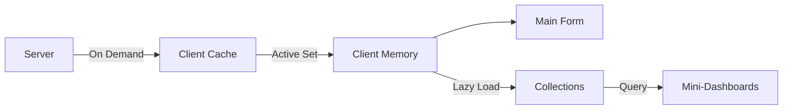

# Form Ecosystem Architecture

## Purpose
Documents the complete form ecosystem pattern that defines Pliers' approach to form management through decomposition, relationships, and semantic navigation rather than monolithic forms.

## Classification
- **Domain:** Architecture/Forms
- **Stability:** Stable (core philosophy)
- **Abstraction:** Structural
- **Confidence:** Established

## Core Philosophy

### Form Decomposition Principle
Large forms are an anti-pattern. Instead of creating forms with 50+ fields, Pliers decomposes them into focused, cohesive units connected through relationships.

**Benefits:**
- Better performance (smaller individual forms)
- Clearer domain boundaries
- Easier testing and maintenance
- More intuitive user experience
- Supports multi-tab workflows

## Architectural Components

### 1. Main Form
The primary entity being edited, containing only fields directly related to that entity.

```typescript
interface MainForm {
  id: string;
  type: string;
  schema: FormSchema;
  data: FormData;
  relationships: Relationship[];
  dashboardQueries: DashboardQuery[];
}
```

### 2. Related Collections
Groups of child or associated entities displayed alongside the main form.

```typescript
interface RelatedCollection {
  type: string;
  title: string;
  position: 'below' | 'right' | 'tab';
  items: Entity[];
  query?: ClientQuery;
  actions: CollectionAction[];
}
```

### 3. Mini-Dashboards
Query-based views that surface relevant information from collections.

```typescript
interface MiniDashboard {
  title: string;
  query: ClientQuery;
  displayType: 'summary' | 'list' | 'chart';
  refreshTriggers: string[];
}
```

### 4. Semantic Navigation
Navigation based on data relationships rather than browser history.

```typescript
interface SemanticNavigation {
  parent?: EntityReference;
  children: Map<string, EntityReference[]>;
  siblings?: EntityReference[];
  related: Map<string, EntityReference[]>;
}
```

## Layout Patterns

### Standard Layout
```
┌─────────────────────────────────────────┐
│          Main Form                      │
│  ┌───────────────────────────────────┐  │
│  │  Core Fields                      │  │
│  │  - Field 1                        │  │
│  │  - Field 2                        │  │
│  │  - Field 3                        │  │
│  └───────────────────────────────────┘  │
│                                         │
│  ┌───────────────────────────────────┐  │
│  │  Mini-Dashboard: Summary Stats    │  │
│  │  - Total items: 42                │  │
│  │  - Blocked: 3                     │  │
│  └───────────────────────────────────┘  │
└─────────────────────────────────────────┘

┌─────────────────────────────────────────┐
│      Related Collection: Tasks          │
│  ┌───────────────────────────────────┐  │
│  │ [Add Task] [Bulk Actions]         │  │
│  ├───────────────────────────────────┤  │
│  │ • Task 1 [View] [Edit]            │  │
│  │ • Task 2 [View] [Edit]            │  │
│  │ • Task 3 (blocked) [View] [Edit]  │  │
│  └───────────────────────────────────┘  │
└─────────────────────────────────────────┘
```

## Data Flow

### v2 Architecture (Current)


### v3 Architecture (Planned)


## Modal Strategy

### Read-Only Display Pattern
Modals are used exclusively for read-only display with navigation options.

```typescript
const ModalUsage = {
  allowed: [
    'Display read-only form data',
    'Show summary information',
    'Provide navigation links',
    'Confirm actions'
  ],
  notAllowed: [
    'Inline editing',
    'Complex form operations',
    'Multi-step workflows'
  ]
};
```

**Rationale:** Inline editing in modals created state management complexity and user confusion. Full-page views provide better context and clearer mental models.

## Relationship Management

### Action-Based Pattern
Relationships are managed through domain actions rather than direct manipulation.

```typescript
// Good: Action-based
<Button onClick={() => addChildTask(parentId)}>
  Add Task
</Button>

// Bad: Direct relationship editing
<Input
  label="Parent ID"
  value={relationship.parentId}
  onChange={updateRelationship}
/>
```

### Inferred Relationships
The system infers relationships from user actions:
- "Add Task" → Creates task with parent relationship
- "Remove Line Item" → Deletes item and relationship
- "Move to Project" → Updates parent relationship

## Query System

### Client-Side Queries
Mini-dashboards run queries against loaded collection data.

```typescript
interface QueryCapabilities {
  filtering: {
    equality: true,
    comparison: true,
    contains: true,
    regex: true
  },
  aggregation: {
    count: true,
    sum: true,
    average: true,
    groupBy: true
  },
  sorting: true,
  limiting: true
}
```

### Example Queries
```typescript
// Show blocked tasks
query: {
  where: { status: 'blocked' },
  orderBy: { field: 'priority', direction: 'desc' }
}

// Summary statistics
query: {
  aggregate: [
    { function: 'count', as: 'total' },
    { function: 'count', where: { status: 'blocked' }, as: 'blocked' },
    { function: 'sum', field: 'estimatedHours', as: 'totalHours' }
  ]
}
```

## Multi-Tab Workflow Support

### Design Principles
1. **Independent Tabs:** Each tab maintains its own state
2. **Semantic Context:** URLs preserve relationship context
3. **Deep Linking:** Direct navigation to any entity
4. **State Preservation:** Form state persists during navigation

### URL Structure
```
/forms/{formType}/{id}?context={parent|child|sibling}&parent={type}:{id}
```

Example:
```
/forms/task/123?context=child&parent=project:456
```

## AI Integration Opportunity

### Form Complexity Advisor
Monitor form complexity and suggest decomposition when thresholds are exceeded.

```typescript
interface ComplexityAdvisor {
  threshold: 20, // fields

  onThresholdExceeded(form: FormDefinition): Suggestion {
    return {
      message: "This form is becoming complex",
      analysis: detectCohesiveGroups(form),
      actions: [
        'Split into related forms',
        'Create child collection',
        'Keep as is'
      ]
    };
  }
}
```

## Migration Path: v2 to v3

### Phase 1: Lazy Loading
- Implement progressive data loading
- Cache management layer
- Maintain backward compatibility

### Phase 2: Enhanced Queries
- Add indexing for large collections
- Implement query optimization
- Support complex aggregations

### Phase 3: Advanced Features
- Real-time synchronization
- Collaborative editing
- AI-powered suggestions

## Best Practices

### Do's
- ✅ Keep forms focused (< 20 fields)
- ✅ Use collections for repeated data
- ✅ Implement client-side filtering
- ✅ Provide clear navigation paths
- ✅ Use modals for read-only display

### Don'ts
- ❌ Create monolithic forms
- ❌ Edit in modals
- ❌ Directly manipulate relationships
- ❌ Load all data eagerly (v3)
- ❌ Rely on browser history for navigation

## Performance Considerations

### Current (v2)
- All data loaded upfront
- Fast client-side operations
- Memory usage scales with data size
- No network latency after initial load

### Future (v3)
- Lazy loading with smart prefetching
- Cached data with TTL
- Virtual scrolling for large collections
- Progressive enhancement

## Related Documentation
- [Form Engine Specification](../../foundation/components/form-engine/specification.md)
- [Design Patterns](../../elements/architecture/design_patterns.md)
- [React Form Builders Research](./overview.md)

## Metadata
- **Created:** 2025-09-23
- **Last Updated:** 2025-09-23
- **Version:** 1.0
- **Status:** Foundational Architecture Document