# Digital-Era Narrative Frameworks

## Purpose
This document provides an overview and navigation hub for digital-era narrative frameworks. The detailed frameworks have been organized into specialized documents for better navigation and maintenance.

## Classification
- **Domain:** Plot Development
- **Stability:** Evolving
- **Abstraction:** Methodological
- **Confidence:** Established

## Framework Areas

### Specialized Framework Documents

1. **[[digital_era/social_media_narratives]]** - Social Media Narrative Integration
   - Three-act structure adaptations
   - Platform-specific narrative approaches
   - Short-form storytelling frameworks

2. **[[digital_era/digital_communication_systems]]** - Digital Communication Representation
   - Multimedia integration approaches
   - User-generated content frameworks
   - Transmedia storytelling methodologies

3. **[[digital_era/virtual_world_structures]]** - Virtual World Narrative Structures
   - Storyliving and participant agency
   - Non-linear progression systems
   - Environmental storytelling frameworks

4. **[[digital_era/technology_integration]]** - Contemporary Technology Integration
   - Technological abstraction methods
   - Cross-platform consistency frameworks
   - Future-proofing strategies

5. **[[digital_era/attention_optimization]]** - Attention Optimization Frameworks
   - Micro-narrative structures
   - Visual-first content design
   - Neurological engagement optimization

### Framework Selection Overview

```mermaid
flowchart TD
    A[Digital-Era Narrative Frameworks] --> B[Social Media Narratives]
    A --> C[Digital Communication]
    A --> D[Virtual World Structures]
    A --> E[Technology Integration]
    A --> F[Attention Optimization]
    
    B --> B1[Short-Form Structure]
    B --> B2[Platform-Specific Approaches]
    B --> B3[Community Integration]
    
    C --> C1[Multimedia Integration]
    C --> C2[User-Generated Content]
    C --> C3[Transmedia Storytelling]
    
    D --> D1[Storyliving Framework]
    D --> D2[Non-Linear Progression]
    D --> D3[Agency and Interaction]
    
    E --> E1[Technological Abstraction]
    E --> E2[Cross-Platform Consistency]
    E --> E3[Future-Proofing Methods]
    
    F --> F1[Micro-Narrative Structures]
    F --> F2[Visual-First Design]
    F --> F3[Neurological Engagement]
```

## Implementation Guide

### Selecting Appropriate Digital Frameworks

When developing digital-era narratives, consider the following factors:

1. **Platform Context:**
   - Native content consumption patterns
   - User interaction expectations
   - Technical capabilities and constraints
   - Audience attention patterns

2. **Content Purpose:**
   - Entertainment vs. information vs. persuasion
   - Emotional vs. intellectual engagement priority
   - Brand/creator consistency requirements
   - Shareability objectives

3. **Audience Factors:**
   - Digital literacy level
   - Platform usage patterns
   - Attention availability
   - Consumption environment

4. **Production Resources:**
   - Technical production capabilities
   - Content creation timeline
   - Multi-platform management capacity
   - Maintenance requirements

### Implementation Process

1. **Planning Phase:**
   - Select appropriate structural frameworks based on platform and purpose
   - Design content architecture incorporating selected frameworks
   - Map engagement points and attention maintenance strategy
   - Develop platform-specific implementation approach

2. **Development Phase:**
   - Create core narrative elements with platform optimization
   - Develop technical infrastructure for chosen frameworks
   - Build engagement and interaction mechanisms
   - Implement measurement systems for effectiveness

3. **Testing Phase:**
   - Verify engagement patterns match objectives
   - Test across different devices and consumption contexts
   - Evaluate cognitive load and attention maintenance
   - Assess emotional impact and message retention

4. **Optimization Phase:**
   - Refine based on engagement analytics
   - Adjust elements with lower than expected performance
   - Enhance high-performing components
   - Update based on platform evolution

### Common Pitfalls and Solutions

| Pitfall | Solution |
|---------|----------|
| Platform overextension diluting narrative | Focus on platforms most aligned with content type |
| Technical features overshadowing story | Prioritize narrative integrity over technical novelty |
| Rapid platform obsolescence | Implement technological abstraction framework |
| Attention fatigue from overstimulation | Balance stimulation with cognitive breathing room |
| Misalignment between content and platform | Match content type to platform-appropriate frameworks |
| Loss of narrative coherence across platforms | Implement cross-platform consistency framework |
| Prioritizing novelty over effectiveness | Test engagement impact of new approaches |

## Relationships
- **Parent Nodes:** 
  - [elements/plot/overview.md] - extends - Expands plot frameworks to include digital-era structures
- **Child Nodes:** 
  - [[digital_era/social_media_narratives]] - Social media narrative frameworks
  - [[digital_era/digital_communication_systems]] - Digital communication frameworks
  - [[digital_era/virtual_world_structures]] - Virtual world narrative frameworks
  - [[digital_era/technology_integration]] - Technology integration guidelines
  - [[digital_era/attention_optimization]] - Attention optimization frameworks
- **Related Nodes:** 
  - [elements/plot/interactive_narrative_frameworks.md] - complements - Digital frameworks overlap with interactive approaches
  - [elements/narrative_frameworks_index.md] - indexed-by - Referenced in the narrative frameworks index
  - [planning/future_research_directions.md] - fulfills - Implements research direction on digital-era conventions

## Navigation Guidance
- **Access Context:** Use this document when designing narratives for digital platforms, social media, or technology-enhanced storytelling
- **Common Next Steps:** After reviewing these frameworks, consider specific implementation approaches for your chosen digital platforms
- **Related Tasks:** Digital content planning, social media storytelling, transmedia narrative design
- **Update Patterns:** This document will evolve as new digital platforms emerge and consumption patterns change

## Metadata
- **Created:** 2025-05-21
- **Last Updated:** 2025-05-21
- **Updated By:** Cline Agent

## Change History
- 2025-05-21: Initial creation of digital-era narrative frameworks document based on research findings
