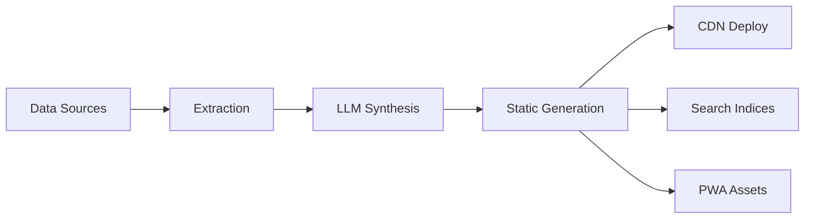
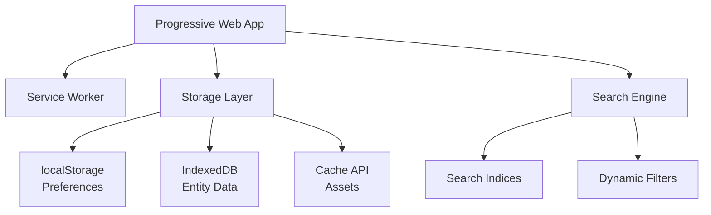

# Architecture Decision: Static-First PWA with Offline Capabilities

## Decision

**We adopt a Static-First Progressive Web App architecture with full offline capabilities**, eliminating the need for backend servers while providing native app-like functionality through web standards.

## Status

Accepted

## Context

The Whereness System needs to deliver rich, personalized city guides while maintaining:
- Minimal hosting costs (<$10/month for multiple cities)
- Fast, reliable access regardless of network conditions
- User privacy (no tracking, no accounts)
- Easy distribution without app store gatekeepers

### Cost Drivers to Avoid

1. **Server Costs**: Database hosting, API servers, search infrastructure
2. **Bandwidth Costs**: Repeated API calls, dynamic content generation
3. **Scaling Costs**: User growth leading to infrastructure growth
4. **Operational Costs**: Server maintenance, security, monitoring

### User Needs

1. **Instant Access**: Sub-second search and filtering
2. **Offline Usage**: Full functionality without network
3. **Personalization**: Customized views based on context
4. **Privacy**: No tracking, data stays on device

## Decision Drivers

### Economic Factors

- **CDN Free Tiers**: Cloudflare Pages/Netlify offer generous free tiers
- **Zero Marginal Cost**: Additional users don't increase costs
- **Predictable Costs**: Only build-time LLM API calls
- **No Scaling Concerns**: Client devices handle all computation

### Technical Factors

- **Modern Browser Capabilities**: IndexedDB, Service Workers, Web Storage
- **Static Site Performance**: CDN edge caching, instant loads
- **PWA Maturity**: Reliable offline, install prompts, app-like experience
- **Search Libraries**: Lunr.js, Fuse.js enable client-side full-text search

### User Experience Factors

- **Speed**: Everything cached locally after first visit
- **Reliability**: Works in subway, airplane mode, poor signal
- **Privacy**: No accounts, no cookies, no tracking
- **Control**: Users manage their own data and storage

## Architecture Components

### Build-Time Pipeline



### Client-Side Architecture



### Storage Strategy

| Storage Type | Usage | Size | Purpose |
|--------------|-------|------|----------|
| localStorage | Preferences | 5-10MB | User settings, bookmarks |
| IndexedDB | Entity Data | 50-100MB | Places, events, relationships |
| Cache API | Assets | 50-100MB | Images, maps, styles |
| Memory | Runtime | Variable | Search indices, active data |

## Implementation Strategy

### Static Generation

```javascript
// Build time - generate everything
const buildProcess = {
  weekly: {
    extractSources: () => fetchAndParse(),
    synthesizeContent: () => llmProcessing(),
    generateIndices: () => buildSearchIndices(),
    createPages: () => generateStaticHTML(),
    compileAssets: () => optimizeAndBundle()
  }
};
```

### Progressive Enhancement

```javascript
// Client side - enhance progressively
const enhancement = {
  level0: 'Static HTML - works without JS',
  level1: 'JS enhancement - instant search',
  level2: 'PWA features - offline, install',
  level3: 'Advanced - IndexedDB, background sync'
};
```

### Offline-First Data Access

```javascript
// All data operations are local-first
const dataAccess = {
  search: async (query) => {
    // Search pre-built indices in memory
    return searchEngine.search(query);
  },
  
  filter: (preferences) => {
    // Filter cached data on device
    return localData.filter(preferences);
  },
  
  sync: async () => {
    // Only sync when online + wifi
    if (navigator.onLine && connection.type === 'wifi') {
      await updateLocalData();
    }
  }
};
```

## Consequences

### Benefits

1. **Cost Efficiency**
   - Hosting: ~$0 (CDN free tier)
   - No backend infrastructure
   - No scaling costs
   - Predictable LLM API costs

2. **Performance**
   - Instant loads from cache
   - No network latency
   - Client-side computation
   - CDN edge distribution

3. **Reliability**
   - Works offline
   - No server downtime
   - Resilient to network issues
   - Local-first architecture

4. **Privacy**
   - No user tracking
   - Data stays on device
   - No accounts needed
   - User controls storage

5. **Developer Experience**
   - Simple deployment
   - No server maintenance
   - Version control friendly
   - Easy rollbacks

### Drawbacks

1. **Initial Download**
   - Larger first visit (2-15MB)
   - Need good first impression
   - Progressive download helps

2. **Update Frequency**
   - Weekly batch updates
   - Not real-time
   - Stale data possible

3. **Browser Limitations**
   - Storage quotas vary
   - PWA support varies
   - Need fallbacks

4. **No Server Features**
   - No user accounts
   - No social features
   - No dynamic pricing
   - No reservations

## Comparison with Alternatives

### Traditional Server Architecture
**Rejected because:**
- Monthly server costs ($50-500)
- Scaling complexity
- Maintenance burden
- Privacy concerns

### Native Mobile Apps
**Rejected because:**
- App store gatekeepers
- Platform fragmentation
- Update friction
- Development cost

### Serverless Functions
**Rejected because:**
- Per-request costs
- Cold starts
- Complexity
- Still needs database

### Hybrid (Static + API)
**Rejected because:**
- Maintains server costs
- Complex caching
- Partial offline
- Mixed mental model

## Implementation Phases

### Phase 1: Static Site (Weeks 1-4)
- Basic HTML generation
- CDN deployment
- Cost validation

### Phase 2: Client Search (Weeks 5-8)
- Search indices
- Client-side filtering
- Performance optimization

### Phase 3: PWA Features (Weeks 13-16)
- Service worker
- Offline support
- Install experience

### Phase 4: Advanced Offline (Weeks 17-20)
- IndexedDB integration
- Background sync
- Storage management

## Success Criteria

### Cost Metrics
- Hosting: <$10/month for 3 cities
- Per user: <$0.001/month
- Scaling: No marginal cost

### Performance Metrics
- First paint: <1 second
- Search results: <100ms
- Offline: 100% functionality
- Lighthouse: >95 score

### User Metrics
- Install rate: >20% returning users
- Offline usage: >30% of sessions
- Search usage: >50% of sessions

## Related Decisions

- Index Model vs Hierarchy (adopted)
- Weekly batch processing (adopted)
- LLM synthesis (adopted)
- Privacy-first design (adopted)

## Review Schedule

Review after:
- Phase 1 completion (static site live)
- First 1000 users
- 6 months production
- Major browser changes

## Metadata

- **ADR Number:** 002
- **Created:** 2024-11-17
- **Updated:** 2024-11-17
- **Status:** Accepted
- **Deciders:** System architects
- **Tags:** #architecture #pwa #offline #cost-optimization #static-site

## Change History

- 2024-11-17: Initial decision documented based on user requirements for minimal hosting costs and offline capability