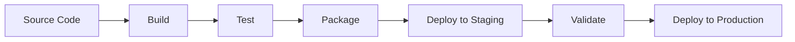

# Delivery Automation

## Purpose
This document describes the delivery automation approach, including continuous delivery pipelines and automated deployment processes.

## Classification
- **Domain:** Process
- **Stability:** Semi-stable
- **Abstraction:** Technical
- **Confidence:** Established

## Content

### Automation Overview

[Describe the approach to delivery automation]

Delivery automation reduces manual effort, increases reliability, and enables faster, more frequent deliveries.

### Continuous Delivery Pipeline

[Describe the continuous delivery pipeline]

#### Pipeline Stages

#### Components
- [Component 1]
- [Component 2]
- [Component 3]

#### Setup
[Instructions for setting up the continuous delivery pipeline]

#### Usage
[Guidelines for using the continuous delivery pipeline]

### Automation Tools

#### Build Automation
- Build tools and configurations
- Dependency management
- Artifact creation

#### Test Automation
- Unit test execution
- Integration testing
- Performance testing
- Security scanning

#### Deployment Automation
- Infrastructure as code
- Configuration management
- Deployment orchestration
- Environment provisioning

### Pipeline Configuration

#### Triggers
- Code commits
- Pull request merges
- Scheduled builds
- Manual triggers

#### Quality Gates
- Code coverage thresholds
- Test pass rates
- Security scan results
- Performance benchmarks

#### Notifications
- Build status updates
- Deployment notifications
- Failure alerts
- Success confirmations

### Best Practices

#### Version Control
- Pipeline configuration in version control
- Infrastructure definitions versioned
- Rollback capabilities maintained

#### Security
- Secrets management
- Access control
- Audit logging
- Compliance checks

#### Monitoring
- Pipeline performance metrics
- Success/failure rates
- Bottleneck identification
- Continuous improvement

## Relationships
- **Parent Node:** [[delivery/index]]
- **Related Nodes:**
  - [[delivery/execution]] - automates - Automation automates execution
  - [[delivery/environments]] - manages - Automation manages environments
  - [[delivery/monitoring]] - integrates - Automation integrates with monitoring

## Navigation Guidance
- **Access Context:** Use when setting up or maintaining delivery automation
- **Common Next Steps:** Configure pipelines for specific projects
- **Related Tasks:** Pipeline setup, tool configuration, automation maintenance
- **Update Patterns:** Update when automation tools or processes change

## Metadata
- **Created:** 5/16/2025
- **Last Updated:** 5/16/2025
- **Updated By:** Context Network Update

## Change History
- 5/16/2025: Extracted from original delivery.md