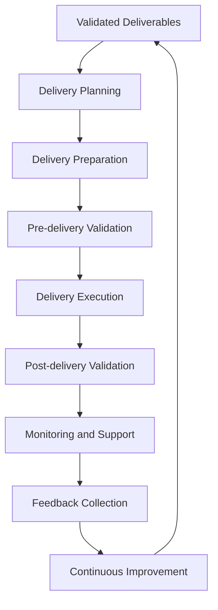

# Delivery Process

## Purpose
This document provides an overview and navigation hub for the delivery process documentation, including strategies, methods, and best practices.

## Classification
- **Domain:** Process
- **Stability:** Semi-stable
- **Abstraction:** Structural
- **Confidence:** Established

## Overview

The delivery process encompasses all activities required to move validated deliverables into their intended environments and ensure they function correctly. This includes planning, preparation, execution, validation, and ongoing support.

## Delivery Components

### Core Process Documents
- [[preparation]] - Pre-delivery preparation activities
- [[execution]] - Delivery execution procedures
- [[verification]] - Post-delivery verification and validation
- [[monitoring]] - Ongoing monitoring and support

### Strategy Documents
- [[strategies]] - Delivery strategies (phased, full, canary)
- [[environments]] - Delivery environment configurations
- [[automation]] - Delivery automation and CI/CD

### Supporting Documents
- [[rollback]] - Rollback procedures and testing
- [[documentation]] - Delivery documentation requirements
- [[compliance]] - Compliance and governance requirements

## Delivery Principles

1. **Reliability First**
   Ensure all deliveries are reliable and repeatable

2. **Minimal Disruption**
   Minimize impact on existing operations during delivery

3. **Continuous Improvement**
   Learn from each delivery to improve the process

## Quick Reference

### Common Tasks
- Planning a delivery → [[preparation]]
- Executing a delivery → [[execution]]
- Handling delivery issues → [[rollback]]
- Setting up automation → [[automation]]

### Key Decisions
- Which delivery strategy to use → [[strategies]]
- Environment selection → [[environments]]
- Documentation requirements → [[documentation]]

## Relationships
- **Parent Nodes:** [[processes/validation]]
- **Related Nodes:** 
  - [[processes/creation]] - precedes - Creation precedes delivery
  - [[foundation/principles]] - guided-by - Delivery follows project principles
  - [[foundation/structure]] - delivers - Delivery implements the project structure

## Navigation Guidance
- **Access Context:** Start here when planning or executing any delivery activity
- **Common Next Steps:** Review specific process documents based on your current phase
- **Related Tasks:** Delivery planning, execution, monitoring, feedback collection
- **Update Patterns:** Update when adding new delivery strategies or processes

## Metadata
- **Created:** 5/16/2025
- **Last Updated:** 5/16/2025
- **Updated By:** Context Network Update

## Change History
- 5/16/2025: Created from original delivery.md with hierarchical structure