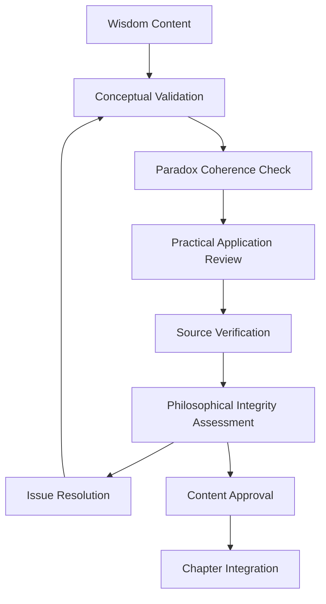

# Validation Process - Index

## Purpose
This directory contains the validation process documentation for "The Wisdom of Both" book project, ensuring philosophical content accuracy, conceptual coherence, and practical applicability of wisdom teachings.

## Classification
- **Domain:** Process
- **Stability:** Semi-stable
- **Abstraction:** Structural
- **Confidence:** Established

## Document Structure

### Core Documents
- [Principles](principles.md) - Fundamental validation principles and approach
- [Types](types.md) - Four types of validation (concept, paradox, chapter, book-level)
- [Contexts](contexts.md) - Validation contexts (draft, chapter, manuscript)
- [Procedures](procedures.md) - Step-by-step validation procedures
- [Strategies](strategies.md) - Validation strategies and techniques
- [Tools](tools.md) - Tools, systems, and metrics for validation

## Validation Overview

The validation process ensures that philosophical content maintains intellectual rigor while remaining accessible and practically applicable. Validation occurs at multiple levels: individual concepts, paradox relationships, chapter coherence, and overall wisdom framework integrity.

## Quick Reference

- **Starting validation planning?** → [Principles](principles.md)
- **What types of validation?** → [Types](types.md)
- **How to validate content?** → [Procedures](procedures.md)
- **Need validation strategies?** → [Strategies](strategies.md)
- **Looking for tools?** → [Tools](tools.md)
- **Validating concepts?** → [Types](types.md#concept-validation)
- **Checking paradox integration?** → [Types](types.md#paradox-integration-validation)

## Navigation

- **Up:** [Processes](../index.md)
- **Home:** [Context Network](../../index.md)
- **Related:** [Content Creation](../content-creation/index.md)

## Relationships

### Parent Nodes
- [Processes](../index.md) - *contains* - Validation process documentation
- [Creation Process](../creation.md) - *includes* - Validation as part of creation

### Child Nodes
- [Principles](principles.md) - *defines* - Core validation approach
- [Types](types.md) - *categorizes* - Validation levels
- [Procedures](procedures.md) - *implements* - Step-by-step processes
- [Strategies](strategies.md) - *provides* - Validation techniques
- [Tools](tools.md) - *supports* - Validation implementation

### Related Nodes
- [Content Creation](../content-creation/index.md) - *validates* - Created content
- [Delivery](../delivery/index.md) - *follows* - Delivery follows validation
- [Foundation Principles](../../foundation/principles.md) - *guided-by* - Validation follows project principles
- [Foundation Structure](../../foundation/structure/index.md) - *validates* - Structure implementation

## Navigation Guidance
- **Access Context:** Use this index when starting validation work, looking for specific validation approaches, or navigating between validation documents
- **Common Next Steps:** Start with principles.md for foundational understanding, then proceed to specific validation types or procedures
- **Related Tasks:** Content validation, philosophical accuracy checking, paradox integration assessment, chapter coherence review
- **Update Patterns:** Update this index when adding new validation documents or changing the overall validation approach

## Metadata
- **Created:** 2025-06-29
- **Last Updated:** 2025-06-29
- **Updated By:** Claude Code

## Change History
- 2025-06-29: Created validation directory structure and index from original validation.md breakdown