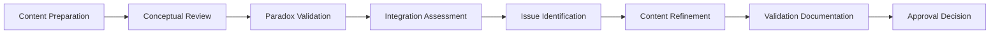

# Validation Procedures

## Purpose
This document provides step-by-step procedures for conducting validation activities throughout "The Wisdom of Both" book project, ensuring systematic and thorough content quality assurance.

## Classification
- **Domain:** Process/Validation
- **Stability:** Semi-stable
- **Abstraction:** Operational
- **Confidence:** Established

## Content

### Overview

The validation process follows seven sequential steps, each with specific activities, outputs, and tools. This systematic approach ensures consistent quality across all content.

### Step 1: Content Preparation

**Objective:** Gather all necessary materials and establish validation framework for the content being reviewed.

**Activities:**
- Gather source materials and research notes
- Review chapter outline and objectives
- Identify key concepts and paradoxes to validate
- Set up validation environment and tools

**Outputs:**
- Validation checklist for the content
- Source reference compilation
- Conceptual framework outline
- Prepared validation workspace

**Tools:**
- Research databases
- Reference management systems
- Validation checklists
- Note organization systems

**Time Allocation:** 15-30 minutes for sections, 1-2 hours for chapters

**Quality Checkpoints:**
- All source materials accessible
- Validation criteria clearly defined
- Review objectives established
- Tools and environment ready

### Step 2: Conceptual Review

**Objective:** Verify the philosophical accuracy, logical consistency, and clarity of individual concepts within the content.

**Activities:**
- Verify philosophical accuracy of core concepts
- Check logical consistency of arguments
- Assess clarity and accessibility of explanations
- Confirm proper attribution and sourcing

**Outputs:**
- Concept accuracy report
- Logical consistency assessment
- Clarity improvement recommendations
- Source verification record

**Tools:**
- Philosophical reference works
- Logic analysis frameworks
- Readability assessment tools
- Citation verification systems

**Time Allocation:** 30-60 minutes for sections, 2-3 hours for chapters

**Quality Checkpoints:**
- All concepts verified against authoritative sources
- Logical flow confirmed throughout content
- Technical terms clearly defined
- Sources properly attributed

### Step 3: Paradox Validation

**Objective:** Ensure paradox pairs represent genuine complementary opposites and synthesize into practical wisdom.

**Activities:**
- Confirm genuine opposition in paradox pairs
- Verify complementary relationship dynamics
- Test practical wisdom synthesis
- Assess integration with broader framework

**Outputs:**
- Paradox integrity assessment
- Complementarity verification
- Practical application examples
- Integration evaluation

**Tools:**
- Dialectical analysis methods
- Case study frameworks
- Real-world application tests
- Logic relationship mapping

**Time Allocation:** 20-45 minutes per paradox pair

**Quality Checkpoints:**
- Genuine opposition confirmed
- Complementary nature verified
- Practical applications identified
- Integration with framework assessed

### Step 4: Integration Assessment

**Objective:** Evaluate how content integrates with chapter themes, adjacent content, and overall book mission.

**Activities:**
- Review chapter coherence and flow
- Verify thematic consistency with book mission
- Assess contribution to overall wisdom framework
- Check transitions and connections

**Outputs:**
- Chapter integration report
- Thematic consistency analysis
- Framework contribution assessment
- Transition quality evaluation

**Tools:**
- Structural analysis templates
- Thematic mapping tools
- Framework coherence checklists
- Flow analysis guides

**Time Allocation:** 45-90 minutes for chapters, 3-5 hours for manuscript

**Quality Checkpoints:**
- Thematic unity maintained
- Clear contribution to wisdom framework
- Smooth transitions between sections
- Consistency with book mission

### Step 5: Issue Identification

**Objective:** Systematically identify and document all content issues requiring attention or improvement.

**Activities:**
- Document conceptual inconsistencies
- Identify unclear or problematic passages
- Note missing connections or weak arguments
- Assess accessibility challenges

**Outputs:**
- Issue log with priority levels
- Problem area identification
- Improvement opportunity list
- Accessibility enhancement needs

**Tools:**
- Issue tracking templates
- Priority assessment frameworks
- Content analysis tools
- Accessibility evaluation guides

**Time Allocation:** 30-60 minutes per validation session

**Quality Checkpoints:**
- All issues clearly documented
- Priority levels assigned
- Specific locations identified
- Improvement pathways noted

### Step 6: Content Refinement

**Objective:** Address identified issues through targeted improvements while maintaining content integrity.

**Activities:**
- Address identified conceptual issues
- Strengthen weak arguments or explanations
- Improve clarity and accessibility
- Enhance integration and flow

**Outputs:**
- Revised content with improvements
- Issue resolution documentation
- Quality enhancement records
- Change tracking documentation

**Tools:**
- Editing and revision tools
- Style and clarity guides
- Peer review processes
- Version control systems

**Time Allocation:** Variable based on issue complexity

**Quality Checkpoints:**
- All priority issues addressed
- Content integrity maintained
- Improvements enhance rather than compromise quality
- Changes properly documented

### Step 7: Validation Documentation

**Objective:** Create comprehensive records of validation activities, findings, and quality assurance measures.

**Activities:**
- Document validation findings and resolutions
- Create quality assurance records
- Prepare content approval documentation
- Update validation metrics and tracking

**Outputs:**
- Validation completion report
- Quality assurance certification
- Content approval records
- Process improvement recommendations

**Tools:**
- Documentation templates
- Quality tracking systems
- Approval workflow tools
- Metrics collection systems

**Time Allocation:** 20-40 minutes per validation session

**Quality Checkpoints:**
- Complete validation record created
- All findings properly documented
- Approval decision clearly stated
- Lessons learned captured

### Procedure Variations by Context

#### Draft Content Procedures
- Emphasize Steps 1-2 (Preparation and Conceptual Review)
- Abbreviated Steps 3-4 (focus on immediate coherence)
- Quick turnaround on Steps 5-7

#### Chapter Validation Procedures
- Full implementation of all seven steps
- Extended time on Steps 3-4 (Paradox and Integration)
- Comprehensive documentation in Step 7

#### Manuscript Validation Procedures
- Comprehensive execution of all steps
- Special emphasis on Step 4 (Integration Assessment)
- Extensive documentation and approval process

### Quality Assurance Checkpoints

#### Before Beginning Validation
- [ ] Validation context clearly defined
- [ ] Appropriate procedures selected
- [ ] Tools and materials prepared
- [ ] Success criteria established

#### During Validation Process
- [ ] Each step completed thoroughly
- [ ] Issues documented immediately
- [ ] Quality checkpoints verified
- [ ] Time allocations respected

#### After Validation Completion
- [ ] All procedures completed
- [ ] Documentation comprehensive
- [ ] Approval decision made
- [ ] Next steps identified

## Relationships
- **Parent Nodes:** [index.md](index.md)
- **Child Nodes:** None
- **Related Nodes:** 
  - [types.md](types.md) - implements - Procedures implement validation types
  - [contexts.md](contexts.md) - varies-by - Procedures vary by validation context
  - [strategies.md](strategies.md) - uses - Procedures use validation strategies
  - [tools.md](tools.md) - supported-by - Procedures are supported by validation tools

## Navigation Guidance
- **Access Context:** Use this document when conducting validation activities, training validators, or ensuring systematic quality assurance
- **Common Next Steps:** After completing procedures, refer to [strategies.md](strategies.md) for specialized techniques or [tools.md](tools.md) for supporting systems
- **Related Tasks:** Content validation execution, quality assurance activities, validation training
- **Update Patterns:** Update when procedures are refined through experience or new validation requirements emerge

## Metadata
- **Created:** 2025-06-29
- **Last Updated:** 2025-06-29
- **Updated By:** Claude Code

## Change History
- 2025-06-29: Created from original validation.md breakdown - extracted validation process section