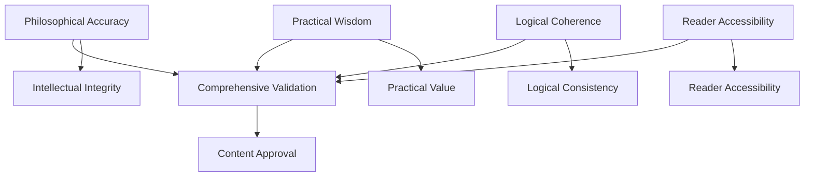

# Validation Strategies

## Purpose
This document outlines specialized validation strategies and techniques for ensuring philosophical accuracy, practical wisdom, logical coherence, and reader accessibility in "The Wisdom of Both" book project.

## Classification
- **Domain:** Process/Validation
- **Stability:** Semi-stable
- **Abstraction:** Methodological
- **Confidence:** Established

## Content

### Overview

Four specialized validation strategies address different aspects of content quality, each with specific techniques and best practices for ensuring comprehensive content validation.

### Philosophical Accuracy Validation

Ensures that philosophical concepts, historical references, and wisdom traditions are accurately represented and properly contextualized.

#### Objective
Maintain intellectual integrity and scholarly accuracy while making complex philosophical concepts accessible to general readers.

#### Core Techniques

**Source Cross-Referencing**
- Cross-reference with authoritative philosophical sources
- Verify historical and cultural context accuracy
- Check interpretation consistency with established scholarship
- Validate translations and cultural adaptations

**Primary Source Verification**
- Consult original philosophical texts when available
- Verify quotations and attributions
- Check translation accuracy for non-English sources
- Confirm historical context and cultural background

**Scholarly Consensus Checking**
- Review contemporary scholarly interpretations
- Identify areas of academic debate or disagreement
- Acknowledge different schools of thought
- Distinguish between mainstream and fringe interpretations

#### Best Practices

**Citation and Attribution**
- Cite primary sources when available
- Acknowledge different interpretations when they exist
- Maintain intellectual humility about complex concepts
- Provide proper attribution for all borrowed ideas

**Cultural Sensitivity**
- Research cultural contexts thoroughly
- Avoid oversimplification of complex traditions
- Acknowledge limitations of cross-cultural interpretation
- Respect source traditions and their contexts

**Accuracy Documentation**
- Maintain detailed source records
- Document verification process for each concept
- Track changes and updates to philosophical understanding
- Create reference trails for future validation

#### Common Challenges and Solutions

**Challenge:** Conflicting interpretations of philosophical concepts
**Solution:** Acknowledge different perspectives and explain the chosen interpretation

**Challenge:** Limited access to primary sources
**Solution:** Use authoritative secondary sources and acknowledge limitations

**Challenge:** Cultural concepts without direct translations
**Solution:** Provide contextual explanations and avoid forced equivalencies

### Practical Wisdom Validation

Verifies that theoretical concepts translate into actionable insights and real-world applications.

#### Objective
Ensure that philosophical concepts provide genuine practical value and can be applied effectively in readers' lives.

#### Core Techniques

**Scenario Testing**
- Test concepts against real-world scenarios
- Develop concrete application examples
- Validate through case study analysis
- Assess applicability across different life contexts

**Application Development**
- Create specific implementation guidance
- Develop progressive skill-building approaches
- Test applications with diverse user contexts
- Refine based on practical feedback

**Outcome Assessment**
- Evaluate potential benefits and risks
- Assess realistic expectations for application
- Identify prerequisites for successful implementation
- Document limitations and boundaries

#### Best Practices

**Contextual Diversity**
- Include diverse application contexts
- Address different life stages and circumstances
- Consider cultural and social variations
- Acknowledge individual differences in application

**Graduated Implementation**
- Provide graduated levels of application
- Start with simple, accessible applications
- Build complexity progressively
- Offer multiple entry points for different readers

**Limitation Acknowledgment**
- Acknowledge limitations and boundaries
- Identify when concepts may not apply
- Provide guidance for recognizing inappropriate applications
- Address potential misuse or misapplication

#### Implementation Framework

**Level 1: Basic Application**
- Simple, immediate applications
- Low risk, high accessibility
- Minimal prerequisites
- Clear success indicators

**Level 2: Intermediate Integration**
- More complex applications
- Integration with existing practices
- Moderate skill requirements
- Longer-term benefits

**Level 3: Advanced Implementation**
- Sophisticated applications
- Deep integration with life philosophy
- Significant skill and commitment requirements
- Transformative potential

### Logical Coherence Validation

Ensures internal consistency within individual chapters and across the entire book's wisdom framework.

#### Objective
Maintain logical consistency while acknowledging legitimate paradoxes and creative tensions within the wisdom framework.

#### Core Techniques

**Conceptual Mapping**
- Map logical relationships between concepts
- Identify dependency chains and hierarchies
- Check for circular reasoning or contradictions
- Verify argument structure and flow

**Consistency Checking**
- Verify consistent terminology throughout
- Check for contradictory statements
- Ensure consistent application of principles
- Validate consistent characterization of concepts

**Paradox Management**
- Distinguish between genuine paradoxes and logical errors
- Ensure paradoxes serve constructive purposes
- Maintain coherent framework despite paradoxical elements
- Address apparent contradictions explicitly

#### Best Practices

**Clear Reasoning Chains**
- Use clear reasoning chains
- Make logical connections explicit
- Avoid unexplained jumps in reasoning
- Provide logical bridges between concepts

**Explicit Contradiction Management**
- Acknowledge apparent contradictions explicitly
- Explain the purpose of genuine paradoxes
- Distinguish between paradox and error
- Provide resolution frameworks where appropriate

**Terminology Consistency**
- Maintain consistent terminology throughout
- Define key terms clearly at first use
- Create glossaries for complex terminology
- Avoid shifting definitions without explanation

#### Coherence Levels

**Local Coherence:** Within individual sections and chapters
**Regional Coherence:** Across related chapters and themes
**Global Coherence:** Throughout the entire wisdom framework

### Reader Accessibility Validation

Confirms that complex philosophical concepts are presented in ways that serve readers without philosophical backgrounds.

#### Objective
Make profound wisdom accessible to general readers while maintaining intellectual depth and avoiding oversimplification.

#### Core Techniques

**Readability Analysis**
- Readability analysis and assessment
- Sentence structure and complexity evaluation
- Vocabulary appropriateness checking
- Paragraph and section length optimization

**Jargon Management**
- Jargon identification and explanation
- Technical term definition and contextualization
- Acronym and abbreviation clarification
- Specialized vocabulary introduction strategies

**Clarity Enhancement**
- Metaphor and analogy effectiveness review
- Example relevance and comprehensibility assessment
- Explanation sequence optimization
- Conceptual bridge building between ideas

#### Best Practices

**Progressive Complexity**
- Build complexity gradually throughout chapters
- Introduce concepts in logical sequence
- Provide foundational understanding before advanced concepts
- Use scaffolding techniques for complex ideas

**Relatable Examples**
- Use relatable examples and analogies
- Draw from common life experiences
- Provide multiple examples for complex concepts
- Ensure examples enhance rather than distract

**Clear Definitions**
- Define technical terms clearly
- Provide context for philosophical concepts
- Use everyday language where possible
- Create conceptual bridges to familiar ideas

#### Accessibility Levels

**Universal Access:** Core concepts accessible to all readers
**Engaged Access:** Deeper insights for committed readers
**Advanced Access:** Sophisticated applications for dedicated practitioners

### Strategy Integration

The four validation strategies work together to ensure comprehensive content quality:

### Strategy Selection Guidelines

**Use Philosophical Accuracy Strategy When:**
- Introducing new philosophical concepts
- Making historical or cultural references
- Citing wisdom traditions
- Making scholarly claims

**Use Practical Wisdom Strategy When:**
- Providing application guidance
- Developing exercises or practices
- Creating implementation frameworks
- Testing real-world applicability

**Use Logical Coherence Strategy When:**
- Integrating multiple concepts
- Addressing apparent contradictions
- Building argument chains
- Ensuring framework consistency

**Use Reader Accessibility Strategy When:**
- Introducing complex concepts
- Explaining technical terminology
- Creating examples and analogies
- Assessing overall readability

## Relationships
- **Parent Nodes:** [index.md](index.md)
- **Child Nodes:** None
- **Related Nodes:** 
  - [principles.md](principles.md) - implements - Strategies implement validation principles
  - [procedures.md](procedures.md) - used-by - Procedures use these validation strategies
  - [types.md](types.md) - applied-to - Strategies are applied to different validation types

## Navigation Guidance
- **Access Context:** Use this document when selecting appropriate validation techniques, developing specialized validation approaches, or training in advanced validation methods
- **Common Next Steps:** After understanding strategies, proceed to [tools.md](tools.md) for supporting systems or return to [procedures.md](procedures.md) for implementation
- **Related Tasks:** Advanced validation activities, specialized content review, validation technique development
- **Update Patterns:** Update when new validation techniques are developed or strategy effectiveness is evaluated

## Metadata
- **Created:** 2025-06-29
- **Last Updated:** 2025-06-29
- **Updated By:** Claude Code

## Change History
- 2025-06-29: Created from original validation.md breakdown - extracted validation strategies section