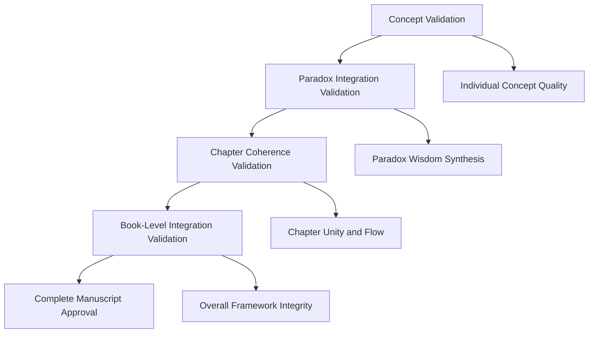

# Validation Types

## Purpose
This document defines the four distinct types of validation used in "The Wisdom of Both" book project, each addressing different levels of content integrity and coherence.

## Classification
- **Domain:** Process/Validation
- **Stability:** Semi-stable
- **Abstraction:** Structural
- **Confidence:** Established

## Content

### Overview

The validation process operates at four distinct levels, each with specific scope, responsibilities, and methodologies to ensure comprehensive content quality.

### Concept Validation

**Purpose:**
Ensure individual wisdom concepts are philosophically sound, clearly articulated, and accurately represent their traditional or contemporary understanding.

**Scope:**
Individual concepts, definitions, philosophical terms, and their explanations within the text.

**Responsibility:**
Content creator with philosophical background review when possible.

**Process:**
1. Verify concept definition accuracy against established sources
2. Check for internal logical consistency
3. Ensure accessibility without oversimplification

**Tools:**
- Philosophical dictionaries and encyclopedias
- Primary source texts
- Academic databases and journals

**Success Criteria:**
- Accurate representation of philosophical concepts
- Clear, accessible explanations
- Proper attribution and sourcing
- Logical internal consistency

### Paradox Integration Validation

**Purpose:**
Validate that paradoxes genuinely represent complementary opposites and that their integration creates meaningful wisdom insights.

**Scope:**
Paradox pairs, their relationship dynamics, and synthesis into practical wisdom.

**Responsibility:**
Content creator with focus on logical coherence and practical wisdom.

**Process:**
1. Confirm genuine opposition between paradox elements
2. Verify complementary nature rather than simple contradiction
3. Test practical applicability of integrated wisdom

**Tools:**
- Logic frameworks
- Real-world scenario testing
- Case study analysis

**Success Criteria:**
- Genuine opposition between paradox elements
- Complementary rather than contradictory relationships
- Practical wisdom synthesis that offers actionable insights
- Clear integration methodology

### Chapter Coherence Validation

**Purpose:**
Ensure each chapter maintains thematic unity, logical flow, and contributes meaningfully to the overall book structure.

**Scope:**
Individual chapters, their internal structure, transitions, and connection to book themes.

**Responsibility:**
Content creator with attention to narrative and structural integrity.

**Process:**
1. Review chapter outline for logical progression
2. Verify thematic consistency throughout chapter
3. Check transitions and connections to adjacent chapters

**Tools:**
- Chapter outline templates
- Structural analysis frameworks
- Reading flow assessment

**Success Criteria:**
- Clear thematic unity within chapters
- Logical progression of ideas
- Smooth transitions between sections
- Strong connection to overall book mission
- Coherent contribution to wisdom framework

### Book-Level Integration Validation

**Purpose:**
Validate the overall coherence of the wisdom framework across all chapters and ensure the book delivers on its central promise.

**Scope:**
Complete manuscript, thematic consistency, overall wisdom framework, and reader value proposition.

**Responsibility:**
Content creator with holistic perspective on book's mission and reader needs.

**Process:**
1. Review complete manuscript for thematic coherence
2. Verify wisdom framework completeness and applicability
3. Assess reader value and practical benefit delivery

**Tools:**
- Manuscript review checklists
- Thematic mapping documents
- Reader feedback mechanisms

**Success Criteria:**
- Thematic coherence across all chapters
- Complete and applicable wisdom framework
- Clear reader value proposition delivery
- Successful integration of all paradox elements
- Fulfillment of book's central mission

### Validation Type Relationships

The four validation types work together in a hierarchical relationship:

### Validation Sequencing

1. **Concept Validation** must be completed before paradox integration
2. **Paradox Integration Validation** informs chapter structure decisions
3. **Chapter Coherence Validation** occurs after individual chapter completion
4. **Book-Level Integration Validation** requires all chapters in near-final form

## Relationships
- **Parent Nodes:** [index.md](index.md)
- **Child Nodes:** None
- **Related Nodes:** 
  - [principles.md](principles.md) - guided-by - All validation types follow validation principles
  - [procedures.md](procedures.md) - implemented-by - Procedures implement these validation types
  - [contexts.md](contexts.md) - applied-in - Validation types are applied in different contexts

## Navigation Guidance
- **Access Context:** Use this document when determining which validation approach to use, planning validation activities, or understanding validation scope
- **Common Next Steps:** After selecting validation type, proceed to [procedures.md](procedures.md) for implementation details
- **Related Tasks:** Validation planning, content quality assessment, validation scope definition
- **Update Patterns:** Update when new validation types are identified or existing types are refined

## Metadata
- **Created:** 2025-06-29
- **Last Updated:** 2025-06-29
- **Updated By:** Claude Code

## Change History
- 2025-06-29: Created from original validation.md breakdown - extracted validation types section